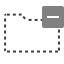

# Unity 2021.3.2f1 Editor Icons List
<table>
<tbody>
<tr>
<td width=20></td><td width=24><code>32x32</code></td><td><code>_Help</code></td>
<td width=20></td><td width=24><code>32x32</code></td><td><code>_Popup</code></td>
</tr>
<tr>
<td width=20></td><td width=24><code>264x92</code></td><td><code>aboutwindow.mainheader</code></td>
<td width=20></td><td width=24><code>120x43</code></td><td><code>ageialogo</code></td>
</tr>
<tr>
<td width=20></td><td width=24><code>32x32</code></td><td><code>AlphabeticalSorting</code></td>
<td width=20></td><td width=24><code>32x32</code></td><td><code>Animation.AddEvent</code></td>
</tr>
<tr>
<td width=20></td><td width=24><code>32x32</code></td><td><code>Animation.AddKeyframe</code></td>
<td width=20></td><td width=24><code>32x32</code></td><td><code>Animation.EventMarker</code></td>
</tr>
<tr>
<td width=20></td><td width=24><code>32x32</code></td><td><code>Animation.FirstKey</code></td>
<td width=20></td><td width=24><code>32x32</code></td><td><code>Animation.LastKey</code></td>
</tr>
<tr>
<td width=20></td><td width=24><code>32x32</code></td><td><code>Animation.NextKey</code></td>
<td width=20></td><td width=24><code>32x32</code></td><td><code>Animation.Play</code></td>
</tr>
<tr>
<td width=20></td><td width=24><code>32x32</code></td><td><code>Animation.PrevKey</code></td>
<td width=20></td><td width=24><code>32x32</code></td><td><code>Animation.Record</code></td>
</tr>
<tr>
<td width=20></td><td width=24><code>15x10</code></td><td><code>Animation.SequencerLink</code></td>
<td width=20></td><td width=24><code>22x22</code></td><td><code>animationanimated</code></td>
</tr>
<tr>
<td width=20></td><td width=24><code>16x16</code></td><td><code>animationdopesheetkeyframe</code></td>
<td width=20></td><td width=24><code>22x22</code></td><td><code>animationkeyframe</code></td>
</tr>
<tr>
<td width=20></td><td width=24><code>11x11</code></td><td><code>animationnocurve</code></td>
<td width=20></td><td width=24><code>32x32</code></td><td><code>animationvisibilitytoggleoff</code></td>
</tr>
<tr>
<td width=20></td><td width=24><code>32x32</code></td><td><code>animationvisibilitytoggleon</code></td>
<td width=20></td><td width=24><code>15x14</code></td><td><code>AnimationWrapModeMenu</code></td>
</tr>
<tr>
<td width=20></td><td width=24><code>16x16</code></td><td><code>AssemblyLock</code></td>
<td width=20></td><td width=24><code>32x32</code></td><td><code>Asset Store</code></td>
</tr>
<tr>
<td width=20></td><td width=24><code>32x32</code></td><td><code>Audio Mixer</code></td>
<td width=20></td><td width=24><code>15x15</code></td><td><code>AvatarCompass</code></td>
</tr>
<tr>
<td width=20></td><td width=24><code>124x52</code></td><td><code>AvatarController.Layer</code></td>
<td width=20></td><td width=24><code>124x52</code></td><td><code>AvatarController.LayerHover</code></td>
</tr>
<tr>
<td width=20></td><td width=24><code>124x52</code></td><td><code>AvatarController.LayerSelected</code></td>
<td width=20></td><td width=24><code>180x378</code></td><td><code>BodyPartPicker</code></td>
</tr>
<tr>
<td width=20></td><td width=24><code>180x378</code></td><td><code>BodySilhouette</code></td>
<td width=20></td><td width=24><code>19x19</code></td><td><code>DotFill</code></td>
</tr>
<tr>
<td width=20></td><td width=24><code>19x19</code></td><td><code>DotFrame</code></td>
<td width=20></td><td width=24><code>19x19</code></td><td><code>DotFrameDotted</code></td>
</tr>
<tr>
<td width=20></td><td width=24><code>19x19</code></td><td><code>DotSelection</code></td>
<td width=20></td><td width=24><code>180x378</code></td><td><code>Head</code></td>
</tr>
<tr>
<td width=20></td><td width=24><code>180x378</code></td><td><code>HeadIk</code></td>
<td width=20></td><td width=24><code>180x378</code></td><td><code>HeadZoom</code></td>
</tr>
<tr>
<td width=20></td><td width=24><code>180x378</code></td><td><code>HeadZoomSilhouette</code></td>
<td width=20></td><td width=24><code>180x378</code></td><td><code>LeftArm</code></td>
</tr>
<tr>
<td width=20></td><td width=24><code>180x378</code></td><td><code>LeftFeetIk</code></td>
<td width=20></td><td width=24><code>180x378</code></td><td><code>LeftFingers</code></td>
</tr>
<tr>
<td width=20></td><td width=24><code>180x378</code></td><td><code>LeftFingersIk</code></td>
<td width=20></td><td width=24><code>240x378</code></td><td><code>LeftHandZoom</code></td>
</tr>
<tr>
<td width=20></td><td width=24><code>240x378</code></td><td><code>LeftHandZoomSilhouette</code></td>
<td width=20></td><td width=24><code>180x378</code></td><td><code>LeftLeg</code></td>
</tr>
<tr>
<td width=20></td><td width=24><code>180x378</code></td><td><code>MaskEditor_Root</code></td>
<td width=20></td><td width=24><code>180x378</code></td><td><code>RightArm</code></td>
</tr>
<tr>
<td width=20></td><td width=24><code>180x378</code></td><td><code>RightFeetIk</code></td>
<td width=20></td><td width=24><code>180x378</code></td><td><code>RightFingers</code></td>
</tr>
<tr>
<td width=20></td><td width=24><code>180x378</code></td><td><code>RightFingersIk</code></td>
<td width=20></td><td width=24><code>240x378</code></td><td><code>RightHandZoom</code></td>
</tr>
<tr>
<td width=20></td><td width=24><code>240x378</code></td><td><code>RightHandZoomSilhouette</code></td>
<td width=20></td><td width=24><code>180x378</code></td><td><code>RightLeg</code></td>
</tr>
<tr>
<td width=20></td><td width=24><code>180x378</code></td><td><code>Torso</code></td>
<td width=20></td><td width=24><code>32x32</code></td><td><code>AvatarPivot</code></td>
</tr>
<tr>
<td width=20></td><td width=24><code>18x20</code></td><td><code>back</code></td>
<td width=20></td><td width=24><code>18x20</code></td><td><code>back@2x</code></td>
</tr>
<tr>
<td width=20></td><td width=24><code>21x20</code></td><td><code>beginButton-On</code></td>
<td width=20></td><td width=24><code>21x20</code></td><td><code>beginButton</code></td>
</tr>
<tr>
<td width=20></td><td width=24><code>32x32</code></td><td><code>blendKey</code></td>
<td width=20></td><td width=24><code>32x32</code></td><td><code>blendKeyOverlay</code></td>
</tr>
<tr>
<td width=20></td><td width=24><code>32x32</code></td><td><code>blendKeySelected</code></td>
<td width=20></td><td width=24><code>11x11</code></td><td><code>blendSampler</code></td>
</tr>
<tr>
<td width=20></td><td width=24><code>4x7</code></td><td><code>blueGroove</code></td>
<td width=20></td><td width=24><code>64x64</code></td><td><code>BuildSettings.Android</code></td>
</tr>
<tr>
<td width=20></td><td width=24><code>32x32</code></td><td><code>BuildSettings.Android.Small</code></td>
<td width=20></td><td width=24><code>32x32</code></td><td><code>BuildSettings.Broadcom</code></td>
</tr>
<tr>
<td width=20></td><td width=24><code>32x32</code></td><td><code>BuildSettings.Editor</code></td>
<td width=20></td><td width=24><code>16x16</code></td><td><code>BuildSettings.Editor.Small</code></td>
</tr>
<tr>
<td width=20></td><td width=24><code>64x64</code></td><td><code>BuildSettings.Facebook</code></td>
<td width=20></td><td width=24><code>32x32</code></td><td><code>BuildSettings.Facebook.Small</code></td>
</tr>
<tr>
<td width=20></td><td width=24><code>32x32</code></td><td><code>BuildSettings.FlashPlayer</code></td>
<td width=20></td><td width=24><code>16x16</code></td><td><code>BuildSettings.FlashPlayer.Small</code></td>
</tr>
<tr>
<td width=20></td><td width=24><code>64x64</code></td><td><code>BuildSettings.iPhone</code></td>
<td width=20></td><td width=24><code>32x32</code></td><td><code>BuildSettings.iPhone.Small</code></td>
</tr>
<tr>
<td width=20></td><td width=24><code>64x64</code></td><td><code>BuildSettings.Lumin</code></td>
<td width=20></td><td width=24><code>32x32</code></td><td><code>BuildSettings.Lumin.small</code></td>
</tr>
<tr>
<td width=20></td><td width=24><code>64x64</code></td><td><code>BuildSettings.Metro</code></td>
<td width=20></td><td width=24><code>32x32</code></td><td><code>BuildSettings.Metro.Small</code></td>
</tr>
<tr>
<td width=20></td><td width=24><code>64x64</code></td><td><code>BuildSettings.N3DS</code></td>
<td width=20></td><td width=24><code>32x32</code></td><td><code>BuildSettings.N3DS.Small</code></td>
</tr>
<tr>
<td width=20></td><td width=24><code>64x64</code></td><td><code>BuildSettings.PS4</code></td>
<td width=20></td><td width=24><code>32x32</code></td><td><code>BuildSettings.PS4.Small</code></td>
</tr>
<tr>
<td width=20></td><td width=24><code>32x32</code></td><td><code>BuildSettings.PSM</code></td>
<td width=20></td><td width=24><code>16x16</code></td><td><code>BuildSettings.PSM.Small</code></td>
</tr>
<tr>
<td width=20></td><td width=24><code>32x32</code></td><td><code>BuildSettings.PSP2</code></td>
<td width=20></td><td width=24><code>16x16</code></td><td><code>BuildSettings.PSP2.Small</code></td>
</tr>
<tr>
<td width=20></td><td width=24><code>16x16</code></td><td><code>BuildSettings.SelectedIcon</code></td>
<td width=20></td><td width=24><code>64x64</code></td><td><code>BuildSettings.Standalone</code></td>
</tr>
<tr>
<td width=20></td><td width=24><code>32x32</code></td><td><code>BuildSettings.Standalone.Small</code></td>
<td width=20></td><td width=24><code>16x16</code></td><td><code>BuildSettings.StandaloneBroadcom.Small</code></td>
</tr>
<tr>
<td width=20></td><td width=24><code>16x16</code></td><td><code>BuildSettings.StandaloneGLES20Emu.Small</code></td>
<td width=20></td><td width=24><code>16x16</code></td><td><code>BuildSettings.StandaloneGLESEmu</code></td>
</tr>
<tr>
<td width=20></td><td width=24><code>16x16</code></td><td><code>BuildSettings.StandaloneGLESEmu.Small</code></td>
<td width=20></td><td width=24><code>64x64</code></td><td><code>BuildSettings.Switch</code></td>
</tr>
<tr>
<td width=20></td><td width=24><code>32x32</code></td><td><code>BuildSettings.Switch.Small</code></td>
<td width=20></td><td width=24><code>64x64</code></td><td><code>BuildSettings.tvOS</code></td>
</tr>
<tr>
<td width=20></td><td width=24><code>32x32</code></td><td><code>BuildSettings.tvOS.Small</code></td>
<td width=20></td><td width=24><code>32x32</code></td><td><code>BuildSettings.Web</code></td>
</tr>
<tr>
<td width=20></td><td width=24><code>16x16</code></td><td><code>BuildSettings.Web.Small</code></td>
<td width=20></td><td width=24><code>64x64</code></td><td><code>BuildSettings.WebGL</code></td>
</tr>
<tr>
<td width=20></td><td width=24><code>32x32</code></td><td><code>BuildSettings.WebGL.Small</code></td>
<td width=20></td><td width=24><code>32x32</code></td><td><code>BuildSettings.WP8</code></td>
</tr>
<tr>
<td width=20></td><td width=24><code>16x16</code></td><td><code>BuildSettings.WP8.Small</code></td>
<td width=20></td><td width=24><code>32x32</code></td><td><code>BuildSettings.Xbox360</code></td>
</tr>
<tr>
<td width=20></td><td width=24><code>16x16</code></td><td><code>BuildSettings.Xbox360.Small</code></td>
<td width=20></td><td width=24><code>64x64</code></td><td><code>BuildSettings.XboxOne</code></td>
</tr>
<tr>
<td width=20></td><td width=24><code>32x32</code></td><td><code>BuildSettings.XboxOne.Small</code></td>
<td width=20></td><td width=24><code>64x64</code></td><td><code>BuildSettings.Xiaomi</code></td>
</tr>
<tr>
<td width=20></td><td width=24><code>256x256</code></td><td><code>Camera Gizmo</code></td>
<td width=20></td><td width=24><code>14x15</code></td><td><code>CheckerFloor</code></td>
</tr>
<tr>
<td width=20></td><td width=24><code>11x13</code></td><td><code>Clipboard</code></td>
<td width=20></td><td width=24><code>19x18</code></td><td><code>ClothInspector.PaintTool</code></td>
</tr>
<tr>
<td width=20></td><td width=24><code>19x18</code></td><td><code>ClothInspector.PaintValue</code></td>
<td width=20></td><td width=24><code>16x14</code></td><td><code>ClothInspector.SelectTool</code></td>
</tr>
<tr>
<td width=20></td><td width=24><code>19x18</code></td><td><code>ClothInspector.SettingsTool</code></td>
<td width=20></td><td width=24><code>19x18</code></td><td><code>ClothInspector.ViewValue</code></td>
</tr>
<tr>
<td width=20></td><td width=24><code>32x32</code></td><td><code>CloudConnect</code></td>
<td width=20></td><td width=24><code>32x26</code></td><td><code>Collab.Build</code></td>
</tr>
<tr>
<td width=20></td><td width=24><code>32x26</code></td><td><code>Collab.BuildFailed</code></td>
<td width=20></td><td width=24><code>32x26</code></td><td><code>Collab.BuildSucceeded</code></td>
</tr>
<tr>
<td width=20></td><td width=24><code>64x64</code></td><td><code>Collab.FileAdded</code></td>
<td width=20></td><td width=24><code>64x64</code></td><td><code>Collab.FileConflict</code></td>
</tr>
<tr>
<td width=20></td><td width=24><code>64x64</code></td><td><code>Collab.FileDeleted</code></td>
<td width=20></td><td width=24><code>64x64</code></td><td><code>Collab.FileIgnored</code></td>
</tr>
<tr>
<td width=20></td><td width=24><code>64x64</code></td><td><code>Collab.FileMoved</code></td>
<td width=20></td><td width=24><code>64x64</code></td><td><code>Collab.FileUpdated</code></td>
</tr>
<tr>
<td width=20></td><td width=24><code>64x64</code></td><td><code>Collab.FolderAdded</code></td>
<td width=20></td><td width=24><code>64x64</code></td><td><code>Collab.FolderConflict</code></td>
</tr>
<tr>
<td width=20></td><td width=24><code>64x64</code></td><td><code>Collab.FolderDeleted</code></td>
<td width=20></td><td width=24><code>64x64</code></td><td><code>Collab.FolderIgnored</code></td>
</tr>
<tr>
<td width=20></td><td width=24><code>64x64</code></td><td><code>Collab.FolderMoved</code></td>
<td width=20></td><td width=24><code>64x64</code></td><td><code>Collab.FolderUpdated</code></td>
</tr>
<tr>
<td width=20></td><td width=24><code>115x150</code></td><td><code>Collab.NoInternet</code></td>
<td width=20></td><td width=24><code>32x32</code></td><td><code>Collab</code></td>
</tr>
<tr>
<td width=20></td><td width=24><code>115x150</code></td><td><code>Collab.Warning</code></td>
<td width=20></td><td width=24><code>12x12</code></td><td><code>CollabConflict</code></td>
</tr>
<tr>
<td width=20></td><td width=24><code>12x12</code></td><td><code>CollabError</code></td>
<td width=20></td><td width=24><code>12x12</code></td><td><code>CollabNew</code></td>
</tr>
<tr>
<td width=20></td><td width=24><code>24x24</code></td><td><code>CollabOffline</code></td>
<td width=20></td><td width=24><code>12x12</code></td><td><code>CollabProgress</code></td>
</tr>
<tr>
<td width=20></td><td width=24><code>12x12</code></td><td><code>CollabPull</code></td>
<td width=20></td><td width=24><code>12x12</code></td><td><code>CollabPush</code></td>
</tr>
<tr>
<td width=20></td><td width=24><code>16x16</code></td><td><code>ColorPicker.ColorCycle</code></td>
<td width=20></td><td width=24><code>16x16</code></td><td><code>ColorPicker.CycleColor</code></td>
</tr>
<tr>
<td width=20></td><td width=24><code>16x16</code></td><td><code>ColorPicker.CycleSlider</code></td>
<td width=20></td><td width=24><code>16x16</code></td><td><code>ColorPicker.SliderCycle</code></td>
</tr>
<tr>
<td width=20></td><td width=24><code>32x32</code></td><td><code>console.erroricon.inactive.sml</code></td>
<td width=20></td><td width=24><code>64x64</code></td><td><code>console.erroricon</code></td>
</tr>
<tr>
<td width=20></td><td width=24><code>32x32</code></td><td><code>console.erroricon.sml</code></td>
<td width=20></td><td width=24><code>64x64</code></td><td><code>console.infoicon</code></td>
</tr>
<tr>
<td width=20></td><td width=24><code>32x32</code></td><td><code>console.infoicon.sml</code></td>
<td width=20></td><td width=24><code>32x32</code></td><td><code>console.warnicon.inactive.sml</code></td>
</tr>
<tr>
<td width=20></td><td width=24><code>64x64</code></td><td><code>console.warnicon</code></td>
<td width=20></td><td width=24><code>32x32</code></td><td><code>console.warnicon.sml</code></td>
</tr>
<tr>
<td width=20></td><td width=24><code>32x32</code></td><td><code>curvekeyframe</code></td>
<td width=20></td><td width=24><code>32x32</code></td><td><code>curvekeyframeselected</code></td>
</tr>
<tr>
<td width=20></td><td width=24><code>32x32</code></td><td><code>curvekeyframeselectedoverlay</code></td>
<td width=20></td><td width=24><code>32x32</code></td><td><code>curvekeyframesemiselectedoverlay</code></td>
</tr>
<tr>
<td width=20></td><td width=24><code>32x32</code></td><td><code>curvekeyframeweighted</code></td>
<td width=20></td><td width=24><code>19x13</code></td><td><code>CustomSorting</code></td>
</tr>
<tr>
<td width=20></td><td width=24><code>32x32</code></td><td><code>d__Popup</code></td>
<td width=20></td><td width=24><code>264x92</code></td><td><code>d_aboutwindow.mainheader</code></td>
</tr>
<tr>
<td width=20></td><td width=24><code>120x43</code></td><td><code>d_ageialogo</code></td>
<td width=20></td><td width=24><code>32x32</code></td><td><code>d_AlphabeticalSorting</code></td>
</tr>
<tr>
<td width=20></td><td width=24><code>32x32</code></td><td><code>d_Animation.AddEvent</code></td>
<td width=20></td><td width=24><code>32x32</code></td><td><code>d_Animation.AddKeyframe</code></td>
</tr>
<tr>
<td width=20></td><td width=24><code>32x32</code></td><td><code>d_Animation.EventMarker</code></td>
<td width=20></td><td width=24><code>32x32</code></td><td><code>d_Animation.FirstKey</code></td>
</tr>
<tr>
<td width=20></td><td width=24><code>32x32</code></td><td><code>d_Animation.LastKey</code></td>
<td width=20></td><td width=24><code>32x32</code></td><td><code>d_Animation.NextKey</code></td>
</tr>
<tr>
<td width=20></td><td width=24><code>32x32</code></td><td><code>d_Animation.Play</code></td>
<td width=20></td><td width=24><code>32x32</code></td><td><code>d_Animation.PrevKey</code></td>
</tr>
<tr>
<td width=20></td><td width=24><code>32x32</code></td><td><code>d_Animation.Record</code></td>
<td width=20></td><td width=24><code>15x10</code></td><td><code>d_Animation.SequencerLink</code></td>
</tr>
<tr>
<td width=20></td><td width=24><code>22x22</code></td><td><code>d_animationanimated</code></td>
<td width=20></td><td width=24><code>22x22</code></td><td><code>d_animationkeyframe</code></td>
</tr>
<tr>
<td width=20></td><td width=24><code>11x11</code></td><td><code>d_animationnocurve</code></td>
<td width=20></td><td width=24><code>32x32</code></td><td><code>d_animationvisibilitytoggleoff</code></td>
</tr>
<tr>
<td width=20></td><td width=24><code>32x32</code></td><td><code>d_animationvisibilitytoggleon</code></td>
<td width=20></td><td width=24><code>15x14</code></td><td><code>d_AnimationWrapModeMenu</code></td>
</tr>
<tr>
<td width=20></td><td width=24><code>30x9</code></td><td><code>d_AS Badge Delete</code></td>
<td width=20></td><td width=24><code>30x9</code></td><td><code>d_AS Badge New</code></td>
</tr>
<tr>
<td width=20></td><td width=24><code>16x16</code></td><td><code>d_AssemblyLock</code></td>
<td width=20></td><td width=24><code>32x32</code></td><td><code>d_Asset Store</code></td>
</tr>
<tr>
<td width=20></td><td width=24><code>32x32</code></td><td><code>d_Audio Mixer</code></td>
<td width=20></td><td width=24><code>5x40</code></td><td><code>d_AvatarBlendBackground</code></td>
</tr>
<tr>
<td width=20></td><td width=24><code>38x39</code></td><td><code>d_AvatarBlendLeft</code></td>
<td width=20></td><td width=24><code>38x39</code></td><td><code>d_AvatarBlendLeftA</code></td>
</tr>
<tr>
<td width=20></td><td width=24><code>38x39</code></td><td><code>d_AvatarBlendRight</code></td>
<td width=20></td><td width=24><code>38x39</code></td><td><code>d_AvatarBlendRightA</code></td>
</tr>
<tr>
<td width=20></td><td width=24><code>15x15</code></td><td><code>d_AvatarCompass</code></td>
<td width=20></td><td width=24><code>32x32</code></td><td><code>d_AvatarPivot</code></td>
</tr>
<tr>
<td width=20></td><td width=24><code>18x20</code></td><td><code>d_back</code></td>
<td width=20></td><td width=24><code>18x20</code></td><td><code>d_back@2x</code></td>
</tr>
<tr>
<td width=20></td><td width=24><code>21x20</code></td><td><code>d_beginButton-On</code></td>
<td width=20></td><td width=24><code>21x20</code></td><td><code>d_beginButton</code></td>
</tr>
<tr>
<td width=20></td><td width=24><code>4x7</code></td><td><code>d_blueGroove</code></td>
<td width=20></td><td width=24><code>64x64</code></td><td><code>d_BuildSettings.Android</code></td>
</tr>
<tr>
<td width=20></td><td width=24><code>32x32</code></td><td><code>d_BuildSettings.Android.Small</code></td>
<td width=20></td><td width=24><code>32x32</code></td><td><code>d_BuildSettings.Broadcom</code></td>
</tr>
<tr>
<td width=20></td><td width=24><code>32x32</code></td><td><code>d_BuildSettings.FlashPlayer</code></td>
<td width=20></td><td width=24><code>16x16</code></td><td><code>d_BuildSettings.FlashPlayer.Small</code></td>
</tr>
<tr>
<td width=20></td><td width=24><code>64x64</code></td><td><code>d_BuildSettings.iPhone</code></td>
<td width=20></td><td width=24><code>32x32</code></td><td><code>d_BuildSettings.iPhone.Small</code></td>
</tr>
<tr>
<td width=20></td><td width=24><code>64x64</code></td><td><code>d_BuildSettings.Lumin</code></td>
<td width=20></td><td width=24><code>32x32</code></td><td><code>d_BuildSettings.Lumin.small</code></td>
</tr>
<tr>
<td width=20></td><td width=24><code>64x64</code></td><td><code>d_BuildSettings.PS4</code></td>
<td width=20></td><td width=24><code>32x32</code></td><td><code>d_BuildSettings.PS4.Small</code></td>
</tr>
<tr>
<td width=20></td><td width=24><code>32x32</code></td><td><code>d_BuildSettings.PSP2</code></td>
<td width=20></td><td width=24><code>16x16</code></td><td><code>d_BuildSettings.PSP2.Small</code></td>
</tr>
<tr>
<td width=20></td><td width=24><code>16x16</code></td><td><code>d_BuildSettings.SelectedIcon</code></td>
<td width=20></td><td width=24><code>64x64</code></td><td><code>d_BuildSettings.Standalone</code></td>
</tr>
<tr>
<td width=20></td><td width=24><code>32x32</code></td><td><code>d_BuildSettings.Standalone.Small</code></td>
<td width=20></td><td width=24><code>64x64</code></td><td><code>d_BuildSettings.tvOS</code></td>
</tr>
<tr>
<td width=20></td><td width=24><code>32x32</code></td><td><code>d_BuildSettings.tvOS.Small</code></td>
<td width=20></td><td width=24><code>32x32</code></td><td><code>d_BuildSettings.Web</code></td>
</tr>
<tr>
<td width=20></td><td width=24><code>16x16</code></td><td><code>d_BuildSettings.Web.Small</code></td>
<td width=20></td><td width=24><code>64x64</code></td><td><code>d_BuildSettings.WebGL</code></td>
</tr>
<tr>
<td width=20></td><td width=24><code>32x32</code></td><td><code>d_BuildSettings.WebGL.Small</code></td>
<td width=20></td><td width=24><code>32x32</code></td><td><code>d_BuildSettings.Xbox360</code></td>
</tr>
<tr>
<td width=20></td><td width=24><code>16x16</code></td><td><code>d_BuildSettings.Xbox360.Small</code></td>
<td width=20></td><td width=24><code>64x64</code></td><td><code>d_BuildSettings.XboxOne</code></td>
</tr>
<tr>
<td width=20></td><td width=24><code>32x32</code></td><td><code>d_BuildSettings.XboxOne.Small</code></td>
<td width=20></td><td width=24><code>14x15</code></td><td><code>d_CheckerFloor</code></td>
</tr>
<tr>
<td width=20></td><td width=24><code>32x32</code></td><td><code>d_CloudConnect</code></td>
<td width=20></td><td width=24><code>64x64</code></td><td><code>d_Collab.FileAdded</code></td>
</tr>
<tr>
<td width=20></td><td width=24><code>64x64</code></td><td><code>d_Collab.FileConflict</code></td>
<td width=20></td><td width=24><code>64x64</code></td><td><code>d_Collab.FileDeleted</code></td>
</tr>
<tr>
<td width=20></td><td width=24><code>64x64</code></td><td><code>d_Collab.FileIgnored</code></td>
<td width=20></td><td width=24><code>64x64</code></td><td><code>d_Collab.FileMoved</code></td>
</tr>
<tr>
<td width=20></td><td width=24><code>64x64</code></td><td><code>d_Collab.FileUpdated</code></td>
<td width=20></td><td width=24><code>64x64</code></td><td><code>d_Collab.FolderAdded</code></td>
</tr>
<tr>
<td width=20></td><td width=24><code>64x64</code></td><td><code>d_Collab.FolderConflict</code></td>
<td width=20></td><td width=24><code>64x64</code></td><td><code>d_Collab.FolderDeleted</code></td>
</tr>
<tr>
<td width=20></td><td width=24><code>64x64</code></td><td><code>d_Collab.FolderIgnored</code></td>
<td width=20></td><td width=24><code>64x64</code></td><td><code>d_Collab.FolderMoved</code></td>
</tr>
<tr>
<td width=20></td><td width=24><code>64x64</code></td><td><code>d_Collab.FolderUpdated</code></td>
<td width=20></td><td width=24><code>16x16</code></td><td><code>d_ColorPicker.CycleColor</code></td>
</tr>
<tr>
<td width=20></td><td width=24><code>16x16</code></td><td><code>d_ColorPicker.CycleSlider</code></td>
<td width=20></td><td width=24><code>64x64</code></td><td><code>d_console.erroricon</code></td>
</tr>
<tr>
<td width=20></td><td width=24><code>32x32</code></td><td><code>d_console.erroricon.sml</code></td>
<td width=20></td><td width=24><code>64x64</code></td><td><code>d_console.infoicon</code></td>
</tr>
<tr>
<td width=20></td><td width=24><code>32x32</code></td><td><code>d_console.infoicon.sml</code></td>
<td width=20></td><td width=24><code>64x64</code></td><td><code>d_console.warnicon</code></td>
</tr>
<tr>
<td width=20></td><td width=24><code>32x32</code></td><td><code>d_console.warnicon.sml</code></td>
<td width=20></td><td width=24><code>32x32</code></td><td><code>d_curvekeyframe</code></td>
</tr>
<tr>
<td width=20></td><td width=24><code>32x32</code></td><td><code>d_curvekeyframeselected</code></td>
<td width=20></td><td width=24><code>32x32</code></td><td><code>d_curvekeyframeselectedoverlay</code></td>
</tr>
<tr>
<td width=20></td><td width=24><code>32x32</code></td><td><code>d_curvekeyframesemiselectedoverlay</code></td>
<td width=20></td><td width=24><code>32x32</code></td><td><code>d_curvekeyframeweighted</code></td>
</tr>
<tr>
<td width=20></td><td width=24><code>19x13</code></td><td><code>d_CustomSorting</code></td>
<td width=20></td><td width=24><code>32x32</code></td><td><code>d_DefaultSorting</code></td>
</tr>
<tr>
<td width=20></td><td width=24><code>14x12</code></td><td><code>d_EditCollider</code></td>
<td width=20></td><td width=24><code>32x32</code></td><td><code>d_editcollision_16</code></td>
</tr>
<tr>
<td width=20></td><td width=24><code>32x32</code></td><td><code>d_editconstraints_16</code></td>
<td width=20></td><td width=24><code>16x16</code></td><td><code>d_editicon.sml</code></td>
</tr>
<tr>
<td width=20></td><td width=24><code>21x20</code></td><td><code>d_endButton-On</code></td>
<td width=20></td><td width=24><code>21x20</code></td><td><code>d_endButton</code></td>
</tr>
<tr>
<td width=20></td><td width=24><code>40x40</code></td><td><code>d_eyeDropper.Large</code></td>
<td width=20></td><td width=24><code>16x16</code></td><td><code>d_eyeDropper.sml</code></td>
</tr>
<tr>
<td width=20></td><td width=24><code>32x32</code></td><td><code>d_Favorite</code></td>
<td width=20></td><td width=24><code>32x32</code></td><td><code>d_FilterByLabel</code></td>
</tr>
<tr>
<td width=20></td><td width=24><code>32x32</code></td><td><code>d_FilterByType</code></td>
<td width=20></td><td width=24><code>32x32</code></td><td><code>d_FilterSelectedOnly</code></td>
</tr>
<tr>
<td width=20></td><td width=24><code>32x32</code></td><td><code>d_FilterSelectedOnly@2x</code></td>
<td width=20></td><td width=24><code>18x20</code></td><td><code>d_forward</code></td>
</tr>
<tr>
<td width=20></td><td width=24><code>18x20</code></td><td><code>d_forward@2x</code></td>
<td width=20></td><td width=24><code>120x7</code></td><td><code>d_GEAR</code></td>
</tr>
<tr>
<td width=20></td><td width=24><code>4x7</code></td><td><code>d_Groove</code></td>
<td width=20></td><td width=24><code>16x16</code></td><td><code>d_HorizontalSplit</code></td>
</tr>
<tr>
<td width=20></td><td width=24><code>24x24</code></td><td><code>d_icon dropdown</code></td>
<td width=20></td><td width=24><code>16x14</code></td><td><code>d_InspectorLock</code></td>
</tr>
<tr>
<td width=20></td><td width=24><code>19x19</code></td><td><code>d_JointAngularLimits</code></td>
<td width=20></td><td width=24><code>7x18</code></td><td><code>d_leftBracket</code></td>
</tr>
<tr>
<td width=20></td><td width=24><code>32x32</code></td><td><code>d_Lighting</code></td>
<td width=20></td><td width=24><code>32x32</code></td><td><code>d_LightmapEditor.WindowTitle</code></td>
</tr>
<tr>
<td width=20></td><td width=24><code>13x14</code></td><td><code>d_Mirror</code></td>
<td width=20></td><td width=24><code>21x32</code></td><td><code>d_model large</code></td>
</tr>
<tr>
<td width=20></td><td width=24><code>58x70</code></td><td><code>d_monologo</code></td>
<td width=20></td><td width=24><code>32x32</code></td><td><code>d_MoveTool on</code></td>
</tr>
<tr>
<td width=20></td><td width=24><code>32x32</code></td><td><code>d_MoveTool</code></td>
<td width=20></td><td width=24><code>16x16</code></td><td><code>d_Navigation</code></td>
</tr>
<tr>
<td width=20></td><td width=24><code>32x32</code></td><td><code>d_Occlusion</code></td>
<td width=20></td><td width=24><code>32x32</code></td><td><code>d_P4_AddedLocal</code></td>
</tr>
<tr>
<td width=20></td><td width=24><code>32x32</code></td><td><code>d_P4_AddedRemote</code></td>
<td width=20></td><td width=24><code>32x32</code></td><td><code>d_P4_CheckOutLocal</code></td>
</tr>
<tr>
<td width=20></td><td width=24><code>32x32</code></td><td><code>d_P4_CheckOutRemote</code></td>
<td width=20></td><td width=24><code>32x32</code></td><td><code>d_P4_Conflicted</code></td>
</tr>
<tr>
<td width=20></td><td width=24><code>32x32</code></td><td><code>d_P4_DeletedLocal</code></td>
<td width=20></td><td width=24><code>32x32</code></td><td><code>d_P4_DeletedRemote</code></td>
</tr>
<tr>
<td width=20></td><td width=24><code>32x32</code></td><td><code>d_P4_Local</code></td>
<td width=20></td><td width=24><code>32x32</code></td><td><code>d_P4_LockedLocal</code></td>
</tr>
<tr>
<td width=20></td><td width=24><code>32x32</code></td><td><code>d_P4_LockedRemote</code></td>
<td width=20></td><td width=24><code>32x32</code></td><td><code>d_P4_OutOfSync</code></td>
</tr>
<tr>
<td width=20></td><td width=24><code>16x14</code></td><td><code>d_Particle Effect</code></td>
<td width=20></td><td width=24><code>32x32</code></td><td><code>d_PauseButton On</code></td>
</tr>
<tr>
<td width=20></td><td width=24><code>32x32</code></td><td><code>d_PauseButton</code></td>
<td width=20></td><td width=24><code>32x32</code></td><td><code>d_PlayButton On</code></td>
</tr>
<tr>
<td width=20></td><td width=24><code>32x32</code></td><td><code>d_PlayButton</code></td>
<td width=20></td><td width=24><code>21x20</code></td><td><code>d_PlayButtonProfile On</code></td>
</tr>
<tr>
<td width=20></td><td width=24><code>21x20</code></td><td><code>d_PlayButtonProfile</code></td>
<td width=20></td><td width=24><code>16x16</code></td><td><code>d_playLoopOff</code></td>
</tr>
<tr>
<td width=20></td><td width=24><code>16x16</code></td><td><code>d_playLoopOn</code></td>
<td width=20></td><td width=24><code>32x32</code></td><td><code>d_preAudioAutoPlayOff</code></td>
</tr>
<tr>
<td width=20></td><td width=24><code>16x16</code></td><td><code>d_preAudioAutoPlayOn</code></td>
<td width=20></td><td width=24><code>32x32</code></td><td><code>d_preAudioLoopOff</code></td>
</tr>
<tr>
<td width=20></td><td width=24><code>16x16</code></td><td><code>d_preAudioLoopOn</code></td>
<td width=20></td><td width=24><code>16x16</code></td><td><code>d_preAudioPlayOff</code></td>
</tr>
<tr>
<td width=20></td><td width=24><code>16x16</code></td><td><code>d_preAudioPlayOn</code></td>
<td width=20></td><td width=24><code>32x32</code></td><td><code>d_PreMatCube</code></td>
</tr>
<tr>
<td width=20></td><td width=24><code>32x32</code></td><td><code>d_PreMatCylinder</code></td>
<td width=20></td><td width=24><code>32x32</code></td><td><code>d_PreMatLight0</code></td>
</tr>
<tr>
<td width=20></td><td width=24><code>32x32</code></td><td><code>d_PreMatLight1</code></td>
<td width=20></td><td width=24><code>32x32</code></td><td><code>d_PreMatSphere</code></td>
</tr>
<tr>
<td width=20></td><td width=24><code>32x32</code></td><td><code>d_PreMatTorus</code></td>
<td width=20></td><td width=24><code>32x32</code></td><td><code>d_Preset.Context</code></td>
</tr>
<tr>
<td width=20></td><td width=24><code>16x16</code></td><td><code>d_PreTextureAlpha</code></td>
<td width=20></td><td width=24><code>16x16</code></td><td><code>d_PreTextureMipMapHigh</code></td>
</tr>
<tr>
<td width=20></td><td width=24><code>16x16</code></td><td><code>d_PreTextureMipMapLow</code></td>
<td width=20></td><td width=24><code>16x16</code></td><td><code>d_PreTextureRGB</code></td>
</tr>
<tr>
<td width=20></td><td width=24><code>32x32</code></td><td><code>d_Profiler.Audio</code></td>
<td width=20></td><td width=24><code>32x32</code></td><td><code>d_Profiler.CPU</code></td>
</tr>
<tr>
<td width=20></td><td width=24><code>16x14</code></td><td><code>d_Profiler.FirstFrame</code></td>
<td width=20></td><td width=24><code>32x32</code></td><td><code>d_Profiler.GPU</code></td>
</tr>
<tr>
<td width=20></td><td width=24><code>16x14</code></td><td><code>d_Profiler.LastFrame</code></td>
<td width=20></td><td width=24><code>32x32</code></td><td><code>d_Profiler.Memory</code></td>
</tr>
<tr>
<td width=20></td><td width=24><code>32x32</code></td><td><code>d_Profiler.Network</code></td>
<td width=20></td><td width=24><code>16x14</code></td><td><code>d_Profiler.NextFrame</code></td>
</tr>
<tr>
<td width=20></td><td width=24><code>32x32</code></td><td><code>d_Profiler.Physics</code></td>
<td width=20></td><td width=24><code>16x14</code></td><td><code>d_Profiler.PrevFrame</code></td>
</tr>
<tr>
<td width=20></td><td width=24><code>16x14</code></td><td><code>d_Profiler.Record</code></td>
<td width=20></td><td width=24><code>32x32</code></td><td><code>d_Profiler.Rendering</code></td>
</tr>
<tr>
<td width=20></td><td width=24><code>32x32</code></td><td><code>d_Profiler.Video</code></td>
<td width=20></td><td width=24><code>16x16</code></td><td><code>d_ProfilerColumn.WarningCount</code></td>
</tr>
<tr>
<td width=20></td><td width=24><code>32x32</code></td><td><code>d_Project</code></td>
<td width=20></td><td width=24><code>32x32</code></td><td><code>d_RectTool On</code></td>
</tr>
<tr>
<td width=20></td><td width=24><code>32x32</code></td><td><code>d_RectTool</code></td>
<td width=20></td><td width=24><code>12x12</code></td><td><code>d_RectTransformBlueprint</code></td>
</tr>
<tr>
<td width=20></td><td width=24><code>12x12</code></td><td><code>d_RectTransformRaw</code></td>
<td width=20></td><td width=24><code>4x7</code></td><td><code>d_redGroove</code></td>
</tr>
<tr>
<td width=20></td><td width=24><code>32x32</code></td><td><code>d_Refresh</code></td>
<td width=20></td><td width=24><code>7x18</code></td><td><code>d_rightBracket</code></td>
</tr>
<tr>
<td width=20></td><td width=24><code>32x32</code></td><td><code>d_RotateTool On</code></td>
<td width=20></td><td width=24><code>32x32</code></td><td><code>d_RotateTool</code></td>
</tr>
<tr>
<td width=20></td><td width=24><code>32x32</code></td><td><code>d_ScaleTool On</code></td>
<td width=20></td><td width=24><code>32x32</code></td><td><code>d_ScaleTool</code></td>
</tr>
<tr>
<td width=20></td><td width=24><code>16x14</code></td><td><code>d_SceneViewAlpha</code></td>
<td width=20></td><td width=24><code>32x32</code></td><td><code>d_SceneViewAudio</code></td>
</tr>
<tr>
<td width=20></td><td width=24><code>32x32</code></td><td><code>d_SceneViewFx</code></td>
<td width=20></td><td width=24><code>32x32</code></td><td><code>d_SceneViewLighting</code></td>
</tr>
<tr>
<td width=20></td><td width=24><code>16x14</code></td><td><code>d_SceneViewOrtho</code></td>
<td width=20></td><td width=24><code>16x14</code></td><td><code>d_SceneViewRGB</code></td>
</tr>
<tr>
<td width=20></td><td width=24><code>72x11</code></td><td><code>d_ScrollShadow</code></td>
<td width=20></td><td width=24><code>32x32</code></td><td><code>d_Settings</code></td>
</tr>
<tr>
<td width=20></td><td width=24><code>32x32</code></td><td><code>d_SettingsIcon</code></td>
<td width=20></td><td width=24><code>61x17</code></td><td><code>d_SocialNetworks.FacebookShare</code></td>
</tr>
<tr>
<td width=20></td><td width=24><code>61x17</code></td><td><code>d_SocialNetworks.LinkedInShare</code></td>
<td width=20></td><td width=24><code>61x17</code></td><td><code>d_SocialNetworks.Tweet</code></td>
</tr>
<tr>
<td width=20></td><td width=24><code>61x17</code></td><td><code>d_SocialNetworks.UDNOpen</code></td>
<td width=20></td><td width=24><code>24x15</code></td><td><code>d_SpeedScale</code></td>
</tr>
<tr>
<td width=20></td><td width=24><code>32x32</code></td><td><code>d_StepButton On</code></td>
<td width=20></td><td width=24><code>32x32</code></td><td><code>d_StepButton</code></td>
</tr>
<tr>
<td width=20></td><td width=24><code>21x20</code></td><td><code>d_StepLeftButton-On</code></td>
<td width=20></td><td width=24><code>21x20</code></td><td><code>d_StepLeftButton</code></td>
</tr>
<tr>
<td width=20></td><td width=24><code>32x32</code></td><td><code>d_tab_next</code></td>
<td width=20></td><td width=24><code>32x32</code></td><td><code>d_tab_next@2x</code></td>
</tr>
<tr>
<td width=20></td><td width=24><code>32x32</code></td><td><code>d_tab_prev</code></td>
<td width=20></td><td width=24><code>32x32</code></td><td><code>d_tab_prev@2x</code></td>
</tr>
<tr>
<td width=20></td><td width=24><code>19x18</code></td><td><code>d_TerrainInspector.TerrainToolLower On</code></td>
<td width=20></td><td width=24><code>19x18</code></td><td><code>d_TerrainInspector.TerrainToolLowerAlt</code></td>
</tr>
<tr>
<td width=20></td><td width=24><code>19x18</code></td><td><code>d_TerrainInspector.TerrainToolPlants On</code></td>
<td width=20></td><td width=24><code>32x32</code></td><td><code>d_TerrainInspector.TerrainToolPlants</code></td>
</tr>
<tr>
<td width=20></td><td width=24><code>19x18</code></td><td><code>d_TerrainInspector.TerrainToolPlantsAlt On</code></td>
<td width=20></td><td width=24><code>19x18</code></td><td><code>d_TerrainInspector.TerrainToolPlantsAlt</code></td>
</tr>
<tr>
<td width=20></td><td width=24><code>19x18</code></td><td><code>d_TerrainInspector.TerrainToolRaise On</code></td>
<td width=20></td><td width=24><code>19x18</code></td><td><code>d_TerrainInspector.TerrainToolRaise</code></td>
</tr>
<tr>
<td width=20></td><td width=24><code>19x18</code></td><td><code>d_TerrainInspector.TerrainToolSetheight On</code></td>
<td width=20></td><td width=24><code>19x18</code></td><td><code>d_TerrainInspector.TerrainToolSetheight</code></td>
</tr>
<tr>
<td width=20></td><td width=24><code>19x18</code></td><td><code>d_TerrainInspector.TerrainToolSetheightAlt On</code></td>
<td width=20></td><td width=24><code>19x18</code></td><td><code>d_TerrainInspector.TerrainToolSetheightAlt</code></td>
</tr>
<tr>
<td width=20></td><td width=24><code>19x18</code></td><td><code>d_TerrainInspector.TerrainToolSettings On</code></td>
<td width=20></td><td width=24><code>32x32</code></td><td><code>d_TerrainInspector.TerrainToolSettings</code></td>
</tr>
<tr>
<td width=20></td><td width=24><code>19x18</code></td><td><code>d_TerrainInspector.TerrainToolSmoothHeight On</code></td>
<td width=20></td><td width=24><code>19x18</code></td><td><code>d_TerrainInspector.TerrainToolSmoothHeight</code></td>
</tr>
<tr>
<td width=20></td><td width=24><code>19x18</code></td><td><code>d_TerrainInspector.TerrainToolSplat On</code></td>
<td width=20></td><td width=24><code>32x32</code></td><td><code>d_TerrainInspector.TerrainToolSplat</code></td>
</tr>
<tr>
<td width=20></td><td width=24><code>19x18</code></td><td><code>d_TerrainInspector.TerrainToolSplatAlt On</code></td>
<td width=20></td><td width=24><code>19x18</code></td><td><code>d_TerrainInspector.TerrainToolSplatAlt</code></td>
</tr>
<tr>
<td width=20></td><td width=24><code>19x18</code></td><td><code>d_TerrainInspector.TerrainToolTrees On</code></td>
<td width=20></td><td width=24><code>32x32</code></td><td><code>d_TerrainInspector.TerrainToolTrees</code></td>
</tr>
<tr>
<td width=20></td><td width=24><code>19x18</code></td><td><code>d_TerrainInspector.TerrainToolTreesAlt On</code></td>
<td width=20></td><td width=24><code>19x18</code></td><td><code>d_TerrainInspector.TerrainToolTreesAlt</code></td>
</tr>
<tr>
<td width=20></td><td width=24><code>32x32</code></td><td><code>d_Toolbar Minus</code></td>
<td width=20></td><td width=24><code>32x32</code></td><td><code>d_Toolbar Plus More</code></td>
</tr>
<tr>
<td width=20></td><td width=24><code>32x32</code></td><td><code>d_Toolbar Plus</code></td>
<td width=20></td><td width=24><code>32x32</code></td><td><code>d_ToolHandleCenter</code></td>
</tr>
<tr>
<td width=20></td><td width=24><code>32x32</code></td><td><code>d_ToolHandleGlobal</code></td>
<td width=20></td><td width=24><code>32x32</code></td><td><code>d_ToolHandleLocal</code></td>
</tr>
<tr>
<td width=20></td><td width=24><code>32x32</code></td><td><code>d_ToolHandlePivot</code></td>
<td width=20></td><td width=24><code>2x2</code></td><td><code>d_tranp</code></td>
</tr>
<tr>
<td width=20></td><td width=24><code>32x32</code></td><td><code>d_TransformTool On</code></td>
<td width=20></td><td width=24><code>32x32</code></td><td><code>d_TransformTool</code></td>
</tr>
<tr>
<td width=20></td><td width=24><code>32x32</code></td><td><code>d_tree_icon</code></td>
<td width=20></td><td width=24><code>32x32</code></td><td><code>d_tree_icon_branch</code></td>
</tr>
<tr>
<td width=20></td><td width=24><code>32x32</code></td><td><code>d_tree_icon_branch_frond</code></td>
<td width=20></td><td width=24><code>32x32</code></td><td><code>d_tree_icon_frond</code></td>
</tr>
<tr>
<td width=20></td><td width=24><code>32x32</code></td><td><code>d_tree_icon_leaf</code></td>
<td width=20></td><td width=24><code>16x16</code></td><td><code>d_TreeEditor.AddBranches</code></td>
</tr>
<tr>
<td width=20></td><td width=24><code>16x16</code></td><td><code>d_TreeEditor.AddLeaves</code></td>
<td width=20></td><td width=24><code>19x18</code></td><td><code>d_TreeEditor.Branch On</code></td>
</tr>
<tr>
<td width=20></td><td width=24><code>19x18</code></td><td><code>d_TreeEditor.Branch</code></td>
<td width=20></td><td width=24><code>19x18</code></td><td><code>d_TreeEditor.BranchFreeHand On</code></td>
</tr>
<tr>
<td width=20></td><td width=24><code>19x18</code></td><td><code>d_TreeEditor.BranchFreeHand</code></td>
<td width=20></td><td width=24><code>19x18</code></td><td><code>d_TreeEditor.BranchRotate On</code></td>
</tr>
<tr>
<td width=20></td><td width=24><code>19x18</code></td><td><code>d_TreeEditor.BranchRotate</code></td>
<td width=20></td><td width=24><code>19x18</code></td><td><code>d_TreeEditor.BranchScale On</code></td>
</tr>
<tr>
<td width=20></td><td width=24><code>19x18</code></td><td><code>d_TreeEditor.BranchScale</code></td>
<td width=20></td><td width=24><code>19x18</code></td><td><code>d_TreeEditor.BranchTranslate On</code></td>
</tr>
<tr>
<td width=20></td><td width=24><code>19x18</code></td><td><code>d_TreeEditor.BranchTranslate</code></td>
<td width=20></td><td width=24><code>19x18</code></td><td><code>d_TreeEditor.Distribution On</code></td>
</tr>
<tr>
<td width=20></td><td width=24><code>19x18</code></td><td><code>d_TreeEditor.Distribution</code></td>
<td width=20></td><td width=24><code>16x16</code></td><td><code>d_TreeEditor.Duplicate</code></td>
</tr>
<tr>
<td width=20></td><td width=24><code>19x18</code></td><td><code>d_TreeEditor.Geometry On</code></td>
<td width=20></td><td width=24><code>19x18</code></td><td><code>d_TreeEditor.Geometry</code></td>
</tr>
<tr>
<td width=20></td><td width=24><code>19x18</code></td><td><code>d_TreeEditor.Leaf On</code></td>
<td width=20></td><td width=24><code>19x18</code></td><td><code>d_TreeEditor.Leaf</code></td>
</tr>
<tr>
<td width=20></td><td width=24><code>19x18</code></td><td><code>d_TreeEditor.LeafFreeHand On</code></td>
<td width=20></td><td width=24><code>19x18</code></td><td><code>d_TreeEditor.LeafFreeHand</code></td>
</tr>
<tr>
<td width=20></td><td width=24><code>19x18</code></td><td><code>d_TreeEditor.LeafRotate On</code></td>
<td width=20></td><td width=24><code>19x18</code></td><td><code>d_TreeEditor.LeafRotate</code></td>
</tr>
<tr>
<td width=20></td><td width=24><code>19x18</code></td><td><code>d_TreeEditor.LeafScale On</code></td>
<td width=20></td><td width=24><code>19x18</code></td><td><code>d_TreeEditor.LeafScale</code></td>
</tr>
<tr>
<td width=20></td><td width=24><code>19x18</code></td><td><code>d_TreeEditor.LeafTranslate On</code></td>
<td width=20></td><td width=24><code>19x18</code></td><td><code>d_TreeEditor.LeafTranslate</code></td>
</tr>
<tr>
<td width=20></td><td width=24><code>19x18</code></td><td><code>d_TreeEditor.Material On</code></td>
<td width=20></td><td width=24><code>19x18</code></td><td><code>d_TreeEditor.Material</code></td>
</tr>
<tr>
<td width=20></td><td width=24><code>16x16</code></td><td><code>d_TreeEditor.Refresh</code></td>
<td width=20></td><td width=24><code>16x16</code></td><td><code>d_TreeEditor.Trash</code></td>
</tr>
<tr>
<td width=20></td><td width=24><code>19x18</code></td><td><code>d_TreeEditor.Wind On</code></td>
<td width=20></td><td width=24><code>19x18</code></td><td><code>d_TreeEditor.Wind</code></td>
</tr>
<tr>
<td width=20></td><td width=24><code>32x32</code></td><td><code>d_UnityEditor.AnimationWindow</code></td>
<td width=20></td><td width=24><code>32x32</code></td><td><code>d_UnityEditor.ConsoleWindow</code></td>
</tr>
<tr>
<td width=20></td><td width=24><code>16x14</code></td><td><code>d_UnityEditor.DebugInspectorWindow</code></td>
<td width=20></td><td width=24><code>16x16</code></td><td><code>d_UnityEditor.FindDependencies</code></td>
</tr>
<tr>
<td width=20></td><td width=24><code>32x32</code></td><td><code>d_UnityEditor.GameView</code></td>
<td width=20></td><td width=24><code>16x14</code></td><td><code>d_UnityEditor.HierarchyWindow</code></td>
</tr>
<tr>
<td width=20></td><td width=24><code>32x32</code></td><td><code>d_UnityEditor.InspectorWindow</code></td>
<td width=20></td><td width=24><code>32x32</code></td><td><code>d_UnityEditor.ProfilerWindow</code></td>
</tr>
<tr>
<td width=20></td><td width=24><code>32x32</code></td><td><code>d_UnityEditor.SceneHierarchyWindow</code></td>
<td width=20></td><td width=24><code>32x32</code></td><td><code>d_UnityEditor.SceneView</code></td>
</tr>
<tr>
<td width=20></td><td width=24><code>32x32</code></td><td><code>d_UnityEditor.Timeline.TimelineWindow</code></td>
<td width=20></td><td width=24><code>32x32</code></td><td><code>d_UnityEditor.VersionControl</code></td>
</tr>
<tr>
<td width=20></td><td width=24><code>67x67</code></td><td><code>d_UnityLogo</code></td>
<td width=20></td><td width=24><code>16x16</code></td><td><code>d_VerticalSplit</code></td>
</tr>
<tr>
<td width=20></td><td width=24><code>32x32</code></td><td><code>d_ViewToolMove On</code></td>
<td width=20></td><td width=24><code>32x32</code></td><td><code>d_ViewToolMove</code></td>
</tr>
<tr>
<td width=20></td><td width=24><code>32x32</code></td><td><code>d_ViewToolOrbit On</code></td>
<td width=20></td><td width=24><code>32x32</code></td><td><code>d_ViewToolOrbit</code></td>
</tr>
<tr>
<td width=20></td><td width=24><code>32x32</code></td><td><code>d_ViewToolZoom On</code></td>
<td width=20></td><td width=24><code>32x32</code></td><td><code>d_ViewToolZoom</code></td>
</tr>
<tr>
<td width=20></td><td width=24><code>16x16</code></td><td><code>d_VisibilityOff</code></td>
<td width=20></td><td width=24><code>16x16</code></td><td><code>d_VisibilityOn</code></td>
</tr>
<tr>
<td width=20></td><td width=24><code>32x2</code></td><td><code>d_VUMeterTextureHorizontal</code></td>
<td width=20></td><td width=24><code>2x32</code></td><td><code>d_VUMeterTextureVertical</code></td>
</tr>
<tr>
<td width=20></td><td width=24><code>16x16</code></td><td><code>d_WaitSpin00</code></td>
<td width=20></td><td width=24><code>16x16</code></td><td><code>d_WaitSpin01</code></td>
</tr>
<tr>
<td width=20></td><td width=24><code>16x16</code></td><td><code>d_WaitSpin02</code></td>
<td width=20></td><td width=24><code>16x16</code></td><td><code>d_WaitSpin03</code></td>
</tr>
<tr>
<td width=20></td><td width=24><code>16x16</code></td><td><code>d_WaitSpin04</code></td>
<td width=20></td><td width=24><code>16x16</code></td><td><code>d_WaitSpin05</code></td>
</tr>
<tr>
<td width=20></td><td width=24><code>16x16</code></td><td><code>d_WaitSpin06</code></td>
<td width=20></td><td width=24><code>16x16</code></td><td><code>d_WaitSpin07</code></td>
</tr>
<tr>
<td width=20></td><td width=24><code>16x16</code></td><td><code>d_WaitSpin08</code></td>
<td width=20></td><td width=24><code>16x16</code></td><td><code>d_WaitSpin09</code></td>
</tr>
<tr>
<td width=20></td><td width=24><code>16x16</code></td><td><code>d_WaitSpin10</code></td>
<td width=20></td><td width=24><code>16x16</code></td><td><code>d_WaitSpin11</code></td>
</tr>
<tr>
<td width=20></td><td width=24><code>58x58</code></td><td><code>d_WelcomeScreen.AssetStoreLogo</code></td>
<td width=20></td><td width=24><code>13x13</code></td><td><code>d_winbtn_graph</code></td>
</tr>
<tr>
<td width=20></td><td width=24><code>13x13</code></td><td><code>d_winbtn_graph_close_h</code></td>
<td width=20></td><td width=24><code>13x13</code></td><td><code>d_winbtn_graph_max_h</code></td>
</tr>
<tr>
<td width=20></td><td width=24><code>13x13</code></td><td><code>d_winbtn_graph_min_h</code></td>
<td width=20></td><td width=24><code>32x32</code></td><td><code>d_winbtn_mac_close</code></td>
</tr>
<tr>
<td width=20></td><td width=24><code>32x32</code></td><td><code>d_winbtn_mac_close_a</code></td>
<td width=20></td><td width=24><code>32x32</code></td><td><code>d_winbtn_mac_close_h</code></td>
</tr>
<tr>
<td width=20></td><td width=24><code>13x13</code></td><td><code>d_winbtn_mac_inact</code></td>
<td width=20></td><td width=24><code>32x32</code></td><td><code>d_winbtn_mac_max</code></td>
</tr>
<tr>
<td width=20></td><td width=24><code>32x32</code></td><td><code>d_winbtn_mac_max_a</code></td>
<td width=20></td><td width=24><code>32x32</code></td><td><code>d_winbtn_mac_max_h</code></td>
</tr>
<tr>
<td width=20></td><td width=24><code>32x32</code></td><td><code>d_winbtn_mac_min</code></td>
<td width=20></td><td width=24><code>32x32</code></td><td><code>d_winbtn_mac_min_a</code></td>
</tr>
<tr>
<td width=20></td><td width=24><code>32x32</code></td><td><code>d_winbtn_mac_min_h</code></td>
<td width=20></td><td width=24><code>32x32</code></td><td><code>d_winbtn_win_close</code></td>
</tr>
<tr>
<td width=20></td><td width=24><code>32x32</code></td><td><code>d_winbtn_win_close_a</code></td>
<td width=20></td><td width=24><code>32x32</code></td><td><code>d_winbtn_win_close_h</code></td>
</tr>
<tr>
<td width=20></td><td width=24><code>32x32</code></td><td><code>d_winbtn_win_max</code></td>
<td width=20></td><td width=24><code>32x32</code></td><td><code>d_winbtn_win_max_a</code></td>
</tr>
<tr>
<td width=20></td><td width=24><code>32x32</code></td><td><code>d_winbtn_win_max_h</code></td>
<td width=20></td><td width=24><code>13x13</code></td><td><code>d_winbtn_win_min</code></td>
</tr>
<tr>
<td width=20></td><td width=24><code>13x13</code></td><td><code>d_winbtn_win_min_a</code></td>
<td width=20></td><td width=24><code>13x13</code></td><td><code>d_winbtn_win_min_h</code></td>
</tr>
<tr>
<td width=20></td><td width=24><code>13x13</code></td><td><code>d_winbtn_win_rest</code></td>
<td width=20></td><td width=24><code>13x13</code></td><td><code>d_winbtn_win_rest_a</code></td>
</tr>
<tr>
<td width=20></td><td width=24><code>13x13</code></td><td><code>d_winbtn_win_rest_h</code></td>
<td width=20></td><td width=24><code>32x32</code></td><td><code>DefaultSorting</code></td>
</tr>
<tr>
<td width=20></td><td width=24><code>14x12</code></td><td><code>EditCollider</code></td>
<td width=20></td><td width=24><code>32x32</code></td><td><code>editcollision_16</code></td>
</tr>
<tr>
<td width=20></td><td width=24><code>32x32</code></td><td><code>editconstraints_16</code></td>
<td width=20></td><td width=24><code>16x16</code></td><td><code>editicon.sml</code></td>
</tr>
<tr>
<td width=20></td><td width=24><code>21x20</code></td><td><code>endButton-On</code></td>
<td width=20></td><td width=24><code>21x20</code></td><td><code>endButton</code></td>
</tr>
<tr>
<td width=20></td><td width=24><code>40x40</code></td><td><code>eyeDropper.Large</code></td>
<td width=20></td><td width=24><code>16x16</code></td><td><code>eyeDropper.sml</code></td>
</tr>
<tr>
<td width=20></td><td width=24><code>32x32</code></td><td><code>Favorite</code></td>
<td width=20></td><td width=24><code>32x32</code></td><td><code>FilterByLabel</code></td>
</tr>
<tr>
<td width=20></td><td width=24><code>32x32</code></td><td><code>FilterByType</code></td>
<td width=20></td><td width=24><code>32x32</code></td><td><code>FilterSelectedOnly</code></td>
</tr>
<tr>
<td width=20></td><td width=24><code>32x32</code></td><td><code>FilterSelectedOnly@2x</code></td>
<td width=20></td><td width=24><code>18x20</code></td><td><code>forward</code></td>
</tr>
<tr>
<td width=20></td><td width=24><code>18x20</code></td><td><code>forward@2x</code></td>
<td width=20></td><td width=24><code>120x7</code></td><td><code>GEAR</code></td>
</tr>
<tr>
<td width=20></td><td width=24><code>32x32</code></td><td><code>Grid.BoxTool</code></td>
<td width=20></td><td width=24><code>32x32</code></td><td><code>Grid.Default</code></td>
</tr>
<tr>
<td width=20></td><td width=24><code>32x32</code></td><td><code>Grid.EraserTool</code></td>
<td width=20></td><td width=24><code>32x32</code></td><td><code>Grid.FillTool</code></td>
</tr>
<tr>
<td width=20></td><td width=24><code>32x32</code></td><td><code>Grid.MoveTool</code></td>
<td width=20></td><td width=24><code>32x32</code></td><td><code>Grid.PaintTool</code></td>
</tr>
<tr>
<td width=20></td><td width=24><code>32x32</code></td><td><code>Grid.PickingTool</code></td>
<td width=20></td><td width=24><code>4x7</code></td><td><code>Groove</code></td>
</tr>
<tr>
<td width=20></td><td width=24><code>15x15</code></td><td><code>align_horizontally</code></td>
<td width=20></td><td width=24><code>15x15</code></td><td><code>align_horizontally_center</code></td>
</tr>
<tr>
<td width=20></td><td width=24><code>15x15</code></td><td><code>align_horizontally_center_active</code></td>
<td width=20></td><td width=24><code>15x15</code></td><td><code>align_horizontally_left</code></td>
</tr>
<tr>
<td width=20></td><td width=24><code>15x15</code></td><td><code>align_horizontally_left_active</code></td>
<td width=20></td><td width=24><code>15x15</code></td><td><code>align_horizontally_right</code></td>
</tr>
<tr>
<td width=20></td><td width=24><code>15x15</code></td><td><code>align_horizontally_right_active</code></td>
<td width=20></td><td width=24><code>15x15</code></td><td><code>align_vertically</code></td>
</tr>
<tr>
<td width=20></td><td width=24><code>15x15</code></td><td><code>align_vertically_bottom</code></td>
<td width=20></td><td width=24><code>15x15</code></td><td><code>align_vertically_bottom_active</code></td>
</tr>
<tr>
<td width=20></td><td width=24><code>15x15</code></td><td><code>align_vertically_center</code></td>
<td width=20></td><td width=24><code>15x15</code></td><td><code>align_vertically_center_active</code></td>
</tr>
<tr>
<td width=20></td><td width=24><code>15x15</code></td><td><code>align_vertically_top</code></td>
<td width=20></td><td width=24><code>15x15</code></td><td><code>align_vertically_top_active</code></td>
</tr>
<tr>
<td width=20></td><td width=24><code>15x15</code></td><td><code>d_align_horizontally</code></td>
<td width=20></td><td width=24><code>15x15</code></td><td><code>d_align_horizontally_center</code></td>
</tr>
<tr>
<td width=20></td><td width=24><code>15x15</code></td><td><code>d_align_horizontally_center_active</code></td>
<td width=20></td><td width=24><code>15x15</code></td><td><code>d_align_horizontally_left</code></td>
</tr>
<tr>
<td width=20></td><td width=24><code>15x15</code></td><td><code>d_align_horizontally_left_active</code></td>
<td width=20></td><td width=24><code>15x15</code></td><td><code>d_align_horizontally_right</code></td>
</tr>
<tr>
<td width=20></td><td width=24><code>15x15</code></td><td><code>d_align_horizontally_right_active</code></td>
<td width=20></td><td width=24><code>15x15</code></td><td><code>d_align_vertically</code></td>
</tr>
<tr>
<td width=20></td><td width=24><code>15x15</code></td><td><code>d_align_vertically_bottom</code></td>
<td width=20></td><td width=24><code>15x15</code></td><td><code>d_align_vertically_bottom_active</code></td>
</tr>
<tr>
<td width=20></td><td width=24><code>15x15</code></td><td><code>d_align_vertically_center</code></td>
<td width=20></td><td width=24><code>15x15</code></td><td><code>d_align_vertically_center_active</code></td>
</tr>
<tr>
<td width=20></td><td width=24><code>15x15</code></td><td><code>d_align_vertically_top</code></td>
<td width=20></td><td width=24><code>15x15</code></td><td><code>d_align_vertically_top_active</code></td>
</tr>
<tr>
<td width=20></td><td width=24><code>16x16</code></td><td><code>HorizontalSplit</code></td>
<td width=20></td><td width=24><code>24x24</code></td><td><code>icon dropdown</code></td>
</tr>
<tr>
<td width=20></td><td width=24><code>16x14</code></td><td><code>InspectorLock</code></td>
<td width=20></td><td width=24><code>19x19</code></td><td><code>JointAngularLimits</code></td>
</tr>
<tr>
<td width=20></td><td width=24><code>40x40</code></td><td><code>KnobCShape</code></td>
<td width=20></td><td width=24><code>29x29</code></td><td><code>KnobCShapeMini</code></td>
</tr>
<tr>
<td width=20></td><td width=24><code>7x18</code></td><td><code>leftBracket</code></td>
<td width=20></td><td width=24><code>32x32</code></td><td><code>Lighting</code></td>
</tr>
<tr>
<td width=20></td><td width=24><code>32x32</code></td><td><code>LightmapEditor.WindowTitle</code></td>
<td width=20></td><td width=24><code>13x15</code></td><td><code>Lightmapping</code></td>
</tr>
<tr>
<td width=20></td><td width=24><code>43x43</code></td><td><code>d_greenLight</code></td>
<td width=20></td><td width=24><code>43x43</code></td><td><code>d_lightOff</code></td>
</tr>
<tr>
<td width=20></td><td width=24><code>43x43</code></td><td><code>d_lightRim</code></td>
<td width=20></td><td width=24><code>43x43</code></td><td><code>d_orangeLight</code></td>
</tr>
<tr>
<td width=20></td><td width=24><code>43x43</code></td><td><code>d_redLight</code></td>
<td width=20></td><td width=24><code>43x43</code></td><td><code>greenLight</code></td>
</tr>
<tr>
<td width=20></td><td width=24><code>43x43</code></td><td><code>lightOff</code></td>
<td width=20></td><td width=24><code>43x43</code></td><td><code>lightRim</code></td>
</tr>
<tr>
<td width=20></td><td width=24><code>43x43</code></td><td><code>orangeLight</code></td>
<td width=20></td><td width=24><code>43x43</code></td><td><code>redLight</code></td>
</tr>
<tr>
<td width=20></td><td width=24><code>11x11</code></td><td><code>LockIcon-On</code></td>
<td width=20></td><td width=24><code>11x11</code></td><td><code>LockIcon</code></td>
</tr>
<tr>
<td width=20></td><td width=24><code>32x21</code></td><td><code>loop</code></td>
<td width=20></td><td width=24><code>13x14</code></td><td><code>Mirror</code></td>
</tr>
<tr>
<td width=20></td><td width=24><code>58x70</code></td><td><code>monologo</code></td>
<td width=20></td><td width=24><code>32x32</code></td><td><code>MoveTool on</code></td>
</tr>
<tr>
<td width=20></td><td width=24><code>32x32</code></td><td><code>MoveTool</code></td>
<td width=20></td><td width=24><code>16x16</code></td><td><code>Navigation</code></td>
</tr>
<tr>
<td width=20></td><td width=24><code>32x32</code></td><td><code>Occlusion</code></td>
<td width=20></td><td width=24><code>32x32</code></td><td><code>P4_AddedLocal</code></td>
</tr>
<tr>
<td width=20></td><td width=24><code>32x32</code></td><td><code>P4_AddedRemote</code></td>
<td width=20></td><td width=24><code>32x32</code></td><td><code>P4_BlueLeftParenthesis</code></td>
</tr>
<tr>
<td width=20></td><td width=24><code>32x32</code></td><td><code>P4_BlueRightParenthesis</code></td>
<td width=20></td><td width=24><code>32x32</code></td><td><code>P4_CheckOutLocal</code></td>
</tr>
<tr>
<td width=20></td><td width=24><code>32x32</code></td><td><code>P4_CheckOutRemote</code></td>
<td width=20></td><td width=24><code>32x32</code></td><td><code>P4_Conflicted</code></td>
</tr>
<tr>
<td width=20></td><td width=24><code>32x32</code></td><td><code>P4_DeletedLocal</code></td>
<td width=20></td><td width=24><code>32x32</code></td><td><code>P4_DeletedRemote</code></td>
</tr>
<tr>
<td width=20></td><td width=24><code>32x32</code></td><td><code>P4_Local</code></td>
<td width=20></td><td width=24><code>32x32</code></td><td><code>P4_LockedLocal</code></td>
</tr>
<tr>
<td width=20></td><td width=24><code>32x32</code></td><td><code>P4_LockedRemote</code></td>
<td width=20></td><td width=24><code>32x32</code></td><td><code>P4_OutOfSync</code></td>
</tr>
<tr>
<td width=20></td><td width=24><code>32x32</code></td><td><code>P4_RedLeftParenthesis</code></td>
<td width=20></td><td width=24><code>16x16</code></td><td><code>P4_RedRightParenthesis</code></td>
</tr>
<tr>
<td width=20></td><td width=24><code>32x32</code></td><td><code>P4_Updating</code></td>
<td width=20></td><td width=24><code>30x9</code></td><td><code>PackageBadgeDelete</code></td>
</tr>
<tr>
<td width=20></td><td width=24><code>30x9</code></td><td><code>PackageBadgeNew</code></td>
<td width=20></td><td width=24><code>16x14</code></td><td><code>Particle Effect</code></td>
</tr>
<tr>
<td width=20></td><td width=24><code>32x32</code></td><td><code>PauseButton On</code></td>
<td width=20></td><td width=24><code>32x32</code></td><td><code>PauseButton</code></td>
</tr>
<tr>
<td width=20></td><td width=24><code>32x32</code></td><td><code>PlayButton On</code></td>
<td width=20></td><td width=24><code>32x32</code></td><td><code>PlayButton</code></td>
</tr>
<tr>
<td width=20></td><td width=24><code>21x20</code></td><td><code>PlayButtonProfile On</code></td>
<td width=20></td><td width=24><code>21x20</code></td><td><code>PlayButtonProfile</code></td>
</tr>
<tr>
<td width=20></td><td width=24><code>16x16</code></td><td><code>playLoopOff</code></td>
<td width=20></td><td width=24><code>16x16</code></td><td><code>playLoopOn</code></td>
</tr>
<tr>
<td width=20></td><td width=24><code>32x21</code></td><td><code>playSpeed</code></td>
<td width=20></td><td width=24><code>32x32</code></td><td><code>preAudioAutoPlayOff</code></td>
</tr>
<tr>
<td width=20></td><td width=24><code>16x16</code></td><td><code>preAudioAutoPlayOn</code></td>
<td width=20></td><td width=24><code>32x32</code></td><td><code>preAudioLoopOff</code></td>
</tr>
<tr>
<td width=20></td><td width=24><code>16x16</code></td><td><code>preAudioLoopOn</code></td>
<td width=20></td><td width=24><code>16x16</code></td><td><code>preAudioPlayOff</code></td>
</tr>
<tr>
<td width=20></td><td width=24><code>16x16</code></td><td><code>preAudioPlayOn</code></td>
<td width=20></td><td width=24><code>32x32</code></td><td><code>PreMatCube</code></td>
</tr>
<tr>
<td width=20></td><td width=24><code>32x32</code></td><td><code>PreMatCylinder</code></td>
<td width=20></td><td width=24><code>32x32</code></td><td><code>PreMatLight0</code></td>
</tr>
<tr>
<td width=20></td><td width=24><code>32x32</code></td><td><code>PreMatLight1</code></td>
<td width=20></td><td width=24><code>32x32</code></td><td><code>PreMatQuad</code></td>
</tr>
<tr>
<td width=20></td><td width=24><code>32x32</code></td><td><code>PreMatSphere</code></td>
<td width=20></td><td width=24><code>32x32</code></td><td><code>PreMatTorus</code></td>
</tr>
<tr>
<td width=20></td><td width=24><code>32x32</code></td><td><code>Preset.Context</code></td>
<td width=20></td><td width=24><code>16x16</code></td><td><code>PreTextureAlpha</code></td>
</tr>
<tr>
<td width=20></td><td width=24><code>16x16</code></td><td><code>PreTextureArrayFirstSlice</code></td>
<td width=20></td><td width=24><code>16x16</code></td><td><code>PreTextureArrayLastSlice</code></td>
</tr>
<tr>
<td width=20></td><td width=24><code>16x16</code></td><td><code>PreTextureMipMapHigh</code></td>
<td width=20></td><td width=24><code>16x16</code></td><td><code>PreTextureMipMapLow</code></td>
</tr>
<tr>
<td width=20></td><td width=24><code>16x16</code></td><td><code>PreTextureRGB</code></td>
<td width=20></td><td width=24><code>256x256</code></td><td><code>AreaLight Gizmo</code></td>
</tr>
<tr>
<td width=20></td><td width=24><code>64x64</code></td><td><code>AreaLight Icon</code></td>
<td width=20></td><td width=24><code>64x64</code></td><td><code>Assembly Icon</code></td>
</tr>
<tr>
<td width=20></td><td width=24><code>64x64</code></td><td><code>AssetStore Icon</code></td>
<td width=20></td><td width=24><code>64x64</code></td><td><code>AudioMixerView Icon</code></td>
</tr>
<tr>
<td width=20></td><td width=24><code>256x256</code></td><td><code>AudioSource Gizmo</code></td>
<td width=20></td><td width=24><code>256x256</code></td><td><code>Camera Gizmo</code></td>
</tr>
<tr>
<td width=20></td><td width=24><code>64x64</code></td><td><code>ChorusFilter Icon</code></td>
<td width=20></td><td width=24><code>64x64</code></td><td><code>CollabChanges Icon</code></td>
</tr>
<tr>
<td width=20></td><td width=24><code>64x64</code></td><td><code>CollabChangesConflict Icon</code></td>
<td width=20></td><td width=24><code>64x64</code></td><td><code>CollabChangesDeleted Icon</code></td>
</tr>
<tr>
<td width=20></td><td width=24><code>64x64</code></td><td><code>CollabConflict Icon</code></td>
<td width=20></td><td width=24><code>64x64</code></td><td><code>CollabCreate Icon</code></td>
</tr>
<tr>
<td width=20></td><td width=24><code>64x64</code></td><td><code>CollabDeleted Icon</code></td>
<td width=20></td><td width=24><code>64x64</code></td><td><code>CollabEdit Icon</code></td>
</tr>
<tr>
<td width=20></td><td width=24><code>64x64</code></td><td><code>CollabExclude Icon</code></td>
<td width=20></td><td width=24><code>64x64</code></td><td><code>CollabMoved Icon</code></td>
</tr>
<tr>
<td width=20></td><td width=24><code>64x64</code></td><td><code>cs Script Icon</code></td>
<td width=20></td><td width=24><code>64x64</code></td><td><code>d_AudioMixerView Icon</code></td>
</tr>
<tr>
<td width=20></td><td width=24><code>64x64</code></td><td><code>d_CollabChanges Icon</code></td>
<td width=20></td><td width=24><code>64x64</code></td><td><code>d_CollabChangesConflict Icon</code></td>
</tr>
<tr>
<td width=20></td><td width=24><code>64x64</code></td><td><code>d_CollabChangesDeleted Icon</code></td>
<td width=20></td><td width=24><code>64x64</code></td><td><code>d_CollabConflict Icon</code></td>
</tr>
<tr>
<td width=20></td><td width=24><code>64x64</code></td><td><code>d_CollabCreate Icon</code></td>
<td width=20></td><td width=24><code>64x64</code></td><td><code>d_CollabDeleted Icon</code></td>
</tr>
<tr>
<td width=20></td><td width=24><code>64x64</code></td><td><code>d_CollabEdit Icon</code></td>
<td width=20></td><td width=24><code>64x64</code></td><td><code>d_CollabExclude Icon</code></td>
</tr>
<tr>
<td width=20></td><td width=24><code>64x64</code></td><td><code>d_CollabMoved Icon</code></td>
<td width=20></td><td width=24><code>32x32</code></td><td><code>d_GridLayoutGroup Icon</code></td>
</tr>
<tr>
<td width=20></td><td width=24><code>32x32</code></td><td><code>d_HorizontalLayoutGroup Icon</code></td>
<td width=20></td><td width=24><code>64x64</code></td><td><code>d_Prefab Icon</code></td>
</tr>
<tr>
<td width=20></td><td width=24><code>64x64</code></td><td><code>d_PrefabModel Icon</code></td>
<td width=20></td><td width=24><code>64x64</code></td><td><code>d_PrefabVariant Icon</code></td>
</tr>
<tr>
<td width=20></td><td width=24><code>32x32</code></td><td><code>d_VerticalLayoutGroup Icon</code></td>
<td width=20></td><td width=24><code>64x64</code></td><td><code>DefaultSlate Icon</code></td>
</tr>
<tr>
<td width=20></td><td width=24><code>256x256</code></td><td><code>DirectionalLight Gizmo</code></td>
<td width=20></td><td width=24><code>64x64</code></td><td><code>DirectionalLight Icon</code></td>
</tr>
<tr>
<td width=20></td><td width=24><code>256x256</code></td><td><code>DiscLight Gizmo</code></td>
<td width=20></td><td width=24><code>64x64</code></td><td><code>DiscLight Icon</code></td>
</tr>
<tr>
<td width=20></td><td width=24><code>64x64</code></td><td><code>dll Script Icon</code></td>
<td width=20></td><td width=24><code>64x64</code></td><td><code>EchoFilter Icon</code></td>
</tr>
<tr>
<td width=20></td><td width=24><code>64x64</code></td><td><code>Favorite Icon</code></td>
<td width=20></td><td width=24><code>64x64</code></td><td><code>Folder Icon</code></td>
</tr>
<tr>
<td width=20></td><td width=24><code>64x64</code></td><td><code>FolderEmpty Icon</code></td>
<td width=20></td><td width=24><code>64x64</code></td><td><code>FolderFavorite Icon</code></td>
</tr>
<tr>
<td width=20></td><td width=24><code>64x64</code></td><td><code>GameManager Icon</code></td>
<td width=20></td><td width=24><code>64x64</code></td><td><code>GridBrush Icon</code></td>
</tr>
<tr>
<td width=20></td><td width=24><code>64x64</code></td><td><code>HighPassFilter Icon</code></td>
<td width=20></td><td width=24><code>32x32</code></td><td><code>HorizontalLayoutGroup Icon</code></td>
</tr>
<tr>
<td width=20></td><td width=24><code>256x256</code></td><td><code>LensFlare Gizmo</code></td>
<td width=20></td><td width=24><code>64x64</code></td><td><code>LightingDataAssetParent Icon</code></td>
</tr>
<tr>
<td width=20></td><td width=24><code>256x256</code></td><td><code>LightProbeGroup Gizmo</code></td>
<td width=20></td><td width=24><code>256x256</code></td><td><code>LightProbeProxyVolume Gizmo</code></td>
</tr>
<tr>
<td width=20></td><td width=24><code>64x64</code></td><td><code>LowPassFilter Icon</code></td>
<td width=20></td><td width=24><code>256x256</code></td><td><code>Main Light Gizmo</code></td>
</tr>
<tr>
<td width=20></td><td width=24><code>64x64</code></td><td><code>MetaFile Icon</code></td>
<td width=20></td><td width=24><code>64x64</code></td><td><code>Microphone Icon</code></td>
</tr>
<tr>
<td width=20></td><td width=24><code>64x64</code></td><td><code>MuscleClip Icon</code></td>
<td width=20></td><td width=24><code>256x256</code></td><td><code>ParticleSystem Gizmo</code></td>
</tr>
<tr>
<td width=20></td><td width=24><code>256x256</code></td><td><code>PointLight Gizmo</code></td>
<td width=20></td><td width=24><code>64x64</code></td><td><code>Prefab Icon</code></td>
</tr>
<tr>
<td width=20></td><td width=24><code>64x64</code></td><td><code>PrefabModel Icon</code></td>
<td width=20></td><td width=24><code>64x64</code></td><td><code>PrefabOverlayAdded Icon</code></td>
</tr>
<tr>
<td width=20></td><td width=24><code>64x64</code></td><td><code>PrefabOverlayModified Icon</code></td>
<td width=20></td><td width=24><code>64x64</code></td><td><code>PrefabOverlayRemoved Icon</code></td>
</tr>
<tr>
<td width=20></td><td width=24><code>64x64</code></td><td><code>PrefabVariant Icon</code></td>
<td width=20></td><td width=24><code>256x256</code></td><td><code>Projector Gizmo</code></td>
</tr>
<tr>
<td width=20></td><td width=24><code>64x64</code></td><td><code>RaycastCollider Icon</code></td>
<td width=20></td><td width=24><code>256x256</code></td><td><code>ReflectionProbe Gizmo</code></td>
</tr>
<tr>
<td width=20></td><td width=24><code>64x64</code></td><td><code>ReverbFilter Icon</code></td>
<td width=20></td><td width=24><code>64x64</code></td><td><code>SceneSet Icon</code></td>
</tr>
<tr>
<td width=20></td><td width=24><code>64x64</code></td><td><code>Search Icon</code></td>
<td width=20></td><td width=24><code>64x64</code></td><td><code>SoftlockProjectBrowser Icon</code></td>
</tr>
<tr>
<td width=20></td><td width=24><code>64x64</code></td><td><code>SpeedTreeModel Icon</code></td>
<td width=20></td><td width=24><code>256x256</code></td><td><code>SpotLight Gizmo</code></td>
</tr>
<tr>
<td width=20></td><td width=24><code>64x64</code></td><td><code>Spotlight Icon</code></td>
<td width=20></td><td width=24><code>64x64</code></td><td><code>SpriteCollider Icon</code></td>
</tr>
<tr>
<td width=20></td><td width=24><code>128x128</code></td><td><code>sv_icon_dot0_pix16_gizmo</code></td>
<td width=20></td><td width=24><code>128x128</code></td><td><code>sv_icon_dot10_pix16_gizmo</code></td>
</tr>
<tr>
<td width=20></td><td width=24><code>128x128</code></td><td><code>sv_icon_dot11_pix16_gizmo</code></td>
<td width=20></td><td width=24><code>128x128</code></td><td><code>sv_icon_dot12_pix16_gizmo</code></td>
</tr>
<tr>
<td width=20></td><td width=24><code>128x128</code></td><td><code>sv_icon_dot13_pix16_gizmo</code></td>
<td width=20></td><td width=24><code>128x128</code></td><td><code>sv_icon_dot14_pix16_gizmo</code></td>
</tr>
<tr>
<td width=20></td><td width=24><code>128x128</code></td><td><code>sv_icon_dot15_pix16_gizmo</code></td>
<td width=20></td><td width=24><code>128x128</code></td><td><code>sv_icon_dot1_pix16_gizmo</code></td>
</tr>
<tr>
<td width=20></td><td width=24><code>128x128</code></td><td><code>sv_icon_dot2_pix16_gizmo</code></td>
<td width=20></td><td width=24><code>128x128</code></td><td><code>sv_icon_dot3_pix16_gizmo</code></td>
</tr>
<tr>
<td width=20></td><td width=24><code>128x128</code></td><td><code>sv_icon_dot4_pix16_gizmo</code></td>
<td width=20></td><td width=24><code>128x128</code></td><td><code>sv_icon_dot5_pix16_gizmo</code></td>
</tr>
<tr>
<td width=20></td><td width=24><code>128x128</code></td><td><code>sv_icon_dot6_pix16_gizmo</code></td>
<td width=20></td><td width=24><code>128x128</code></td><td><code>sv_icon_dot7_pix16_gizmo</code></td>
</tr>
<tr>
<td width=20></td><td width=24><code>128x128</code></td><td><code>sv_icon_dot8_pix16_gizmo</code></td>
<td width=20></td><td width=24><code>128x128</code></td><td><code>sv_icon_dot9_pix16_gizmo</code></td>
</tr>
<tr>
<td width=20></td><td width=24><code>64x64</code></td><td><code>AnimatorController Icon</code></td>
<td width=20></td><td width=24><code>64x64</code></td><td><code>AnimatorState Icon</code></td>
</tr>
<tr>
<td width=20></td><td width=24><code>64x64</code></td><td><code>AnimatorStateMachine Icon</code></td>
<td width=20></td><td width=24><code>64x64</code></td><td><code>AnimatorStateTransition Icon</code></td>
</tr>
<tr>
<td width=20></td><td width=24><code>64x64</code></td><td><code>BlendTree Icon</code></td>
<td width=20></td><td width=24><code>64x64</code></td><td><code>AnimationWindowEvent Icon</code></td>
</tr>
<tr>
<td width=20></td><td width=24><code>64x64</code></td><td><code>AudioMixerController Icon</code></td>
<td width=20></td><td width=24><code>64x64</code></td><td><code>DefaultAsset Icon</code></td>
</tr>
<tr>
<td width=20></td><td width=24><code>64x64</code></td><td><code>EditorSettings Icon</code></td>
<td width=20></td><td width=24><code>64x64</code></td><td><code>AnyStateNode Icon</code></td>
</tr>
<tr>
<td width=20></td><td width=24><code>64x64</code></td><td><code>HumanTemplate Icon</code></td>
<td width=20></td><td width=24><code>64x64</code></td><td><code>LightingDataAsset Icon</code></td>
</tr>
<tr>
<td width=20></td><td width=24><code>64x64</code></td><td><code>LightmapParameters Icon</code></td>
<td width=20></td><td width=24><code>64x64</code></td><td><code>Preset Icon</code></td>
</tr>
<tr>
<td width=20></td><td width=24><code>256x256</code></td><td><code>SceneAsset Icon</code></td>
<td width=20></td><td width=24><code>64x64</code></td><td><code>SubstanceArchive Icon</code></td>
</tr>
<tr>
<td width=20></td><td width=24><code>64x64</code></td><td><code>AssemblyDefinitionAsset Icon</code></td>
<td width=20></td><td width=24><code>64x64</code></td><td><code>NavMeshAgent Icon</code></td>
</tr>
<tr>
<td width=20></td><td width=24><code>64x64</code></td><td><code>NavMeshData Icon</code></td>
<td width=20></td><td width=24><code>64x64</code></td><td><code>NavMeshObstacle Icon</code></td>
</tr>
<tr>
<td width=20></td><td width=24><code>64x64</code></td><td><code>OffMeshLink Icon</code></td>
<td width=20></td><td width=24><code>64x64</code></td><td><code>AnalyticsTracker Icon</code></td>
</tr>
<tr>
<td width=20></td><td width=24><code>64x64</code></td><td><code>Animation Icon</code></td>
<td width=20></td><td width=24><code>64x64</code></td><td><code>AnimationClip Icon</code></td>
</tr>
<tr>
<td width=20></td><td width=24><code>64x64</code></td><td><code>AimConstraint Icon</code></td>
<td width=20></td><td width=24><code>64x64</code></td><td><code>d_AimConstraint Icon</code></td>
</tr>
<tr>
<td width=20></td><td width=24><code>64x64</code></td><td><code>d_LookAtConstraint Icon</code></td>
<td width=20></td><td width=24><code>64x64</code></td><td><code>d_ParentConstraint Icon</code></td>
</tr>
<tr>
<td width=20></td><td width=24><code>64x64</code></td><td><code>d_PositionConstraint Icon</code></td>
<td width=20></td><td width=24><code>64x64</code></td><td><code>d_RotationConstraint Icon</code></td>
</tr>
<tr>
<td width=20></td><td width=24><code>64x64</code></td><td><code>d_ScaleConstraint Icon</code></td>
<td width=20></td><td width=24><code>64x64</code></td><td><code>LookAtConstraint Icon</code></td>
</tr>
<tr>
<td width=20></td><td width=24><code>64x64</code></td><td><code>ParentConstraint Icon</code></td>
<td width=20></td><td width=24><code>64x64</code></td><td><code>PositionConstraint Icon</code></td>
</tr>
<tr>
<td width=20></td><td width=24><code>64x64</code></td><td><code>RotationConstraint Icon</code></td>
<td width=20></td><td width=24><code>64x64</code></td><td><code>ScaleConstraint Icon</code></td>
</tr>
<tr>
<td width=20></td><td width=24><code>64x64</code></td><td><code>Animator Icon</code></td>
<td width=20></td><td width=24><code>64x64</code></td><td><code>AnimatorOverrideController Icon</code></td>
</tr>
<tr>
<td width=20></td><td width=24><code>64x64</code></td><td><code>AreaEffector2D Icon</code></td>
<td width=20></td><td width=24><code>64x64</code></td><td><code>AudioMixerGroup Icon</code></td>
</tr>
<tr>
<td width=20></td><td width=24><code>64x64</code></td><td><code>AudioMixerSnapshot Icon</code></td>
<td width=20></td><td width=24><code>64x64</code></td><td><code>AudioSpatializerMicrosoft Icon</code></td>
</tr>
<tr>
<td width=20></td><td width=24><code>64x64</code></td><td><code>AudioChorusFilter Icon</code></td>
<td width=20></td><td width=24><code>64x64</code></td><td><code>AudioClip Icon</code></td>
</tr>
<tr>
<td width=20></td><td width=24><code>64x64</code></td><td><code>AudioDistortionFilter Icon</code></td>
<td width=20></td><td width=24><code>64x64</code></td><td><code>AudioEchoFilter Icon</code></td>
</tr>
<tr>
<td width=20></td><td width=24><code>64x64</code></td><td><code>AudioHighPassFilter Icon</code></td>
<td width=20></td><td width=24><code>64x64</code></td><td><code>AudioListener Icon</code></td>
</tr>
<tr>
<td width=20></td><td width=24><code>64x64</code></td><td><code>AudioLowPassFilter Icon</code></td>
<td width=20></td><td width=24><code>64x64</code></td><td><code>AudioReverbFilter Icon</code></td>
</tr>
<tr>
<td width=20></td><td width=24><code>64x64</code></td><td><code>AudioReverbZone Icon</code></td>
<td width=20></td><td width=24><code>64x64</code></td><td><code>AudioSource Icon</code></td>
</tr>
<tr>
<td width=20></td><td width=24><code>64x64</code></td><td><code>Avatar Icon</code></td>
<td width=20></td><td width=24><code>64x64</code></td><td><code>AvatarMask Icon</code></td>
</tr>
<tr>
<td width=20></td><td width=24><code>64x64</code></td><td><code>BillboardAsset Icon</code></td>
<td width=20></td><td width=24><code>64x64</code></td><td><code>BillboardRenderer Icon</code></td>
</tr>
<tr>
<td width=20></td><td width=24><code>64x64</code></td><td><code>BoxCollider Icon</code></td>
<td width=20></td><td width=24><code>64x64</code></td><td><code>BoxCollider2D Icon</code></td>
</tr>
<tr>
<td width=20></td><td width=24><code>64x64</code></td><td><code>BuoyancyEffector2D Icon</code></td>
<td width=20></td><td width=24><code>64x64</code></td><td><code>Camera Icon</code></td>
</tr>
<tr>
<td width=20></td><td width=24><code>64x64</code></td><td><code>Canvas Icon</code></td>
<td width=20></td><td width=24><code>32x32</code></td><td><code>CanvasGroup Icon</code></td>
</tr>
<tr>
<td width=20></td><td width=24><code>16x16</code></td><td><code>CanvasRenderer Icon</code></td>
<td width=20></td><td width=24><code>64x64</code></td><td><code>CapsuleCollider Icon</code></td>
</tr>
<tr>
<td width=20></td><td width=24><code>64x64</code></td><td><code>CapsuleCollider2D Icon</code></td>
<td width=20></td><td width=24><code>64x64</code></td><td><code>CharacterController Icon</code></td>
</tr>
<tr>
<td width=20></td><td width=24><code>64x64</code></td><td><code>CharacterJoint Icon</code></td>
<td width=20></td><td width=24><code>64x64</code></td><td><code>CircleCollider2D Icon</code></td>
</tr>
<tr>
<td width=20></td><td width=24><code>64x64</code></td><td><code>Cloth Icon</code></td>
<td width=20></td><td width=24><code>64x64</code></td><td><code>CompositeCollider2D Icon</code></td>
</tr>
<tr>
<td width=20></td><td width=24><code>64x64</code></td><td><code>ComputeShader Icon</code></td>
<td width=20></td><td width=24><code>64x64</code></td><td><code>ConfigurableJoint Icon</code></td>
</tr>
<tr>
<td width=20></td><td width=24><code>64x64</code></td><td><code>ConstantForce Icon</code></td>
<td width=20></td><td width=24><code>64x64</code></td><td><code>ConstantForce2D Icon</code></td>
</tr>
<tr>
<td width=20></td><td width=24><code>64x64</code></td><td><code>Cubemap Icon</code></td>
<td width=20></td><td width=24><code>64x64</code></td><td><code>d_Canvas Icon</code></td>
</tr>
<tr>
<td width=20></td><td width=24><code>32x32</code></td><td><code>d_CanvasGroup Icon</code></td>
<td width=20></td><td width=24><code>16x16</code></td><td><code>d_CanvasRenderer Icon</code></td>
</tr>
<tr>
<td width=20></td><td width=24><code>64x64</code></td><td><code>d_GameObject Icon</code></td>
<td width=20></td><td width=24><code>64x64</code></td><td><code>d_LightProbeProxyVolume Icon</code></td>
</tr>
<tr>
<td width=20></td><td width=24><code>64x64</code></td><td><code>d_ParticleSystem Icon</code></td>
<td width=20></td><td width=24><code>64x64</code></td><td><code>d_ParticleSystemForceField Icon</code></td>
</tr>
<tr>
<td width=20></td><td width=24><code>64x64</code></td><td><code>d_RectTransform Icon</code></td>
<td width=20></td><td width=24><code>64x64</code></td><td><code>d_StreamingController Icon</code></td>
</tr>
<tr>
<td width=20></td><td width=24><code>64x64</code></td><td><code>DistanceJoint2D Icon</code></td>
<td width=20></td><td width=24><code>64x64</code></td><td><code>EdgeCollider2D Icon</code></td>
</tr>
<tr>
<td width=20></td><td width=24><code>64x64</code></td><td><code>d_EventSystem Icon</code></td>
<td width=20></td><td width=24><code>64x64</code></td><td><code>d_EventTrigger Icon</code></td>
</tr>
<tr>
<td width=20></td><td width=24><code>64x64</code></td><td><code>d_Physics2DRaycaster Icon</code></td>
<td width=20></td><td width=24><code>64x64</code></td><td><code>d_PhysicsRaycaster Icon</code></td>
</tr>
<tr>
<td width=20></td><td width=24><code>64x64</code></td><td><code>d_StandaloneInputModule Icon</code></td>
<td width=20></td><td width=24><code>64x64</code></td><td><code>d_TouchInputModule Icon</code></td>
</tr>
<tr>
<td width=20></td><td width=24><code>64x64</code></td><td><code>EventSystem Icon</code></td>
<td width=20></td><td width=24><code>64x64</code></td><td><code>EventTrigger Icon</code></td>
</tr>
<tr>
<td width=20></td><td width=24><code>64x64</code></td><td><code>HoloLensInputModule Icon</code></td>
<td width=20></td><td width=24><code>64x64</code></td><td><code>Physics2DRaycaster Icon</code></td>
</tr>
<tr>
<td width=20></td><td width=24><code>64x64</code></td><td><code>PhysicsRaycaster Icon</code></td>
<td width=20></td><td width=24><code>64x64</code></td><td><code>StandaloneInputModule Icon</code></td>
</tr>
<tr>
<td width=20></td><td width=24><code>64x64</code></td><td><code>TouchInputModule Icon</code></td>
<td width=20></td><td width=24><code>64x64</code></td><td><code>SpriteShapeRenderer Icon</code></td>
</tr>
<tr>
<td width=20></td><td width=24><code>64x64</code></td><td><code>VisualTreeAsset Icon</code></td>
<td width=20></td><td width=24><code>64x64</code></td><td><code>d_VisualEffect Icon</code></td>
</tr>
<tr>
<td width=20></td><td width=24><code>64x64</code></td><td><code>d_VisualEffectAsset Icon</code></td>
<td width=20></td><td width=24><code>64x64</code></td><td><code>VisualEffect Icon</code></td>
</tr>
<tr>
<td width=20></td><td width=24><code>64x64</code></td><td><code>VisualEffectAsset Icon</code></td>
<td width=20></td><td width=24><code>64x64</code></td><td><code>FixedJoint Icon</code></td>
</tr>
<tr>
<td width=20></td><td width=24><code>64x64</code></td><td><code>FixedJoint2D Icon</code></td>
<td width=20></td><td width=24><code>64x64</code></td><td><code>Flare Icon</code></td>
</tr>
<tr>
<td width=20></td><td width=24><code>64x64</code></td><td><code>FlareLayer Icon</code></td>
<td width=20></td><td width=24><code>64x64</code></td><td><code>Font Icon</code></td>
</tr>
<tr>
<td width=20></td><td width=24><code>64x64</code></td><td><code>FrictionJoint2D Icon</code></td>
<td width=20></td><td width=24><code>64x64</code></td><td><code>GameObject Icon</code></td>
</tr>
<tr>
<td width=20></td><td width=24><code>64x64</code></td><td><code>Grid Icon</code></td>
<td width=20></td><td width=24><code>64x64</code></td><td><code>GUILayer Icon</code></td>
</tr>
<tr>
<td width=20></td><td width=24><code>64x64</code></td><td><code>GUISkin Icon</code></td>
<td width=20></td><td width=24><code>64x64</code></td><td><code>GUIText Icon</code></td>
</tr>
<tr>
<td width=20></td><td width=24><code>64x64</code></td><td><code>GUITexture Icon</code></td>
<td width=20></td><td width=24><code>64x64</code></td><td><code>Halo Icon</code></td>
</tr>
<tr>
<td width=20></td><td width=24><code>64x64</code></td><td><code>HingeJoint Icon</code></td>
<td width=20></td><td width=24><code>64x64</code></td><td><code>HingeJoint2D Icon</code></td>
</tr>
<tr>
<td width=20></td><td width=24><code>64x64</code></td><td><code>LensFlare Icon</code></td>
<td width=20></td><td width=24><code>64x64</code></td><td><code>Light Icon</code></td>
</tr>
<tr>
<td width=20></td><td width=24><code>64x64</code></td><td><code>LightProbeGroup Icon</code></td>
<td width=20></td><td width=24><code>64x64</code></td><td><code>LightProbeProxyVolume Icon</code></td>
</tr>
<tr>
<td width=20></td><td width=24><code>64x64</code></td><td><code>LightProbes Icon</code></td>
<td width=20></td><td width=24><code>64x64</code></td><td><code>LineRenderer Icon</code></td>
</tr>
<tr>
<td width=20></td><td width=24><code>64x64</code></td><td><code>LODGroup Icon</code></td>
<td width=20></td><td width=24><code>64x64</code></td><td><code>Material Icon</code></td>
</tr>
<tr>
<td width=20></td><td width=24><code>64x64</code></td><td><code>Mesh Icon</code></td>
<td width=20></td><td width=24><code>64x64</code></td><td><code>MeshCollider Icon</code></td>
</tr>
<tr>
<td width=20></td><td width=24><code>64x64</code></td><td><code>MeshFilter Icon</code></td>
<td width=20></td><td width=24><code>64x64</code></td><td><code>MeshRenderer Icon</code></td>
</tr>
<tr>
<td width=20></td><td width=24><code>64x64</code></td><td><code>Motion Icon</code></td>
<td width=20></td><td width=24><code>64x64</code></td><td><code>MovieTexture Icon</code></td>
</tr>
<tr>
<td width=20></td><td width=24><code>64x64</code></td><td><code>NetworkAnimator Icon</code></td>
<td width=20></td><td width=24><code>64x64</code></td><td><code>NetworkDiscovery Icon</code></td>
</tr>
<tr>
<td width=20></td><td width=24><code>64x64</code></td><td><code>NetworkIdentity Icon</code></td>
<td width=20></td><td width=24><code>64x64</code></td><td><code>NetworkLobbyManager Icon</code></td>
</tr>
<tr>
<td width=20></td><td width=24><code>64x64</code></td><td><code>NetworkLobbyPlayer Icon</code></td>
<td width=20></td><td width=24><code>64x64</code></td><td><code>NetworkManager Icon</code></td>
</tr>
<tr>
<td width=20></td><td width=24><code>64x64</code></td><td><code>NetworkManagerHUD Icon</code></td>
<td width=20></td><td width=24><code>64x64</code></td><td><code>NetworkMigrationManager Icon</code></td>
</tr>
<tr>
<td width=20></td><td width=24><code>64x64</code></td><td><code>NetworkProximityChecker Icon</code></td>
<td width=20></td><td width=24><code>64x64</code></td><td><code>NetworkStartPosition Icon</code></td>
</tr>
<tr>
<td width=20></td><td width=24><code>64x64</code></td><td><code>NetworkTransform Icon</code></td>
<td width=20></td><td width=24><code>64x64</code></td><td><code>NetworkTransformChild Icon</code></td>
</tr>
<tr>
<td width=20></td><td width=24><code>64x64</code></td><td><code>NetworkTransformVisualizer Icon</code></td>
<td width=20></td><td width=24><code>64x64</code></td><td><code>NetworkView Icon</code></td>
</tr>
<tr>
<td width=20></td><td width=24><code>64x64</code></td><td><code>OcclusionArea Icon</code></td>
<td width=20></td><td width=24><code>64x64</code></td><td><code>OcclusionPortal Icon</code></td>
</tr>
<tr>
<td width=20></td><td width=24><code>64x64</code></td><td><code>ParticleSystem Icon</code></td>
<td width=20></td><td width=24><code>64x64</code></td><td><code>ParticleSystemForceField Icon</code></td>
</tr>
<tr>
<td width=20></td><td width=24><code>64x64</code></td><td><code>PhysicMaterial Icon</code></td>
<td width=20></td><td width=24><code>64x64</code></td><td><code>PhysicsMaterial2D Icon</code></td>
</tr>
<tr>
<td width=20></td><td width=24><code>64x64</code></td><td><code>PlatformEffector2D Icon</code></td>
<td width=20></td><td width=24><code>64x64</code></td><td><code>d_PlayableDirector Icon</code></td>
</tr>
<tr>
<td width=20></td><td width=24><code>64x64</code></td><td><code>PlayableDirector Icon</code></td>
<td width=20></td><td width=24><code>64x64</code></td><td><code>PointEffector2D Icon</code></td>
</tr>
<tr>
<td width=20></td><td width=24><code>64x64</code></td><td><code>PolygonCollider2D Icon</code></td>
<td width=20></td><td width=24><code>64x64</code></td><td><code>ProceduralMaterial Icon</code></td>
</tr>
<tr>
<td width=20></td><td width=24><code>64x64</code></td><td><code>Projector Icon</code></td>
<td width=20></td><td width=24><code>64x64</code></td><td><code>RectTransform Icon</code></td>
</tr>
<tr>
<td width=20></td><td width=24><code>64x64</code></td><td><code>ReflectionProbe Icon</code></td>
<td width=20></td><td width=24><code>64x64</code></td><td><code>RelativeJoint2D Icon</code></td>
</tr>
<tr>
<td width=20></td><td width=24><code>64x64</code></td><td><code>d_SortingGroup Icon</code></td>
<td width=20></td><td width=24><code>64x64</code></td><td><code>SortingGroup Icon</code></td>
</tr>
<tr>
<td width=20></td><td width=24><code>64x64</code></td><td><code>RenderTexture Icon</code></td>
<td width=20></td><td width=24><code>64x64</code></td><td><code>Rigidbody Icon</code></td>
</tr>
<tr>
<td width=20></td><td width=24><code>64x64</code></td><td><code>Rigidbody2D Icon</code></td>
<td width=20></td><td width=24><code>64x64</code></td><td><code>ScriptableObject Icon</code></td>
</tr>
<tr>
<td width=20></td><td width=24><code>64x64</code></td><td><code>Shader Icon</code></td>
<td width=20></td><td width=24><code>64x64</code></td><td><code>ShaderVariantCollection Icon</code></td>
</tr>
<tr>
<td width=20></td><td width=24><code>64x64</code></td><td><code>SkinnedMeshRenderer Icon</code></td>
<td width=20></td><td width=24><code>64x64</code></td><td><code>Skybox Icon</code></td>
</tr>
<tr>
<td width=20></td><td width=24><code>64x64</code></td><td><code>SliderJoint2D Icon</code></td>
<td width=20></td><td width=24><code>64x64</code></td><td><code>TrackedPoseDriver Icon</code></td>
</tr>
<tr>
<td width=20></td><td width=24><code>64x64</code></td><td><code>SphereCollider Icon</code></td>
<td width=20></td><td width=24><code>64x64</code></td><td><code>SpringJoint Icon</code></td>
</tr>
<tr>
<td width=20></td><td width=24><code>64x64</code></td><td><code>SpringJoint2D Icon</code></td>
<td width=20></td><td width=24><code>64x64</code></td><td><code>Sprite Icon</code></td>
</tr>
<tr>
<td width=20></td><td width=24><code>64x64</code></td><td><code>SpriteMask Icon</code></td>
<td width=20></td><td width=24><code>64x64</code></td><td><code>SpriteRenderer Icon</code></td>
</tr>
<tr>
<td width=20></td><td width=24><code>64x64</code></td><td><code>StreamingController Icon</code></td>
<td width=20></td><td width=24><code>64x64</code></td><td><code>StyleSheet Icon</code></td>
</tr>
<tr>
<td width=20></td><td width=24><code>64x64</code></td><td><code>SurfaceEffector2D Icon</code></td>
<td width=20></td><td width=24><code>64x64</code></td><td><code>TargetJoint2D Icon</code></td>
</tr>
<tr>
<td width=20></td><td width=24><code>64x64</code></td><td><code>Terrain Icon</code></td>
<td width=20></td><td width=24><code>64x64</code></td><td><code>TerrainCollider Icon</code></td>
</tr>
<tr>
<td width=20></td><td width=24><code>64x64</code></td><td><code>TerrainData Icon</code></td>
<td width=20></td><td width=24><code>64x64</code></td><td><code>TextAsset Icon</code></td>
</tr>
<tr>
<td width=20></td><td width=24><code>64x64</code></td><td><code>TextMesh Icon</code></td>
<td width=20></td><td width=24><code>64x64</code></td><td><code>Texture Icon</code></td>
</tr>
<tr>
<td width=20></td><td width=24><code>64x64</code></td><td><code>Texture2D Icon</code></td>
<td width=20></td><td width=24><code>64x64</code></td><td><code>Tile Icon</code></td>
</tr>
<tr>
<td width=20></td><td width=24><code>64x64</code></td><td><code>Tilemap Icon</code></td>
<td width=20></td><td width=24><code>64x64</code></td><td><code>TilemapCollider2D Icon</code></td>
</tr>
<tr>
<td width=20></td><td width=24><code>64x64</code></td><td><code>TilemapRenderer Icon</code></td>
<td width=20></td><td width=24><code>64x64</code></td><td><code>d_TimelineAsset Icon</code></td>
</tr>
<tr>
<td width=20></td><td width=24><code>64x64</code></td><td><code>TimelineAsset Icon</code></td>
<td width=20></td><td width=24><code>64x64</code></td><td><code>TrailRenderer Icon</code></td>
</tr>
<tr>
<td width=20></td><td width=24><code>64x64</code></td><td><code>Transform Icon</code></td>
<td width=20></td><td width=24><code>64x64</code></td><td><code>SpriteAtlas Icon</code></td>
</tr>
<tr>
<td width=20></td><td width=24><code>32x32</code></td><td><code>AspectRatioFitter Icon</code></td>
<td width=20></td><td width=24><code>32x32</code></td><td><code>Button Icon</code></td>
</tr>
<tr>
<td width=20></td><td width=24><code>32x32</code></td><td><code>CanvasScaler Icon</code></td>
<td width=20></td><td width=24><code>32x32</code></td><td><code>ContentSizeFitter Icon</code></td>
</tr>
<tr>
<td width=20></td><td width=24><code>32x32</code></td><td><code>d_AspectRatioFitter Icon</code></td>
<td width=20></td><td width=24><code>32x32</code></td><td><code>d_CanvasScaler Icon</code></td>
</tr>
<tr>
<td width=20></td><td width=24><code>32x32</code></td><td><code>d_ContentSizeFitter Icon</code></td>
<td width=20></td><td width=24><code>16x16</code></td><td><code>d_FreeformLayoutGroup Icon</code></td>
</tr>
<tr>
<td width=20></td><td width=24><code>64x64</code></td><td><code>d_GraphicRaycaster Icon</code></td>
<td width=20></td><td width=24><code>32x32</code></td><td><code>d_GridLayoutGroup Icon</code></td>
</tr>
<tr>
<td width=20></td><td width=24><code>32x32</code></td><td><code>d_HorizontalLayoutGroup Icon</code></td>
<td width=20></td><td width=24><code>32x32</code></td><td><code>d_LayoutElement Icon</code></td>
</tr>
<tr>
<td width=20></td><td width=24><code>16x16</code></td><td><code>d_PhysicalResolution Icon</code></td>
<td width=20></td><td width=24><code>16x16</code></td><td><code>d_ScrollViewArea Icon</code></td>
</tr>
<tr>
<td width=20></td><td width=24><code>16x16</code></td><td><code>d_SelectionList Icon</code></td>
<td width=20></td><td width=24><code>16x16</code></td><td><code>d_SelectionListItem Icon</code></td>
</tr>
<tr>
<td width=20></td><td width=24><code>16x16</code></td><td><code>d_SelectionListTemplate Icon</code></td>
<td width=20></td><td width=24><code>32x32</code></td><td><code>d_VerticalLayoutGroup Icon</code></td>
</tr>
<tr>
<td width=20></td><td width=24><code>32x32</code></td><td><code>Dropdown Icon</code></td>
<td width=20></td><td width=24><code>16x16</code></td><td><code>FreeformLayoutGroup Icon</code></td>
</tr>
<tr>
<td width=20></td><td width=24><code>64x64</code></td><td><code>GraphicRaycaster Icon</code></td>
<td width=20></td><td width=24><code>32x32</code></td><td><code>GridLayoutGroup Icon</code></td>
</tr>
<tr>
<td width=20></td><td width=24><code>32x32</code></td><td><code>HorizontalLayoutGroup Icon</code></td>
<td width=20></td><td width=24><code>32x32</code></td><td><code>Image Icon</code></td>
</tr>
<tr>
<td width=20></td><td width=24><code>32x32</code></td><td><code>InputField Icon</code></td>
<td width=20></td><td width=24><code>32x32</code></td><td><code>LayoutElement Icon</code></td>
</tr>
<tr>
<td width=20></td><td width=24><code>32x32</code></td><td><code>Mask Icon</code></td>
<td width=20></td><td width=24><code>32x32</code></td><td><code>Outline Icon</code></td>
</tr>
<tr>
<td width=20></td><td width=24><code>32x32</code></td><td><code>PositionAsUV1 Icon</code></td>
<td width=20></td><td width=24><code>32x32</code></td><td><code>RawImage Icon</code></td>
</tr>
<tr>
<td width=20></td><td width=24><code>32x32</code></td><td><code>RectMask2D Icon</code></td>
<td width=20></td><td width=24><code>32x32</code></td><td><code>Scrollbar Icon</code></td>
</tr>
<tr>
<td width=20></td><td width=24><code>32x32</code></td><td><code>ScrollRect Icon</code></td>
<td width=20></td><td width=24><code>32x32</code></td><td><code>Selectable Icon</code></td>
</tr>
<tr>
<td width=20></td><td width=24><code>32x32</code></td><td><code>Shadow Icon</code></td>
<td width=20></td><td width=24><code>32x32</code></td><td><code>Slider Icon</code></td>
</tr>
<tr>
<td width=20></td><td width=24><code>32x32</code></td><td><code>Text Icon</code></td>
<td width=20></td><td width=24><code>32x32</code></td><td><code>Toggle Icon</code></td>
</tr>
<tr>
<td width=20></td><td width=24><code>32x32</code></td><td><code>ToggleGroup Icon</code></td>
<td width=20></td><td width=24><code>32x32</code></td><td><code>VerticalLayoutGroup Icon</code></td>
</tr>
<tr>
<td width=20></td><td width=24><code>64x64</code></td><td><code>VideoClip Icon</code></td>
<td width=20></td><td width=24><code>64x64</code></td><td><code>VideoPlayer Icon</code></td>
</tr>
<tr>
<td width=20></td><td width=24><code>64x64</code></td><td><code>VisualEffect Icon</code></td>
<td width=20></td><td width=24><code>64x64</code></td><td><code>VisualEffectAsset Icon</code></td>
</tr>
<tr>
<td width=20></td><td width=24><code>64x64</code></td><td><code>WheelCollider Icon</code></td>
<td width=20></td><td width=24><code>64x64</code></td><td><code>WheelJoint2D Icon</code></td>
</tr>
<tr>
<td width=20></td><td width=24><code>64x64</code></td><td><code>WindZone Icon</code></td>
<td width=20></td><td width=24><code>64x64</code></td><td><code>SpatialMappingCollider Icon</code></td>
</tr>
<tr>
<td width=20></td><td width=24><code>16x16</code></td><td><code>SpatialMappingRenderer Icon</code></td>
<td width=20></td><td width=24><code>16x16</code></td><td><code>WorldAnchor Icon</code></td>
</tr>
<tr>
<td width=20></td><td width=24><code>64x64</code></td><td><code>UssScript Icon</code></td>
<td width=20></td><td width=24><code>64x64</code></td><td><code>UxmlScript Icon</code></td>
</tr>
<tr>
<td width=20></td><td width=24><code>32x32</code></td><td><code>VerticalLayoutGroup Icon</code></td>
<td width=20></td><td width=24><code>64x64</code></td><td><code>VideoEffect Icon</code></td>
</tr>
<tr>
<td width=20></td><td width=24><code>256x256</code></td><td><code>VisualEffect Gizmo</code></td>
<td width=20></td><td width=24><code>64x64</code></td><td><code>VisualEffectAsset Icon</code></td>
</tr>
<tr>
<td width=20></td><td width=24><code>256x256</code></td><td><code>WindZone Gizmo</code></td>
<td width=20></td><td width=24><code>32x32</code></td><td><code>Profiler.Audio</code></td>
</tr>
<tr>
<td width=20></td><td width=24><code>32x32</code></td><td><code>Profiler.CPU</code></td>
<td width=20></td><td width=24><code>16x14</code></td><td><code>Profiler.FirstFrame</code></td>
</tr>
<tr>
<td width=20></td><td width=24><code>32x32</code></td><td><code>Profiler.GlobalIllumination</code></td>
<td width=20></td><td width=24><code>32x32</code></td><td><code>Profiler.GPU</code></td>
</tr>
<tr>
<td width=20></td><td width=24><code>16x14</code></td><td><code>Profiler.Instrumentation</code></td>
<td width=20></td><td width=24><code>16x14</code></td><td><code>Profiler.LastFrame</code></td>
</tr>
<tr>
<td width=20></td><td width=24><code>32x32</code></td><td><code>Profiler.Memory</code></td>
<td width=20></td><td width=24><code>32x32</code></td><td><code>Profiler.NetworkMessages</code></td>
</tr>
<tr>
<td width=20></td><td width=24><code>32x32</code></td><td><code>Profiler.NetworkOperations</code></td>
<td width=20></td><td width=24><code>16x14</code></td><td><code>Profiler.NextFrame</code></td>
</tr>
<tr>
<td width=20></td><td width=24><code>32x32</code></td><td><code>Profiler.Physics</code></td>
<td width=20></td><td width=24><code>32x32</code></td><td><code>Profiler.Physics2D</code></td>
</tr>
<tr>
<td width=20></td><td width=24><code>16x14</code></td><td><code>Profiler.PrevFrame</code></td>
<td width=20></td><td width=24><code>16x14</code></td><td><code>Profiler.Record</code></td>
</tr>
<tr>
<td width=20></td><td width=24><code>32x32</code></td><td><code>Profiler.Rendering</code></td>
<td width=20></td><td width=24><code>32x32</code></td><td><code>Profiler.UI</code></td>
</tr>
<tr>
<td width=20></td><td width=24><code>32x32</code></td><td><code>Profiler.UIDetails</code></td>
<td width=20></td><td width=24><code>32x32</code></td><td><code>Profiler.Video</code></td>
</tr>
<tr>
<td width=20></td><td width=24><code>16x16</code></td><td><code>ProfilerColumn.WarningCount</code></td>
<td width=20></td><td width=24><code>32x32</code></td><td><code>Project</code></td>
</tr>
<tr>
<td width=20></td><td width=24><code>32x32</code></td><td><code>RectTool On</code></td>
<td width=20></td><td width=24><code>32x32</code></td><td><code>RectTool</code></td>
</tr>
<tr>
<td width=20></td><td width=24><code>12x12</code></td><td><code>RectTransformBlueprint</code></td>
<td width=20></td><td width=24><code>12x12</code></td><td><code>RectTransformRaw</code></td>
</tr>
<tr>
<td width=20></td><td width=24><code>4x7</code></td><td><code>redGroove</code></td>
<td width=20></td><td width=24><code>32x32</code></td><td><code>Refresh</code></td>
</tr>
<tr>
<td width=20></td><td width=24><code>7x18</code></td><td><code>rightBracket</code></td>
<td width=20></td><td width=24><code>32x32</code></td><td><code>RotateTool On</code></td>
</tr>
<tr>
<td width=20></td><td width=24><code>32x32</code></td><td><code>RotateTool</code></td>
<td width=20></td><td width=24><code>16x16</code></td><td><code>SaveActive</code></td>
</tr>
<tr>
<td width=20></td><td width=24><code>16x16</code></td><td><code>SaveFromPlay</code></td>
<td width=20></td><td width=24><code>16x16</code></td><td><code>SavePassive</code></td>
</tr>
<tr>
<td width=20></td><td width=24><code>32x32</code></td><td><code>ScaleTool On</code></td>
<td width=20></td><td width=24><code>32x32</code></td><td><code>ScaleTool</code></td>
</tr>
<tr>
<td width=20></td><td width=24><code>17x15</code></td><td><code>SceneLoadIn</code></td>
<td width=20></td><td width=24><code>17x15</code></td><td><code>SceneLoadOut</code></td>
</tr>
<tr>
<td width=20></td><td width=24><code>17x15</code></td><td><code>SceneSave</code></td>
<td width=20></td><td width=24><code>17x15</code></td><td><code>SceneSaveGrey</code></td>
</tr>
<tr>
<td width=20></td><td width=24><code>16x14</code></td><td><code>SceneViewAlpha</code></td>
<td width=20></td><td width=24><code>32x32</code></td><td><code>SceneViewAudio</code></td>
</tr>
<tr>
<td width=20></td><td width=24><code>32x32</code></td><td><code>SceneViewFx</code></td>
<td width=20></td><td width=24><code>32x32</code></td><td><code>SceneViewLighting</code></td>
</tr>
<tr>
<td width=20></td><td width=24><code>16x14</code></td><td><code>SceneViewOrtho</code></td>
<td width=20></td><td width=24><code>16x14</code></td><td><code>SceneViewRGB</code></td>
</tr>
<tr>
<td width=20></td><td width=24><code>72x11</code></td><td><code>ScrollShadow</code></td>
<td width=20></td><td width=24><code>32x32</code></td><td><code>Settings</code></td>
</tr>
<tr>
<td width=20></td><td width=24><code>32x32</code></td><td><code>SettingsIcon</code></td>
<td width=20></td><td width=24><code>61x17</code></td><td><code>SocialNetworks.FacebookShare</code></td>
</tr>
<tr>
<td width=20></td><td width=24><code>61x17</code></td><td><code>SocialNetworks.LinkedInShare</code></td>
<td width=20></td><td width=24><code>61x17</code></td><td><code>SocialNetworks.Tweet</code></td>
</tr>
<tr>
<td width=20></td><td width=24><code>142x149</code></td><td><code>SocialNetworks.UDNLogo</code></td>
<td width=20></td><td width=24><code>61x17</code></td><td><code>SocialNetworks.UDNOpen</code></td>
</tr>
<tr>
<td width=20></td><td width=24><code>16x16</code></td><td><code>SoftlockInline</code></td>
<td width=20></td><td width=24><code>24x15</code></td><td><code>SpeedScale</code></td>
</tr>
<tr>
<td width=20></td><td width=24><code>30x30</code></td><td><code>StateMachineEditor.ArrowTip</code></td>
<td width=20></td><td width=24><code>30x30</code></td><td><code>StateMachineEditor.ArrowTipSelected</code></td>
</tr>
<tr>
<td width=20></td><td width=24><code>592x343</code></td><td><code>StateMachineEditor.Background</code></td>
<td width=20></td><td width=24><code>150x150</code></td><td><code>StateMachineEditor.State</code></td>
</tr>
<tr>
<td width=20></td><td width=24><code>150x150</code></td><td><code>StateMachineEditor.StateHover</code></td>
<td width=20></td><td width=24><code>150x150</code></td><td><code>StateMachineEditor.StateSelected</code></td>
</tr>
<tr>
<td width=20></td><td width=24><code>150x150</code></td><td><code>StateMachineEditor.StateSub</code></td>
<td width=20></td><td width=24><code>150x150</code></td><td><code>StateMachineEditor.StateSubHover</code></td>
</tr>
<tr>
<td width=20></td><td width=24><code>150x150</code></td><td><code>StateMachineEditor.StateSubSelected</code></td>
<td width=20></td><td width=24><code>100x100</code></td><td><code>StateMachineEditor.UpButton</code></td>
</tr>
<tr>
<td width=20></td><td width=24><code>100x100</code></td><td><code>StateMachineEditor.UpButtonHover</code></td>
<td width=20></td><td width=24><code>32x32</code></td><td><code>StepButton On</code></td>
</tr>
<tr>
<td width=20></td><td width=24><code>32x32</code></td><td><code>StepButton</code></td>
<td width=20></td><td width=24><code>21x20</code></td><td><code>StepLeftButton-On</code></td>
</tr>
<tr>
<td width=20></td><td width=24><code>21x20</code></td><td><code>StepLeftButton</code></td>
<td width=20></td><td width=24><code>9x9</code></td><td><code>sv_icon_dot0_sml</code></td>
</tr>
<tr>
<td width=20></td><td width=24><code>9x9</code></td><td><code>sv_icon_dot10_sml</code></td>
<td width=20></td><td width=24><code>9x9</code></td><td><code>sv_icon_dot11_sml</code></td>
</tr>
<tr>
<td width=20></td><td width=24><code>9x9</code></td><td><code>sv_icon_dot12_sml</code></td>
<td width=20></td><td width=24><code>9x9</code></td><td><code>sv_icon_dot13_sml</code></td>
</tr>
<tr>
<td width=20></td><td width=24><code>9x9</code></td><td><code>sv_icon_dot14_sml</code></td>
<td width=20></td><td width=24><code>9x9</code></td><td><code>sv_icon_dot15_sml</code></td>
</tr>
<tr>
<td width=20></td><td width=24><code>9x9</code></td><td><code>sv_icon_dot1_sml</code></td>
<td width=20></td><td width=24><code>9x9</code></td><td><code>sv_icon_dot2_sml</code></td>
</tr>
<tr>
<td width=20></td><td width=24><code>9x9</code></td><td><code>sv_icon_dot3_sml</code></td>
<td width=20></td><td width=24><code>9x9</code></td><td><code>sv_icon_dot4_sml</code></td>
</tr>
<tr>
<td width=20></td><td width=24><code>9x9</code></td><td><code>sv_icon_dot5_sml</code></td>
<td width=20></td><td width=24><code>9x9</code></td><td><code>sv_icon_dot6_sml</code></td>
</tr>
<tr>
<td width=20></td><td width=24><code>9x9</code></td><td><code>sv_icon_dot7_sml</code></td>
<td width=20></td><td width=24><code>9x9</code></td><td><code>sv_icon_dot8_sml</code></td>
</tr>
<tr>
<td width=20></td><td width=24><code>9x9</code></td><td><code>sv_icon_dot9_sml</code></td>
<td width=20></td><td width=24><code>27x12</code></td><td><code>sv_icon_name0</code></td>
</tr>
<tr>
<td width=20></td><td width=24><code>27x12</code></td><td><code>sv_icon_name1</code></td>
<td width=20></td><td width=24><code>27x12</code></td><td><code>sv_icon_name2</code></td>
</tr>
<tr>
<td width=20></td><td width=24><code>27x12</code></td><td><code>sv_icon_name3</code></td>
<td width=20></td><td width=24><code>27x12</code></td><td><code>sv_icon_name4</code></td>
</tr>
<tr>
<td width=20></td><td width=24><code>27x12</code></td><td><code>sv_icon_name5</code></td>
<td width=20></td><td width=24><code>27x12</code></td><td><code>sv_icon_name6</code></td>
</tr>
<tr>
<td width=20></td><td width=24><code>27x12</code></td><td><code>sv_icon_name7</code></td>
<td width=20></td><td width=24><code>9x9</code></td><td><code>sv_icon_none</code></td>
</tr>
<tr>
<td width=20></td><td width=24><code>24x14</code></td><td><code>sv_label_0</code></td>
<td width=20></td><td width=24><code>24x14</code></td><td><code>sv_label_1</code></td>
</tr>
<tr>
<td width=20></td><td width=24><code>24x14</code></td><td><code>sv_label_2</code></td>
<td width=20></td><td width=24><code>24x14</code></td><td><code>sv_label_3</code></td>
</tr>
<tr>
<td width=20></td><td width=24><code>24x14</code></td><td><code>sv_label_4</code></td>
<td width=20></td><td width=24><code>24x14</code></td><td><code>sv_label_5</code></td>
</tr>
<tr>
<td width=20></td><td width=24><code>24x14</code></td><td><code>sv_label_6</code></td>
<td width=20></td><td width=24><code>24x14</code></td><td><code>sv_label_7</code></td>
</tr>
<tr>
<td width=20></td><td width=24><code>32x32</code></td><td><code>tab_next</code></td>
<td width=20></td><td width=24><code>32x32</code></td><td><code>tab_next@2x</code></td>
</tr>
<tr>
<td width=20></td><td width=24><code>32x32</code></td><td><code>tab_prev</code></td>
<td width=20></td><td width=24><code>32x32</code></td><td><code>tab_prev@2x</code></td>
</tr>
<tr>
<td width=20></td><td width=24><code>19x18</code></td><td><code>TerrainInspector.TerrainToolLower On</code></td>
<td width=20></td><td width=24><code>19x18</code></td><td><code>TerrainInspector.TerrainToolLower</code></td>
</tr>
<tr>
<td width=20></td><td width=24><code>19x18</code></td><td><code>TerrainInspector.TerrainToolLowerAlt</code></td>
<td width=20></td><td width=24><code>19x18</code></td><td><code>TerrainInspector.TerrainToolPlants On</code></td>
</tr>
<tr>
<td width=20></td><td width=24><code>32x32</code></td><td><code>TerrainInspector.TerrainToolPlants</code></td>
<td width=20></td><td width=24><code>19x18</code></td><td><code>TerrainInspector.TerrainToolPlantsAlt On</code></td>
</tr>
<tr>
<td width=20></td><td width=24><code>19x18</code></td><td><code>TerrainInspector.TerrainToolPlantsAlt</code></td>
<td width=20></td><td width=24><code>19x18</code></td><td><code>TerrainInspector.TerrainToolRaise On</code></td>
</tr>
<tr>
<td width=20></td><td width=24><code>19x18</code></td><td><code>TerrainInspector.TerrainToolRaise</code></td>
<td width=20></td><td width=24><code>19x18</code></td><td><code>TerrainInspector.TerrainToolSculpt On</code></td>
</tr>
<tr>
<td width=20></td><td width=24><code>19x18</code></td><td><code>TerrainInspector.TerrainToolSculpt</code></td>
<td width=20></td><td width=24><code>19x18</code></td><td><code>TerrainInspector.TerrainToolSetheight On</code></td>
</tr>
<tr>
<td width=20></td><td width=24><code>19x18</code></td><td><code>TerrainInspector.TerrainToolSetheight</code></td>
<td width=20></td><td width=24><code>19x18</code></td><td><code>TerrainInspector.TerrainToolSetheightAlt On</code></td>
</tr>
<tr>
<td width=20></td><td width=24><code>19x18</code></td><td><code>TerrainInspector.TerrainToolSetheightAlt</code></td>
<td width=20></td><td width=24><code>19x18</code></td><td><code>TerrainInspector.TerrainToolSettings On</code></td>
</tr>
<tr>
<td width=20></td><td width=24><code>32x32</code></td><td><code>TerrainInspector.TerrainToolSettings</code></td>
<td width=20></td><td width=24><code>19x18</code></td><td><code>TerrainInspector.TerrainToolSmoothHeight On</code></td>
</tr>
<tr>
<td width=20></td><td width=24><code>19x18</code></td><td><code>TerrainInspector.TerrainToolSmoothHeight</code></td>
<td width=20></td><td width=24><code>19x18</code></td><td><code>TerrainInspector.TerrainToolSplat On</code></td>
</tr>
<tr>
<td width=20></td><td width=24><code>32x32</code></td><td><code>TerrainInspector.TerrainToolSplat</code></td>
<td width=20></td><td width=24><code>19x18</code></td><td><code>TerrainInspector.TerrainToolSplatAlt On</code></td>
</tr>
<tr>
<td width=20></td><td width=24><code>19x18</code></td><td><code>TerrainInspector.TerrainToolSplatAlt</code></td>
<td width=20></td><td width=24><code>19x18</code></td><td><code>TerrainInspector.TerrainToolTrees On</code></td>
</tr>
<tr>
<td width=20></td><td width=24><code>32x32</code></td><td><code>TerrainInspector.TerrainToolTrees</code></td>
<td width=20></td><td width=24><code>19x18</code></td><td><code>TerrainInspector.TerrainToolTreesAlt On</code></td>
</tr>
<tr>
<td width=20></td><td width=24><code>19x18</code></td><td><code>TerrainInspector.TerrainToolTreesAlt</code></td>
<td width=20></td><td width=24><code>16x16</code></td><td><code>TestFailed</code></td>
</tr>
<tr>
<td width=20></td><td width=24><code>16x16</code></td><td><code>TestIgnored</code></td>
<td width=20></td><td width=24><code>16x16</code></td><td><code>TestInconclusive</code></td>
</tr>
<tr>
<td width=20></td><td width=24><code>16x16</code></td><td><code>TestNormal</code></td>
<td width=20></td><td width=24><code>16x16</code></td><td><code>TestPassed</code></td>
</tr>
<tr>
<td width=20></td><td width=24><code>16x16</code></td><td><code>TestStopwatch</code></td>
<td width=20></td><td width=24><code>32x32</code></td><td><code>Toolbar Minus</code></td>
</tr>
<tr>
<td width=20></td><td width=24><code>32x32</code></td><td><code>Toolbar Plus More</code></td>
<td width=20></td><td width=24><code>32x32</code></td><td><code>Toolbar Plus</code></td>
</tr>
<tr>
<td width=20></td><td width=24><code>32x32</code></td><td><code>ToolHandleCenter</code></td>
<td width=20></td><td width=24><code>32x32</code></td><td><code>ToolHandleGlobal</code></td>
</tr>
<tr>
<td width=20></td><td width=24><code>32x32</code></td><td><code>ToolHandleLocal</code></td>
<td width=20></td><td width=24><code>32x32</code></td><td><code>ToolHandlePivot</code></td>
</tr>
<tr>
<td width=20></td><td width=24><code>2x2</code></td><td><code>tranp</code></td>
<td width=20></td><td width=24><code>32x32</code></td><td><code>TransformTool On</code></td>
</tr>
<tr>
<td width=20></td><td width=24><code>32x32</code></td><td><code>TransformTool</code></td>
<td width=20></td><td width=24><code>32x32</code></td><td><code>tree_icon</code></td>
</tr>
<tr>
<td width=20></td><td width=24><code>32x32</code></td><td><code>tree_icon_branch</code></td>
<td width=20></td><td width=24><code>32x32</code></td><td><code>tree_icon_branch_frond</code></td>
</tr>
<tr>
<td width=20></td><td width=24><code>32x32</code></td><td><code>tree_icon_frond</code></td>
<td width=20></td><td width=24><code>32x32</code></td><td><code>tree_icon_leaf</code></td>
</tr>
<tr>
<td width=20></td><td width=24><code>16x16</code></td><td><code>TreeEditor.AddBranches</code></td>
<td width=20></td><td width=24><code>16x16</code></td><td><code>TreeEditor.AddLeaves</code></td>
</tr>
<tr>
<td width=20></td><td width=24><code>19x18</code></td><td><code>TreeEditor.Branch On</code></td>
<td width=20></td><td width=24><code>19x18</code></td><td><code>TreeEditor.Branch</code></td>
</tr>
<tr>
<td width=20></td><td width=24><code>19x18</code></td><td><code>TreeEditor.BranchFreeHand On</code></td>
<td width=20></td><td width=24><code>19x18</code></td><td><code>TreeEditor.BranchFreeHand</code></td>
</tr>
<tr>
<td width=20></td><td width=24><code>19x18</code></td><td><code>TreeEditor.BranchRotate On</code></td>
<td width=20></td><td width=24><code>19x18</code></td><td><code>TreeEditor.BranchRotate</code></td>
</tr>
<tr>
<td width=20></td><td width=24><code>19x18</code></td><td><code>TreeEditor.BranchScale On</code></td>
<td width=20></td><td width=24><code>19x18</code></td><td><code>TreeEditor.BranchScale</code></td>
</tr>
<tr>
<td width=20></td><td width=24><code>19x18</code></td><td><code>TreeEditor.BranchTranslate On</code></td>
<td width=20></td><td width=24><code>19x18</code></td><td><code>TreeEditor.BranchTranslate</code></td>
</tr>
<tr>
<td width=20></td><td width=24><code>19x18</code></td><td><code>TreeEditor.Distribution On</code></td>
<td width=20></td><td width=24><code>19x18</code></td><td><code>TreeEditor.Distribution</code></td>
</tr>
<tr>
<td width=20></td><td width=24><code>16x16</code></td><td><code>TreeEditor.Duplicate</code></td>
<td width=20></td><td width=24><code>19x18</code></td><td><code>TreeEditor.Geometry On</code></td>
</tr>
<tr>
<td width=20></td><td width=24><code>19x18</code></td><td><code>TreeEditor.Geometry</code></td>
<td width=20></td><td width=24><code>19x18</code></td><td><code>TreeEditor.Leaf On</code></td>
</tr>
<tr>
<td width=20></td><td width=24><code>19x18</code></td><td><code>TreeEditor.Leaf</code></td>
<td width=20></td><td width=24><code>19x18</code></td><td><code>TreeEditor.LeafFreeHand On</code></td>
</tr>
<tr>
<td width=20></td><td width=24><code>19x18</code></td><td><code>TreeEditor.LeafFreeHand</code></td>
<td width=20></td><td width=24><code>19x18</code></td><td><code>TreeEditor.LeafRotate On</code></td>
</tr>
<tr>
<td width=20></td><td width=24><code>19x18</code></td><td><code>TreeEditor.LeafRotate</code></td>
<td width=20></td><td width=24><code>19x18</code></td><td><code>TreeEditor.LeafScale On</code></td>
</tr>
<tr>
<td width=20></td><td width=24><code>19x18</code></td><td><code>TreeEditor.LeafScale</code></td>
<td width=20></td><td width=24><code>19x18</code></td><td><code>TreeEditor.LeafTranslate On</code></td>
</tr>
<tr>
<td width=20></td><td width=24><code>19x18</code></td><td><code>TreeEditor.LeafTranslate</code></td>
<td width=20></td><td width=24><code>19x18</code></td><td><code>TreeEditor.Material On</code></td>
</tr>
<tr>
<td width=20></td><td width=24><code>19x18</code></td><td><code>TreeEditor.Material</code></td>
<td width=20></td><td width=24><code>16x16</code></td><td><code>TreeEditor.Refresh</code></td>
</tr>
<tr>
<td width=20></td><td width=24><code>16x16</code></td><td><code>TreeEditor.Trash</code></td>
<td width=20></td><td width=24><code>19x18</code></td><td><code>TreeEditor.Wind On</code></td>
</tr>
<tr>
<td width=20></td><td width=24><code>19x18</code></td><td><code>TreeEditor.Wind</code></td>
<td width=20></td><td width=24><code>32x32</code></td><td><code>UnityEditor.AnimationWindow</code></td>
</tr>
<tr>
<td width=20></td><td width=24><code>32x32</code></td><td><code>UnityEditor.ConsoleWindow</code></td>
<td width=20></td><td width=24><code>16x14</code></td><td><code>UnityEditor.DebugInspectorWindow</code></td>
</tr>
<tr>
<td width=20></td><td width=24><code>16x16</code></td><td><code>UnityEditor.FindDependencies</code></td>
<td width=20></td><td width=24><code>32x32</code></td><td><code>UnityEditor.GameView</code></td>
</tr>
<tr>
<td width=20></td><td width=24><code>32x32</code></td><td><code>UnityEditor.Graphs.AnimatorControllerTool</code></td>
<td width=20></td><td width=24><code>16x14</code></td><td><code>UnityEditor.HierarchyWindow</code></td>
</tr>
<tr>
<td width=20></td><td width=24><code>32x32</code></td><td><code>UnityEditor.InspectorWindow</code></td>
<td width=20></td><td width=24><code>32x32</code></td><td><code>UnityEditor.ProfilerWindow</code></td>
</tr>
<tr>
<td width=20></td><td width=24><code>32x32</code></td><td><code>UnityEditor.SceneHierarchyWindow</code></td>
<td width=20></td><td width=24><code>32x32</code></td><td><code>UnityEditor.SceneView</code></td>
</tr>
<tr>
<td width=20></td><td width=24><code>32x32</code></td><td><code>UnityEditor.Timeline.TimelineWindow</code></td>
<td width=20></td><td width=24><code>32x32</code></td><td><code>UnityEditor.VersionControl</code></td>
</tr>
<tr>
<td width=20></td><td width=24><code>67x67</code></td><td><code>UnityLogo</code></td>
<td width=20></td><td width=24><code>128x128</code></td><td><code>UnityLogoLarge</code></td>
</tr>
<tr>
<td width=20></td><td width=24><code>26x21</code></td><td><code>UpArrow</code></td>
<td width=20></td><td width=24><code>16x16</code></td><td><code>VerticalSplit</code></td>
</tr>
<tr>
<td width=20></td><td width=24><code>32x32</code></td><td><code>ViewToolMove On</code></td>
<td width=20></td><td width=24><code>32x32</code></td><td><code>ViewToolMove</code></td>
</tr>
<tr>
<td width=20></td><td width=24><code>32x32</code></td><td><code>ViewToolOrbit On</code></td>
<td width=20></td><td width=24><code>32x32</code></td><td><code>ViewToolOrbit</code></td>
</tr>
<tr>
<td width=20></td><td width=24><code>32x32</code></td><td><code>ViewToolZoom On</code></td>
<td width=20></td><td width=24><code>32x32</code></td><td><code>ViewToolZoom</code></td>
</tr>
<tr>
<td width=20></td><td width=24><code>16x16</code></td><td><code>VisibilityOff</code></td>
<td width=20></td><td width=24><code>16x16</code></td><td><code>VisibilityOn</code></td>
</tr>
<tr>
<td width=20></td><td width=24><code>256x256</code></td><td><code>VisualEffect Gizmo</code></td>
<td width=20></td><td width=24><code>32x2</code></td><td><code>VUMeterTextureHorizontal</code></td>
</tr>
<tr>
<td width=20></td><td width=24><code>2x32</code></td><td><code>VUMeterTextureVertical</code></td>
<td width=20></td><td width=24><code>16x16</code></td><td><code>WaitSpin00</code></td>
</tr>
<tr>
<td width=20></td><td width=24><code>16x16</code></td><td><code>WaitSpin01</code></td>
<td width=20></td><td width=24><code>16x16</code></td><td><code>WaitSpin02</code></td>
</tr>
<tr>
<td width=20></td><td width=24><code>16x16</code></td><td><code>WaitSpin03</code></td>
<td width=20></td><td width=24><code>16x16</code></td><td><code>WaitSpin04</code></td>
</tr>
<tr>
<td width=20></td><td width=24><code>16x16</code></td><td><code>WaitSpin05</code></td>
<td width=20></td><td width=24><code>16x16</code></td><td><code>WaitSpin06</code></td>
</tr>
<tr>
<td width=20></td><td width=24><code>16x16</code></td><td><code>WaitSpin07</code></td>
<td width=20></td><td width=24><code>16x16</code></td><td><code>WaitSpin08</code></td>
</tr>
<tr>
<td width=20></td><td width=24><code>16x16</code></td><td><code>WaitSpin09</code></td>
<td width=20></td><td width=24><code>16x16</code></td><td><code>WaitSpin10</code></td>
</tr>
<tr>
<td width=20></td><td width=24><code>16x16</code></td><td><code>WaitSpin11</code></td>
<td width=20></td><td width=24><code>58x58</code></td><td><code>WelcomeScreen.AssetStoreLogo</code></td>
</tr>
<tr>
<td width=20></td><td width=24><code>13x13</code></td><td><code>winbtn_graph</code></td>
<td width=20></td><td width=24><code>13x13</code></td><td><code>winbtn_graph_close_h</code></td>
</tr>
<tr>
<td width=20></td><td width=24><code>13x13</code></td><td><code>winbtn_graph_max_h</code></td>
<td width=20></td><td width=24><code>13x13</code></td><td><code>winbtn_graph_min_h</code></td>
</tr>
<tr>
<td width=20></td><td width=24><code>32x32</code></td><td><code>winbtn_mac_close</code></td>
<td width=20></td><td width=24><code>32x32</code></td><td><code>winbtn_mac_close_a</code></td>
</tr>
<tr>
<td width=20></td><td width=24><code>32x32</code></td><td><code>winbtn_mac_close_h</code></td>
<td width=20></td><td width=24><code>13x13</code></td><td><code>winbtn_mac_inact</code></td>
</tr>
<tr>
<td width=20></td><td width=24><code>32x32</code></td><td><code>winbtn_mac_max</code></td>
<td width=20></td><td width=24><code>32x32</code></td><td><code>winbtn_mac_max_a</code></td>
</tr>
<tr>
<td width=20></td><td width=24><code>32x32</code></td><td><code>winbtn_mac_max_h</code></td>
<td width=20></td><td width=24><code>32x32</code></td><td><code>winbtn_mac_min</code></td>
</tr>
<tr>
<td width=20></td><td width=24><code>32x32</code></td><td><code>winbtn_mac_min_a</code></td>
<td width=20></td><td width=24><code>32x32</code></td><td><code>winbtn_mac_min_h</code></td>
</tr>
<tr>
<td width=20></td><td width=24><code>32x32</code></td><td><code>winbtn_win_close</code></td>
<td width=20></td><td width=24><code>32x32</code></td><td><code>winbtn_win_close_a</code></td>
</tr>
<tr>
<td width=20></td><td width=24><code>32x32</code></td><td><code>winbtn_win_close_h</code></td>
<td width=20></td><td width=24><code>32x32</code></td><td><code>winbtn_win_max</code></td>
</tr>
<tr>
<td width=20></td><td width=24><code>32x32</code></td><td><code>winbtn_win_max_a</code></td>
<td width=20></td><td width=24><code>32x32</code></td><td><code>winbtn_win_max_h</code></td>
</tr>
<tr>
<td width=20></td><td width=24><code>13x13</code></td><td><code>winbtn_win_min</code></td>
<td width=20></td><td width=24><code>13x13</code></td><td><code>winbtn_win_min_a</code></td>
</tr>
<tr>
<td width=20></td><td width=24><code>13x13</code></td><td><code>winbtn_win_min_h</code></td>
<td width=20></td><td width=24><code>13x13</code></td><td><code>winbtn_win_rest</code></td>
</tr>
<tr>
<td width=20></td><td width=24><code>13x13</code></td><td><code>winbtn_win_rest_a</code></td>
<td width=20></td><td width=24><code>13x13</code></td><td><code>winbtn_win_rest_h</code></td>
</tr>
<tr>
<td width=20></td><td width=24><code>64x64</code></td><td><code>boo Script Icon</code></td>
<td width=20></td><td width=24><code>64x64</code></td><td><code>js Script Icon</code></td>
</tr>
<tr>
<td width=20></td><td width=24><code>40x40</code></td><td><code>EyeDropper.Large</code></td>
<td width=20></td><td width=24><code>264x92</code></td><td><code>AboutWindow.MainHeader</code></td>
</tr>
<tr>
<td width=20></td><td width=24><code>120x43</code></td><td><code>AgeiaLogo</code></td>
<td width=20></td><td width=24><code>58x70</code></td><td><code>MonoLogo</code></td>
</tr>
<tr>
<td width=20></td><td width=24><code>32x32</code></td><td><code>MoveTool On</code></td>
<td width=20></td><td width=24><code>24x24</code></td><td><code>Icon Dropdown</code></td>
</tr>
<tr>
<td width=20></td><td width=24><code>32x32</code></td><td><code>SceneviewAudio</code></td>
<td width=20></td><td width=24><code>32x32</code></td><td><code>SceneviewLighting</code></td>
</tr>
<tr>
<td width=20></td><td width=24><code>19x18</code></td><td><code>TerrainInspector.TerrainToolSetHeight</code></td>
<td width=20></td><td width=24><code>30x9</code></td><td><code>AS Badge New</code></td>
</tr>
<tr>
<td width=20></td><td width=24><code>30x9</code></td><td><code>AS Badge Delete</code></td>
<td width=20></td><td width=24><code>24x24</code></td><td><code>Icon Dropdown</code></td>
</tr>
<tr>
<td width=20></td><td width=24><code>16x16</code></td><td><code>BuildSettings.XBox360.Small</code></td>
<td width=20></td><td width=24><code>32x32</code></td><td><code>BuildSettings.XBox360</code></td>
</tr>
<tr>
</tr>
</tbody>
</table>
