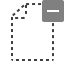
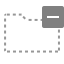
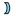

# Unity Editor Built-in Icons
Unity version **6000.4.0a2**

Load icons using `EditorGUIUtility.IconContent(<ICON NAME>);`

### File ID
You can change script icon by file id
1. Open meta file (ex. `*.cs.meta`) in Text Editor
2. Modify the line `icon: {instanceID: 0}` to `icon: {fileID: <FILE ID>, guid: 0000000000000000d000000000000000, type: 0}`
3. Save and focus Unity Editor

All icons are clickable, you will be forwarded to description file.
| Icon | Name | ID |
| --- | --- | --- |
| ](meta/_Help.md) | _Help | 6012202242263741038 |
| ](meta/_Help@2x.md) | _Help@2x | 4169196540306420147 |
| ](meta/_Menu.md) | _Menu | 4484009487905280788 |
| ](meta/_Menu@2x.md) | _Menu@2x | -7134199221773064657 |
| ](meta/_Popup.md) | _Popup | -1238941053918525804 |
| ](meta/_Popup@2x.md) | _Popup@2x | -1775921575863481085 |
| ](meta/AISparkle.md) | AISparkle | -3889721864363376411 |
| ](meta/AISparkle@2x.md) | AISparkle@2x | -7999907376314094397 |
| ](meta/AlphabeticalSorting.md) | AlphabeticalSorting | 385791893351368358 |
| ](meta/AlphabeticalSorting@2x.md) | AlphabeticalSorting@2x | 7687558349484904409 |
| ](meta/AnchorTransformTool%20On.md) | AnchorTransformTool On | -5941242636935399841 |
| ](meta/AnchorTransformTool%20On@2x.md) | AnchorTransformTool On@2x | 726274932638104148 |
| ](meta/AnchorTransformTool.md) | AnchorTransformTool | 723890132883790350 |
| ](meta/AnchorTransformTool@2x.md) | AnchorTransformTool@2x | -1760597073280235803 |
| ](meta/Animation.AddEvent.md) | Animation.AddEvent | 4137659740751492990 |
| ](meta/Animation.AddEvent@2x.md) | Animation.AddEvent@2x | 4559771996658765653 |
| ](meta/Animation.AddKeyframe.md) | Animation.AddKeyframe | 1899560698203370934 |
| ](meta/Animation.AddKeyframe@2x.md) | Animation.AddKeyframe@2x | 4928525775237636745 |
| ](meta/Animation.EventMarker.md) | Animation.EventMarker | -9093604829510332455 |
| ](meta/Animation.EventMarker@2x.md) | Animation.EventMarker@2x | 363374367590188809 |
| ](meta/Animation.FilterBySelection.md) | Animation.FilterBySelection | 4435535828786833316 |
| ](meta/Animation.FilterBySelection@2x.md) | Animation.FilterBySelection@2x | 5496628722178675830 |
| ](meta/Animation.FirstKey.md) | Animation.FirstKey | 3024128271444096090 |
| ](meta/Animation.FirstKey@2x.md) | Animation.FirstKey@2x | -6182535885671000683 |
| ](meta/Animation.LastKey.md) | Animation.LastKey | -891300260708246628 |
| ](meta/Animation.LastKey@2x.md) | Animation.LastKey@2x | -9094964329764419516 |
| ](meta/Animation.NextKey.md) | Animation.NextKey | -4388512538784373571 |
| ](meta/Animation.NextKey@2x.md) | Animation.NextKey@2x | -6917890404064482732 |
| ](meta/Animation.Play.md) | Animation.Play | -5044339833078438672 |
| ](meta/Animation.Play@2x.md) | Animation.Play@2x | 1241623811056693672 |
| ](meta/Animation.PrevKey.md) | Animation.PrevKey | 2990535490684037521 |
| ](meta/Animation.PrevKey@2x.md) | Animation.PrevKey@2x | 2404351936869365903 |
| ](meta/Animation.Record.md) | Animation.Record | 3223261772366079321 |
| ](meta/Animation.Record@2x.md) | Animation.Record@2x | -5824205243551370972 |
| ](meta/Animation.SequencerLink.md) | Animation.SequencerLink | 4724545919325408663 |
| ](meta/animationanimated.md) | animationanimated | 3991419891476851759 |
| ](meta/animationanimated@2x.md) | animationanimated@2x | -3957402828522027677 |
| ](meta/animationdopesheetkeyframe.md) | animationdopesheetkeyframe | -726526387389776670 |
| ](meta/animationkeyframe.md) | animationkeyframe | -129130776268707423 |
| ](meta/animationkeyframe@2x.md) | animationkeyframe@2x | 54921030647317439 |
| ](meta/animationnocurve.md) | animationnocurve | -6874279867631124203 |
| ](meta/animationvisibilitytoggleoff.md) | animationvisibilitytoggleoff | -8612809770818944968 |
| ](meta/animationvisibilitytoggleoff@2x.md) | animationvisibilitytoggleoff@2x | 2084219579258176148 |
| ](meta/animationvisibilitytoggleon.md) | animationvisibilitytoggleon | -7566948067701445177 |
| ](meta/animationvisibilitytoggleon@2x.md) | animationvisibilitytoggleon@2x | -3637143793055229142 |
| ](meta/AnimationWrapModeMenu.md) | AnimationWrapModeMenu | -811430376147227483 |
| ](meta/AssemblyLock.md) | AssemblyLock | -7772047616066763351 |
| ](meta/Asset%20Store.md) | Asset Store | 357073275683767465 |
| ](meta/Asset%20Store@2x.md) | Asset Store@2x | -4391848389275900105 |
| ](meta/Unity-AssetStore-Originals-Logo-White.md) | Unity-AssetStore-Originals-Logo-White | -8708281630871735944 |
| ](meta/Unity-AssetStore-Originals-Logo-White@2x.md) | Unity-AssetStore-Originals-Logo-White@2x | 5141202327592148685 |
| ](meta/Audio%20Mixer.md) | Audio Mixer | 5436946869657106676 |
| ](meta/Audio%20Mixer@2x.md) | Audio Mixer@2x | 923997255885558976 |
| ](meta/d_Pause.md) | d_Pause | -176319008291689145 |
| ](meta/d_Pause@2x.md) | d_Pause@2x | 5513754980864687971 |
| ](meta/d_Play.md) | d_Play | 2840300199887526447 |
| ](meta/d_Play@2x.md) | d_Play@2x | 7097392774114191295 |
| ](meta/d_Skip.md) | d_Skip | -151480035455886007 |
| ](meta/d_Skip@2x.md) | d_Skip@2x | -116362692607643271 |
| ](meta/d_Stop.md) | d_Stop | -4719932466619129553 |
| ](meta/d_Stop@2x.md) | d_Stop@2x | 2021644824490632000 |
| ](meta/Pause.md) | Pause | -2186780396375101553 |
| ](meta/Pause@2x.md) | Pause@2x | 8962986169007383491 |
| ](meta/Play.md) | Play | 8189429188577072440 |
| ](meta/Play@2x.md) | Play@2x | -75702923616896629 |
| ](meta/Skip.md) | Skip | -271356807615742943 |
| ](meta/Skip@2x.md) | Skip@2x | 3369782718960177557 |
| ](meta/Stop.md) | Stop | -6549760428460166285 |
| ](meta/Stop@2x.md) | Stop@2x | -8818875308651402091 |
| ](meta/AutoLightbakingOff.md) | AutoLightbakingOff | 3199249832511293691 |
| ](meta/AutoLightbakingOff@2x.md) | AutoLightbakingOff@2x | -7393052276937929259 |
| ](meta/AutoLightbakingOn.md) | AutoLightbakingOn | -7832132671675705975 |
| ](meta/AutoLightbakingOn@2x.md) | AutoLightbakingOn@2x | 5360101526799613901 |
| ](meta/AvatarCompass.md) | AvatarCompass | -4187170121413361579 |
| ](meta/AvatarController.Layer.md) | AvatarController.Layer | -7416910222760410010 |
| ](meta/AvatarController.LayerHover.md) | AvatarController.LayerHover | 1060193532816808308 |
| ](meta/AvatarController.LayerSelected.md) | AvatarController.LayerSelected | 3582037340827626199 |
| ](meta/BodyPartPicker.md) | BodyPartPicker | -3590433989099234366 |
| ](meta/BodySilhouette.md) | BodySilhouette | -4451312289517108567 |
| ](meta/DotFill.md) | DotFill | -8233242210051104170 |
| ](meta/DotFrame.md) | DotFrame | 7869005827914783879 |
| ](meta/DotFrameDotted.md) | DotFrameDotted | -3148911654985173949 |
| ](meta/DotSelection.md) | DotSelection | -3482997569041162315 |
| ](meta/Head.md) | Head | 3170944555394327123 |
| ](meta/HeadIk.md) | HeadIk | -1140323874079327623 |
| ](meta/HeadZoom.md) | HeadZoom | 5257450994311700591 |
| ](meta/HeadZoomSilhouette.md) | HeadZoomSilhouette | 7762936895225980166 |
| ](meta/LeftArm.md) | LeftArm | 6123190672307434784 |
| ](meta/LeftFeetIk.md) | LeftFeetIk | 7545747472747947336 |
| ](meta/LeftFingers.md) | LeftFingers | -1642451135284037380 |
| ](meta/LeftFingersIk.md) | LeftFingersIk | 1748729859595675987 |
| ](meta/LeftHandZoom.md) | LeftHandZoom | 1621456644947490004 |
| ](meta/LeftHandZoomSilhouette.md) | LeftHandZoomSilhouette | 8384039629936793124 |
| ](meta/LeftLeg.md) | LeftLeg | 4921818627043158325 |
| ](meta/MaskEditor_Root.md) | MaskEditor_Root | 4804520092827026396 |
| ](meta/RightArm.md) | RightArm | 1833656670869755110 |
| ](meta/RightFeetIk.md) | RightFeetIk | 3710563382436173543 |
| ](meta/RightFingers.md) | RightFingers | -3389118511690339839 |
| ](meta/RightFingersIk.md) | RightFingersIk | 3975814432022212013 |
| ](meta/RightHandZoom.md) | RightHandZoom | 1596608304540055736 |
| ](meta/RightHandZoomSilhouette.md) | RightHandZoomSilhouette | 4529296075431145259 |
| ](meta/RightLeg.md) | RightLeg | -1476864603792500380 |
| ](meta/Torso.md) | Torso | -8990505202146232379 |
| ](meta/AvatarPivot.md) | AvatarPivot | -4773557929347618964 |
| ](meta/AvatarPivot@2x.md) | AvatarPivot@2x | -4221608646632983637 |
| ](meta/AvatarSelector.md) | AvatarSelector | 3140210110609189590 |
| ](meta/AvatarSelector@2x.md) | AvatarSelector@2x | 1207210223992105847 |
| ](meta/back.md) | back | 320677636847005385 |
| ](meta/back@2x.md) | back@2x | -7499749373794679393 |
| ](meta/beginButton-On.md) | beginButton-On | -4324571489063779742 |
| ](meta/beginButton.md) | beginButton | -7576460149459046898 |
| ](meta/BigIcons.CloudArrowUp.md) | BigIcons.CloudArrowUp | -3663220868850177073 |
| ](meta/BigIcons.CloudArrowUp@2x.md) | BigIcons.CloudArrowUp@2x | -5434993055627382757 |
| ](meta/BigIcons.CloudCheckmark.md) | BigIcons.CloudCheckmark | -8163206045635866552 |
| ](meta/BigIcons.CloudCheckmark@2x.md) | BigIcons.CloudCheckmark@2x | -7995637075994146780 |
| ](meta/BigIcons.ExclamationMark.md) | BigIcons.ExclamationMark | 7235897139591392561 |
| ](meta/BigIcons.ExclamationMark@2x.md) | BigIcons.ExclamationMark@2x | -7409421512409619805 |
| ](meta/BigIcons.Gear.md) | BigIcons.Gear | 8988468630332807318 |
| ](meta/BigIcons.Gear@2x.md) | BigIcons.Gear@2x | 8641374060797376716 |
| ](meta/blendKey.md) | blendKey | 6036928476410329760 |
| ](meta/blendKey@2x.md) | blendKey@2x | -2397077918234679593 |
| ](meta/blendKeyOverlay.md) | blendKeyOverlay | 4617552029562368530 |
| ](meta/blendKeyOverlay@2x.md) | blendKeyOverlay@2x | 958581468013483940 |
| ](meta/blendKeySelected.md) | blendKeySelected | -1506858753398121587 |
| ](meta/blendKeySelected@2x.md) | blendKeySelected@2x | -5330284743984316167 |
| ](meta/blendSampler.md) | blendSampler | 7624220810582456138 |
| ](meta/blueGroove.md) | blueGroove | -1206214115408343928 |
| ](meta/d_UnityProduct.md) | d_UnityProduct | -1197854585121930836 |
| ](meta/d_UnityProduct@2x.md) | d_UnityProduct@2x | -5040562646006385990 |
| ](meta/Mono-logo.md) | Mono-logo | -6533001126546822243 |
| ](meta/Mono-logo@2x.md) | Mono-logo@2x | -6437743468973249972 |
| ](meta/PhysX-logo.md) | PhysX-logo | 3656026296223292759 |
| ](meta/PhysX-logo@2x.md) | PhysX-logo@2x | -3737108243305175383 |
| ](meta/UnityAboutLogo.md) | UnityAboutLogo | 799538274456256032 |
| ](meta/UnityAboutLogo@2x.md) | UnityAboutLogo@2x | -3981379970930999149 |
| ](meta/UnityProduct.md) | UnityProduct | -4106767590473708029 |
| ](meta/UnityProduct@2x.md) | UnityProduct@2x | -3756281054813284186 |
| ](meta/BuildSettings.Android.Hero.md) | BuildSettings.Android.Hero | -9207837334396807036 |
| ](meta/BuildSettings.DedicatedServer.Hero.md) | BuildSettings.DedicatedServer.Hero | 4193703434860849406 |
| ](meta/BuildSettings.Editor.Hero.md) | BuildSettings.Editor.Hero | 2165036744747510781 |
| ](meta/BuildSettings.EmbeddedLinux.Hero.md) | BuildSettings.EmbeddedLinux.Hero | -7121870567508689846 |
| ](meta/BuildSettings.Facebook.Hero.md) | BuildSettings.Facebook.Hero | 6983985304502384072 |
| ](meta/BuildSettings.GameCoreScarlett.Hero.md) | BuildSettings.GameCoreScarlett.Hero | 6644121568336346536 |
| ](meta/BuildSettings.GameCoreXboxOne.Hero.md) | BuildSettings.GameCoreXboxOne.Hero | 5682788306882981402 |
| ](meta/BuildSettings.iPhone.Hero.md) | BuildSettings.iPhone.Hero | -1516956157574014769 |
| ](meta/BuildSettings.Linux.Hero.md) | BuildSettings.Linux.Hero | -3979910643278840037 |
| ](meta/BuildSettings.LinuxHeadlessSimulation.Hero.md) | BuildSettings.LinuxHeadlessSimulation.Hero | -2453472649154599336 |
| ](meta/BuildSettings.Meta.Hero.md) | BuildSettings.Meta.Hero | -9070482282421505461 |
| ](meta/BuildSettings.Metro.Hero.md) | BuildSettings.Metro.Hero | 6180724917844104010 |
| ](meta/BuildSettings.OSX.Hero.md) | BuildSettings.OSX.Hero | -7048650731427229155 |
| ](meta/BuildSettings.PS4.Hero.md) | BuildSettings.PS4.Hero | -70003218503760845 |
| ](meta/BuildSettings.PS5.Hero.md) | BuildSettings.PS5.Hero | 1996713589037423828 |
| ](meta/BuildSettings.QNX.Hero.md) | BuildSettings.QNX.Hero | 773378296198852062 |
| ](meta/BuildSettings.Standalone.Hero.md) | BuildSettings.Standalone.Hero | -7109271019165039811 |
| ](meta/BuildSettings.Switch.Hero.md) | BuildSettings.Switch.Hero | 1305347955515595851 |
| ](meta/BuildSettings.Switch2.Hero.md) | BuildSettings.Switch2.Hero | -2639969635391981578 |
| ](meta/BuildSettings.tvOS.Hero.md) | BuildSettings.tvOS.Hero | 6655431228166588383 |
| ](meta/BuildSettings.visionOS.Hero.md) | BuildSettings.visionOS.Hero | 6168439465575266322 |
| ](meta/BuildSettings.WebGL.Hero.md) | BuildSettings.WebGL.Hero | -1859576962997995457 |
| ](meta/BuildSettings.Windows.Hero.md) | BuildSettings.Windows.Hero | 8884405939664539451 |
| ](meta/d_BuildSettings.Android.Hero.md) | d_BuildSettings.Android.Hero | -5951549563545373222 |
| ](meta/d_BuildSettings.DedicatedServer.Hero.md) | d_BuildSettings.DedicatedServer.Hero | -5850428861380546811 |
| ](meta/d_BuildSettings.Editor.Hero.md) | d_BuildSettings.Editor.Hero | 5553819741498998102 |
| ](meta/d_BuildSettings.EmbeddedLinux.Hero.md) | d_BuildSettings.EmbeddedLinux.Hero | 5442802489627464067 |
| ](meta/d_BuildSettings.Facebook.Hero.md) | d_BuildSettings.Facebook.Hero | -6213294416433447442 |
| ](meta/d_BuildSettings.GameCoreScarlett.Hero.md) | d_BuildSettings.GameCoreScarlett.Hero | 1535812934028099565 |
| ](meta/d_BuildSettings.GameCoreXboxOne.Hero.md) | d_BuildSettings.GameCoreXboxOne.Hero | -4307401168516486034 |
| ](meta/d_BuildSettings.iPhone.Hero.md) | d_BuildSettings.iPhone.Hero | -8195827054175098805 |
| ](meta/d_BuildSettings.Linux.Hero.md) | d_BuildSettings.Linux.Hero | 7780600872021275871 |
| ](meta/d_BuildSettings.LinuxHeadlessSimulation.Hero.md) | d_BuildSettings.LinuxHeadlessSimulation.Hero | -7039769864725891724 |
| ](meta/d_BuildSettings.Meta.Hero.md) | d_BuildSettings.Meta.Hero | 8766829007195887137 |
| ](meta/d_BuildSettings.Metro.Hero.md) | d_BuildSettings.Metro.Hero | 3758786635687518533 |
| ](meta/d_BuildSettings.OSX.Hero.md) | d_BuildSettings.OSX.Hero | -9124916827662756587 |
| ](meta/d_BuildSettings.PS4.Hero.md) | d_BuildSettings.PS4.Hero | 5621852659444027150 |
| ](meta/d_BuildSettings.PS5.Hero.md) | d_BuildSettings.PS5.Hero | 2585079198597406132 |
| ](meta/d_BuildSettings.QNX.Hero.md) | d_BuildSettings.QNX.Hero | -5773374152050314284 |
| ](meta/d_BuildSettings.Standalone.Hero.md) | d_BuildSettings.Standalone.Hero | 7989510244471379643 |
| ](meta/d_BuildSettings.Switch.Hero.md) | d_BuildSettings.Switch.Hero | 8484671321705716838 |
| ](meta/d_BuildSettings.Switch2.Hero.md) | d_BuildSettings.Switch2.Hero | 2745787593543998444 |
| ](meta/d_BuildSettings.tvOS.Hero.md) | d_BuildSettings.tvOS.Hero | -8126428299051736897 |
| ](meta/d_BuildSettings.visionOS.Hero.md) | d_BuildSettings.visionOS.Hero | 5140727046411053362 |
| ](meta/d_BuildSettings.WebGL.Hero.md) | d_BuildSettings.WebGL.Hero | -7442804917201370544 |
| ](meta/d_BuildSettings.Windows.Hero.md) | d_BuildSettings.Windows.Hero | 1983672742163315439 |
| ](meta/PlaceholderHero.md) | PlaceholderHero | 240214147559646209 |
| ](meta/BuildSettings.Android%20On.md) | BuildSettings.Android On | -1878890260662668789 |
| ](meta/BuildSettings.Android%20On@2x.md) | BuildSettings.Android On@2x | 16334440819132706 |
| ](meta/BuildSettings.Android.md) | BuildSettings.Android | -3225301215205586114 |
| ](meta/BuildSettings.Android.Small.md) | BuildSettings.Android.Small | -1166641788184234255 |
| ](meta/BuildSettings.Android.Small@2x.md) | BuildSettings.Android.Small@2x | -5945452454175733588 |
| ](meta/BuildSettings.Android@2x.md) | BuildSettings.Android@2x | 5734965202261760406 |
| ](meta/BuildSettings.Broadcom.md) | BuildSettings.Broadcom | -2611540343518146177 |
| ](meta/BuildSettings.DedicatedServer%20On.md) | BuildSettings.DedicatedServer On | 3297296290159596267 |
| ](meta/BuildSettings.DedicatedServer%20On@2x.md) | BuildSettings.DedicatedServer On@2x | 5919977954002937266 |
| ](meta/BuildSettings.DedicatedServer.md) | BuildSettings.DedicatedServer | 3815258833528828467 |
| ](meta/BuildSettings.DedicatedServer.Small.md) | BuildSettings.DedicatedServer.Small | -7647273969673859249 |
| ](meta/BuildSettings.DedicatedServer.Small@2x.md) | BuildSettings.DedicatedServer.Small@2x | -6058522490286245110 |
| ](meta/BuildSettings.DedicatedServer@2x.md) | BuildSettings.DedicatedServer@2x | 6769625271997971160 |
| ](meta/BuildSettings.Editor.md) | BuildSettings.Editor | 8400232691031406736 |
| ](meta/BuildSettings.Editor.Small.md) | BuildSettings.Editor.Small | -6908710258048083175 |
| ](meta/BuildSettings.EmbeddedLinux%20On@2x.md) | BuildSettings.EmbeddedLinux On@2x | 1354193150461728072 |
| ](meta/BuildSettings.EmbeddedLinux.md) | BuildSettings.EmbeddedLinux | -2896840256165816803 |
| ](meta/BuildSettings.EmbeddedLinux.Small.md) | BuildSettings.EmbeddedLinux.Small | -3209210660937311089 |
| ](meta/BuildSettings.EmbeddedLinux.Small@2x.md) | BuildSettings.EmbeddedLinux.Small@2x | -3888723655212919763 |
| ](meta/BuildSettings.EmbeddedLinux@2x.md) | BuildSettings.EmbeddedLinux@2x | -2157157522209226451 |
| ](meta/BuildSettings.Facebook%20On.md) | BuildSettings.Facebook On | -7859711678534788915 |
| ](meta/BuildSettings.Facebook%20On@2x.md) | BuildSettings.Facebook On@2x | -1283358686002970987 |
| ](meta/BuildSettings.Facebook.md) | BuildSettings.Facebook | -5485581235442607191 |
| ](meta/BuildSettings.Facebook.Small.md) | BuildSettings.Facebook.Small | 5439670708184688316 |
| ](meta/BuildSettings.Facebook.Small@2x.md) | BuildSettings.Facebook.Small@2x | 9115517695639967145 |
| ](meta/BuildSettings.Facebook@2x.md) | BuildSettings.Facebook@2x | -2925270732012849750 |
| ](meta/BuildSettings.FlashPlayer.md) | BuildSettings.FlashPlayer | 466988226579792567 |
| ](meta/BuildSettings.FlashPlayer.Small.md) | BuildSettings.FlashPlayer.Small | 4366120842335875659 |
| ](meta/BuildSettings.GameCoreScarlett%20On.md) | BuildSettings.GameCoreScarlett On | 4032073047827678025 |
| ](meta/BuildSettings.GameCoreScarlett%20On@2x.md) | BuildSettings.GameCoreScarlett On@2x | 7612008437288004200 |
| ](meta/BuildSettings.GameCoreScarlett.md) | BuildSettings.GameCoreScarlett | 438378150247721864 |
| ](meta/BuildSettings.GameCoreScarlett.Small.md) | BuildSettings.GameCoreScarlett.Small | -9179897014072820805 |
| ](meta/BuildSettings.GameCoreScarlett.Small@2x.md) | BuildSettings.GameCoreScarlett.Small@2x | -7651910531202835751 |
| ](meta/BuildSettings.GameCoreScarlett@2x.md) | BuildSettings.GameCoreScarlett@2x | -9106869091312449984 |
| ](meta/BuildSettings.GameCoreXboxOne%20On.md) | BuildSettings.GameCoreXboxOne On | 7548485100206320310 |
| ](meta/BuildSettings.GameCoreXboxOne%20On@2x.md) | BuildSettings.GameCoreXboxOne On@2x | 991673151852721335 |
| ](meta/BuildSettings.GameCoreXboxOne.md) | BuildSettings.GameCoreXboxOne | 3068716228704556637 |
| ](meta/BuildSettings.GameCoreXboxOne.Small.md) | BuildSettings.GameCoreXboxOne.Small | 4089031816727803355 |
| ](meta/BuildSettings.GameCoreXboxOne.Small@2x.md) | BuildSettings.GameCoreXboxOne.Small@2x | 2145091974174636302 |
| ](meta/BuildSettings.GameCoreXboxOne@2x.md) | BuildSettings.GameCoreXboxOne@2x | 7098168344539396557 |
| ](meta/BuildSettings.iPhone%20On.md) | BuildSettings.iPhone On | 5315025538136271434 |
| ](meta/BuildSettings.iPhone%20On@2x.md) | BuildSettings.iPhone On@2x | 3856988739857600585 |
| ](meta/BuildSettings.iPhone.md) | BuildSettings.iPhone | 3079519598310828125 |
| ](meta/BuildSettings.iPhone.Small.md) | BuildSettings.iPhone.Small | 4345870033486632634 |
| ](meta/BuildSettings.iPhone.Small@2x.md) | BuildSettings.iPhone.Small@2x | -5634524864065029246 |
| ](meta/BuildSettings.iPhone@2x.md) | BuildSettings.iPhone@2x | 6987697712259842190 |
| ](meta/BuildSettings.Linux.md) | BuildSettings.Linux | -8143322538885544226 |
| ](meta/BuildSettings.Linux.Small.md) | BuildSettings.Linux.Small | 3567089156471553452 |
| ](meta/BuildSettings.Linux.Small@2x.md) | BuildSettings.Linux.Small@2x | -6361760883703383191 |
| ](meta/BuildSettings.Linux@2x.md) | BuildSettings.Linux@2x | 3764582336549979051 |
| ](meta/BuildSettings.LinuxHeadlessSimulation%20On.md) | BuildSettings.LinuxHeadlessSimulation On | -7513381595562638541 |
| ](meta/BuildSettings.LinuxHeadlessSimulation%20On@2x.md) | BuildSettings.LinuxHeadlessSimulation On@2x | -4400627701946926389 |
| ](meta/BuildSettings.LinuxHeadlessSimulation.md) | BuildSettings.LinuxHeadlessSimulation | -8957706314130457392 |
| ](meta/BuildSettings.LinuxHeadlessSimulation.Small.md) | BuildSettings.LinuxHeadlessSimulation.Small | 7705685685023676459 |
| ](meta/BuildSettings.LinuxHeadlessSimulation.Small@2x.md) | BuildSettings.LinuxHeadlessSimulation.Small@2x | 6676424620479421655 |
| ](meta/BuildSettings.LinuxHeadlessSimulation@2x.md) | BuildSettings.LinuxHeadlessSimulation@2x | -8985081934903617673 |
| ](meta/BuildSettings.Lumin%20On.md) | BuildSettings.Lumin On | -7421784102139658696 |
| ](meta/BuildSettings.Lumin%20On@2x.md) | BuildSettings.Lumin On@2x | 2998448140356953732 |
| ](meta/BuildSettings.Lumin.md) | BuildSettings.Lumin | -5215224591671759445 |
| ](meta/BuildSettings.Lumin.small.md) | BuildSettings.Lumin.small | 8979687790990599924 |
| ](meta/BuildSettings.Lumin.small@2x.md) | BuildSettings.Lumin.small@2x | -731794183861421397 |
| ](meta/BuildSettings.Lumin@2x.md) | BuildSettings.Lumin@2x | -5166817344748110915 |
| ](meta/BuildSettings.Metro%20On.md) | BuildSettings.Metro On | 3455818660745422868 |
| ](meta/BuildSettings.Metro%20On@2x.md) | BuildSettings.Metro On@2x | 6720285510691535691 |
| ](meta/BuildSettings.Metro.md) | BuildSettings.Metro | -4021004726003450232 |
| ](meta/BuildSettings.Metro.Small.md) | BuildSettings.Metro.Small | 8056438331138731872 |
| ](meta/BuildSettings.Metro.Small@2x.md) | BuildSettings.Metro.Small@2x | -8732235388156778990 |
| ](meta/BuildSettings.Metro@2x.md) | BuildSettings.Metro@2x | -2311780035366954593 |
| ](meta/BuildSettings.N3DS%20On.md) | BuildSettings.N3DS On | 6165003963721005565 |
| ](meta/BuildSettings.N3DS%20On@2x.md) | BuildSettings.N3DS On@2x | 8791219912215951517 |
| ](meta/BuildSettings.N3DS.md) | BuildSettings.N3DS | -5908170440005314456 |
| ](meta/BuildSettings.N3DS.Small.md) | BuildSettings.N3DS.Small | -6066799282333214607 |
| ](meta/BuildSettings.N3DS.Small@2x.md) | BuildSettings.N3DS.Small@2x | 2057369963675073982 |
| ](meta/BuildSettings.N3DS@2x.md) | BuildSettings.N3DS@2x | -6430829192587231253 |
| ](meta/BuildSettings.OSX.md) | BuildSettings.OSX | 5732989794339194379 |
| ](meta/BuildSettings.OSX.Small.md) | BuildSettings.OSX.Small | 3544963573631410847 |
| ](meta/BuildSettings.OSX.Small@2x.md) | BuildSettings.OSX.Small@2x | -7254486946852970549 |
| ](meta/BuildSettings.OSX@2x.md) | BuildSettings.OSX@2x | 5336092474376659068 |
| ](meta/BuildSettings.PS4%20On.md) | BuildSettings.PS4 On | -2446513153997903262 |
| ](meta/BuildSettings.PS4%20On@2x.md) | BuildSettings.PS4 On@2x | 7838709373500781874 |
| ](meta/BuildSettings.PS4.md) | BuildSettings.PS4 | 55494050528514414 |
| ](meta/BuildSettings.PS4.Small.md) | BuildSettings.PS4.Small | 2298978507677022530 |
| ](meta/BuildSettings.PS4.Small@2x.md) | BuildSettings.PS4.Small@2x | -2413739408649156995 |
| ](meta/BuildSettings.PS4@2x.md) | BuildSettings.PS4@2x | -6527979290361645938 |
| ](meta/BuildSettings.PS5%20On.md) | BuildSettings.PS5 On | 6012666984125897113 |
| ](meta/BuildSettings.PS5%20On@2x.md) | BuildSettings.PS5 On@2x | 5021112018744779014 |
| ](meta/BuildSettings.PS5.md) | BuildSettings.PS5 | -8144718789618191920 |
| ](meta/BuildSettings.PS5.Small.md) | BuildSettings.PS5.Small | 8521832537410238816 |
| ](meta/BuildSettings.PS5.Small@2x.md) | BuildSettings.PS5.Small@2x | 7719912845452673205 |
| ](meta/BuildSettings.PS5@2x.md) | BuildSettings.PS5@2x | 373751416080676096 |
| ](meta/BuildSettings.PSM.md) | BuildSettings.PSM | -98090470861308492 |
| ](meta/BuildSettings.PSM.Small.md) | BuildSettings.PSM.Small | -715787968158446526 |
| ](meta/BuildSettings.PSP2.md) | BuildSettings.PSP2 | 9006858688270511880 |
| ](meta/BuildSettings.PSP2.Small.md) | BuildSettings.PSP2.Small | -2257309162268670159 |
| ](meta/BuildSettings.QNX%20On.md) | BuildSettings.QNX On | 8649443330007599567 |
| ](meta/BuildSettings.QNX%20On@2x.md) | BuildSettings.QNX On@2x | 651470099042661747 |
| ](meta/BuildSettings.QNX.md) | BuildSettings.QNX | 1050841081343024967 |
| ](meta/BuildSettings.QNX.Small.md) | BuildSettings.QNX.Small | -989840311337000591 |
| ](meta/BuildSettings.QNX.Small@2x.md) | BuildSettings.QNX.Small@2x | 8699015482324335218 |
| ](meta/BuildSettings.QNX@2x.md) | BuildSettings.QNX@2x | 6676897800958288455 |
| ](meta/BuildSettings.SceneList.md) | BuildSettings.SceneList | -3947758333842445173 |
| ](meta/BuildSettings.SelectedIcon.md) | BuildSettings.SelectedIcon | -3237302683924646227 |
| ](meta/BuildSettings.Stadia%20On.md) | BuildSettings.Stadia On | -583410931937435233 |
| ](meta/BuildSettings.Stadia%20On@2x.md) | BuildSettings.Stadia On@2x | -2427937019371804007 |
| ](meta/BuildSettings.Stadia.md) | BuildSettings.Stadia | -1059611258551044968 |
| ](meta/BuildSettings.Stadia.small.md) | BuildSettings.Stadia.small | -1982176944817373238 |
| ](meta/BuildSettings.Stadia.Small@2x.md) | BuildSettings.Stadia.Small@2x | 8703136191750934175 |
| ](meta/BuildSettings.Stadia@2x.md) | BuildSettings.Stadia@2x | 3805792301904044692 |
| ](meta/BuildSettings.Standalone%20On.md) | BuildSettings.Standalone On | -8032632311582345015 |
| ](meta/BuildSettings.Standalone%20On@2x.md) | BuildSettings.Standalone On@2x | 4576219794024598259 |
| ](meta/BuildSettings.Standalone.md) | BuildSettings.Standalone | -9041251142560793768 |
| ](meta/BuildSettings.Standalone.Small.md) | BuildSettings.Standalone.Small | 4297135980918140731 |
| ](meta/BuildSettings.Standalone.Small@2x.md) | BuildSettings.Standalone.Small@2x | 8897440368062136615 |
| ](meta/BuildSettings.Standalone@2x.md) | BuildSettings.Standalone@2x | 3214811950287853606 |
| ](meta/BuildSettings.StandaloneBroadcom.Small.md) | BuildSettings.StandaloneBroadcom.Small | -8905343430035773069 |
| ](meta/BuildSettings.StandaloneGLES20Emu.Small.md) | BuildSettings.StandaloneGLES20Emu.Small | 2723429009875258330 |
| ](meta/BuildSettings.StandaloneGLESEmu.md) | BuildSettings.StandaloneGLESEmu | -1310285349776098935 |
| ](meta/BuildSettings.StandaloneGLESEmu.Small.md) | BuildSettings.StandaloneGLESEmu.Small | 6677928742535971017 |
| ](meta/BuildSettings.Switch%20On.md) | BuildSettings.Switch On | 5706999980759659277 |
| ](meta/BuildSettings.Switch%20On@2x.md) | BuildSettings.Switch On@2x | -61262952020375652 |
| ](meta/BuildSettings.Switch.md) | BuildSettings.Switch | 5517785097875794962 |
| ](meta/BuildSettings.Switch.Small.md) | BuildSettings.Switch.Small | 8765560747129780117 |
| ](meta/BuildSettings.Switch.Small@2x.md) | BuildSettings.Switch.Small@2x | -3990060041231824171 |
| ](meta/BuildSettings.Switch2%20On.md) | BuildSettings.Switch2 On | 5733145375251382739 |
| ](meta/BuildSettings.Switch2%20On@2x.md) | BuildSettings.Switch2 On@2x | -5433540146580045549 |
| ](meta/BuildSettings.Switch2.md) | BuildSettings.Switch2 | 2014774361819103299 |
| ](meta/BuildSettings.Switch2.Small.md) | BuildSettings.Switch2.Small | 2853083068090880168 |
| ](meta/BuildSettings.Switch2.Small@2x.md) | BuildSettings.Switch2.Small@2x | 4884064470701719486 |
| ](meta/BuildSettings.Switch@2x.md) | BuildSettings.Switch@2x | 4203361953608673628 |
| ](meta/BuildSettings.tvOS%20On.md) | BuildSettings.tvOS On | -1883590773550481976 |
| ](meta/BuildSettings.tvOS%20On@2x.md) | BuildSettings.tvOS On@2x | -2815775797557438328 |
| ](meta/BuildSettings.tvOS.md) | BuildSettings.tvOS | -2604507406547028008 |
| ](meta/BuildSettings.tvOS.Small.md) | BuildSettings.tvOS.Small | 2324412021468308913 |
| ](meta/BuildSettings.tvOS.Small@2x.md) | BuildSettings.tvOS.Small@2x | 9180157117389547636 |
| ](meta/BuildSettings.tvOS@2x.md) | BuildSettings.tvOS@2x | -1376627478172224437 |
| ](meta/BuildSettings.visionOS%20On.md) | BuildSettings.visionOS On | 9124571375880852433 |
| ](meta/BuildSettings.visionOS%20On@2x.md) | BuildSettings.visionOS On@2x | 1894222060145787484 |
| ](meta/BuildSettings.visionOS.md) | BuildSettings.visionOS | 7255139279651513950 |
| ](meta/BuildSettings.visionOS.small.md) | BuildSettings.visionOS.small | 5988672859772047745 |
| ](meta/BuildSettings.visionOS.small@2x.md) | BuildSettings.visionOS.small@2x | -4230535166689694229 |
| ](meta/BuildSettings.visionOS@2x.md) | BuildSettings.visionOS@2x | 3766923774201948693 |
| ](meta/BuildSettings.Web.md) | BuildSettings.Web | -8073681927563260479 |
| ](meta/BuildSettings.Web.Small.md) | BuildSettings.Web.Small | -8502616656149400873 |
| ](meta/BuildSettings.WebGL%20On.md) | BuildSettings.WebGL On | 4781758196249721453 |
| ](meta/BuildSettings.WebGL%20On@2x.md) | BuildSettings.WebGL On@2x | -6184026389132908262 |
| ](meta/BuildSettings.WebGL.md) | BuildSettings.WebGL | -4911556789970686505 |
| ](meta/BuildSettings.WebGL.Small.md) | BuildSettings.WebGL.Small | -3267170773426585699 |
| ](meta/BuildSettings.WebGL.Small@2x.md) | BuildSettings.WebGL.Small@2x | 7777299662375183282 |
| ](meta/BuildSettings.WebGL@2x.md) | BuildSettings.WebGL@2x | -596689760537875709 |
| ](meta/BuildSettings.Windows.md) | BuildSettings.Windows | 6950411709033133733 |
| ](meta/BuildSettings.Windows.Small.md) | BuildSettings.Windows.Small | -8973708545683805325 |
| ](meta/BuildSettings.Windows.Small@2x.md) | BuildSettings.Windows.Small@2x | 2331217329389106139 |
| ](meta/BuildSettings.Windows@2x.md) | BuildSettings.Windows@2x | -2748820393575266280 |
| ](meta/BuildSettings.WP8.md) | BuildSettings.WP8 | 8103707556279304917 |
| ](meta/BuildSettings.WP8.Small.md) | BuildSettings.WP8.Small | -1021178350218690989 |
| ](meta/BuildSettings.Xbox360.md) | BuildSettings.Xbox360 | -3037193308305438414 |
| ](meta/BuildSettings.Xbox360.Small.md) | BuildSettings.Xbox360.Small | -1179187124510255440 |
| ](meta/BuildSettings.XboxOne%20On.md) | BuildSettings.XboxOne On | -6576850163072677896 |
| ](meta/BuildSettings.XboxOne%20On@2x.md) | BuildSettings.XboxOne On@2x | 7572160625161521045 |
| ](meta/BuildSettings.XboxOne.md) | BuildSettings.XboxOne | 5149289017103940624 |
| ](meta/BuildSettings.XboxOne.Small.md) | BuildSettings.XboxOne.Small | -245827484132217333 |
| ](meta/BuildSettings.XboxOne.Small@2x.md) | BuildSettings.XboxOne.Small@2x | 389319431642934349 |
| ](meta/BuildSettings.XboxOne@2x.md) | BuildSettings.XboxOne@2x | 3546431289802905298 |
| ](meta/CacheServerConnected.md) | CacheServerConnected | 6237473061563373096 |
| ](meta/CacheServerConnected@2x.md) | CacheServerConnected@2x | 5286386693594080902 |
| ](meta/CacheServerDisabled.md) | CacheServerDisabled | 1688511831137845510 |
| ](meta/CacheServerDisabled@2x.md) | CacheServerDisabled@2x | 3350491704846691845 |
| ](meta/CacheServerDisconnected.md) | CacheServerDisconnected | 185745745770690484 |
| ](meta/CacheServerDisconnected@2x.md) | CacheServerDisconnected@2x | -3833278316657131349 |
| ](meta/CheckerFloor.md) | CheckerFloor | -7297968518591046888 |
| ](meta/Clipboard.md) | Clipboard | 6367713590482950888 |
| ](meta/ClothInspector.PaintTool.md) | ClothInspector.PaintTool | 1624265540036763281 |
| ](meta/ClothInspector.PaintValue.md) | ClothInspector.PaintValue | 2134799571607069742 |
| ](meta/ClothInspector.SelectTool.md) | ClothInspector.SelectTool | 9194464402604369906 |
| ](meta/ClothInspector.SettingsTool.md) | ClothInspector.SettingsTool | -5509047954332065865 |
| ](meta/ClothInspector.ViewValue.md) | ClothInspector.ViewValue | -8688548480094122452 |
| ](meta/CloudConnect.md) | CloudConnect | 1796978947134172663 |
| ](meta/CloudConnect@2x.md) | CloudConnect@2x | -2753773498841969441 |
| ](meta/Collab.Build.md) | Collab.Build | -6191915706818861775 |
| ](meta/Collab.BuildFailed.md) | Collab.BuildFailed | -5437438620272192643 |
| ](meta/Collab.BuildSucceeded.md) | Collab.BuildSucceeded | 5057284793689411865 |
| ](meta/Collab.FileAdded.md) | Collab.FileAdded | 6445321136183198910 |
| ](meta/Collab.FileConflict.md) | Collab.FileConflict | 4336985247694938811 |
| ](meta/Collab.FileDeleted.md) | Collab.FileDeleted | 6324715908799697015 |
| ](meta/Collab.FileIgnored.md) | Collab.FileIgnored | 5400097563507297522 |
| ](meta/Collab.FileMoved.md) | Collab.FileMoved | -2730299386048139239 |
| ](meta/Collab.FileUpdated.md) | Collab.FileUpdated | 1417162553530547262 |
| ](meta/Collab.FolderAdded.md) | Collab.FolderAdded | -1210278254150948088 |
| ](meta/Collab.FolderConflict.md) | Collab.FolderConflict | 8903646916365696551 |
| ](meta/Collab.FolderDeleted.md) | Collab.FolderDeleted | 735796692002808257 |
| ](meta/Collab.FolderIgnored.md) | Collab.FolderIgnored | -1970951285390588327 |
| ](meta/Collab.FolderMoved.md) | Collab.FolderMoved | 8020716426326303056 |
| ](meta/Collab.FolderUpdated.md) | Collab.FolderUpdated | -8335063640492715981 |
| ](meta/Collab.NoInternet.md) | Collab.NoInternet | -6607641266460543220 |
| ](meta/Collab.md) | Collab | -6158769726174120613 |
| ](meta/Collab.Warning.md) | Collab.Warning | -7186489016682460555 |
| ](meta/Collab@2x.md) | Collab@2x | -204901687004141392 |
| ](meta/CollabConflict.md) | CollabConflict | 7544789595935200320 |
| ](meta/CollabError.md) | CollabError | -8234132648094580814 |
| ](meta/CollabNew.md) | CollabNew | -8705029441204933142 |
| ](meta/CollabOffline.md) | CollabOffline | 8796122042331125716 |
| ](meta/CollabProgress.md) | CollabProgress | -5136566985977948126 |
| ](meta/CollabPull.md) | CollabPull | -8487449939106475213 |
| ](meta/CollabPush.md) | CollabPush | -4221040498047746133 |
| ](meta/ColorPicker.ColorCycle.md) | ColorPicker.ColorCycle | 886907316228417740 |
| ](meta/ColorPicker.CycleColor.md) | ColorPicker.CycleColor | -3564112748134886232 |
| ](meta/ColorPicker.CycleSlider.md) | ColorPicker.CycleSlider | -3513833679861578334 |
| ](meta/ColorPicker.SliderCycle.md) | ColorPicker.SliderCycle | -7083475956794908383 |
| ](meta/console.erroricon.inactive.sml.md) | console.erroricon.inactive.sml | 3590839462479323251 |
| ](meta/console.erroricon.inactive.sml@2x.md) | console.erroricon.inactive.sml@2x | -2994576740540915103 |
| ](meta/console.erroricon.md) | console.erroricon | 1715859669443758926 |
| ](meta/console.erroricon.sml.md) | console.erroricon.sml | -2005373149481181617 |
| ](meta/console.erroricon.sml@2x.md) | console.erroricon.sml@2x | 8987726391556715404 |
| ](meta/console.erroricon@2x.md) | console.erroricon@2x | 6284689507932306902 |
| ](meta/console.infoicon.inactive.sml.md) | console.infoicon.inactive.sml | -834181036293777854 |
| ](meta/console.infoicon.inactive.sml@2x.md) | console.infoicon.inactive.sml@2x | -7419826344962246451 |
| ](meta/console.infoicon.md) | console.infoicon | -7150409940516424707 |
| ](meta/console.infoicon.sml.md) | console.infoicon.sml | 5425037494185492166 |
| ](meta/console.infoicon.sml@2x.md) | console.infoicon.sml@2x | -5160543911401257732 |
| ](meta/console.infoicon@2x.md) | console.infoicon@2x | -834399640629991296 |
| ](meta/console.warnicon.inactive.sml.md) | console.warnicon.inactive.sml | 2636775829707929427 |
| ](meta/console.warnicon.inactive.sml@2x.md) | console.warnicon.inactive.sml@2x | -3380099296471467840 |
| ](meta/console.warnicon.md) | console.warnicon | 2655493458141633029 |
| ](meta/console.warnicon.sml.md) | console.warnicon.sml | -5763820162405496800 |
| ](meta/console.warnicon.sml@2x.md) | console.warnicon.sml@2x | -3338366152654577817 |
| ](meta/console.warnicon@2x.md) | console.warnicon@2x | 3345359830406526867 |
| ](meta/CreateAddNew.md) | CreateAddNew | 5612988733227447382 |
| ](meta/CreateAddNew@2x.md) | CreateAddNew@2x | 2537850299970768384 |
| ](meta/CrossIcon.md) | CrossIcon | -7991997088291664513 |
| ](meta/curvekeyframe.md) | curvekeyframe | -5735313763964030175 |
| ](meta/curvekeyframe@2x.md) | curvekeyframe@2x | 7341072774159052384 |
| ](meta/curvekeyframeselected.md) | curvekeyframeselected | 8557251948433319039 |
| ](meta/curvekeyframeselected@2x.md) | curvekeyframeselected@2x | 4181363336114948910 |
| ](meta/curvekeyframeselectedoverlay.md) | curvekeyframeselectedoverlay | 4691473716350331671 |
| ](meta/curvekeyframeselectedoverlay@2x.md) | curvekeyframeselectedoverlay@2x | 7875830917259516073 |
| ](meta/curvekeyframesemiselectedoverlay.md) | curvekeyframesemiselectedoverlay | -752352312952114710 |
| ](meta/curvekeyframesemiselectedoverlay@2x.md) | curvekeyframesemiselectedoverlay@2x | 7164663534835563533 |
| ](meta/curvekeyframeweighted.md) | curvekeyframeweighted | 2608427245204659800 |
| ](meta/curvekeyframeweighted@2x.md) | curvekeyframeweighted@2x | -4920033693090927328 |
| ](meta/CustomSorting.md) | CustomSorting | 1223667551903327650 |
| ](meta/CustomTool.md) | CustomTool | 6092978192067049055 |
| ](meta/CustomTool@2x.md) | CustomTool@2x | 7660263989159558545 |
| ](meta/d__Help.md) | d__Help | 4574346317732048352 |
| ](meta/d__Help@2x.md) | d__Help@2x | 8209119591668177465 |
| ](meta/d__Menu.md) | d__Menu | 255284738923976659 |
| ](meta/d__Menu@2x.md) | d__Menu@2x | 4417794529297650604 |
| ](meta/d__Popup.md) | d__Popup | 5527209713546761551 |
| ](meta/d__Popup@2x.md) | d__Popup@2x | 3415297583445976952 |
| ](meta/d_aboutwindow.mainheader.md) | d_aboutwindow.mainheader | -5261814007879969666 |
| ](meta/d_aboutwindow.mainheader@2x.md) | d_aboutwindow.mainheader@2x | -7537782773985232593 |
| ](meta/d_ageialogo.md) | d_ageialogo | -4074805018749045636 |
| ](meta/d_AISparkle.md) | d_AISparkle | 8674391727653145297 |
| ](meta/d_AISparkle@2x.md) | d_AISparkle@2x | 6863859681513228858 |
| ](meta/d_AlphabeticalSorting.md) | d_AlphabeticalSorting | 4704375340429805257 |
| ](meta/d_AlphabeticalSorting@2x.md) | d_AlphabeticalSorting@2x | 8188608333265313135 |
| ](meta/d_AnchorTransformTool%20On.md) | d_AnchorTransformTool On | 2674281924599343872 |
| ](meta/d_AnchorTransformTool%20On@2x.md) | d_AnchorTransformTool On@2x | -3292284930737090087 |
| ](meta/d_AnchorTransformTool.md) | d_AnchorTransformTool | 6856279758526228965 |
| ](meta/d_AnchorTransformTool@2x.md) | d_AnchorTransformTool@2x | 4866097001312715500 |
| ](meta/d_Animation.AddEvent.md) | d_Animation.AddEvent | 5580871185958974552 |
| ](meta/d_Animation.AddEvent@2x.md) | d_Animation.AddEvent@2x | -7623869019956723390 |
| ](meta/d_Animation.AddKeyframe.md) | d_Animation.AddKeyframe | -5868239735812553188 |
| ](meta/d_Animation.AddKeyframe@2x.md) | d_Animation.AddKeyframe@2x | -2776116734577802626 |
| ](meta/d_Animation.EventMarker.md) | d_Animation.EventMarker | 4865330878740040390 |
| ](meta/d_Animation.EventMarker@2x.md) | d_Animation.EventMarker@2x | -6803414926992170210 |
| ](meta/d_Animation.FilterBySelection.md) | d_Animation.FilterBySelection | -3394420714319832911 |
| ](meta/d_Animation.FilterBySelection@2x.md) | d_Animation.FilterBySelection@2x | 4939039871414479757 |
| ](meta/d_Animation.FirstKey.md) | d_Animation.FirstKey | 3960224646933354229 |
| ](meta/d_Animation.FirstKey@2x.md) | d_Animation.FirstKey@2x | -3708388552213529080 |
| ](meta/d_Animation.LastKey.md) | d_Animation.LastKey | -4115714495813998023 |
| ](meta/d_Animation.LastKey@2x.md) | d_Animation.LastKey@2x | 6052967016156083927 |
| ](meta/d_Animation.NextKey.md) | d_Animation.NextKey | 5594613797062276571 |
| ](meta/d_Animation.NextKey@2x.md) | d_Animation.NextKey@2x | 5596665190693250607 |
| ](meta/d_Animation.Play.md) | d_Animation.Play | -8660489847922084980 |
| ](meta/d_Animation.Play@2x.md) | d_Animation.Play@2x | 5504932610587006541 |
| ](meta/d_Animation.PrevKey.md) | d_Animation.PrevKey | 7684763639276239761 |
| ](meta/d_Animation.PrevKey@2x.md) | d_Animation.PrevKey@2x | -6229856987248980021 |
| ](meta/d_Animation.Record.md) | d_Animation.Record | 6569083827624595240 |
| ](meta/d_Animation.Record@2x.md) | d_Animation.Record@2x | 8982227325937526715 |
| ](meta/d_Animation.SequencerLink.md) | d_Animation.SequencerLink | 1211459679570569961 |
| ](meta/d_animationanimated.md) | d_animationanimated | -7467828229802735559 |
| ](meta/d_animationanimated@2x.md) | d_animationanimated@2x | -6671771345497075567 |
| ](meta/d_animationkeyframe.md) | d_animationkeyframe | 4997269261844303601 |
| ](meta/d_animationkeyframe@2x.md) | d_animationkeyframe@2x | 6827032349305691703 |
| ](meta/d_animationnocurve.md) | d_animationnocurve | 7669471596081897553 |
| ](meta/d_animationvisibilitytoggleoff.md) | d_animationvisibilitytoggleoff | 4907371712499317586 |
| ](meta/d_animationvisibilitytoggleoff@2x.md) | d_animationvisibilitytoggleoff@2x | -1080093472756764387 |
| ](meta/d_animationvisibilitytoggleon.md) | d_animationvisibilitytoggleon | -4628323394505387389 |
| ](meta/d_animationvisibilitytoggleon@2x.md) | d_animationvisibilitytoggleon@2x | -2598023676157580243 |
| ](meta/d_AnimationWrapModeMenu.md) | d_AnimationWrapModeMenu | 5158551771503169309 |
| ](meta/d_AS%20Badge%20Delete.md) | d_AS Badge Delete | 301681052602819724 |
| ](meta/d_AS%20Badge%20New.md) | d_AS Badge New | -7220028169341326075 |
| ](meta/d_AssemblyLock.md) | d_AssemblyLock | 1997798467560094451 |
| ](meta/d_Asset%20Store.md) | d_Asset Store | -8693916549880196297 |
| ](meta/d_Asset%20Store@2x.md) | d_Asset Store@2x | -7444545952099596278 |
| ](meta/d_Audio%20Mixer.md) | d_Audio Mixer | 2344599766593239149 |
| ](meta/d_Audio%20Mixer@2x.md) | d_Audio Mixer@2x | -3283902137440876849 |
| ](meta/d_AutoLightbakingOff.md) | d_AutoLightbakingOff | 2955618777930367874 |
| ](meta/d_AutoLightbakingOff@2x.md) | d_AutoLightbakingOff@2x | 7639127569424470396 |
| ](meta/d_AutoLightbakingOn.md) | d_AutoLightbakingOn | -7351569177776282220 |
| ](meta/d_AutoLightbakingOn@2x.md) | d_AutoLightbakingOn@2x | 5223064176733806433 |
| ](meta/d_AvatarBlendBackground.md) | d_AvatarBlendBackground | -7740670662150012262 |
| ](meta/d_AvatarBlendLeft.md) | d_AvatarBlendLeft | 6392251390363527398 |
| ](meta/d_AvatarBlendLeftA.md) | d_AvatarBlendLeftA | 1513400179016092070 |
| ](meta/d_AvatarBlendRight.md) | d_AvatarBlendRight | -437346551407802260 |
| ](meta/d_AvatarBlendRightA.md) | d_AvatarBlendRightA | -6342677975472070947 |
| ](meta/d_AvatarCompass.md) | d_AvatarCompass | 9167206752844903456 |
| ](meta/d_AvatarPivot.md) | d_AvatarPivot | 2269904091327538262 |
| ](meta/d_AvatarPivot@2x.md) | d_AvatarPivot@2x | -933964196293086434 |
| ](meta/d_AvatarSelector.md) | d_AvatarSelector | 291972862006145974 |
| ](meta/d_AvatarSelector@2x.md) | d_AvatarSelector@2x | 4374373771682133825 |
| ](meta/d_back.md) | d_back | 7491503434607560644 |
| ](meta/d_back@2x.md) | d_back@2x | 9130732976430192545 |
| ](meta/d_beginButton-On.md) | d_beginButton-On | -1541906980972628192 |
| ](meta/d_beginButton.md) | d_beginButton | -8634218779858824612 |
| ](meta/d_BigIcons.CloudArrowUp.md) | d_BigIcons.CloudArrowUp | 1723173849608937638 |
| ](meta/d_BigIcons.CloudArrowUp@2x.md) | d_BigIcons.CloudArrowUp@2x | 6369362965244277906 |
| ](meta/d_BigIcons.CloudCheckmark.md) | d_BigIcons.CloudCheckmark | 123756255497602745 |
| ](meta/d_BigIcons.CloudCheckmark@2x.md) | d_BigIcons.CloudCheckmark@2x | 2428751379495219018 |
| ](meta/d_BigIcons.ExclamationMark.md) | d_BigIcons.ExclamationMark | -6459938975380292312 |
| ](meta/d_BigIcons.ExclamationMark@2x.md) | d_BigIcons.ExclamationMark@2x | 4691046677052387442 |
| ](meta/d_BigIcons.Gear.md) | d_BigIcons.Gear | -2347774097214998433 |
| ](meta/d_BigIcons.Gear@2x.md) | d_BigIcons.Gear@2x | -3952144843832463048 |
| ](meta/d_blueGroove.md) | d_blueGroove | 3958074764286187482 |
| ](meta/d_BuildSettings.Android.md) | d_BuildSettings.Android | -3446736307351038430 |
| ](meta/d_BuildSettings.Android.Small.md) | d_BuildSettings.Android.Small | 6296815224293940132 |
| ](meta/d_BuildSettings.Android.Small@2x.md) | d_BuildSettings.Android.Small@2x | -7220358749881951425 |
| ](meta/d_BuildSettings.Android@2x.md) | d_BuildSettings.Android@2x | -2004670820733268908 |
| ](meta/d_BuildSettings.Broadcom.md) | d_BuildSettings.Broadcom | -9008726449081888597 |
| ](meta/d_BuildSettings.DedicatedServer.md) | d_BuildSettings.DedicatedServer | 2578505128784497995 |
| ](meta/d_BuildSettings.DedicatedServer.Small.md) | d_BuildSettings.DedicatedServer.Small | -2134664407540065926 |
| ](meta/d_BuildSettings.DedicatedServer.Small@2x.md) | d_BuildSettings.DedicatedServer.Small@2x | 3327166165389737355 |
| ](meta/d_BuildSettings.DedicatedServer@2x.md) | d_BuildSettings.DedicatedServer@2x | 5944582379227412270 |
| ](meta/d_BuildSettings.Facebook.md) | d_BuildSettings.Facebook | 4036877365744175712 |
| ](meta/d_BuildSettings.Facebook.Small.md) | d_BuildSettings.Facebook.Small | -1773235622925870077 |
| ](meta/d_BuildSettings.Facebook.Small@2x.md) | d_BuildSettings.Facebook.Small@2x | -1523609404782003456 |
| ](meta/d_BuildSettings.Facebook@2x.md) | d_BuildSettings.Facebook@2x | 1063348289580890539 |
| ](meta/d_BuildSettings.FlashPlayer.md) | d_BuildSettings.FlashPlayer | -2305605046842453662 |
| ](meta/d_BuildSettings.FlashPlayer.Small.md) | d_BuildSettings.FlashPlayer.Small | 731514638995218830 |
| ](meta/d_BuildSettings.GameCoreScarlett.md) | d_BuildSettings.GameCoreScarlett | -5955308897697106432 |
| ](meta/d_BuildSettings.GameCoreScarlett.Small.md) | d_BuildSettings.GameCoreScarlett.Small | -6652521207947470784 |
| ](meta/d_BuildSettings.GameCoreScarlett.Small@2x.md) | d_BuildSettings.GameCoreScarlett.Small@2x | -6995364089635719962 |
| ](meta/d_BuildSettings.GameCoreScarlett@2x.md) | d_BuildSettings.GameCoreScarlett@2x | -1108914255804725048 |
| ](meta/d_BuildSettings.GameCoreXboxOne.md) | d_BuildSettings.GameCoreXboxOne | -832438869913387760 |
| ](meta/d_BuildSettings.GameCoreXboxOne.Small.md) | d_BuildSettings.GameCoreXboxOne.Small | 1014862496525268134 |
| ](meta/d_BuildSettings.GameCoreXboxOne.Small@2x.md) | d_BuildSettings.GameCoreXboxOne.Small@2x | 5323906888130457667 |
| ](meta/d_BuildSettings.GameCoreXboxOne@2x.md) | d_BuildSettings.GameCoreXboxOne@2x | -8240390544447176125 |
| ](meta/d_BuildSettings.iPhone.md) | d_BuildSettings.iPhone | -6259517079827926906 |
| ](meta/d_BuildSettings.iPhone.Small.md) | d_BuildSettings.iPhone.Small | -1080992744858828460 |
| ](meta/d_BuildSettings.iPhone.Small@2x.md) | d_BuildSettings.iPhone.Small@2x | 4152198871333242844 |
| ](meta/d_BuildSettings.iPhone@2x.md) | d_BuildSettings.iPhone@2x | -8260825193331817229 |
| ](meta/d_BuildSettings.Linux.md) | d_BuildSettings.Linux | 7138347608523357709 |
| ](meta/d_BuildSettings.Linux.Small.md) | d_BuildSettings.Linux.Small | -4345977406897148175 |
| ](meta/d_BuildSettings.Linux.Small@2x.md) | d_BuildSettings.Linux.Small@2x | -5854033857499563411 |
| ](meta/d_BuildSettings.Linux@2x.md) | d_BuildSettings.Linux@2x | 7295335864922443843 |
| ](meta/d_BuildSettings.LinuxHeadlessSimulation.md) | d_BuildSettings.LinuxHeadlessSimulation | -6928787078081158267 |
| ](meta/d_BuildSettings.LinuxHeadlessSimulation.Small.md) | d_BuildSettings.LinuxHeadlessSimulation.Small | -6401006882625916543 |
| ](meta/d_BuildSettings.LinuxHeadlessSimulation.Small@2x.md) | d_BuildSettings.LinuxHeadlessSimulation.Small@2x | -4235291371007709424 |
| ](meta/d_BuildSettings.LinuxHeadlessSimulation@2x.md) | d_BuildSettings.LinuxHeadlessSimulation@2x | 731831657698283869 |
| ](meta/d_BuildSettings.Lumin.md) | d_BuildSettings.Lumin | 6535942805984192183 |
| ](meta/d_BuildSettings.Lumin.small.md) | d_BuildSettings.Lumin.small | -2841579067038442323 |
| ](meta/d_BuildSettings.Lumin.small@2x.md) | d_BuildSettings.Lumin.small@2x | 2381741023756229166 |
| ](meta/d_BuildSettings.Lumin@2x.md) | d_BuildSettings.Lumin@2x | -1524415034251050656 |
| ](meta/d_BuildSettings.Metro.md) | d_BuildSettings.Metro | 3599409261634019790 |
| ](meta/d_BuildSettings.Metro.Small.md) | d_BuildSettings.Metro.Small | 1784067418094738445 |
| ](meta/d_BuildSettings.Metro.Small@2x.md) | d_BuildSettings.Metro.Small@2x | -1497910192269226091 |
| ](meta/d_BuildSettings.Metro@2x.md) | d_BuildSettings.Metro@2x | 889119860637441237 |
| ](meta/d_BuildSettings.N3DS.md) | d_BuildSettings.N3DS | 1548403576493293022 |
| ](meta/d_BuildSettings.N3DS.Small.md) | d_BuildSettings.N3DS.Small | 5168174702038070723 |
| ](meta/d_BuildSettings.N3DS.Small@2x.md) | d_BuildSettings.N3DS.Small@2x | -8843039746199640544 |
| ](meta/d_BuildSettings.N3DS@2x.md) | d_BuildSettings.N3DS@2x | -6180537394732015050 |
| ](meta/d_BuildSettings.OSX.md) | d_BuildSettings.OSX | -7869959308015676819 |
| ](meta/d_BuildSettings.OSX.Small.md) | d_BuildSettings.OSX.Small | 8518898020541173724 |
| ](meta/d_BuildSettings.OSX.Small@2x.md) | d_BuildSettings.OSX.Small@2x | 7714420375933168765 |
| ](meta/d_BuildSettings.OSX@2x.md) | d_BuildSettings.OSX@2x | -5801611753966906945 |
| ](meta/d_BuildSettings.PS4.md) | d_BuildSettings.PS4 | 9035645644763246296 |
| ](meta/d_BuildSettings.PS4.Small.md) | d_BuildSettings.PS4.Small | -1326778436304736038 |
| ](meta/d_BuildSettings.PS4.Small@2x.md) | d_BuildSettings.PS4.Small@2x | -8641487154673754581 |
| ](meta/d_BuildSettings.PS4@2x.md) | d_BuildSettings.PS4@2x | 4572901898994548769 |
| ](meta/d_BuildSettings.PS5.md) | d_BuildSettings.PS5 | -5292037846748931880 |
| ](meta/d_BuildSettings.PS5.Small.md) | d_BuildSettings.PS5.Small | 4660124725284368101 |
| ](meta/d_BuildSettings.PS5.Small@2x.md) | d_BuildSettings.PS5.Small@2x | 5350496758064582428 |
| ](meta/d_BuildSettings.PS5@2x.md) | d_BuildSettings.PS5@2x | -4374360490385192044 |
| ](meta/d_BuildSettings.PSP2.md) | d_BuildSettings.PSP2 | 672497611671670674 |
| ](meta/d_BuildSettings.PSP2.Small.md) | d_BuildSettings.PSP2.Small | -5490013650174253100 |
| ](meta/d_BuildSettings.QNX.md) | d_BuildSettings.QNX | 1732572143302613247 |
| ](meta/d_BuildSettings.QNX.Small.md) | d_BuildSettings.QNX.Small | 6146449108786339081 |
| ](meta/d_BuildSettings.QNX.Small@2x.md) | d_BuildSettings.QNX.Small@2x | -4487640414938228903 |
| ](meta/d_BuildSettings.QNX@2x.md) | d_BuildSettings.QNX@2x | 2190123638057228037 |
| ](meta/d_BuildSettings.SelectedIcon.md) | d_BuildSettings.SelectedIcon | -5638162169307524054 |
| ](meta/d_BuildSettings.Stadia.md) | d_BuildSettings.Stadia | 41120884009361448 |
| ](meta/d_BuildSettings.Stadia.Small.md) | d_BuildSettings.Stadia.Small | 6365604532169879272 |
| ](meta/d_BuildSettings.Stadia.Small@2x.md) | d_BuildSettings.Stadia.Small@2x | -2916328454764905165 |
| ](meta/d_BuildSettings.Stadia@2x.md) | d_BuildSettings.Stadia@2x | -683160021736784701 |
| ](meta/d_BuildSettings.Standalone.md) | d_BuildSettings.Standalone | -3581297997062639961 |
| ](meta/d_BuildSettings.Standalone.Small.md) | d_BuildSettings.Standalone.Small | 382013416940812573 |
| ](meta/d_BuildSettings.Standalone.Small@2x.md) | d_BuildSettings.Standalone.Small@2x | -2129607575182838650 |
| ](meta/d_BuildSettings.Standalone@2x.md) | d_BuildSettings.Standalone@2x | -1770062895102740351 |
| ](meta/d_BuildSettings.Switch.md) | d_BuildSettings.Switch | -6585269640543235773 |
| ](meta/d_BuildSettings.Switch.Small.md) | d_BuildSettings.Switch.Small | 2920198948148501075 |
| ](meta/d_BuildSettings.Switch.Small@2x.md) | d_BuildSettings.Switch.Small@2x | 6822354511494598398 |
| ](meta/d_BuildSettings.Switch2.md) | d_BuildSettings.Switch2 | 5669817889437714171 |
| ](meta/d_BuildSettings.Switch2.Small.md) | d_BuildSettings.Switch2.Small | 227306922223053756 |
| ](meta/d_BuildSettings.Switch2.Small@2x.md) | d_BuildSettings.Switch2.Small@2x | 849640396418626918 |
| ](meta/d_BuildSettings.Switch2@2x.md) | d_BuildSettings.Switch2@2x | 4054013910625595769 |
| ](meta/d_BuildSettings.Switch@2x.md) | d_BuildSettings.Switch@2x | -1125836962778702150 |
| ](meta/d_BuildSettings.tvOS.md) | d_BuildSettings.tvOS | 3261360856959884992 |
| ](meta/d_BuildSettings.tvOS.Small.md) | d_BuildSettings.tvOS.Small | -4229590885225958408 |
| ](meta/d_BuildSettings.tvOS.Small@2x.md) | d_BuildSettings.tvOS.Small@2x | -7889761708514874415 |
| ](meta/d_BuildSettings.tvOS@2x.md) | d_BuildSettings.tvOS@2x | 9036554527568043497 |
| ](meta/d_BuildSettings.UnityPlay.md) | d_BuildSettings.UnityPlay | 8565764088746700291 |
| ](meta/d_BuildSettings.UnityPlay.Small.md) | d_BuildSettings.UnityPlay.Small | -4977315445368190824 |
| ](meta/d_BuildSettings.UnityPlay.Small@2x.md) | d_BuildSettings.UnityPlay.Small@2x | -5628949815191073608 |
| ](meta/d_BuildSettings.UnityPlay@2x.md) | d_BuildSettings.UnityPlay@2x | 8898196791376281308 |
| ](meta/d_BuildSettings.Web.md) | d_BuildSettings.Web | 169656382621208501 |
| ](meta/d_BuildSettings.Web.Small.md) | d_BuildSettings.Web.Small | -3074397474341108136 |
| ](meta/d_BuildSettings.WebGL.md) | d_BuildSettings.WebGL | -4805328497058567814 |
| ](meta/d_BuildSettings.WebGL.Small.md) | d_BuildSettings.WebGL.Small | 3315521960194682417 |
| ](meta/d_BuildSettings.WebGL.Small@2x.md) | d_BuildSettings.WebGL.Small@2x | -3349758287006924090 |
| ](meta/d_BuildSettings.WebGL@2x.md) | d_BuildSettings.WebGL@2x | -6900537904881935172 |
| ](meta/d_BuildSettings.Windows.md) | d_BuildSettings.Windows | -2578474536370710337 |
| ](meta/d_BuildSettings.Windows.Small.md) | d_BuildSettings.Windows.Small | 8327636491067668638 |
| ](meta/d_BuildSettings.Windows.Small@2x.md) | d_BuildSettings.Windows.Small@2x | 4304545583024696733 |
| ](meta/d_BuildSettings.Windows@2x.md) | d_BuildSettings.Windows@2x | 2028317340883703374 |
| ](meta/d_BuildSettings.Xbox360.md) | d_BuildSettings.Xbox360 | -2043457658809275335 |
| ](meta/d_BuildSettings.Xbox360.Small.md) | d_BuildSettings.Xbox360.Small | 3510589587984622768 |
| ](meta/d_BuildSettings.XboxOne.md) | d_BuildSettings.XboxOne | 8529469165666183730 |
| ](meta/d_BuildSettings.XboxOne.Small.md) | d_BuildSettings.XboxOne.Small | 8220482464425789369 |
| ](meta/d_BuildSettings.XboxOne.Small@2x.md) | d_BuildSettings.XboxOne.Small@2x | -2957719757152438512 |
| ](meta/d_BuildSettings.XboxOne@2x.md) | d_BuildSettings.XboxOne@2x | 2654908836672212704 |
| ](meta/d_BuildSettings.Xiaomi.md) | d_BuildSettings.Xiaomi | -6144129136269295938 |
| ](meta/d_BuildSettings.Xiaomi.Small.md) | d_BuildSettings.Xiaomi.Small | 3928405084570541427 |
| ](meta/d_BuildSettings.Xiaomi.Small@2x.md) | d_BuildSettings.Xiaomi.Small@2x | 4005156709013535498 |
| ](meta/d_BuildSettings.Xiaomi@2x.md) | d_BuildSettings.Xiaomi@2x | 3805764193246990354 |
| ](meta/d_CacheServerConnected.md) | d_CacheServerConnected | -3709775289237028813 |
| ](meta/d_CacheServerConnected@2x.md) | d_CacheServerConnected@2x | 8285689593283388110 |
| ](meta/d_CacheServerDisabled.md) | d_CacheServerDisabled | -4185380870971124387 |
| ](meta/d_CacheServerDisabled@2x.md) | d_CacheServerDisabled@2x | -1894744329818022854 |
| ](meta/d_CacheServerDisconnected.md) | d_CacheServerDisconnected | 462771044136129715 |
| ](meta/d_CacheServerDisconnected@2x.md) | d_CacheServerDisconnected@2x | -560614279296114739 |
| ](meta/d_CheckerFloor.md) | d_CheckerFloor | 3488054696338013110 |
| ](meta/d_CloudConnect.md) | d_CloudConnect | 2461709212557881423 |
| ](meta/d_CloudConnect@2x.md) | d_CloudConnect@2x | -5339467531230289067 |
| ](meta/d_Collab.FileAdded.md) | d_Collab.FileAdded | -6257073720136177559 |
| ](meta/d_Collab.FileConflict.md) | d_Collab.FileConflict | 7902632807435868239 |
| ](meta/d_Collab.FileDeleted.md) | d_Collab.FileDeleted | 6049887228244754300 |
| ](meta/d_Collab.FileIgnored.md) | d_Collab.FileIgnored | -3716117597818073499 |
| ](meta/d_Collab.FileMoved.md) | d_Collab.FileMoved | 8389502801107628237 |
| ](meta/d_Collab.FileUpdated.md) | d_Collab.FileUpdated | -4535590531064895163 |
| ](meta/d_Collab.FolderAdded.md) | d_Collab.FolderAdded | 8235436423499093705 |
| ](meta/d_Collab.FolderConflict.md) | d_Collab.FolderConflict | 6781191672715281524 |
| ](meta/d_Collab.FolderDeleted.md) | d_Collab.FolderDeleted | 3132797155617530135 |
| ](meta/d_Collab.FolderIgnored.md) | d_Collab.FolderIgnored | 4476748674792936110 |
| ](meta/d_Collab.FolderMoved.md) | d_Collab.FolderMoved | -143210653946747314 |
| ](meta/d_Collab.FolderUpdated.md) | d_Collab.FolderUpdated | 2222360239620688078 |
| ](meta/d_Collab.md) | d_Collab | -1852156573812982509 |
| ](meta/d_Collab@2x.md) | d_Collab@2x | 4653114280351915588 |
| ](meta/d_ColorPicker.CycleColor.md) | d_ColorPicker.CycleColor | -4438168099941589078 |
| ](meta/d_ColorPicker.CycleSlider.md) | d_ColorPicker.CycleSlider | -6127063465635223028 |
| ](meta/d_console.erroricon.inactive.sml.md) | d_console.erroricon.inactive.sml | -1422735066093442274 |
| ](meta/d_console.erroricon.inactive.sml@2x.md) | d_console.erroricon.inactive.sml@2x | -1683012324619503922 |
| ](meta/d_console.erroricon.md) | d_console.erroricon | -9048625076807369346 |
| ](meta/d_console.erroricon.sml.md) | d_console.erroricon.sml | 8521385900707336378 |
| ](meta/d_console.erroricon.sml@2x.md) | d_console.erroricon.sml@2x | -6442799736734524024 |
| ](meta/d_console.erroricon@2x.md) | d_console.erroricon@2x | 8117322529516780618 |
| ](meta/d_console.infoicon.inactive.sml.md) | d_console.infoicon.inactive.sml | -3276413875869322032 |
| ](meta/d_console.infoicon.inactive.sml@2x.md) | d_console.infoicon.inactive.sml@2x | -7670031800153505217 |
| ](meta/d_console.infoicon.md) | d_console.infoicon | -8466309453026419660 |
| ](meta/d_console.infoicon.sml.md) | d_console.infoicon.sml | 786882066299589297 |
| ](meta/d_console.infoicon.sml@2x.md) | d_console.infoicon.sml@2x | -4405542200666886037 |
| ](meta/d_console.infoicon@2x.md) | d_console.infoicon@2x | -7943110704522483240 |
| ](meta/d_console.warnicon.inactive.sml.md) | d_console.warnicon.inactive.sml | 8751020510356332213 |
| ](meta/d_console.warnicon.inactive.sml@2x.md) | d_console.warnicon.inactive.sml@2x | -6520636669904382973 |
| ](meta/d_console.warnicon.md) | d_console.warnicon | 8881090524650496746 |
| ](meta/d_console.warnicon.sml.md) | d_console.warnicon.sml | -4166112459083603383 |
| ](meta/d_console.warnicon.sml@2x.md) | d_console.warnicon.sml@2x | 8889457268015356735 |
| ](meta/d_console.warnicon@2x.md) | d_console.warnicon@2x | 385142089026517244 |
| ](meta/d_CreateAddNew.md) | d_CreateAddNew | 1812748973091573627 |
| ](meta/d_CreateAddNew@2x.md) | d_CreateAddNew@2x | 2592344950612753479 |
| ](meta/d_curvekeyframe.md) | d_curvekeyframe | 5342509488035076654 |
| ](meta/d_curvekeyframe@2x.md) | d_curvekeyframe@2x | -688232900210362382 |
| ](meta/d_curvekeyframeselected.md) | d_curvekeyframeselected | 4350979343334187468 |
| ](meta/d_curvekeyframeselected@2x.md) | d_curvekeyframeselected@2x | -7868416356603583436 |
| ](meta/d_curvekeyframeselectedoverlay.md) | d_curvekeyframeselectedoverlay | 7588837242874043407 |
| ](meta/d_curvekeyframeselectedoverlay@2x.md) | d_curvekeyframeselectedoverlay@2x | 3968257128542437649 |
| ](meta/d_curvekeyframesemiselectedoverlay.md) | d_curvekeyframesemiselectedoverlay | -6530874666569833345 |
| ](meta/d_curvekeyframesemiselectedoverlay@2x.md) | d_curvekeyframesemiselectedoverlay@2x | -7094273229742421856 |
| ](meta/d_curvekeyframeweighted.md) | d_curvekeyframeweighted | 8905559942646768812 |
| ](meta/d_curvekeyframeweighted@2x.md) | d_curvekeyframeweighted@2x | 6140112835163582435 |
| ](meta/d_CustomSorting.md) | d_CustomSorting | 395480234370563609 |
| ](meta/d_CustomTool.md) | d_CustomTool | 5639368617152057657 |
| ](meta/d_CustomTool@2x.md) | d_CustomTool@2x | 3919062399048514441 |
| ](meta/d_DataMode.Authoring.md) | d_DataMode.Authoring | -3314814539223616720 |
| ](meta/d_DataMode.Authoring.Sticky.md) | d_DataMode.Authoring.Sticky | 343646959104756894 |
| ](meta/d_DataMode.Authoring.Sticky@2x.md) | d_DataMode.Authoring.Sticky@2x | -6833851508663297981 |
| ](meta/d_DataMode.Authoring@2x.md) | d_DataMode.Authoring@2x | -1706030703237661756 |
| ](meta/d_DataMode.Mixed.md) | d_DataMode.Mixed | -3682056275656594206 |
| ](meta/d_DataMode.Mixed.Sticky.md) | d_DataMode.Mixed.Sticky | 5875945490006378687 |
| ](meta/d_DataMode.Mixed.Sticky@2x.md) | d_DataMode.Mixed.Sticky@2x | 515647381894256511 |
| ](meta/d_DataMode.Mixed@2x.md) | d_DataMode.Mixed@2x | -8292143178990915874 |
| ](meta/d_DataMode.Runtime.md) | d_DataMode.Runtime | -2870688628503069083 |
| ](meta/d_DataMode.Runtime.Sticky.md) | d_DataMode.Runtime.Sticky | -1507912107701308185 |
| ](meta/d_DataMode.Runtime.Sticky@2x.md) | d_DataMode.Runtime.Sticky@2x | -7717563217125961761 |
| ](meta/d_DataMode.Runtime@2x.md) | d_DataMode.Runtime@2x | 6730679689466120889 |
| ](meta/d_DebuggerAttached.md) | d_DebuggerAttached | 5563126720994373707 |
| ](meta/d_DebuggerAttached@2x.md) | d_DebuggerAttached@2x | 1844289310244502933 |
| ](meta/d_DebuggerDisabled.md) | d_DebuggerDisabled | -5458696979244044411 |
| ](meta/d_DebuggerDisabled@2x.md) | d_DebuggerDisabled@2x | 3542560887663055117 |
| ](meta/d_DebuggerEnabled.md) | d_DebuggerEnabled | -2102042193745376952 |
| ](meta/d_DebuggerEnabled@2x.md) | d_DebuggerEnabled@2x | 54610517339055645 |
| ](meta/d_DefaultSorting.md) | d_DefaultSorting | -7007298182136219932 |
| ](meta/d_DefaultSorting@2x.md) | d_DefaultSorting@2x | -7502076344271459185 |
| ](meta/d_DragArrow@2x.md) | d_DragArrow@2x | 1646394057496694136 |
| ](meta/d_EditCollider.md) | d_EditCollider | -560221908340507589 |
| ](meta/d_editcollision_16.md) | d_editcollision_16 | -6557626779103690695 |
| ](meta/d_editcollision_16@2x.md) | d_editcollision_16@2x | 8845369254156353136 |
| ](meta/d_editcollision_32.md) | d_editcollision_32 | -8231814896589588898 |
| ](meta/d_editconstraints_16.md) | d_editconstraints_16 | -3693818722149281418 |
| ](meta/d_editconstraints_16@2x.md) | d_editconstraints_16@2x | 7339544473212849810 |
| ](meta/d_editconstraints_32.md) | d_editconstraints_32 | -9079786742084075774 |
| ](meta/d_editicon.sml.md) | d_editicon.sml | -1241212020868663418 |
| ](meta/d_endButton-On.md) | d_endButton-On | 3810875022365821714 |
| ](meta/d_endButton.md) | d_endButton | -6462869565880638227 |
| ](meta/d_Exposure.md) | d_Exposure | 3911045305965011867 |
| ](meta/d_Exposure@2x.md) | d_Exposure@2x | -7053067109466291222 |
| ](meta/d_eyeDropper.Large.md) | d_eyeDropper.Large | 2093162046483104582 |
| ](meta/d_eyeDropper.Large@2x.md) | d_eyeDropper.Large@2x | -6408884465903604919 |
| ](meta/d_eyeDropper.sml.md) | d_eyeDropper.sml | 5535293865780846947 |
| ](meta/d_False.md) | d_False | -7327853432294568486 |
| ](meta/d_False@2x.md) | d_False@2x | -6709368529428530233 |
| ](meta/d_Favorite.md) | d_Favorite | 6403350156513638414 |
| ](meta/d_Favorite@2x.md) | d_Favorite@2x | 8208000917413203914 |
| ](meta/d_Favorite_colored.md) | d_Favorite_colored | -6574229164958253968 |
| ](meta/d_Favorite_colored@2x.md) | d_Favorite_colored@2x | -6919406274150041774 |
| ](meta/d_Favorite_hover.md) | d_Favorite_hover | 253441256580398070 |
| ](meta/d_Favorite_hover@2x.md) | d_Favorite_hover@2x | -5329069748392387425 |
| ](meta/d_FilterByLabel.md) | d_FilterByLabel | -9055196687221778681 |
| ](meta/d_FilterByLabel@2x.md) | d_FilterByLabel@2x | -1673784058278515987 |
| ](meta/d_FilterByType.md) | d_FilterByType | 3147778976006948682 |
| ](meta/d_FilterByType@2x.md) | d_FilterByType@2x | 5741433715250483933 |
| ](meta/d_FilterSelectedOnly.md) | d_FilterSelectedOnly | -6516198459129062285 |
| ](meta/d_FilterSelectedOnly@2x.md) | d_FilterSelectedOnly@2x | 1418106307674997700 |
| ](meta/d_forward.md) | d_forward | -9064726536009358814 |
| ](meta/d_forward@2x.md) | d_forward@2x | 7538205741505319679 |
| ](meta/d_FrameCapture.md) | d_FrameCapture | -4613876581785085335 |
| ](meta/d_FrameCapture@2x.md) | d_FrameCapture@2x | 4577274247496714266 |
| ](meta/d_GameViewAudio%20On.md) | d_GameViewAudio On | 2982461421274898508 |
| ](meta/d_GameViewAudio%20On@2x.md) | d_GameViewAudio On@2x | -7801400447708130948 |
| ](meta/d_GameViewAudio.md) | d_GameViewAudio | -1653672918977858978 |
| ](meta/d_GameViewAudio@2x.md) | d_GameViewAudio@2x | -8808772950841312921 |
| ](meta/d_GEAR.md) | d_GEAR | -5036357898621054360 |
| ](meta/d_GizmosToggle%20On.md) | d_GizmosToggle On | 1271549576400595343 |
| ](meta/d_GizmosToggle%20On@2x.md) | d_GizmosToggle On@2x | -6564463512198911524 |
| ](meta/d_GizmosToggle.md) | d_GizmosToggle | 8577862951845126185 |
| ](meta/d_GizmosToggle@2x.md) | d_GizmosToggle@2x | -7250623444466721990 |
| ](meta/d_GreenCheckmark.md) | d_GreenCheckmark | 1641555361472442051 |
| ](meta/d_GreenCheckmark@2x.md) | d_GreenCheckmark@2x | -1699155660150818322 |
| ](meta/d_Grid.BoxTool.md) | d_Grid.BoxTool | -344943740643441785 |
| ](meta/d_Grid.BoxTool@2x.md) | d_Grid.BoxTool@2x | -1600691820090266399 |
| ](meta/d_Grid.Default.md) | d_Grid.Default | 1069608246273552248 |
| ](meta/d_Grid.Default@2x.md) | d_Grid.Default@2x | 4249954606966202676 |
| ](meta/d_Grid.EraserTool.md) | d_Grid.EraserTool | -3906651192056200450 |
| ](meta/d_Grid.EraserTool@2x.md) | d_Grid.EraserTool@2x | -4529165727302037272 |
| ](meta/d_Grid.FillTool.md) | d_Grid.FillTool | -3052415461247654607 |
| ](meta/d_Grid.FillTool@2x.md) | d_Grid.FillTool@2x | 143984297763390986 |
| ](meta/d_Grid.MoveTool.md) | d_Grid.MoveTool | -5310791424171426395 |
| ](meta/d_Grid.MoveTool@2x.md) | d_Grid.MoveTool@2x | 1148298343989445206 |
| ](meta/d_Grid.PaintTool.md) | d_Grid.PaintTool | 7266813162977989727 |
| ](meta/d_Grid.PaintTool@2x.md) | d_Grid.PaintTool@2x | 6390878959879609722 |
| ](meta/d_Grid.PickingTool.md) | d_Grid.PickingTool | 7378396512500722431 |
| ](meta/d_Grid.PickingTool@2x.md) | d_Grid.PickingTool@2x | 7165346143996055229 |
| ](meta/d_Groove.md) | d_Groove | -5628198530706764212 |
| ](meta/d_HierarchyLock.md) | d_HierarchyLock | -5745424126699072843 |
| ](meta/d_HierarchyLock@2x.md) | d_HierarchyLock@2x | -3598376119244046132 |
| ](meta/d_HorizontalSplit.md) | d_HorizontalSplit | 6300538257523189164 |
| ](meta/d_icon%20dropdown%20open.md) | d_icon dropdown open | -2590477558192584926 |
| ](meta/d_icon%20dropdown%20open@2x.md) | d_icon dropdown open@2x | -596205699523596846 |
| ](meta/d_icon%20dropdown.md) | d_icon dropdown | -8803814024050117606 |
| ](meta/d_icon%20dropdown@2x.md) | d_icon dropdown@2x | -4029445073156530774 |
| ](meta/d_Import.md) | d_Import | -6062748997451094969 |
| ](meta/d_Import@2x.md) | d_Import@2x | -540142351572539542 |
| ](meta/d_InspectorLock.md) | d_InspectorLock | -2287267532218988703 |
| ](meta/d_Invalid.md) | d_Invalid | -6254598091745687312 |
| ](meta/d_Invalid@2x.md) | d_Invalid@2x | -6746276532397667986 |
| ](meta/d_JointAngularLimits.md) | d_JointAngularLimits | 2055165929574443600 |
| ](meta/d_Keyboard.md) | d_Keyboard | 4925678384277950291 |
| ](meta/d_Keyboard@2x.md) | d_Keyboard@2x | 5666957688460018447 |
| ](meta/d_KeyboardShortcutsDisabled.md) | d_KeyboardShortcutsDisabled | 2977766409931321681 |
| ](meta/d_KeyboardShortcutsDisabled@2x.md) | d_KeyboardShortcutsDisabled@2x | 1271723339638769897 |
| ](meta/d_leftBracket.md) | d_leftBracket | 7767883810485083697 |
| ](meta/d_Lighting.md) | d_Lighting | -1347227620855488341 |
| ](meta/d_Lighting@2x.md) | d_Lighting@2x | -1477008817101679558 |
| ](meta/d_LightingVisualization.md) | d_LightingVisualization | -3257329323386304053 |
| ](meta/d_LightingVisualization@2x.md) | d_LightingVisualization@2x | 1448681916655844433 |
| ](meta/d_LightingVisualizationColors.md) | d_LightingVisualizationColors | 423062814975780999 |
| ](meta/d_LightingVisualizationColors@2x.md) | d_LightingVisualizationColors@2x | 8524340884495795520 |
| ](meta/d_LightmapEditor.WindowTitle.md) | d_LightmapEditor.WindowTitle | -9217767230680498827 |
| ](meta/d_LightmapEditor.WindowTitle@2x.md) | d_LightmapEditor.WindowTitle@2x | 4113057386760552577 |
| ](meta/d_Linked.md) | d_Linked | 8717391706768293765 |
| ](meta/d_Linked@2x.md) | d_Linked@2x | 9159644588079355192 |
| ](meta/d_MainStageView.md) | d_MainStageView | 500566344293810340 |
| ](meta/d_MainStageView@2x.md) | d_MainStageView@2x | -234771246099921279 |
| ](meta/d_MeshLOD%20On.md) | d_MeshLOD On | 5880316427278146847 |
| ](meta/d_MeshLOD%20On@2x.md) | d_MeshLOD On@2x | -5351269288548534779 |
| ](meta/d_MeshLOD.md) | d_MeshLOD | -6407064408012860952 |
| ](meta/d_MeshLOD@2x.md) | d_MeshLOD@2x | 2989651307418587788 |
| ](meta/d_Mirror.md) | d_Mirror | 1200669419913028060 |
| ](meta/d_model%20large.md) | d_model large | -4151579237291548445 |
| ](meta/d_monologo.md) | d_monologo | 2024370742291596448 |
| ](meta/d_MoreOptions.md) | d_MoreOptions | 229314162830439344 |
| ](meta/d_MoreOptions@2x.md) | d_MoreOptions@2x | 411964233765197720 |
| ](meta/d_MoveTool%20on.md) | d_MoveTool on | 1097061428838518575 |
| ](meta/d_MoveTool%20On@2x.md) | d_MoveTool On@2x | 3500650182120335439 |
| ](meta/d_MoveTool.md) | d_MoveTool | 887304518092530642 |
| ](meta/d_MoveTool@2x.md) | d_MoveTool@2x | -4497096070357054744 |
| ](meta/d_Navigation.md) | d_Navigation | 1087843850482249999 |
| ](meta/d_Occlusion.md) | d_Occlusion | -3571815596324412722 |
| ](meta/d_Occlusion@2x.md) | d_Occlusion@2x | -6304520642066340446 |
| ](meta/d_Package%20Manager.md) | d_Package Manager | -2824328813065806953 |
| ](meta/d_Package%20Manager@2x.md) | d_Package Manager@2x | 5076950121296946556 |
| ](meta/d_PackageManagerDefault.md) | d_PackageManagerDefault | -4973110175173821429 |
| ](meta/d_PackageManagerDefault@2x.md) | d_PackageManagerDefault@2x | -8369832253946478824 |
| ](meta/d_PackageManagerError.md) | d_PackageManagerError | -621600394582068280 |
| ](meta/d_PackageManagerError@2x.md) | d_PackageManagerError@2x | -1313166286992032590 |
| ](meta/d_PackageManagerWarning.md) | d_PackageManagerWarning | -8532170002001870489 |
| ](meta/d_PackageManagerWarning@2x.md) | d_PackageManagerWarning@2x | -6576201691842742763 |
| ](meta/d_Particle%20Effect.md) | d_Particle Effect | 5771782372421417087 |
| ](meta/d_ParticleShapeTool%20On.md) | d_ParticleShapeTool On | -2490055883357134180 |
| ](meta/d_ParticleShapeTool%20On@2x.md) | d_ParticleShapeTool On@2x | 3209709000766459305 |
| ](meta/d_ParticleShapeTool%20On@3x.md) | d_ParticleShapeTool On@3x | 6072499746921704317 |
| ](meta/d_ParticleShapeTool%20On@4x.md) | d_ParticleShapeTool On@4x | -6678398234095800395 |
| ](meta/d_ParticleShapeTool.md) | d_ParticleShapeTool | -6507076857732603520 |
| ](meta/d_ParticleShapeTool@2x.md) | d_ParticleShapeTool@2x | 7734407232278247305 |
| ](meta/d_ParticleShapeTool@3x.md) | d_ParticleShapeTool@3x | 8972950984554528606 |
| ](meta/d_ParticleShapeTool@4x.md) | d_ParticleShapeTool@4x | -5788779923927301010 |
| ](meta/d_PauseButton%20On.md) | d_PauseButton On | -973498369591615148 |
| ](meta/d_PauseButton%20On@2x.md) | d_PauseButton On@2x | -1094549480319892696 |
| ](meta/d_PauseButton.md) | d_PauseButton | -157328457287382343 |
| ](meta/d_PauseButton@2x.md) | d_PauseButton@2x | 5104857897416931454 |
| ](meta/d_PlayButton%20On.md) | d_PlayButton On | -3809874325970553086 |
| ](meta/d_PlayButton%20On@2x.md) | d_PlayButton On@2x | 2500439415879940646 |
| ](meta/d_PlayButton.md) | d_PlayButton | 8119404038100594556 |
| ](meta/d_PlayButton@2x.md) | d_PlayButton@2x | -4819823979207714598 |
| ](meta/d_PlayButtonProfile%20On.md) | d_PlayButtonProfile On | 1257828600702360869 |
| ](meta/d_PlayButtonProfile.md) | d_PlayButtonProfile | -8046626215917028164 |
| ](meta/d_playLoopOff.md) | d_playLoopOff | 318665147316921697 |
| ](meta/d_playLoopOn.md) | d_playLoopOn | 6659501543657729554 |
| ](meta/d_preAudioAutoPlayOff.md) | d_preAudioAutoPlayOff | -789892869308303679 |
| ](meta/d_preAudioAutoPlayOff@2x.md) | d_preAudioAutoPlayOff@2x | -4755659114434921155 |
| ](meta/d_preAudioAutoPlayOn.md) | d_preAudioAutoPlayOn | 6992124700896504965 |
| ](meta/d_preAudioLoopOff.md) | d_preAudioLoopOff | 4177878259298178914 |
| ](meta/d_preAudioLoopOff@2x.md) | d_preAudioLoopOff@2x | 8107005214570602525 |
| ](meta/d_preAudioLoopOn.md) | d_preAudioLoopOn | -8448322007878352887 |
| ](meta/d_preAudioPlayOff.md) | d_preAudioPlayOff | -4940265039149199715 |
| ](meta/d_preAudioPlayOn.md) | d_preAudioPlayOn | 6330601433602270759 |
| ](meta/d_PreMatCube.md) | d_PreMatCube | 4963668328950458727 |
| ](meta/d_PreMatCube@2x.md) | d_PreMatCube@2x | -75972919704443941 |
| ](meta/d_PreMatCylinder.md) | d_PreMatCylinder | -7226617611154474229 |
| ](meta/d_PreMatCylinder@2x.md) | d_PreMatCylinder@2x | 866970916475876282 |
| ](meta/d_PreMatLight0.md) | d_PreMatLight0 | -1945259441751596937 |
| ](meta/d_PreMatLight0@2x.md) | d_PreMatLight0@2x | -1701890779967931852 |
| ](meta/d_PreMatLight1.md) | d_PreMatLight1 | -380625847890886982 |
| ](meta/d_PreMatLight1@2x.md) | d_PreMatLight1@2x | 1610942458273272326 |
| ](meta/d_PreMatQuad.md) | d_PreMatQuad | 4848250331040192703 |
| ](meta/d_PreMatQuad@2x.md) | d_PreMatQuad@2x | 3343070717676370588 |
| ](meta/d_PreMatSphere.md) | d_PreMatSphere | 252860475409480837 |
| ](meta/d_PreMatSphere@2x.md) | d_PreMatSphere@2x | -1669113664096939030 |
| ](meta/d_PreMatTorus.md) | d_PreMatTorus | 4683423234777854641 |
| ](meta/d_PreMatTorus@2x.md) | d_PreMatTorus@2x | 6026626136071251619 |
| ](meta/d_Preset.Context.md) | d_Preset.Context | -7987359591204857063 |
| ](meta/d_Preset.Context@2x.md) | d_Preset.Context@2x | -4818530072447904267 |
| ](meta/d_Preset.Current.md) | d_Preset.Current | 338154204812158674 |
| ](meta/d_Preset.Current@2x.md) | d_Preset.Current@2x | -4963207657813227985 |
| ](meta/d_PreTexA.md) | d_PreTexA | 7632835222734365967 |
| ](meta/d_PreTexA@2x.md) | d_PreTexA@2x | -1926211739393515375 |
| ](meta/d_PreTexB.md) | d_PreTexB | 5079224787941795564 |
| ](meta/d_PreTexB@2x.md) | d_PreTexB@2x | 5974784371795290094 |
| ](meta/d_PreTexG.md) | d_PreTexG | -4971360785712303266 |
| ](meta/d_PreTexG@2x.md) | d_PreTexG@2x | 2204046562616517693 |
| ](meta/d_PreTexR.md) | d_PreTexR | 5735497499000957771 |
| ](meta/d_PreTexR@2x.md) | d_PreTexR@2x | 5002290883785906145 |
| ](meta/d_PreTexRGB.md) | d_PreTexRGB | -3698057716840329173 |
| ](meta/d_PreTexRGB@2x.md) | d_PreTexRGB@2x | -5114238059335211639 |
| ](meta/d_PreTextureAlpha.md) | d_PreTextureAlpha | -3157848010053115858 |
| ](meta/d_PreTextureMipMapHigh.md) | d_PreTextureMipMapHigh | 3543029727608300790 |
| ](meta/d_PreTextureMipMapLow.md) | d_PreTextureMipMapLow | 8854688391959382100 |
| ](meta/d_PreTextureRGB.md) | d_PreTextureRGB | -7366084334261073295 |
| ](meta/d_Profiler.AssetLoading.md) | d_Profiler.AssetLoading | -5968866986019898856 |
| ](meta/d_Profiler.AssetLoading@2x.md) | d_Profiler.AssetLoading@2x | 5634579270563339951 |
| ](meta/d_Profiler.Audio.md) | d_Profiler.Audio | -562467101068280041 |
| ](meta/d_Profiler.Audio@2x.md) | d_Profiler.Audio@2x | -1724589160592844358 |
| ](meta/d_Profiler.CPU.md) | d_Profiler.CPU | 6318610627759634659 |
| ](meta/d_Profiler.CPU@2x.md) | d_Profiler.CPU@2x | 1465108915573023449 |
| ](meta/d_Profiler.Custom.md) | d_Profiler.Custom | 8644936328217283950 |
| ](meta/d_Profiler.Custom@2x.md) | d_Profiler.Custom@2x | -1589288358861240189 |
| ](meta/d_Profiler.FileAccess.md) | d_Profiler.FileAccess | 8271743063065308341 |
| ](meta/d_Profiler.FileAccess@2x.md) | d_Profiler.FileAccess@2x | -6650714976175737013 |
| ](meta/d_Profiler.FirstFrame.md) | d_Profiler.FirstFrame | 3362450475174513823 |
| ](meta/d_Profiler.GlobalIllumination.md) | d_Profiler.GlobalIllumination | -4487867878065485569 |
| ](meta/d_Profiler.GlobalIllumination@2x.md) | d_Profiler.GlobalIllumination@2x | 1407345384548418524 |
| ](meta/d_Profiler.GPU.md) | d_Profiler.GPU | -4509557850814624509 |
| ](meta/d_Profiler.GPU@2x.md) | d_Profiler.GPU@2x | -3627773931424168081 |
| ](meta/d_Profiler.LastFrame.md) | d_Profiler.LastFrame | 1156741976402795997 |
| ](meta/d_Profiler.Memory.md) | d_Profiler.Memory | -4451796808612405346 |
| ](meta/d_Profiler.Memory@2x.md) | d_Profiler.Memory@2x | 6899869724690319097 |
| ](meta/d_Profiler.Network.md) | d_Profiler.Network | 5938926803166097124 |
| ](meta/d_Profiler.NetworkMessages.md) | d_Profiler.NetworkMessages | 7855334776489544202 |
| ](meta/d_Profiler.NetworkMessages@2x.md) | d_Profiler.NetworkMessages@2x | -2037852890972606901 |
| ](meta/d_Profiler.NetworkOperations.md) | d_Profiler.NetworkOperations | 3346445059416804343 |
| ](meta/d_Profiler.NetworkOperations@2x.md) | d_Profiler.NetworkOperations@2x | -5220521966090024607 |
| ](meta/d_Profiler.NextFrame.md) | d_Profiler.NextFrame | -7433698056413564813 |
| ](meta/d_Profiler.Open.md) | d_Profiler.Open | 8520121654172952750 |
| ](meta/d_Profiler.Open@2x.md) | d_Profiler.Open@2x | 9170675756192270696 |
| ](meta/d_Profiler.Open@4x.md) | d_Profiler.Open@4x | 3686699002197205757 |
| ](meta/d_Profiler.Physics.md) | d_Profiler.Physics | -14112535770407334 |
| ](meta/d_Profiler.Physics2D.md) | d_Profiler.Physics2D | 2210237403609355899 |
| ](meta/d_Profiler.Physics2D@2x.md) | d_Profiler.Physics2D@2x | -3232397485418273802 |
| ](meta/d_Profiler.Physics@2x.md) | d_Profiler.Physics@2x | 9076475276266678525 |
| ](meta/d_Profiler.PrevFrame.md) | d_Profiler.PrevFrame | 1189885843623048564 |
| ](meta/d_Profiler.Record.md) | d_Profiler.Record | 5014591224172978528 |
| ](meta/d_Profiler.Rendering.md) | d_Profiler.Rendering | -1121320922046616461 |
| ](meta/d_Profiler.Rendering@2x.md) | d_Profiler.Rendering@2x | -8531880013172322318 |
| ](meta/d_Profiler.UI.md) | d_Profiler.UI | -4371440437764676778 |
| ](meta/d_Profiler.UI@2x.md) | d_Profiler.UI@2x | -6830019465850980371 |
| ](meta/d_Profiler.UIDetails.md) | d_Profiler.UIDetails | 2333416111286726795 |
| ](meta/d_Profiler.UIDetails@2x.md) | d_Profiler.UIDetails@2x | 9149478254149279762 |
| ](meta/d_Profiler.Video.md) | d_Profiler.Video | 3536098652246358673 |
| ](meta/d_Profiler.Video@2x.md) | d_Profiler.Video@2x | -4765946172409673153 |
| ](meta/d_Profiler.VirtualTexturing.md) | d_Profiler.VirtualTexturing | -7535359465505183856 |
| ](meta/d_Profiler.VirtualTexturing@2x.md) | d_Profiler.VirtualTexturing@2x | -8897157260961263381 |
| ](meta/d_ProfilerColumn.WarningCount.md) | d_ProfilerColumn.WarningCount | -5161429177145976760 |
| ](meta/d_Progress.md) | d_Progress | 8142386356158188468 |
| ](meta/d_Progress@2x.md) | d_Progress@2x | 6636489078914771903 |
| ](meta/d_Project.md) | d_Project | -5467254957812901981 |
| ](meta/d_Project@2x.md) | d_Project@2x | -5179483145760003458 |
| ](meta/d_Record%20Off.md) | d_Record Off | -4426769082850307119 |
| ](meta/d_Record%20Off@2x.md) | d_Record Off@2x | -3114417486998244059 |
| ](meta/d_Record%20On.md) | d_Record On | -6865134418605253402 |
| ](meta/d_Record%20On@2x.md) | d_Record On@2x | 6498687645821137866 |
| ](meta/d_RectTool%20On.md) | d_RectTool On | -1184618488162704965 |
| ](meta/d_RectTool%20On@2x.md) | d_RectTool On@2x | -364124398708526985 |
| ](meta/d_RectTool.md) | d_RectTool | -4775378067382821976 |
| ](meta/d_RectTool@2x.md) | d_RectTool@2x | -9130624343394379811 |
| ](meta/d_RectTransformBlueprint.md) | d_RectTransformBlueprint | -7092392679310191003 |
| ](meta/d_RectTransformRaw.md) | d_RectTransformRaw | 261028769251843280 |
| ](meta/d_redGroove.md) | d_redGroove | 5972235673456810952 |
| ](meta/d_ReflectionProbeSelector.md) | d_ReflectionProbeSelector | -7067623766649443779 |
| ](meta/d_ReflectionProbeSelector@2x.md) | d_ReflectionProbeSelector@2x | -8494432123982237986 |
| ](meta/d_Refresh.md) | d_Refresh | 5313143563260175306 |
| ](meta/d_Refresh@2x.md) | d_Refresh@2x | 8815869999013920796 |
| ](meta/d_rightBracket.md) | d_rightBracket | -4916741683038362039 |
| ](meta/d_RotateTool%20On.md) | d_RotateTool On | -5784064337410130985 |
| ](meta/d_RotateTool%20On@2x.md) | d_RotateTool On@2x | -3781600029101913557 |
| ](meta/d_RotateTool.md) | d_RotateTool | -884787280140238455 |
| ](meta/d_RotateTool@2x.md) | d_RotateTool@2x | 8027094801851720001 |
| ](meta/d_SaveAs.md) | d_SaveAs | 5698028109680057803 |
| ](meta/d_SaveAs@2x.md) | d_SaveAs@2x | -8440776694992983928 |
| ](meta/d_ScaleTool%20On.md) | d_ScaleTool On | 8127765477191694456 |
| ](meta/d_ScaleTool%20On@2x.md) | d_ScaleTool On@2x | 7775916351347549205 |
| ](meta/d_ScaleTool.md) | d_ScaleTool | -8309042981607308294 |
| ](meta/d_ScaleTool@2x.md) | d_ScaleTool@2x | -3818617102614430489 |
| ](meta/d_Scene.md) | d_Scene | 2727480576448286891 |
| ](meta/d_Scene@2x.md) | d_Scene@2x | -5280412695858446811 |
| ](meta/d_scenepicking_notpickable-mixed.md) | d_scenepicking_notpickable-mixed | 1345688505442826507 |
| ](meta/d_scenepicking_notpickable-mixed@2x.md) | d_scenepicking_notpickable-mixed@2x | 2726475240577701949 |
| ](meta/d_scenepicking_notpickable-mixed_hover.md) | d_scenepicking_notpickable-mixed_hover | 2947891202215600997 |
| ](meta/d_scenepicking_notpickable-mixed_hover@2x.md) | d_scenepicking_notpickable-mixed_hover@2x | 9185018949423274174 |
| ](meta/d_scenepicking_notpickable.md) | d_scenepicking_notpickable | 6313090202799444802 |
| ](meta/d_scenepicking_notpickable@2x.md) | d_scenepicking_notpickable@2x | 3194198111900066150 |
| ](meta/d_scenepicking_notpickable_hover.md) | d_scenepicking_notpickable_hover | -8083865232103998779 |
| ](meta/d_scenepicking_notpickable_hover@2x.md) | d_scenepicking_notpickable_hover@2x | -3705688081712756380 |
| ](meta/d_scenepicking_pickable-mixed.md) | d_scenepicking_pickable-mixed | 906836699973209161 |
| ](meta/d_scenepicking_pickable-mixed@2x.md) | d_scenepicking_pickable-mixed@2x | 8487399371163767942 |
| ](meta/d_scenepicking_pickable-mixed_hover.md) | d_scenepicking_pickable-mixed_hover | 2587317674444199029 |
| ](meta/d_scenepicking_pickable-mixed_hover@2x.md) | d_scenepicking_pickable-mixed_hover@2x | -8621361855829124081 |
| ](meta/d_scenepicking_pickable.md) | d_scenepicking_pickable | -2011439508453615441 |
| ](meta/d_scenepicking_pickable@2x.md) | d_scenepicking_pickable@2x | -6244006619687045507 |
| ](meta/d_scenepicking_pickable_hover.md) | d_scenepicking_pickable_hover | 961036335595100380 |
| ](meta/d_scenepicking_pickable_hover@2x.md) | d_scenepicking_pickable_hover@2x | -6416461356461061450 |
| ](meta/d_SceneView2D%20On.md) | d_SceneView2D On | 4282494027651760341 |
| ](meta/d_SceneView2D%20On@2x.md) | d_SceneView2D On@2x | -8639581246078304990 |
| ](meta/d_SceneView2D.md) | d_SceneView2D | 5585625871878311761 |
| ](meta/d_SceneView2D@2x.md) | d_SceneView2D@2x | -4803168346691062969 |
| ](meta/d_SceneViewAlpha.md) | d_SceneViewAlpha | 5852310185524866069 |
| ](meta/d_SceneViewAudio%20On.md) | d_SceneViewAudio On | 7967182057222393119 |
| ](meta/d_SceneViewAudio%20On@2x.md) | d_SceneViewAudio On@2x | 6162737255602335043 |
| ](meta/d_SceneViewAudio.md) | d_SceneViewAudio | 5793056515904932867 |
| ](meta/d_SceneViewAudio@2x.md) | d_SceneViewAudio@2x | -5997701993775962491 |
| ](meta/d_SceneViewCamera.md) | d_SceneViewCamera | 4374603736546719859 |
| ](meta/d_SceneViewCamera@2x.md) | d_SceneViewCamera@2x | -3029137089513132433 |
| ](meta/d_SceneViewFx%20On.md) | d_SceneViewFx On | 5851696042570751733 |
| ](meta/d_SceneViewFX%20On@2x.md) | d_SceneViewFX On@2x | -4213460222744013977 |
| ](meta/d_SceneViewFx.md) | d_SceneViewFx | 2109362922743127443 |
| ](meta/d_SceneViewFX@2x.md) | d_SceneViewFX@2x | -976224214725393938 |
| ](meta/d_SceneViewLighting%20On.md) | d_SceneViewLighting On | -3402184066134468744 |
| ](meta/d_SceneViewLighting%20On@2x.md) | d_SceneViewLighting On@2x | 3581646967942900699 |
| ](meta/d_SceneViewLighting.md) | d_SceneViewLighting | -2039896852630029315 |
| ](meta/d_SceneViewLighting@2x.md) | d_SceneViewLighting@2x | -1108800813049456072 |
| ](meta/d_SceneViewOrtho.md) | d_SceneViewOrtho | 5153128777763766899 |
| ](meta/d_SceneViewRGB.md) | d_SceneViewRGB | -4395245879842824607 |
| ](meta/d_SceneViewTools.md) | d_SceneViewTools | 6380571991878966436 |
| ](meta/d_SceneViewTools@2x.md) | d_SceneViewTools@2x | -515035524211713703 |
| ](meta/d_SceneViewVisibility%20On.md) | d_SceneViewVisibility On | -8826385305044964620 |
| ](meta/d_SceneViewVisibility%20On@2x.md) | d_SceneViewVisibility On@2x | 1961391669297307520 |
| ](meta/d_SceneViewVisibility.md) | d_SceneViewVisibility | -8014697249703758512 |
| ](meta/d_SceneViewVisibility@2x.md) | d_SceneViewVisibility@2x | -6731205782113901468 |
| ](meta/d_scenevis_hidden-mixed.md) | d_scenevis_hidden-mixed | -367818062997572119 |
| ](meta/d_scenevis_hidden-mixed@2x.md) | d_scenevis_hidden-mixed@2x | -7373678000268837389 |
| ](meta/d_scenevis_hidden-mixed_hover.md) | d_scenevis_hidden-mixed_hover | -900996951579032977 |
| ](meta/d_scenevis_hidden-mixed_hover@2x.md) | d_scenevis_hidden-mixed_hover@2x | 55377904738520260 |
| ](meta/d_scenevis_hidden.md) | d_scenevis_hidden | 5809236672930321531 |
| ](meta/d_scenevis_hidden@2x.md) | d_scenevis_hidden@2x | -7515556761660754019 |
| ](meta/d_scenevis_hidden_hover.md) | d_scenevis_hidden_hover | 1499207288317143069 |
| ](meta/d_scenevis_hidden_hover@2x.md) | d_scenevis_hidden_hover@2x | 4735919219770554792 |
| ](meta/d_scenevis_scene_hover.md) | d_scenevis_scene_hover | -3572185108349636266 |
| ](meta/d_scenevis_scene_hover@2x.md) | d_scenevis_scene_hover@2x | -1672863458383159008 |
| ](meta/d_scenevis_visible-mixed.md) | d_scenevis_visible-mixed | -7480247175525136850 |
| ](meta/d_scenevis_visible-mixed@2x.md) | d_scenevis_visible-mixed@2x | -7545399465389356179 |
| ](meta/d_scenevis_visible-mixed_hover.md) | d_scenevis_visible-mixed_hover | -4581269737643806485 |
| ](meta/d_scenevis_visible-mixed_hover@2x.md) | d_scenevis_visible-mixed_hover@2x | 3968629940296874996 |
| ](meta/d_scenevis_visible.md) | d_scenevis_visible | -5333196500445959777 |
| ](meta/d_scenevis_visible@2x.md) | d_scenevis_visible@2x | -3849592399274969638 |
| ](meta/d_scenevis_visible_hover.md) | d_scenevis_visible_hover | 7253020486146380094 |
| ](meta/d_scenevis_visible_hover@2x.md) | d_scenevis_visible_hover@2x | -6427026658306835562 |
| ](meta/d_ScrollShadow.md) | d_ScrollShadow | 1763600831050966060 |
| ](meta/d_Settings.md) | d_Settings | -5712115415447495865 |
| ](meta/d_Settings@2x.md) | d_Settings@2x | 866346219090771560 |
| ](meta/d_SettingsIcon.md) | d_SettingsIcon | 5381480092998778614 |
| ](meta/d_SettingsIcon@2x.md) | d_SettingsIcon@2x | 6486885048923350559 |
| ](meta/d_ShowPanels.md) | d_ShowPanels | 2295183597677556822 |
| ](meta/d_SocialNetworks.FacebookShare.md) | d_SocialNetworks.FacebookShare | 2049154809568945525 |
| ](meta/d_SocialNetworks.LinkedInShare.md) | d_SocialNetworks.LinkedInShare | -4940098468753614169 |
| ](meta/d_SocialNetworks.Tweet.md) | d_SocialNetworks.Tweet | 2360951554312685488 |
| ](meta/d_SocialNetworks.UDNOpen.md) | d_SocialNetworks.UDNOpen | 6139137094072441570 |
| ](meta/d_SpeedScale.md) | d_SpeedScale | 4653327244346953892 |
| ](meta/d_StepButton%20On.md) | d_StepButton On | 4014904564705991832 |
| ](meta/d_StepButton%20On@2x.md) | d_StepButton On@2x | -3453935173509006897 |
| ](meta/d_StepButton.md) | d_StepButton | 7606677459205826508 |
| ](meta/d_StepButton@2x.md) | d_StepButton@2x | 7481816853378517098 |
| ](meta/d_StepLeftButton-On.md) | d_StepLeftButton-On | -3932087793021272969 |
| ](meta/d_StepLeftButton.md) | d_StepLeftButton | 8785071916037024806 |
| ](meta/d_StopButton.md) | d_StopButton | 7309627092478731029 |
| ](meta/d_StopButton@2x.md) | d_StopButton@2x | -2297525761736764249 |
| ](meta/d_tab_next.md) | d_tab_next | -6574784532474579880 |
| ](meta/d_tab_next@2x.md) | d_tab_next@2x | 730228441494581919 |
| ](meta/d_tab_prev.md) | d_tab_prev | 1520363512747001854 |
| ](meta/d_tab_prev@2x.md) | d_tab_prev@2x | -2565729208000026050 |
| ](meta/d_TerrainInspector.TerrainToolAdd.md) | d_TerrainInspector.TerrainToolAdd | 4007539108572525436 |
| ](meta/d_TerrainInspector.TerrainToolAdd@2x.md) | d_TerrainInspector.TerrainToolAdd@2x | -2585016000710295292 |
| ](meta/d_TerrainInspector.TerrainToolLower%20On.md) | d_TerrainInspector.TerrainToolLower On | -7018870706256041083 |
| ](meta/d_TerrainInspector.TerrainToolLowerAlt.md) | d_TerrainInspector.TerrainToolLowerAlt | -8280841837321782853 |
| ](meta/d_TerrainInspector.TerrainToolPlants%20On.md) | d_TerrainInspector.TerrainToolPlants On | 7964355670572157738 |
| ](meta/d_TerrainInspector.TerrainToolPlants.md) | d_TerrainInspector.TerrainToolPlants | -1025051059034027230 |
| ](meta/d_TerrainInspector.TerrainToolPlants@2x.md) | d_TerrainInspector.TerrainToolPlants@2x | -7189217926114634306 |
| ](meta/d_TerrainInspector.TerrainToolPlantsAlt%20On.md) | d_TerrainInspector.TerrainToolPlantsAlt On | 695185396480600495 |
| ](meta/d_TerrainInspector.TerrainToolPlantsAlt.md) | d_TerrainInspector.TerrainToolPlantsAlt | 9102541166709075363 |
| ](meta/d_TerrainInspector.TerrainToolRaise%20On.md) | d_TerrainInspector.TerrainToolRaise On | -7101164592867190886 |
| ](meta/d_TerrainInspector.TerrainToolRaise.md) | d_TerrainInspector.TerrainToolRaise | -8105909042350411446 |
| ](meta/d_TerrainInspector.TerrainToolSetheight%20On.md) | d_TerrainInspector.TerrainToolSetheight On | -8900889475685537841 |
| ](meta/d_TerrainInspector.TerrainToolSetheight.md) | d_TerrainInspector.TerrainToolSetheight | -4890987159883832499 |
| ](meta/d_TerrainInspector.TerrainToolSetheightAlt%20On.md) | d_TerrainInspector.TerrainToolSetheightAlt On | 7248580639401813216 |
| ](meta/d_TerrainInspector.TerrainToolSetheightAlt.md) | d_TerrainInspector.TerrainToolSetheightAlt | 8467571569567794528 |
| ](meta/d_TerrainInspector.TerrainToolSettings%20On.md) | d_TerrainInspector.TerrainToolSettings On | 4049206959827259428 |
| ](meta/d_TerrainInspector.TerrainToolSettings.md) | d_TerrainInspector.TerrainToolSettings | -6973837421056443143 |
| ](meta/d_TerrainInspector.TerrainToolSettings@2x.md) | d_TerrainInspector.TerrainToolSettings@2x | -4788678860681484553 |
| ](meta/d_TerrainInspector.TerrainToolSmoothHeight%20On.md) | d_TerrainInspector.TerrainToolSmoothHeight On | 6590753734117813735 |
| ](meta/d_TerrainInspector.TerrainToolSmoothHeight.md) | d_TerrainInspector.TerrainToolSmoothHeight | -6913608102063742031 |
| ](meta/d_TerrainInspector.TerrainToolSplat%20On.md) | d_TerrainInspector.TerrainToolSplat On | -5494605685755294509 |
| ](meta/d_TerrainInspector.TerrainToolSplat.md) | d_TerrainInspector.TerrainToolSplat | 7491197737728525215 |
| ](meta/d_TerrainInspector.TerrainToolSplat@2x.md) | d_TerrainInspector.TerrainToolSplat@2x | 4072899499628455992 |
| ](meta/d_TerrainInspector.TerrainToolSplatAlt%20On.md) | d_TerrainInspector.TerrainToolSplatAlt On | -548509776208534379 |
| ](meta/d_TerrainInspector.TerrainToolSplatAlt.md) | d_TerrainInspector.TerrainToolSplatAlt | 5474546866240586385 |
| ](meta/d_TerrainInspector.TerrainToolTrees%20On.md) | d_TerrainInspector.TerrainToolTrees On | -4674422272229835484 |
| ](meta/d_TerrainInspector.TerrainToolTrees.md) | d_TerrainInspector.TerrainToolTrees | 9144015468752333222 |
| ](meta/d_TerrainInspector.TerrainToolTrees@2x.md) | d_TerrainInspector.TerrainToolTrees@2x | -2576579250321257178 |
| ](meta/d_TerrainInspector.TerrainToolTreesAlt%20On.md) | d_TerrainInspector.TerrainToolTreesAlt On | -7485767978317427188 |
| ](meta/d_TerrainInspector.TerrainToolTreesAlt.md) | d_TerrainInspector.TerrainToolTreesAlt | -8995306044925429599 |
| ](meta/d_Texture2DArray%20On.md) | d_Texture2DArray On | -6602800344818175697 |
| ](meta/d_Texture2DArray%20On@2x.md) | d_Texture2DArray On@2x | -1120470716488272595 |
| ](meta/d_Texture2DArray.md) | d_Texture2DArray | -2626300816741732290 |
| ](meta/d_Texture2DArray@2x.md) | d_Texture2DArray@2x | 566485410785891431 |
| ](meta/d_toggle_searcher_preview_off.md) | d_toggle_searcher_preview_off | 7595168004074721385 |
| ](meta/d_toggle_searcher_preview_off@2x.md) | d_toggle_searcher_preview_off@2x | -8032179987610191258 |
| ](meta/d_toggle_searcher_preview_off_hover.md) | d_toggle_searcher_preview_off_hover | -4139572353535405076 |
| ](meta/d_toggle_searcher_preview_off_hover@2x.md) | d_toggle_searcher_preview_off_hover@2x | -323989442896435071 |
| ](meta/d_toggle_searcher_preview_on.md) | d_toggle_searcher_preview_on | -5146160500611732228 |
| ](meta/d_toggle_searcher_preview_on@2x.md) | d_toggle_searcher_preview_on@2x | -1746573833422774882 |
| ](meta/d_toggle_searcher_preview_on_hover.md) | d_toggle_searcher_preview_on_hover | -5499722797753252228 |
| ](meta/d_toggle_searcher_preview_on_hover@2x.md) | d_toggle_searcher_preview_on_hover@2x | 9129569009688944234 |
| ](meta/d_ToggleUVOverlay.md) | d_ToggleUVOverlay | -5754544812250024037 |
| ](meta/d_ToggleUVOverlay@2x.md) | d_ToggleUVOverlay@2x | 8890116857778231823 |
| ](meta/d_Toolbar%20Minus.md) | d_Toolbar Minus | -8887860103969893004 |
| ](meta/d_Toolbar%20Minus@2x.md) | d_Toolbar Minus@2x | -1421885110104602859 |
| ](meta/d_Toolbar%20Plus%20More.md) | d_Toolbar Plus More | -2213165035764607753 |
| ](meta/d_Toolbar%20Plus%20More@2x.md) | d_Toolbar Plus More@2x | 2554409044035794638 |
| ](meta/d_Toolbar%20Plus.md) | d_Toolbar Plus | -2898646326628310891 |
| ](meta/d_Toolbar%20Plus@2x.md) | d_Toolbar Plus@2x | -602025719189319611 |
| ](meta/d_ToolHandleCenter.md) | d_ToolHandleCenter | -8217431242342725957 |
| ](meta/d_ToolHandleCenter@2x.md) | d_ToolHandleCenter@2x | -8240261483234487822 |
| ](meta/d_ToolHandleGlobal.md) | d_ToolHandleGlobal | -8756003553683572175 |
| ](meta/d_ToolHandleGlobal@2x.md) | d_ToolHandleGlobal@2x | -2467842395677528527 |
| ](meta/d_ToolHandleLocal.md) | d_ToolHandleLocal | -7099525877738355008 |
| ](meta/d_ToolHandleLocal@2x.md) | d_ToolHandleLocal@2x | -5824083545108327042 |
| ](meta/d_ToolHandlePivot.md) | d_ToolHandlePivot | -1006384048708293121 |
| ](meta/d_ToolHandlePivot@2x.md) | d_ToolHandlePivot@2x | 2969558182079956279 |
| ](meta/d_ToolsGroupArrow.md) | d_ToolsGroupArrow | -2847299188587087592 |
| ](meta/d_ToolsGroupArrow@2x.md) | d_ToolsGroupArrow@2x | 1917910959015869672 |
| ](meta/d_ToolsIcon.md) | d_ToolsIcon | -1132492110180558443 |
| ](meta/d_tranp.md) | d_tranp | 3696117970163896625 |
| ](meta/d_TransformTool%20On.md) | d_TransformTool On | 6919197376143957669 |
| ](meta/d_TransformTool%20On@2x.md) | d_TransformTool On@2x | -5801705656505186811 |
| ](meta/d_TransformTool.md) | d_TransformTool | -8640484275250894197 |
| ](meta/d_TransformTool@2x.md) | d_TransformTool@2x | -1030793656625170183 |
| ](meta/d_tree_icon.md) | d_tree_icon | -3389468806786834333 |
| ](meta/d_tree_icon_branch.md) | d_tree_icon_branch | 3140734145585297598 |
| ](meta/d_tree_icon_branch_frond.md) | d_tree_icon_branch_frond | 1245402215010373504 |
| ](meta/d_tree_icon_frond.md) | d_tree_icon_frond | 4397212793807811582 |
| ](meta/d_tree_icon_leaf.md) | d_tree_icon_leaf | -6339206214482627575 |
| ](meta/d_TreeEditor.AddBranches.md) | d_TreeEditor.AddBranches | -3161676579122055006 |
| ](meta/d_TreeEditor.AddLeaves.md) | d_TreeEditor.AddLeaves | -970854246939229116 |
| ](meta/d_TreeEditor.Branch%20On.md) | d_TreeEditor.Branch On | -8853154858397655543 |
| ](meta/d_TreeEditor.Branch.md) | d_TreeEditor.Branch | -8722198914562977115 |
| ](meta/d_TreeEditor.BranchFreeHand%20On.md) | d_TreeEditor.BranchFreeHand On | 7618930606506348096 |
| ](meta/d_TreeEditor.BranchFreeHand.md) | d_TreeEditor.BranchFreeHand | -6128833036810023724 |
| ](meta/d_TreeEditor.BranchRotate%20On.md) | d_TreeEditor.BranchRotate On | 735432558237851804 |
| ](meta/d_TreeEditor.BranchRotate.md) | d_TreeEditor.BranchRotate | 5194201409507740346 |
| ](meta/d_TreeEditor.BranchScale%20On.md) | d_TreeEditor.BranchScale On | -2929725025985644648 |
| ](meta/d_TreeEditor.BranchScale.md) | d_TreeEditor.BranchScale | -50002816216971943 |
| ](meta/d_TreeEditor.BranchTranslate%20On.md) | d_TreeEditor.BranchTranslate On | 3602842976205812021 |
| ](meta/d_TreeEditor.BranchTranslate.md) | d_TreeEditor.BranchTranslate | -2433709507772431412 |
| ](meta/d_TreeEditor.Distribution%20On.md) | d_TreeEditor.Distribution On | -1041983670440554654 |
| ](meta/d_TreeEditor.Distribution.md) | d_TreeEditor.Distribution | -6209399669475687377 |
| ](meta/d_TreeEditor.Duplicate.md) | d_TreeEditor.Duplicate | -6233489530057464607 |
| ](meta/d_TreeEditor.Geometry%20On.md) | d_TreeEditor.Geometry On | -3451546583001403165 |
| ](meta/d_TreeEditor.Geometry.md) | d_TreeEditor.Geometry | 4033106655989306628 |
| ](meta/d_TreeEditor.Leaf%20On.md) | d_TreeEditor.Leaf On | -8926089315991301564 |
| ](meta/d_TreeEditor.Leaf.md) | d_TreeEditor.Leaf | 1380581288001008139 |
| ](meta/d_TreeEditor.LeafFreeHand%20On.md) | d_TreeEditor.LeafFreeHand On | -2138146232929022181 |
| ](meta/d_TreeEditor.LeafFreeHand.md) | d_TreeEditor.LeafFreeHand | 1704694028236549567 |
| ](meta/d_TreeEditor.LeafRotate%20On.md) | d_TreeEditor.LeafRotate On | -6419064971963233203 |
| ](meta/d_TreeEditor.LeafRotate.md) | d_TreeEditor.LeafRotate | 5652028150649124548 |
| ](meta/d_TreeEditor.LeafScale%20On.md) | d_TreeEditor.LeafScale On | -2491663927799231673 |
| ](meta/d_TreeEditor.LeafScale.md) | d_TreeEditor.LeafScale | -5262619807025421859 |
| ](meta/d_TreeEditor.LeafTranslate%20On.md) | d_TreeEditor.LeafTranslate On | 8873277973026539042 |
| ](meta/d_TreeEditor.LeafTranslate.md) | d_TreeEditor.LeafTranslate | -7970162492754696072 |
| ](meta/d_TreeEditor.Material%20On.md) | d_TreeEditor.Material On | 5185264627557807277 |
| ](meta/d_TreeEditor.Material.md) | d_TreeEditor.Material | 7462113005024948280 |
| ](meta/d_TreeEditor.Refresh.md) | d_TreeEditor.Refresh | -8645155574314553585 |
| ](meta/d_TreeEditor.Trash.md) | d_TreeEditor.Trash | -513469070796835333 |
| ](meta/d_TreeEditor.Wind%20On.md) | d_TreeEditor.Wind On | -5948080704082544443 |
| ](meta/d_TreeEditor.Wind.md) | d_TreeEditor.Wind | -6605443991349060836 |
| ](meta/d_UndoHistory.md) | d_UndoHistory | 5959028705685729133 |
| ](meta/d_UndoHistory@2x.md) | d_UndoHistory@2x | 3045442782115910999 |
| ](meta/d_Unity.Hierarchy.Editor.HierarchyWindow.md) | d_Unity.Hierarchy.Editor.HierarchyWindow | -5946966265193468822 |
| ](meta/d_Unity.Hierarchy.Editor.HierarchyWindow@2x.md) | d_Unity.Hierarchy.Editor.HierarchyWindow@2x | -2913598597854352187 |
| ](meta/d_UnityEditor.AnimationWindow.md) | d_UnityEditor.AnimationWindow | -8166618308981325432 |
| ](meta/d_UnityEditor.AnimationWindow@2x.md) | d_UnityEditor.AnimationWindow@2x | -3237396543322336831 |
| ](meta/d_UnityEditor.ConsoleWindow.md) | d_UnityEditor.ConsoleWindow | -4327648978806127646 |
| ](meta/d_UnityEditor.ConsoleWindow@2x.md) | d_UnityEditor.ConsoleWindow@2x | -4950941429401207979 |
| ](meta/d_UnityEditor.DebugInspectorWindow.md) | d_UnityEditor.DebugInspectorWindow | -3941822883218600027 |
| ](meta/d_UnityEditor.DeviceSimulation.SimulatorWindow.md) | d_UnityEditor.DeviceSimulation.SimulatorWindow | 8720083202187608617 |
| ](meta/d_UnityEditor.DeviceSimulation.SimulatorWindow@2x.md) | d_UnityEditor.DeviceSimulation.SimulatorWindow@2x | 3038311277492192215 |
| ](meta/d_UnityEditor.FindDependencies.md) | d_UnityEditor.FindDependencies | 7216898103529819720 |
| ](meta/d_UnityEditor.GameView.md) | d_UnityEditor.GameView | -6423792434712278376 |
| ](meta/d_UnityEditor.GameView@2x.md) | d_UnityEditor.GameView@2x | 4621777727084837110 |
| ](meta/d_UnityEditor.Graphs.AnimatorControllerTool.md) | d_UnityEditor.Graphs.AnimatorControllerTool | -1673928668082335149 |
| ](meta/d_UnityEditor.Graphs.AnimatorControllerTool@2x.md) | d_UnityEditor.Graphs.AnimatorControllerTool@2x | 1711060831702674872 |
| ](meta/d_UnityEditor.HierarchyWindow.md) | d_UnityEditor.HierarchyWindow | 4110793017640982004 |
| ](meta/d_UnityEditor.HistoryWindow.md) | d_UnityEditor.HistoryWindow | -8654612648804037319 |
| ](meta/d_UnityEditor.HistoryWindow@2x.md) | d_UnityEditor.HistoryWindow@2x | -1608452002797687582 |
| ](meta/d_UnityEditor.InspectorWindow.md) | d_UnityEditor.InspectorWindow | -2667387946076563598 |
| ](meta/d_UnityEditor.InspectorWindow@2x.md) | d_UnityEditor.InspectorWindow@2x | -440750813802333266 |
| ](meta/d_UnityEditor.ProfilerWindow.md) | d_UnityEditor.ProfilerWindow | -1089619856830078684 |
| ](meta/d_UnityEditor.ProfilerWindow@2x.md) | d_UnityEditor.ProfilerWindow@2x | 2169972056302973491 |
| ](meta/d_UnityEditor.SceneHierarchyWindow.md) | d_UnityEditor.SceneHierarchyWindow | 7966133145522015247 |
| ](meta/d_UnityEditor.SceneHierarchyWindow@2x.md) | d_UnityEditor.SceneHierarchyWindow@2x | -3734745235275155857 |
| ](meta/d_UnityEditor.SceneView.md) | d_UnityEditor.SceneView | 2593428753322112591 |
| ](meta/d_UnityEditor.SceneView@2x.md) | d_UnityEditor.SceneView@2x | 8634526014445323508 |
| ](meta/d_UnityEditor.Timeline.TimelineWindow.md) | d_UnityEditor.Timeline.TimelineWindow | -9173288242387172643 |
| ](meta/d_UnityEditor.Timeline.TimelineWindow@2x.md) | d_UnityEditor.Timeline.TimelineWindow@2x | -5401195905404635996 |
| ](meta/d_UnityEditor.VersionControl.md) | d_UnityEditor.VersionControl | 1103693779275574025 |
| ](meta/d_UnityEditor.VersionControl@2x.md) | d_UnityEditor.VersionControl@2x | 568883795182493604 |
| ](meta/d_UnityLogo.md) | d_UnityLogo | 7123690520299862052 |
| ](meta/d_UnityPlayLogo.md) | d_UnityPlayLogo | 3945357944932944873 |
| ](meta/d_UnityPlayLogoSmall.md) | d_UnityPlayLogoSmall | 186726146430859965 |
| ](meta/d_UnityPlayLogoSmall@2x.md) | d_UnityPlayLogoSmall@2x | 6396243925360270234 |
| ](meta/d_Unlinked.md) | d_Unlinked | -3229942486024715916 |
| ](meta/d_Unlinked@2x.md) | d_Unlinked@2x | -235294023168959309 |
| ](meta/d_Valid.md) | d_Valid | 1579723343033342750 |
| ](meta/d_Valid@2x.md) | d_Valid@2x | -1311383952902672002 |
| ](meta/d_VerticalSplit.md) | d_VerticalSplit | 5489641135604499956 |
| ](meta/d_ViewToolMove%20On.md) | d_ViewToolMove On | 2212978449242124751 |
| ](meta/d_ViewToolMove%20On@2x.md) | d_ViewToolMove On@2x | -4062358878467075745 |
| ](meta/d_ViewToolMove.md) | d_ViewToolMove | 1675631543789428847 |
| ](meta/d_ViewToolMove@2x.md) | d_ViewToolMove@2x | 4173692700232024533 |
| ](meta/d_ViewToolOrbit%20On.md) | d_ViewToolOrbit On | 7706891218075793074 |
| ](meta/d_ViewToolOrbit%20On@2x.md) | d_ViewToolOrbit On@2x | -2081127361458044492 |
| ](meta/d_ViewToolOrbit.md) | d_ViewToolOrbit | -516446903078688516 |
| ](meta/d_ViewToolOrbit@2x.md) | d_ViewToolOrbit@2x | -4832323505033991861 |
| ](meta/d_ViewToolZoom%20On.md) | d_ViewToolZoom On | -1051375143800908876 |
| ](meta/d_ViewToolZoom%20On@2x.md) | d_ViewToolZoom On@2x | 6789617363726658630 |
| ](meta/d_ViewToolZoom.md) | d_ViewToolZoom | -5345237920460187022 |
| ](meta/d_ViewToolZoom@2x.md) | d_ViewToolZoom@2x | -3298639432403203932 |
| ](meta/d_VisibilityOff.md) | d_VisibilityOff | 3795127435614206635 |
| ](meta/d_VisibilityOn.md) | d_VisibilityOn | -7094240123405023973 |
| ](meta/d_VisualQueryBuilder.md) | d_VisualQueryBuilder | 2458483954629871290 |
| ](meta/d_VisualQueryBuilder@2x.md) | d_VisualQueryBuilder@2x | 4841665948870159953 |
| ](meta/d_VUMeterTextureHorizontal.md) | d_VUMeterTextureHorizontal | -5604046849013387335 |
| ](meta/d_VUMeterTextureVertical.md) | d_VUMeterTextureVertical | -2600449814269487935 |
| ](meta/d_WaitSpin00.md) | d_WaitSpin00 | -3701465445597994196 |
| ](meta/d_WaitSpin01.md) | d_WaitSpin01 | 3487487167340928589 |
| ](meta/d_WaitSpin02.md) | d_WaitSpin02 | 3994821228243246118 |
| ](meta/d_WaitSpin03.md) | d_WaitSpin03 | 2445815309160976959 |
| ](meta/d_WaitSpin04.md) | d_WaitSpin04 | 5630226589167411438 |
| ](meta/d_WaitSpin05.md) | d_WaitSpin05 | 1942373528053885550 |
| ](meta/d_WaitSpin06.md) | d_WaitSpin06 | 7988277252511183877 |
| ](meta/d_WaitSpin07.md) | d_WaitSpin07 | 8337090045493876137 |
| ](meta/d_WaitSpin08.md) | d_WaitSpin08 | -3293272779344301347 |
| ](meta/d_WaitSpin09.md) | d_WaitSpin09 | 6775081708837701133 |
| ](meta/d_WaitSpin10.md) | d_WaitSpin10 | -6684797453558232295 |
| ](meta/d_WaitSpin11.md) | d_WaitSpin11 | -3409402888062814874 |
| ](meta/d_WelcomeScreen.AssetStoreLogo.md) | d_WelcomeScreen.AssetStoreLogo | -1267765922707722170 |
| ](meta/d_winbtn_graph.md) | d_winbtn_graph | -1439542687132942355 |
| ](meta/d_winbtn_graph_close_h.md) | d_winbtn_graph_close_h | 7776592995050265503 |
| ](meta/d_winbtn_graph_max_h.md) | d_winbtn_graph_max_h | -5514221545814077692 |
| ](meta/d_winbtn_graph_min_h.md) | d_winbtn_graph_min_h | -5882145016691025815 |
| ](meta/d_winbtn_mac_close_a.md) | d_winbtn_mac_close_a | -3419918338035193121 |
| ](meta/d_winbtn_mac_close_a@2x.md) | d_winbtn_mac_close_a@2x | -2836579278060744806 |
| ](meta/d_winbtn_mac_inact.md) | d_winbtn_mac_inact | -1264402055048774367 |
| ](meta/d_winbtn_mac_min_a.md) | d_winbtn_mac_min_a | -1015464695701247494 |
| ](meta/d_winbtn_mac_min_a@2x.md) | d_winbtn_mac_min_a@2x | -3451167446656906705 |
| ](meta/d_winbtn_win_min.md) | d_winbtn_win_min | 6526218710746035121 |
| ](meta/d_winbtn_win_min_a.md) | d_winbtn_win_min_a | -5394976062888765721 |
| ](meta/d_winbtn_win_min_h.md) | d_winbtn_win_min_h | 6090924663360798466 |
| ](meta/d_winbtn_win_rest.md) | d_winbtn_win_rest | 8432667383545876044 |
| ](meta/d_winbtn_win_rest_a.md) | d_winbtn_win_rest_a | 7404350904221215148 |
| ](meta/d_winbtn_win_rest_h.md) | d_winbtn_win_rest_h | 7380522951247917617 |
| ](meta/DataMode.Authoring.md) | DataMode.Authoring | 6713153040819333382 |
| ](meta/DataMode.Authoring.Sticky.md) | DataMode.Authoring.Sticky | -4330034960144240921 |
| ](meta/DataMode.Authoring.Sticky@2x.md) | DataMode.Authoring.Sticky@2x | 2115647718039436248 |
| ](meta/DataMode.Authoring@2x.md) | DataMode.Authoring@2x | 2258993338897959182 |
| ](meta/DataMode.Mixed.md) | DataMode.Mixed | -3253408090618762416 |
| ](meta/DataMode.Mixed.Sticky.md) | DataMode.Mixed.Sticky | 2616920528250498686 |
| ](meta/DataMode.Mixed.Sticky@2x.md) | DataMode.Mixed.Sticky@2x | -6771027534148148689 |
| ](meta/DataMode.Mixed@2x.md) | DataMode.Mixed@2x | -6318973073145174948 |
| ](meta/DataMode.Runtime.md) | DataMode.Runtime | 2918817017716212263 |
| ](meta/DataMode.Runtime.Sticky.md) | DataMode.Runtime.Sticky | -5815062849081551051 |
| ](meta/DataMode.Runtime.Sticky@2x.md) | DataMode.Runtime.Sticky@2x | 8884714859235717511 |
| ](meta/DataMode.Runtime@2x.md) | DataMode.Runtime@2x | -1528998263592436864 |
| ](meta/Debug_Frame_d.md) | Debug_Frame_d | 1283915995619438913 |
| ](meta/Debug_Frame_d@2x.md) | Debug_Frame_d@2x | 3988132551175365234 |
| ](meta/DebuggerAttached.md) | DebuggerAttached | -7170190017073639716 |
| ](meta/DebuggerAttached@2x.md) | DebuggerAttached@2x | -5504019084107374268 |
| ](meta/DebuggerDisabled.md) | DebuggerDisabled | -6752520531078645004 |
| ](meta/DebuggerDisabled@2x.md) | DebuggerDisabled@2x | 7357184545928555412 |
| ](meta/DebuggerEnabled.md) | DebuggerEnabled | 8475363573266764733 |
| ](meta/DebuggerEnabled@2x.md) | DebuggerEnabled@2x | -4502338348980926644 |
| ](meta/DefaultSorting.md) | DefaultSorting | 6248398737729433369 |
| ](meta/DefaultSorting@2x.md) | DefaultSorting@2x | 328606683810477776 |
| ](meta/DragArrow@2x.md) | DragArrow@2x | 4054076942599893293 |
| ](meta/EditCollider.md) | EditCollider | 3062233825073640527 |
| ](meta/editcollision_16.md) | editcollision_16 | 5799996980918471266 |
| ](meta/editcollision_16@2x.md) | editcollision_16@2x | 3350208835365332795 |
| ](meta/editcollision_32.md) | editcollision_32 | -7396395346997249558 |
| ](meta/editconstraints_16.md) | editconstraints_16 | -3670145392805940398 |
| ](meta/editconstraints_16@2x.md) | editconstraints_16@2x | 346246803618484247 |
| ](meta/editconstraints_32.md) | editconstraints_32 | -6653826369513442129 |
| ](meta/editicon.sml.md) | editicon.sml | -3595506641705146835 |
| ](meta/endButton-On.md) | endButton-On | 7333210581000447131 |
| ](meta/endButton.md) | endButton | -3723338368306162341 |
| ](meta/Exposure.md) | Exposure | 4855708316991231517 |
| ](meta/Exposure@2x.md) | Exposure@2x | -3790738517592712546 |
| ](meta/eyeDropper.Large.md) | eyeDropper.Large | -8510552059963263117 |
| ](meta/eyeDropper.Large@2x.md) | eyeDropper.Large@2x | -4219858151163914732 |
| ](meta/eyeDropper.sml.md) | eyeDropper.sml | -5323962665676680884 |
| ](meta/False.md) | False | 7179845716301739986 |
| ](meta/False@2x.md) | False@2x | -3355447015541166520 |
| ](meta/Favorite.md) | Favorite | -175816127591506612 |
| ](meta/Favorite@2x.md) | Favorite@2x | -4346750932637707470 |
| ](meta/Favorite_colored.md) | Favorite_colored | 2133446851367768681 |
| ](meta/Favorite_colored@2x.md) | Favorite_colored@2x | 4015832245015412698 |
| ](meta/FilterByLabel.md) | FilterByLabel | -8291520698594614439 |
| ](meta/FilterByLabel@2x.md) | FilterByLabel@2x | -4801494262727041811 |
| ](meta/FilterByType.md) | FilterByType | -7425893098507633474 |
| ](meta/FilterByType@2x.md) | FilterByType@2x | -5636305882183512083 |
| ](meta/FilterSelectedOnly.md) | FilterSelectedOnly | -1326304706695572111 |
| ](meta/FilterSelectedOnly@2x.md) | FilterSelectedOnly@2x | 4255200989265145760 |
| ](meta/forward.md) | forward | -6568470661219336839 |
| ](meta/forward@2x.md) | forward@2x | -6511785837501005249 |
| ](meta/FrameCapture%20On.md) | FrameCapture On | 7685827182630506593 |
| ](meta/FrameCapture%20On@2x.md) | FrameCapture On@2x | 1191872746093516458 |
| ](meta/FrameCapture.md) | FrameCapture | -7831586651656842828 |
| ](meta/FrameCapture@2x.md) | FrameCapture@2x | 631677252826075006 |
| ](meta/GameViewAudio%20On.md) | GameViewAudio On | 8536030347248569903 |
| ](meta/GameViewAudio%20On@2x.md) | GameViewAudio On@2x | -1495403575208838536 |
| ](meta/GameViewAudio.md) | GameViewAudio | -1260266744470521813 |
| ](meta/GameViewAudio@2x.md) | GameViewAudio@2x | 6684829486672853810 |
| ](meta/GEAR.md) | GEAR | -2604678844943948956 |
| ](meta/GizmosToggle%20On.md) | GizmosToggle On | 4754131122683343772 |
| ](meta/GizmosToggle%20On@2x.md) | GizmosToggle On@2x | 7701343433342206296 |
| ](meta/GizmosToggle.md) | GizmosToggle | 7202653460388006389 |
| ](meta/GizmosToggle@2x.md) | GizmosToggle@2x | 3823531632482580487 |
| ](meta/Advanced@x3.md) | Advanced@x3 | 2271165004104727190 |
| ](meta/BlackboardFieldExposed.md) | BlackboardFieldExposed | -8630495596011526449 |
| ](meta/Breadcrumb.md) | Breadcrumb | 397953838779177976 |
| ](meta/Breadcrumb@2x.md) | Breadcrumb@2x | 8380427293941956878 |
| ](meta/Breadcrumb@4x.md) | Breadcrumb@4x | -5425369266859566312 |
| ](meta/d_Breadcrumb.md) | d_Breadcrumb | -2988945215406238898 |
| ](meta/d_Breadcrumb@2x.md) | d_Breadcrumb@2x | -7214314507328679747 |
| ](meta/d_Breadcrumb@4x.md) | d_Breadcrumb@4x | 708766551553499604 |
| ](meta/d_Function@x3.md) | d_Function@x3 | -1432549517040403761 |
| ](meta/d_NodeChevronDown.md) | d_NodeChevronDown | 1852931057993110706 |
| ](meta/d_NodeChevronDown@2x.md) | d_NodeChevronDown@2x | 3896222333206885506 |
| ](meta/d_NodeChevronLeft.md) | d_NodeChevronLeft | 257598205239762123 |
| ](meta/d_NodeChevronLeft@2x.md) | d_NodeChevronLeft@2x | -775799438956517181 |
| ](meta/d_NodeChevronRight.md) | d_NodeChevronRight | -5534455856208157774 |
| ](meta/d_NodeChevronRight@2x.md) | d_NodeChevronRight@2x | -8178291426247415968 |
| ](meta/d_NodeChevronUp.md) | d_NodeChevronUp | 277072412657081176 |
| ](meta/d_NodeChevronUp@2x.md) | d_NodeChevronUp@2x | 6700758849154895101 |
| ](meta/d_Open.md) | d_Open | -8178435052987368508 |
| ](meta/d_Open@64.md) | d_Open@64 | 3388907586794696729 |
| ](meta/d_Refresh.md) | d_Refresh | 3803237475107537219 |
| ](meta/d_ErrorNotification.md) | d_ErrorNotification | 2803872166496235020 |
| ](meta/d_ErrorNotification@2x.md) | d_ErrorNotification@2x | 4376138128689158311 |
| ](meta/d_ErrorNotification@4x.md) | d_ErrorNotification@4x | 7172562218709453926 |
| ](meta/NextError.md) | NextError | 8797780344526274439 |
| ](meta/PreviousError.md) | PreviousError | -5855964548484920552 |
| ](meta/Function@x3.md) | Function@x3 | -1573974812231325931 |
| ](meta/BuildAll.md) | BuildAll | -9095185549652223025 |
| ](meta/BuildAll@2x.md) | BuildAll@2x | -2950365912436700982 |
| ](meta/BuildAll@4x.md) | BuildAll@4x | 6041950597871938087 |
| ](meta/d_BuildAll.md) | d_BuildAll | 7751238207293081024 |
| ](meta/d_BuildAll@2x.md) | d_BuildAll@2x | 6490796183915419470 |
| ](meta/d_BuildAll@4x.md) | d_BuildAll@4x | 6997899164094936080 |
| ](meta/d_Help.md) | d_Help | 7761997556371365841 |
| ](meta/d_Help@2x.md) | d_Help@2x | 3361893568821677017 |
| ](meta/d_Help@4x.md) | d_Help@4x | -8901257518463907054 |
| ](meta/d_Snapping.md) | d_Snapping | -3628069058006085414 |
| ](meta/d_Snapping@2x.md) | d_Snapping@2x | -7012278334315604699 |
| ](meta/d_Snapping@4x.md) | d_Snapping@4x | 2976074722273908264 |
| ](meta/d_Snapping_ConnectedPorts.md) | d_Snapping_ConnectedPorts | 8877133106830155529 |
| ](meta/d_Snapping_ConnectedPorts@2x.md) | d_Snapping_ConnectedPorts@2x | 8103829740705009616 |
| ](meta/d_Snapping_ConnectedPorts@4x.md) | d_Snapping_ConnectedPorts@4x | -6666809635610574446 |
| ](meta/d_Snapping_Element.md) | d_Snapping_Element | -8222803137387779280 |
| ](meta/d_Snapping_Element@2x.md) | d_Snapping_Element@2x | -5742146035530221464 |
| ](meta/d_Snapping_Element@4x.md) | d_Snapping_Element@4x | 5159638414242512929 |
| ](meta/d_Snapping_EqualSpacing.md) | d_Snapping_EqualSpacing | 1824904491201950321 |
| ](meta/d_Snapping_EqualSpacing@2x.md) | d_Snapping_EqualSpacing@2x | 6903282117891857475 |
| ](meta/d_Snapping_EqualSpacing@4x.md) | d_Snapping_EqualSpacing@4x | 6285160442577029872 |
| ](meta/Help.md) | Help | 9158084861575772261 |
| ](meta/Help@2x.md) | Help@2x | -4685583757675970113 |
| ](meta/Help@4x.md) | Help@4x | 2372363177731832961 |
| ](meta/Snapping.md) | Snapping | 3916394178716023393 |
| ](meta/Snapping@2x.md) | Snapping@2x | 7840641175034387381 |
| ](meta/Snapping@4x.md) | Snapping@4x | 56778137514063436 |
| ](meta/Snapping_ConnectedPorts.md) | Snapping_ConnectedPorts | 786252160501111745 |
| ](meta/Snapping_ConnectedPorts@2x.md) | Snapping_ConnectedPorts@2x | -907775916370406963 |
| ](meta/Snapping_ConnectedPorts@4x.md) | Snapping_ConnectedPorts@4x | -505556648867019564 |
| ](meta/Snapping_Element.md) | Snapping_Element | 917091431650789604 |
| ](meta/Snapping_Element@2x.md) | Snapping_Element@2x | 3377830724421238904 |
| ](meta/Snapping_Element@4x.md) | Snapping_Element@4x | 5303427316408521471 |
| ](meta/Snapping_EqualSpacing.md) | Snapping_EqualSpacing | -3018204279982768960 |
| ](meta/Snapping_EqualSpacing@2x.md) | Snapping_EqualSpacing@2x | -8386986456155388996 |
| ](meta/Snapping_EqualSpacing@4x.md) | Snapping_EqualSpacing@4x | 7870235726589248963 |
| ](meta/Missing.md) | Missing | 1346271479702210327 |
| ](meta/NodeChevronDown.md) | NodeChevronDown | 40330763661333444 |
| ](meta/NodeChevronDown@2x.md) | NodeChevronDown@2x | 8748836561164806387 |
| ](meta/NodeChevronLeft.md) | NodeChevronLeft | 4291775949672514576 |
| ](meta/NodeChevronLeft@2x.md) | NodeChevronLeft@2x | 5877854426564820884 |
| ](meta/NodeChevronRight.md) | NodeChevronRight | 2703387908274744330 |
| ](meta/NodeChevronRight@2x.md) | NodeChevronRight@2x | 2147461696264305331 |
| ](meta/NodeChevronUp.md) | NodeChevronUp | -7462135260489134824 |
| ](meta/NodeChevronUp@2x.md) | NodeChevronUp@2x | -2295408670320493926 |
| ](meta/Open.md) | Open | -7594891025451858761 |
| ](meta/Open@64.md) | Open@64 | -9184956850012307955 |
| ](meta/Blackboard.md) | Blackboard | -3271218754054777661 |
| ](meta/Blackboard@2x.md) | Blackboard@2x | -3566253470093138304 |
| ](meta/Blackboard@4x.md) | Blackboard@4x | 8399754421627097196 |
| ](meta/d_Blackboard.md) | d_Blackboard | 1323951149032386161 |
| ](meta/d_Blackboard@2x.md) | d_Blackboard@2x | 14993528375039635 |
| ](meta/d_Blackboard@4x.md) | d_Blackboard@4x | 4408628324554879439 |
| ](meta/d_Inspector.md) | d_Inspector | -486949836437592901 |
| ](meta/d_Inspector@2x.md) | d_Inspector@2x | -3911750147644891712 |
| ](meta/d_Inspector@4x.md) | d_Inspector@4x | 9076188627730829141 |
| ](meta/d_MiniMap.md) | d_MiniMap | 4478871183368207392 |
| ](meta/d_Minimap@2x.md) | d_Minimap@2x | -4781075364466929677 |
| ](meta/d_Minimap@4x.md) | d_Minimap@4x | -225298848709161151 |
| ](meta/d_Panels.md) | d_Panels | 420751142559489040 |
| ](meta/d_Panels@2x.md) | d_Panels@2x | 8594695198446192813 |
| ](meta/d_Panels@4x.md) | d_Panels@4x | 4525035522260055875 |
| ](meta/Inspector.md) | Inspector | 4578331000787131282 |
| ](meta/Inspector@2x.md) | Inspector@2x | 1978417759818135403 |
| ](meta/Inspector@4x.md) | Inspector@4x | 2236823138375007720 |
| ](meta/MiniMap.md) | MiniMap | 5981539096518115885 |
| ](meta/Minimap@2x.md) | Minimap@2x | 9221296747580970670 |
| ](meta/Minimap@4x.md) | Minimap@4x | -6211379732588483241 |
| ](meta/Panels.md) | Panels | -7458765030047149862 |
| ](meta/Panels@2x.md) | Panels@2x | -3824374319471010555 |
| ](meta/Panels@4x.md) | Panels@4x | 243070435308614484 |
| ](meta/Refresh.md) | Refresh | 7846678179153322147 |
| ](meta/AnyStateTransition%20On.md) | AnyStateTransition On | 8468246927020451959 |
| ](meta/AnyStateTransition%20On@128.md) | AnyStateTransition On@128 | -1775806044590221239 |
| ](meta/AnyStateTransition%20On@16.md) | AnyStateTransition On@16 | -5424533268383445961 |
| ](meta/AnyStateTransition%20On@256.md) | AnyStateTransition On@256 | 2299497159204541443 |
| ](meta/AnyStateTransition%20On@2x.md) | AnyStateTransition On@2x | -3413140388191599731 |
| ](meta/AnyStateTransition%20On@32.md) | AnyStateTransition On@32 | -314531285935111031 |
| ](meta/AnyStateTransition%20On@64.md) | AnyStateTransition On@64 | -7524312515858085069 |
| ](meta/AnyStateTransition.md) | AnyStateTransition | -9122860464204022924 |
| ](meta/AnyStateTransition@128.md) | AnyStateTransition@128 | -6410912756135974830 |
| ](meta/AnyStateTransition@16.md) | AnyStateTransition@16 | 2016868842871167425 |
| ](meta/AnyStateTransition@256.md) | AnyStateTransition@256 | 4595481127532213769 |
| ](meta/AnyStateTransition@2x.md) | AnyStateTransition@2x | -1796642021290327422 |
| ](meta/AnyStateTransition@32.md) | AnyStateTransition@32 | 3205876871743621326 |
| ](meta/AnyStateTransition@64.md) | AnyStateTransition@64 | -323793461620324982 |
| ](meta/d_AnyStateTransition%20On.md) | d_AnyStateTransition On | -8288229408059198045 |
| ](meta/d_AnyStateTransition%20On@128.md) | d_AnyStateTransition On@128 | -3152634071346878008 |
| ](meta/d_AnyStateTransition%20On@16.md) | d_AnyStateTransition On@16 | 6066216754605087608 |
| ](meta/d_AnyStateTransition%20On@256.md) | d_AnyStateTransition On@256 | 5030839802403316930 |
| ](meta/d_AnyStateTransition%20On@2x.md) | d_AnyStateTransition On@2x | 5232280883927782237 |
| ](meta/d_AnyStateTransition%20On@32.md) | d_AnyStateTransition On@32 | 3368310956370536510 |
| ](meta/d_AnyStateTransition%20On@64.md) | d_AnyStateTransition On@64 | 978317592267036937 |
| ](meta/d_AnyStateTransition.md) | d_AnyStateTransition | -4224895968671712727 |
| ](meta/d_AnyStateTransition@128.md) | d_AnyStateTransition@128 | -3424755096235989826 |
| ](meta/d_AnyStateTransition@16.md) | d_AnyStateTransition@16 | -1010124595175129772 |
| ](meta/d_AnyStateTransition@256.md) | d_AnyStateTransition@256 | 8434698047764892548 |
| ](meta/d_AnyStateTransition@2x.md) | d_AnyStateTransition@2x | -6703101173961022598 |
| ](meta/d_AnyStateTransition@32.md) | d_AnyStateTransition@32 | -5129771027039238706 |
| ](meta/d_AnyStateTransition@64.md) | d_AnyStateTransition@64 | 7723375668354928738 |
| ](meta/d_OnEnterTransition%20On.md) | d_OnEnterTransition On | -8542233000797984130 |
| ](meta/d_OnEnterTransition%20On@128.md) | d_OnEnterTransition On@128 | 6855804982108210980 |
| ](meta/d_OnEnterTransition%20On@16.md) | d_OnEnterTransition On@16 | -3019464956790564434 |
| ](meta/d_OnEnterTransition%20On@256.md) | d_OnEnterTransition On@256 | 1009482094965285107 |
| ](meta/d_OnEnterTransition%20On@2x.md) | d_OnEnterTransition On@2x | -456676209762313935 |
| ](meta/d_OnEnterTransition%20On@32.md) | d_OnEnterTransition On@32 | 6962670414842694468 |
| ](meta/d_OnEnterTransition%20On@64.md) | d_OnEnterTransition On@64 | 8806815271187722784 |
| ](meta/d_OnEnterTransition.md) | d_OnEnterTransition | -7705637994309411028 |
| ](meta/d_OnEnterTransition@128.md) | d_OnEnterTransition@128 | 8393049018320117833 |
| ](meta/d_OnEnterTransition@16.md) | d_OnEnterTransition@16 | -7456666098610070039 |
| ](meta/d_OnEnterTransition@256.md) | d_OnEnterTransition@256 | -182834964841724541 |
| ](meta/d_OnEnterTransition@2x.md) | d_OnEnterTransition@2x | 2822675132830433308 |
| ](meta/d_OnEnterTransition@32.md) | d_OnEnterTransition@32 | 7908265194223508788 |
| ](meta/d_OnEnterTransition@64.md) | d_OnEnterTransition@64 | -4384267957583915307 |
| ](meta/d_SelfTransition%20On.md) | d_SelfTransition On | -3921831109791881277 |
| ](meta/d_SelfTransition%20On@128.md) | d_SelfTransition On@128 | -6566614906344932518 |
| ](meta/d_SelfTransition%20On@16.md) | d_SelfTransition On@16 | -2001086337398857311 |
| ](meta/d_SelfTransition%20On@256.md) | d_SelfTransition On@256 | 2437339298693328498 |
| ](meta/d_SelfTransition%20On@2x.md) | d_SelfTransition On@2x | 7165687528883298697 |
| ](meta/d_SelfTransition%20On@32.md) | d_SelfTransition On@32 | 8159838841926658658 |
| ](meta/d_SelfTransition%20On@64.md) | d_SelfTransition On@64 | -8640103066563259166 |
| ](meta/d_SelfTransition.md) | d_SelfTransition | 8790486982262459262 |
| ](meta/d_SelfTransition@128.md) | d_SelfTransition@128 | 8467736495269458998 |
| ](meta/d_SelfTransition@16.md) | d_SelfTransition@16 | -3381178724512090384 |
| ](meta/d_SelfTransition@256.md) | d_SelfTransition@256 | 7361642992364049309 |
| ](meta/d_SelfTransition@2x.md) | d_SelfTransition@2x | 417237023732227224 |
| ](meta/d_SelfTransition@32.md) | d_SelfTransition@32 | -2045754980802363446 |
| ](meta/d_SelfTransition@64.md) | d_SelfTransition@64 | -7376724487582543314 |
| ](meta/OnEnterTransition%20On.md) | OnEnterTransition On | 4207339050252046959 |
| ](meta/OnEnterTransition%20On@128.md) | OnEnterTransition On@128 | 725929398191602707 |
| ](meta/OnEnterTransition%20On@16.md) | OnEnterTransition On@16 | 1914469304149014011 |
| ](meta/OnEnterTransition%20On@256.md) | OnEnterTransition On@256 | -5992471352508191027 |
| ](meta/OnEnterTransition%20On@2x.md) | OnEnterTransition On@2x | 8495097993226445133 |
| ](meta/OnEnterTransition%20On@32.md) | OnEnterTransition On@32 | -4723963174917552516 |
| ](meta/OnEnterTransition%20On@64.md) | OnEnterTransition On@64 | -5644555229503235338 |
| ](meta/OnEnterTransition.md) | OnEnterTransition | -9020039001181660248 |
| ](meta/OnEnterTransition@128.md) | OnEnterTransition@128 | -4082090279100007121 |
| ](meta/OnEnterTransition@16.md) | OnEnterTransition@16 | 5360169531192705415 |
| ](meta/OnEnterTransition@256.md) | OnEnterTransition@256 | 3493206373857561734 |
| ](meta/OnEnterTransition@2x.md) | OnEnterTransition@2x | -5166746264897862785 |
| ](meta/OnEnterTransition@32.md) | OnEnterTransition@32 | 2033146839266679181 |
| ](meta/OnEnterTransition@64.md) | OnEnterTransition@64 | 6468080729310836081 |
| ](meta/SelfTransition%20On.md) | SelfTransition On | 1197986786664850247 |
| ](meta/SelfTransition%20On@128.md) | SelfTransition On@128 | 7181147306707668020 |
| ](meta/SelfTransition%20On@16.md) | SelfTransition On@16 | -2567556882151520452 |
| ](meta/SelfTransition%20On@256.md) | SelfTransition On@256 | 5252219531775516196 |
| ](meta/SelfTransition%20On@2x.md) | SelfTransition On@2x | 4434159173296050758 |
| ](meta/SelfTransition%20On@32.md) | SelfTransition On@32 | -6752643806278274076 |
| ](meta/SelfTransition%20On@64.md) | SelfTransition On@64 | 4287647780950815925 |
| ](meta/SelfTransition.md) | SelfTransition | -6102779465285871863 |
| ](meta/SelfTransition@128.md) | SelfTransition@128 | 1426242584737935156 |
| ](meta/SelfTransition@16.md) | SelfTransition@16 | -1094758496946377423 |
| ](meta/SelfTransition@256.md) | SelfTransition@256 | -4339709972621915300 |
| ](meta/SelfTransition@2x.md) | SelfTransition@2x | 3937422756508843198 |
| ](meta/SelfTransition@32.md) | SelfTransition@32 | 7667762924330914931 |
| ](meta/SelfTransition@64.md) | SelfTransition@64 | -2124373512295416946 |
| ](meta/GreenCheckmark.md) | GreenCheckmark | -6203206191837598201 |
| ](meta/GreenCheckmark@2x.md) | GreenCheckmark@2x | -7647730755192563584 |
| ](meta/Grid.BoxTool.md) | Grid.BoxTool | -5470262736211965078 |
| ](meta/Grid.BoxTool@2x.md) | Grid.BoxTool@2x | 6450220969105345974 |
| ](meta/Grid.Default.md) | Grid.Default | -7036483092075925500 |
| ](meta/Grid.Default@2x.md) | Grid.Default@2x | -3831664911619843614 |
| ](meta/Grid.EraserTool.md) | Grid.EraserTool | -2230402226522707323 |
| ](meta/Grid.EraserTool@2x.md) | Grid.EraserTool@2x | 8662319474526129088 |
| ](meta/Grid.FillTool.md) | Grid.FillTool | 4459545966167170145 |
| ](meta/Grid.FillTool@2x.md) | Grid.FillTool@2x | 5406547563542848234 |
| ](meta/Grid.MoveTool.md) | Grid.MoveTool | 3938945288623598814 |
| ](meta/Grid.MoveTool@2x.md) | Grid.MoveTool@2x | -8482776701497344590 |
| ](meta/Grid.PaintTool.md) | Grid.PaintTool | 4311092434086980044 |
| ](meta/Grid.PaintTool@2x.md) | Grid.PaintTool@2x | 4681095314397999575 |
| ](meta/Grid.PickingTool.md) | Grid.PickingTool | -2181022926894969760 |
| ](meta/Grid.PickingTool@2x.md) | Grid.PickingTool@2x | -742276554209047569 |
| ](meta/Groove.md) | Groove | 2929066317406839552 |
| ](meta/align_horizontally.md) | align_horizontally | -8205893325853371123 |
| ](meta/align_horizontally_center.md) | align_horizontally_center | 1239805442360563159 |
| ](meta/align_horizontally_center_active.md) | align_horizontally_center_active | 5354474306189974614 |
| ](meta/align_horizontally_left.md) | align_horizontally_left | -3615912257155059854 |
| ](meta/align_horizontally_left_active.md) | align_horizontally_left_active | 8575156096697886247 |
| ](meta/align_horizontally_right.md) | align_horizontally_right | -1365039562544946640 |
| ](meta/align_horizontally_right_active.md) | align_horizontally_right_active | 1772206217235000161 |
| ](meta/align_vertically.md) | align_vertically | 5248561625420407272 |
| ](meta/align_vertically_bottom.md) | align_vertically_bottom | 1312695177700740348 |
| ](meta/align_vertically_bottom_active.md) | align_vertically_bottom_active | 6407092635398360469 |
| ](meta/align_vertically_center.md) | align_vertically_center | -1707639690392287884 |
| ](meta/align_vertically_center_active.md) | align_vertically_center_active | -1320261786938130832 |
| ](meta/align_vertically_top.md) | align_vertically_top | -8550469583405674909 |
| ](meta/align_vertically_top_active.md) | align_vertically_top_active | -8790467300232962722 |
| ](meta/d_align_horizontally.md) | d_align_horizontally | 6383862883606243145 |
| ](meta/d_align_horizontally_center.md) | d_align_horizontally_center | -2775737829945577630 |
| ](meta/d_align_horizontally_center_active.md) | d_align_horizontally_center_active | -6349957642079964836 |
| ](meta/d_align_horizontally_left.md) | d_align_horizontally_left | -6355841540353639021 |
| ](meta/d_align_horizontally_left_active.md) | d_align_horizontally_left_active | -730693292407146041 |
| ](meta/d_align_horizontally_right.md) | d_align_horizontally_right | -5255287662862396319 |
| ](meta/d_align_horizontally_right_active.md) | d_align_horizontally_right_active | 6914772228775924292 |
| ](meta/d_align_vertically.md) | d_align_vertically | -4604239600133596583 |
| ](meta/d_align_vertically_bottom.md) | d_align_vertically_bottom | 2643638410002921691 |
| ](meta/d_align_vertically_bottom_active.md) | d_align_vertically_bottom_active | 6924616339316597485 |
| ](meta/d_align_vertically_center.md) | d_align_vertically_center | -919638550638716555 |
| ](meta/d_align_vertically_center_active.md) | d_align_vertically_center_active | -8802132952529447826 |
| ](meta/d_align_vertically_top.md) | d_align_vertically_top | 384705459098737317 |
| ](meta/d_align_vertically_top_active.md) | d_align_vertically_top_active | 1464074894016521029 |
| ](meta/HierarchyLock.md) | HierarchyLock | 5704609184552511145 |
| ](meta/HierarchyLock@2x.md) | HierarchyLock@2x | -7377466467976893219 |
| ](meta/HorizontalSplit.md) | HorizontalSplit | -4435309529036413705 |
| ](meta/icon%20dropdown%20open.md) | icon dropdown open | 7222802907260064400 |
| ](meta/icon%20dropdown%20open@2x.md) | icon dropdown open@2x | -6690528547024542970 |
| ](meta/icon%20dropdown.md) | icon dropdown | 3330941069740306283 |
| ](meta/icon%20dropdown@2x.md) | icon dropdown@2x | -2422836270288356527 |
| ](meta/Import.md) | Import | 202702680418688184 |
| ](meta/Import@2x.md) | Import@2x | -442897235730570523 |
| ](meta/InspectorLock.md) | InspectorLock | -8729048956793927418 |
| ](meta/Invalid.md) | Invalid | -2837632134304592923 |
| ](meta/Invalid@2x.md) | Invalid@2x | 7798105442249816217 |
| ](meta/JointAngularLimits.md) | JointAngularLimits | 1169701992620337331 |
| ](meta/Keyboard.md) | Keyboard | -6131513001437326570 |
| ](meta/Keyboard@2x.md) | Keyboard@2x | 6171955102914893739 |
| ](meta/KeyboardShortcutsDisabled.md) | KeyboardShortcutsDisabled | -6479211325059601187 |
| ](meta/KeyboardShortcutsDisabled@2x.md) | KeyboardShortcutsDisabled@2x | -2604689729285861231 |
| ](meta/KnobCShape.md) | KnobCShape | 6104152958405969099 |
| ](meta/KnobCShapeMini.md) | KnobCShapeMini | -5536043694101708221 |
| ](meta/leftBracket.md) | leftBracket | -175689630301374587 |
| ](meta/Lighting.md) | Lighting | 8394858894532624064 |
| ](meta/Lighting@2x.md) | Lighting@2x | 4345591932164060902 |
| ](meta/LightingVisualization.md) | LightingVisualization | -8564268719431848526 |
| ](meta/LightingVisualization@2x.md) | LightingVisualization@2x | 1248369474596671023 |
| ](meta/LightingVisualizationColors.md) | LightingVisualizationColors | -3815118620200340717 |
| ](meta/LightingVisualizationColors@2x.md) | LightingVisualizationColors@2x | -2051284957255375398 |
| ](meta/LightmapEditor.WindowTitle.md) | LightmapEditor.WindowTitle | 6532003565976252547 |
| ](meta/LightmapEditor.WindowTitle@2x.md) | LightmapEditor.WindowTitle@2x | 126879011974522002 |
| ](meta/Lightmapping.md) | Lightmapping | -3351127871323511696 |
| ](meta/d_greenLight.md) | d_greenLight | 2158857582549356844 |
| ](meta/d_lightOff.md) | d_lightOff | -8764360548624135429 |
| ](meta/d_lightRim.md) | d_lightRim | 8245576631637741613 |
| ](meta/d_orangeLight.md) | d_orangeLight | -8167136607454143530 |
| ](meta/d_redLight.md) | d_redLight | -3646618881647911098 |
| ](meta/greenLight.md) | greenLight | -4352610217062901812 |
| ](meta/lightOff.md) | lightOff | 5681784110904456585 |
| ](meta/lightRim.md) | lightRim | 2228402035362692230 |
| ](meta/orangeLight.md) | orangeLight | -4922244468336006861 |
| ](meta/redLight.md) | redLight | -678386006895754224 |
| ](meta/Linked.md) | Linked | 2255985163011602147 |
| ](meta/Linked@2x.md) | Linked@2x | 1818164797828020291 |
| ](meta/LockIcon-On.md) | LockIcon-On | -6794972709259673207 |
| ](meta/LockIcon.md) | LockIcon | 4182018128144966475 |
| ](meta/loop.md) | loop | -2200085055269470160 |
| ](meta/MainStageView.md) | MainStageView | 3941239396516042914 |
| ](meta/MainStageView@2x.md) | MainStageView@2x | -1712647720307149611 |
| ](meta/MeshLOD%20On.md) | MeshLOD On | 6617027114800940656 |
| ](meta/MeshLOD%20On@2x.md) | MeshLOD On@2x | -1678390991765841678 |
| ](meta/MeshLOD.md) | MeshLOD | -8525955300191669742 |
| ](meta/MeshLOD@2x.md) | MeshLOD@2x | 2265624659033752589 |
| ](meta/Mirror.md) | Mirror | -1939442913395969536 |
| ](meta/MoreOptions.md) | MoreOptions | -396104207779788434 |
| ](meta/MoreOptions@2x.md) | MoreOptions@2x | -6105829090472715468 |
| ](meta/MoveTool%20on.md) | MoveTool on | -2322508416891747092 |
| ](meta/MoveTool%20On@2x.md) | MoveTool On@2x | 2460247270128132024 |
| ](meta/MoveTool.md) | MoveTool | -195777091071594156 |
| ](meta/MoveTool@2x.md) | MoveTool@2x | 6772457180101594644 |
| ](meta/Navigation.md) | Navigation | 7874161543223113035 |
| ](meta/Occlusion.md) | Occlusion | -2243944637213960084 |
| ](meta/Occlusion@2x.md) | Occlusion@2x | -85077433961444196 |
| ](meta/CameraPreview.md) | CameraPreview | -3682675918830112238 |
| ](meta/CameraPreview@2x.md) | CameraPreview@2x | 8526432084837784107 |
| ](meta/Close.md) | Close | 1565284971826275487 |
| ](meta/Close@2x.md) | Close@2x | -3138236448698825842 |
| ](meta/d_CameraPreview.md) | d_CameraPreview | 4569326774554763843 |
| ](meta/d_CameraPreview@2x.md) | d_CameraPreview@2x | 2472485302921922708 |
| ](meta/d_Close.md) | d_Close | -6812797415407933439 |
| ](meta/d_Close@2x.md) | d_Close@2x | 6517922191044001662 |
| ](meta/d_Fullscreen.md) | d_Fullscreen | 6752721031261733636 |
| ](meta/d_Fullscreen@2x.md) | d_Fullscreen@2x | 6621770859531691538 |
| ](meta/d_FullscreenOn.md) | d_FullscreenOn | -7663441890098420746 |
| ](meta/d_FullscreenOn@2x.md) | d_FullscreenOn@2x | -5409505258369893819 |
| ](meta/d_GridAndSnap.md) | d_GridAndSnap | -6553166050642390328 |
| ](meta/d_GridAndSnap@2x.md) | d_GridAndSnap@2x | -3162080030483174924 |
| ](meta/d_MinimizedMode.md) | d_MinimizedMode | -4677872626857076615 |
| ](meta/d_MinimizedMode@2x.md) | d_MinimizedMode@2x | -6104728581925741687 |
| ](meta/d_MinimizedModeFlipped.md) | d_MinimizedModeFlipped | -186490498486001054 |
| ](meta/d_MinimizedModeFlipped@2x.md) | d_MinimizedModeFlipped@2x | -221932180844538716 |
| ](meta/d_OrientationGizmo.md) | d_OrientationGizmo | -6135209065953748294 |
| ](meta/d_OrientationGizmo@2x.md) | d_OrientationGizmo@2x | -8277229073386864955 |
| ](meta/d_OverlayMenu%20On.md) | d_OverlayMenu On | 6429311565157856171 |
| ](meta/d_OverlayMenu%20On@2x.md) | d_OverlayMenu On@2x | -5488015273814264146 |
| ](meta/d_OverlayMenu.md) | d_OverlayMenu | -6280094755435761328 |
| ](meta/d_OverlayMenu@2x.md) | d_OverlayMenu@2x | -194317962366914242 |
| ](meta/d_SceneLayersToggle.md) | d_SceneLayersToggle | 5896295023122549347 |
| ](meta/d_SceneLayersToggle@2x.md) | d_SceneLayersToggle@2x | -268796267119533968 |
| ](meta/d_SearchOverlay.md) | d_SearchOverlay | -6981028259998604918 |
| ](meta/d_SearchOverlay@2x.md) | d_SearchOverlay@2x | -4302525445083531785 |
| ](meta/d_StandardTools.md) | d_StandardTools | -1386623868000654542 |
| ](meta/d_StandardTools@2x.md) | d_StandardTools@2x | -1093825279684502929 |
| ](meta/d_ToolbarMode.md) | d_ToolbarMode | -6782577824451565850 |
| ](meta/d_ToolbarMode@2x.md) | d_ToolbarMode@2x | 6773041559520097831 |
| ](meta/d_ToolbarModeFlipped.md) | d_ToolbarModeFlipped | -5597663788745410207 |
| ](meta/d_ToolbarModeFlipped@2x.md) | d_ToolbarModeFlipped@2x | -8883792112562481710 |
| ](meta/d_ToolContext.md) | d_ToolContext | -1576886361467185942 |
| ](meta/d_ToolContext@2x.md) | d_ToolContext@2x | 491859554369393955 |
| ](meta/d_ToolSettings.md) | d_ToolSettings | -7496162414698775660 |
| ](meta/d_ToolSettings@2x.md) | d_ToolSettings@2x | -7492443965407369068 |
| ](meta/d_ToolsToggle.md) | d_ToolsToggle | 2941579056883168123 |
| ](meta/d_ToolsToggle@2x.md) | d_ToolsToggle@2x | -6782229574576267889 |
| ](meta/d_VariantArrow_Idle.md) | d_VariantArrow_Idle | 4259440297638743473 |
| ](meta/d_VariantArrow_Idle@2x.md) | d_VariantArrow_Idle@2x | 6055387309654959470 |
| ](meta/d_ViewOptions.md) | d_ViewOptions | -5261421315042111363 |
| ](meta/d_ViewOptions@2x.md) | d_ViewOptions@2x | -5844602889527387302 |
| ](meta/Fullscreen.md) | Fullscreen | 5922023539398003182 |
| ](meta/Fullscreen@2x.md) | Fullscreen@2x | 5218461556818427795 |
| ](meta/FullscreenOn.md) | FullscreenOn | 8843406109982965420 |
| ](meta/FullscreenOn@2x.md) | FullscreenOn@2x | 8426446963475970389 |
| ](meta/GridAndSnap.md) | GridAndSnap | -2513294603516114829 |
| ](meta/GridAndSnap@2x.md) | GridAndSnap@2x | -3718842038914706136 |
| ](meta/Grip_HorizontalContainer.md) | Grip_HorizontalContainer | 1324884463102540922 |
| ](meta/Grip_VerticalContainer.md) | Grip_VerticalContainer | 3168940985355905689 |
| ](meta/HoverBar_Down.md) | HoverBar_Down | 6708792951804490289 |
| ](meta/HoverBar_LeftRight.md) | HoverBar_LeftRight | -1153194198751683936 |
| ](meta/HoverBar_Up.md) | HoverBar_Up | 8791734007862775158 |
| ](meta/Locked.md) | Locked | 7135903581281949910 |
| ](meta/Locked@2x.md) | Locked@2x | 4335956379683032050 |
| ](meta/MinimizedMode.md) | MinimizedMode | 2594710848247365566 |
| ](meta/MinimizedMode@2x.md) | MinimizedMode@2x | -534920853180648312 |
| ](meta/MinimizedModeFlipped.md) | MinimizedModeFlipped | -1255307098416903938 |
| ](meta/MinimizedModeFlipped@2x.md) | MinimizedModeFlipped@2x | -4509215509159416965 |
| ](meta/OrientationGizmo.md) | OrientationGizmo | -7183629658564907559 |
| ](meta/OrientationGizmo@2x.md) | OrientationGizmo@2x | 6250355048641800988 |
| ](meta/OverlayMenu%20On.md) | OverlayMenu On | -9033344965151034011 |
| ](meta/OverlayMenu%20On@2x.md) | OverlayMenu On@2x | -4740096274189134244 |
| ](meta/OverlayMenu.md) | OverlayMenu | 9045391183199070844 |
| ](meta/OverlayMenu@2x.md) | OverlayMenu@2x | -253675588287464535 |
| ](meta/SceneLayersToggle.md) | SceneLayersToggle | -8479566021647698010 |
| ](meta/SceneLayersToggle@2x.md) | SceneLayersToggle@2x | 6289581378237369969 |
| ](meta/SearchOverlay.md) | SearchOverlay | -6312600171252480386 |
| ](meta/SearchOverlay@2x.md) | SearchOverlay@2x | 982733137689226552 |
| ](meta/StandardTools.md) | StandardTools | -891387126945643926 |
| ](meta/StandardTools@2x.md) | StandardTools@2x | 335000613040045122 |
| ](meta/ToolbarMode.md) | ToolbarMode | 621415202411803519 |
| ](meta/ToolbarMode@2x.md) | ToolbarMode@2x | -3882859612763724051 |
| ](meta/ToolbarModeFlipped.md) | ToolbarModeFlipped | -5161877182116190057 |
| ](meta/ToolbarModeFlipped@2x.md) | ToolbarModeFlipped@2x | -1913702586970922947 |
| ](meta/ToolContext.md) | ToolContext | -8151002527870644056 |
| ](meta/ToolContext@2x.md) | ToolContext@2x | 2126737026185257957 |
| ](meta/ToolSettings.md) | ToolSettings | 9060049500849984820 |
| ](meta/ToolSettings@2x.md) | ToolSettings@2x | -2864933165721975125 |
| ](meta/ToolsToggle.md) | ToolsToggle | 5963308004888477059 |
| ](meta/ToolsToggle@2x.md) | ToolsToggle@2x | 6693242737727472969 |
| ](meta/Unlocked.md) | Unlocked | 2906772725347426950 |
| ](meta/Unlocked@2x.md) | Unlocked@2x | 5716910961467918088 |
| ](meta/VariantArrow_Active.md) | VariantArrow_Active | -777784047907096166 |
| ](meta/VariantArrow_Active@2x.md) | VariantArrow_Active@2x | 539710456926545224 |
| ](meta/VariantArrow_Idle.md) | VariantArrow_Idle | -790404344760642557 |
| ](meta/VariantArrow_Idle@2x.md) | VariantArrow_Idle@2x | 8395178086706060318 |
| ](meta/ViewOptions.md) | ViewOptions | 5632879930038042197 |
| ](meta/ViewOptions@2x.md) | ViewOptions@2x | 1061509240269847317 |
| ](meta/Package%20Manager.md) | Package Manager | 2532104554704294423 |
| ](meta/Package%20Manager@2x.md) | Package Manager@2x | 6524541947987886810 |
| ](meta/PackageBadgeNew.md) | PackageBadgeNew | 4733447884700736996 |
| ](meta/PackageBadgeOverride.md) | PackageBadgeOverride | 5807634774830249104 |
| ](meta/Feature-Selected.md) | Feature-Selected | -9191798353000785765 |
| ](meta/Feature-Selected@2x.md) | Feature-Selected@2x | -2049177008327960789 |
| ](meta/Feature.md) | Feature | 9171591155536988804 |
| ](meta/Feature@2x.md) | Feature@2x | 5184974230601062466 |
| ](meta/BuiltIn.md) | BuiltIn | -3560247447866857390 |
| ](meta/BuiltIn@2x.md) | BuiltIn@2x | 3658392094511703466 |
| ](meta/Cancel.md) | Cancel | -5519138257445821450 |
| ](meta/Cancel@2x.md) | Cancel@2x | -7352103944868230162 |
| ](meta/Check.md) | Check | 2427474122568172781 |
| ](meta/Check@2x.md) | Check@2x | 7187586015039922160 |
| ](meta/Copy.md) | Copy | -4131890728719448243 |
| ](meta/Copy@2x.md) | Copy@2x | -8926101606605991502 |
| ](meta/Custom.md) | Custom | -5519664601237801743 |
| ](meta/Custom@2x.md) | Custom@2x | -9112991058904505087 |
| ](meta/Customized.md) | Customized | -973903703320449542 |
| ](meta/Customized@2x.md) | Customized@2x | -439116481690803077 |
| ](meta/Dependency.md) | Dependency | -3161082149744055663 |
| ](meta/Dependency@2x.md) | Dependency@2x | 1188473892242179850 |
| ](meta/Download-Available.md) | Download-Available | -2331844027922037381 |
| ](meta/Download-Available@2x.md) | Download-Available@2x | -2590167648247948394 |
| ](meta/Error.md) | Error | -1206932700789720667 |
| ](meta/Error@2x.md) | Error@2x | 1995842370011243426 |
| ](meta/Folder.md) | Folder | 6779233778693761063 |
| ](meta/Folder@2x.md) | Folder@2x | -7957506865716647781 |
| ](meta/Git.md) | Git | -1629283815751451662 |
| ](meta/Git@2x.md) | Git@2x | -7086370932160537091 |
| ](meta/Import-Available.md) | Import-Available | 2636824408634996891 |
| ](meta/Import-Available@2x.md) | Import-Available@2x | -7087287378485859629 |
| ](meta/Import-Button.md) | Import-Button | -4074917515102669414 |
| ](meta/Import-Button@2x.md) | Import-Button@2x | -8138298392258733012 |
| ](meta/Info.md) | Info | 2291483119394662503 |
| ](meta/Info@2x.md) | Info@2x | 5727283608739328112 |
| ](meta/InProject.md) | InProject | 1734338558639025484 |
| ](meta/InProject@2x.md) | InProject@2x | -4810397972718082545 |
| ](meta/Installed.md) | Installed | 949714065580955838 |
| ](meta/Installed@2x.md) | Installed@2x | -7917458367904284656 |
| ](meta/Link.md) | Link | -3570544528375002184 |
| ](meta/Link@2x.md) | Link@2x | -5376768356681808108 |
| ](meta/Loading.md) | Loading | 1321084300985579115 |
| ](meta/Loading@2x.md) | Loading@2x | 1174200599957708458 |
| ](meta/Locked.md) | Locked | -4374447511723320068 |
| ](meta/Locked@2x.md) | Locked@2x | -2399821670699442862 |
| ](meta/More.md) | More | -949534065991196189 |
| ](meta/More@2x.md) | More@2x | -557628960684594794 |
| ](meta/MultiSelectFeature.md) | MultiSelectFeature | 4109020720013462805 |
| ](meta/MultiSelectFeature@2x.md) | MultiSelectFeature@2x | -7111961169635194419 |
| ](meta/MyAssets.md) | MyAssets | -4838413669549176454 |
| ](meta/MyAssets@2x.md) | MyAssets@2x | 3987513875230261924 |
| ](meta/MyRegistries.md) | MyRegistries | 7613830058254052808 |
| ](meta/MyRegistries@2x.md) | MyRegistries@2x | 7735182645683598132 |
| ](meta/Package.md) | Package | 2012693553114710932 |
| ](meta/Package@2x.md) | Package@2x | -7407954342322818126 |
| ](meta/PackageError-Large.md) | PackageError-Large | -1706416331775380322 |
| ](meta/PackageError-Large@2x.md) | PackageError-Large@2x | -7410485280483806717 |
| ](meta/PackageError.md) | PackageError | 2356830462735271719 |
| ](meta/PackageError@2x.md) | PackageError@2x | -534447406553921033 |
| ](meta/PackageOption-Large.md) | PackageOption-Large | -7906311332064394208 |
| ](meta/PackageOption-Large@2x.md) | PackageOption-Large@2x | 8443531174730052909 |
| ](meta/PackageOption.md) | PackageOption | -5724954040589993982 |
| ](meta/PackageOption@2x.md) | PackageOption@2x | -5398858664944899290 |
| ](meta/PackageWarning-Large.md) | PackageWarning-Large | 6688339694997804355 |
| ](meta/PackageWarning-Large@2x.md) | PackageWarning-Large@2x | 3405566662141260422 |
| ](meta/PackageWarning.md) | PackageWarning | -5453606176217304561 |
| ](meta/PackageWarning@2x.md) | PackageWarning@2x | 4079184706605776484 |
| ](meta/Pause.md) | Pause | 3357787248931773537 |
| ](meta/Pause@2x.md) | Pause@2x | 6344707952674539687 |
| ](meta/Play.md) | Play | 7649982976759806404 |
| ](meta/Play@2x.md) | Play@2x | -1081713503965802771 |
| ](meta/Refresh.md) | Refresh | -447942956131276855 |
| ](meta/Refresh@2x.md) | Refresh@2x | -4282781367899890149 |
| ](meta/RegistryError-Large.md) | RegistryError-Large | 95044570019219135 |
| ](meta/RegistryError-Large@2x.md) | RegistryError-Large@2x | -541867309943386476 |
| ](meta/RegistryError.md) | RegistryError | -3106949455818439255 |
| ](meta/RegistryError@2x.md) | RegistryError@2x | 6740861887754821641 |
| ](meta/RestrictedError-Large.md) | RestrictedError-Large | -7047040519645088049 |
| ](meta/RestrictedError-Large@2x.md) | RestrictedError-Large@2x | 2175228507290189996 |
| ](meta/RestrictedError.md) | RestrictedError | 4266916583697526471 |
| ](meta/RestrictedError@2x.md) | RestrictedError@2x | -8461119940959709760 |
| ](meta/Services.md) | Services | 5338666172253201029 |
| ](meta/Services@2x.md) | Services@2x | 5515713745913761529 |
| ](meta/UnityRegistry.md) | UnityRegistry | -6469983227492818084 |
| ](meta/UnityRegistry@2x.md) | UnityRegistry@2x | 3416590463940639335 |
| ](meta/Unlocked.md) | Unlocked | 1425154519526530328 |
| ](meta/Unlocked@2x.md) | Unlocked@2x | 7577816002164503134 |
| ](meta/Update-Available.md) | Update-Available | 7401877450436430954 |
| ](meta/Update-Available@2x.md) | Update-Available@2x | -727690455639994639 |
| ](meta/Verified.md) | Verified | -8381588547641213158 |
| ](meta/Verified@2x.md) | Verified@2x | -1459076901312704986 |
| ](meta/Warning.md) | Warning | -7822711946518049310 |
| ](meta/Warning@2x.md) | Warning@2x | -627304555572474643 |
| ](meta/BuiltIn-Selected-Focused.md) | BuiltIn-Selected-Focused | 3789952546644625939 |
| ](meta/BuiltIn-Selected-Focused@2x.md) | BuiltIn-Selected-Focused@2x | 103233754698425854 |
| ](meta/BuiltIn.md) | BuiltIn | 8800099080875854309 |
| ](meta/BuiltIn@2x.md) | BuiltIn@2x | -3774665211689282770 |
| ](meta/Cancel.md) | Cancel | -6048058823402128159 |
| ](meta/Cancel@2x.md) | Cancel@2x | 9117585866246663713 |
| ](meta/Check.md) | Check | 7420045754724952901 |
| ](meta/Check@2x.md) | Check@2x | -5976189072995714243 |
| ](meta/Copy.md) | Copy | -3765142991065804119 |
| ](meta/Copy@2x.md) | Copy@2x | 214897790934227094 |
| ](meta/Custom.md) | Custom | 8192115626559006272 |
| ](meta/Custom@2x.md) | Custom@2x | 8279358381794498049 |
| ](meta/Customized.md) | Customized | -5009145360731223040 |
| ](meta/Customized@2x.md) | Customized@2x | 878492355646121427 |
| ](meta/Dependency-Selected-Focused.md) | Dependency-Selected-Focused | -1017212314925318631 |
| ](meta/Dependency-Selected-Focused@2x.md) | Dependency-Selected-Focused@2x | 9146357312263473926 |
| ](meta/Dependency.md) | Dependency | 2893090417498508106 |
| ](meta/Dependency@2x.md) | Dependency@2x | -1733431017835079431 |
| ](meta/Download-Available-Selected-Focused.md) | Download-Available-Selected-Focused | -2872142299846797552 |
| ](meta/Download-Available-Selected-Focused@2x.md) | Download-Available-Selected-Focused@2x | -3753402387734432989 |
| ](meta/Download-Available.md) | Download-Available | -4941979212973664135 |
| ](meta/Download-Available@2x.md) | Download-Available@2x | -3108495770648099554 |
| ](meta/Error.md) | Error | -1093292119200880466 |
| ](meta/Error@2x.md) | Error@2x | 9101795644835239609 |
| ](meta/Folder.md) | Folder | -8977133471426761264 |
| ](meta/Folder@2x.md) | Folder@2x | -8177638703615854856 |
| ](meta/Git.md) | Git | -4265854456175031340 |
| ](meta/Git@2x.md) | Git@2x | -1223207897777109905 |
| ](meta/Import-Available-Selected-Focused.md) | Import-Available-Selected-Focused | 7646074747727051477 |
| ](meta/Import-Available-Selected-Focused@2x.md) | Import-Available-Selected-Focused@2x | -5456794273345695464 |
| ](meta/Import-Available.md) | Import-Available | 742230587024768524 |
| ](meta/Import-Available@2x.md) | Import-Available@2x | -3257461684408739899 |
| ](meta/Import-Button.md) | Import-Button | -3162334340865873694 |
| ](meta/Import-Button@2x.md) | Import-Button@2x | -1736467144975015854 |
| ](meta/Info.md) | Info | -2993408683385858028 |
| ](meta/Info@2x.md) | Info@2x | 7480619891111737119 |
| ](meta/InProject-Selected-Focused.md) | InProject-Selected-Focused | 2501557290772451901 |
| ](meta/InProject-Selected-Focused@2x.md) | InProject-Selected-Focused@2x | -6004578947488794429 |
| ](meta/InProject.md) | InProject | 8945404145045434504 |
| ](meta/InProject@2x.md) | InProject@2x | -9106010699648310075 |
| ](meta/Installed-Selected-Focused.md) | Installed-Selected-Focused | -7716403783494551626 |
| ](meta/Installed-Selected-Focused@2x.md) | Installed-Selected-Focused@2x | 1261936946955062664 |
| ](meta/Installed.md) | Installed | -7463781148177919167 |
| ](meta/Installed@2x.md) | Installed@2x | 6223114327627550440 |
| ](meta/Link.md) | Link | 4096703549728609393 |
| ](meta/Link@2x.md) | Link@2x | -5272558681500094245 |
| ](meta/Loading.md) | Loading | 380806179118873212 |
| ](meta/Loading@2x.md) | Loading@2x | 4345216535031777781 |
| ](meta/Locked-Selected-Focused.md) | Locked-Selected-Focused | 8475253641726993338 |
| ](meta/Locked-Selected-Focused@2x.md) | Locked-Selected-Focused@2x | 8883013491601219402 |
| ](meta/Locked.md) | Locked | 1525486278179658202 |
| ](meta/Locked@2x.md) | Locked@2x | 771862435094109860 |
| ](meta/More.md) | More | -5780560188392537807 |
| ](meta/More@2x.md) | More@2x | 6848015237940817381 |
| ](meta/MultiSelectFeature.md) | MultiSelectFeature | -7423167965397083479 |
| ](meta/MultiSelectFeature@2x.md) | MultiSelectFeature@2x | 691206200206644999 |
| ](meta/MyAssets-Selected-Focused.md) | MyAssets-Selected-Focused | -3157603535753017158 |
| ](meta/MyAssets-Selected-Focused@2x.md) | MyAssets-Selected-Focused@2x | 628095124635214492 |
| ](meta/MyAssets.md) | MyAssets | -4332087883101758315 |
| ](meta/MyAssets@2x.md) | MyAssets@2x | -1435431733880529886 |
| ](meta/MyRegistries-Selected-Focused.md) | MyRegistries-Selected-Focused | -4148363837085929834 |
| ](meta/MyRegistries-Selected-Focused@2x.md) | MyRegistries-Selected-Focused@2x | -8752638476375233071 |
| ](meta/MyRegistries.md) | MyRegistries | 3520804601354127368 |
| ](meta/MyRegistries@2x.md) | MyRegistries@2x | -7548035919507005741 |
| ](meta/Package.md) | Package | 9130077513296818293 |
| ](meta/Package@2x.md) | Package@2x | 1226987765860890946 |
| ](meta/PackageError-Large.md) | PackageError-Large | 6712989809533939842 |
| ](meta/PackageError-Large@2x.md) | PackageError-Large@2x | 6989546639176044258 |
| ](meta/PackageError.md) | PackageError | -7322981702274675314 |
| ](meta/PackageError@2x.md) | PackageError@2x | -9212657893416050311 |
| ](meta/PackageOption-Large.md) | PackageOption-Large | 3318379004102133401 |
| ](meta/PackageOption-Large@2x.md) | PackageOption-Large@2x | -2562029369926746328 |
| ](meta/PackageOption.md) | PackageOption | 187725732830172186 |
| ](meta/PackageOption@2x.md) | PackageOption@2x | -6447032821129892671 |
| ](meta/PackageWarning-Large.md) | PackageWarning-Large | 7771230383322460780 |
| ](meta/PackageWarning-Large@2x.md) | PackageWarning-Large@2x | 6442862344900000620 |
| ](meta/PackageWarning.md) | PackageWarning | 19469538645374617 |
| ](meta/PackageWarning@2x.md) | PackageWarning@2x | -2464196955589387732 |
| ](meta/Pause.md) | Pause | -5377294088817967288 |
| ](meta/Pause@2x.md) | Pause@2x | -6401455712598504064 |
| ](meta/Play.md) | Play | -3092883840056809924 |
| ](meta/Play@2x.md) | Play@2x | 6100206489309594354 |
| ](meta/Refresh.md) | Refresh | -6247896602299869858 |
| ](meta/Refresh@2x.md) | Refresh@2x | -8840061074903248347 |
| ](meta/RegistryError-Large.md) | RegistryError-Large | -7888992006594620375 |
| ](meta/RegistryError-Large@2x.md) | RegistryError-Large@2x | -1320850950616095516 |
| ](meta/RegistryError.md) | RegistryError | 4059746204765809069 |
| ](meta/RegistryError@2x.md) | RegistryError@2x | -4395174706351591913 |
| ](meta/RestrictedError-Large.md) | RestrictedError-Large | -499684653842005268 |
| ](meta/RestrictedError-Large@2x.md) | RestrictedError-Large@2x | 6134429942962279960 |
| ](meta/RestrictedError.md) | RestrictedError | 2611002063830872424 |
| ](meta/RestrictedError@2x.md) | RestrictedError@2x | 6378625657435893767 |
| ](meta/Services-Selected-Focused.md) | Services-Selected-Focused | -4939579836104027211 |
| ](meta/Services-Selected-Focused@2x.md) | Services-Selected-Focused@2x | 1330210035844396415 |
| ](meta/Services.md) | Services | 6850672774161741799 |
| ](meta/Services@2x.md) | Services@2x | 8729872061101379939 |
| ](meta/UnityRegistry-Selected-Focused.md) | UnityRegistry-Selected-Focused | 5560867358163770960 |
| ](meta/UnityRegistry-Selected-Focused@2x.md) | UnityRegistry-Selected-Focused@2x | 8106810746826344312 |
| ](meta/UnityRegistry.md) | UnityRegistry | 8981374611699157215 |
| ](meta/UnityRegistry@2x.md) | UnityRegistry@2x | 3925455540192750057 |
| ](meta/Unlocked-Selected-Focused.md) | Unlocked-Selected-Focused | 6250473036222508998 |
| ](meta/Unlocked-Selected-Focused@2x.md) | Unlocked-Selected-Focused@2x | -1210701017327471329 |
| ](meta/Unlocked.md) | Unlocked | 7393907806995991002 |
| ](meta/Unlocked@2x.md) | Unlocked@2x | 8715723167080169131 |
| ](meta/Update-Available-Selected-Focused.md) | Update-Available-Selected-Focused | 6921223586907729511 |
| ](meta/Update-Available-Selected-Focused@2x.md) | Update-Available-Selected-Focused@2x | 1630256279732627090 |
| ](meta/Update-Available.md) | Update-Available | -4662347354767015544 |
| ](meta/Update-Available@2x.md) | Update-Available@2x | 3940122558328331918 |
| ](meta/Verified.md) | Verified | 6387714650425512371 |
| ](meta/Verified@2x.md) | Verified@2x | -1149611046132239295 |
| ](meta/Warning.md) | Warning | 2726919792208691281 |
| ](meta/Warning@2x.md) | Warning@2x | -6093991948104476032 |
| ](meta/d_SelectionWindow.Remove.md) | d_SelectionWindow.Remove | -2927195026337542706 |
| ](meta/d_SelectionWindow.Remove@2x.md) | d_SelectionWindow.Remove@2x | 4277375502262680576 |
| ](meta/SelectionWindow.Remove.md) | SelectionWindow.Remove | -5417098906094637033 |
| ](meta/SelectionWindow.Remove@2x.md) | SelectionWindow.Remove@2x | -85233832097377903 |
| ](meta/PackageManagerDefault.md) | PackageManagerDefault | 215978254872952776 |
| ](meta/PackageManagerDefault@2x.md) | PackageManagerDefault@2x | 5501757130529665725 |
| ](meta/PackageManagerError.md) | PackageManagerError | -8422781126179266671 |
| ](meta/PackageManagerError@2x.md) | PackageManagerError@2x | -295508391185547184 |
| ](meta/PackageManagerWarning.md) | PackageManagerWarning | 7710038522408024506 |
| ](meta/PackageManagerWarning@2x.md) | PackageManagerWarning@2x | 5771005277937610680 |
| ](meta/Particle%20Effect.md) | Particle Effect | -3708470382322310263 |
| ](meta/ParticleShapeTool%20On.md) | ParticleShapeTool On | -197514649296174668 |
| ](meta/ParticleShapeTool%20On@2x.md) | ParticleShapeTool On@2x | 8621169622347992546 |
| ](meta/ParticleShapeTool%20On@3x.md) | ParticleShapeTool On@3x | -8169987881957978157 |
| ](meta/ParticleShapeTool%20On@4x.md) | ParticleShapeTool On@4x | 7612731255350744311 |
| ](meta/ParticleShapeTool.md) | ParticleShapeTool | -5440957207209922157 |
| ](meta/ParticleShapeTool@2x.md) | ParticleShapeTool@2x | 8544796609258685962 |
| ](meta/ParticleShapeTool@3x.md) | ParticleShapeTool@3x | -3347790399583174707 |
| ](meta/ParticleShapeTool@4x.md) | ParticleShapeTool@4x | -5502203955012109065 |
| ](meta/PauseButton%20On.md) | PauseButton On | 2393772363912626266 |
| ](meta/PauseButton%20On@2x.md) | PauseButton On@2x | -1125545430847002150 |
| ](meta/PauseButton.md) | PauseButton | 461084198665957024 |
| ](meta/PauseButton@2x.md) | PauseButton@2x | -1070116189790665407 |
| ](meta/PlayButton%20On.md) | PlayButton On | 6800979619225139861 |
| ](meta/PlayButton%20On@2x.md) | PlayButton On@2x | -7582931478423895185 |
| ](meta/PlayButton.md) | PlayButton | -6456408286484392453 |
| ](meta/PlayButton@2x.md) | PlayButton@2x | -6523958329189635091 |
| ](meta/PlayButtonProfile%20On.md) | PlayButtonProfile On | 7440788987092985216 |
| ](meta/PlayButtonProfile.md) | PlayButtonProfile | -6646970236458273354 |
| ](meta/playLoopOff.md) | playLoopOff | -3242863084168820064 |
| ](meta/playLoopOn.md) | playLoopOn | -8704230745159471572 |
| ](meta/playSpeed.md) | playSpeed | -8353139027405236758 |
| ](meta/preAudioAutoPlayOff.md) | preAudioAutoPlayOff | -1657305085237661301 |
| ](meta/preAudioAutoPlayOff@2x.md) | preAudioAutoPlayOff@2x | 4327669099792540201 |
| ](meta/preAudioAutoPlayOn.md) | preAudioAutoPlayOn | 2311378828796091682 |
| ](meta/preAudioLoopOff.md) | preAudioLoopOff | 8374986689902457806 |
| ](meta/preAudioLoopOff@2x.md) | preAudioLoopOff@2x | 7272805956704072891 |
| ](meta/preAudioLoopOn.md) | preAudioLoopOn | -8442295984470096286 |
| ](meta/preAudioPlayOff.md) | preAudioPlayOff | -1164700616123813223 |
| ](meta/preAudioPlayOn.md) | preAudioPlayOn | 4799295070752914978 |
| ](meta/PreMatCube.md) | PreMatCube | -4176855899218501181 |
| ](meta/PreMatCube@2x.md) | PreMatCube@2x | 402876103614817647 |
| ](meta/PreMatCylinder.md) | PreMatCylinder | -5761841381980235979 |
| ](meta/PreMatCylinder@2x.md) | PreMatCylinder@2x | -7496678325399726006 |
| ](meta/PreMatLight0.md) | PreMatLight0 | 3364532926769606096 |
| ](meta/PreMatLight0@2x.md) | PreMatLight0@2x | -107342617715925658 |
| ](meta/PreMatLight1.md) | PreMatLight1 | -2496858024509757497 |
| ](meta/PreMatLight1@2x.md) | PreMatLight1@2x | 9058255855648411734 |
| ](meta/PreMatQuad.md) | PreMatQuad | 4703181895710152794 |
| ](meta/PreMatQuad@2x.md) | PreMatQuad@2x | -932132707889750855 |
| ](meta/PreMatSphere.md) | PreMatSphere | 3303841103410983472 |
| ](meta/PreMatSphere@2x.md) | PreMatSphere@2x | 8968407494066740625 |
| ](meta/PreMatTorus.md) | PreMatTorus | 8224787959106745992 |
| ](meta/PreMatTorus@2x.md) | PreMatTorus@2x | -967819472494828476 |
| ](meta/Preset.Context.md) | Preset.Context | -2114209684518766023 |
| ](meta/Preset.Context@2x.md) | Preset.Context@2x | 2252240335459056903 |
| ](meta/Preset.Current.md) | Preset.Current | 8121934501373629479 |
| ](meta/Preset.Current@2x.md) | Preset.Current@2x | -8440864023291775965 |
| ](meta/PreTexA.md) | PreTexA | 1424101846035757749 |
| ](meta/PreTexA@2x.md) | PreTexA@2x | 388533461934695245 |
| ](meta/PreTexB.md) | PreTexB | 867309423262214311 |
| ](meta/PreTexB@2x.md) | PreTexB@2x | -4895120849157306359 |
| ](meta/PreTexG.md) | PreTexG | -5479243477282444999 |
| ](meta/PreTexG@2x.md) | PreTexG@2x | -8825091264775996627 |
| ](meta/PreTexR.md) | PreTexR | -3257346081796659712 |
| ](meta/PreTexR@2x.md) | PreTexR@2x | -4312792526757047117 |
| ](meta/PreTexRGB.md) | PreTexRGB | -6141360836384260547 |
| ](meta/PreTexRGB@2x.md) | PreTexRGB@2x | -5380321908329270156 |
| ](meta/PreTextureAlpha.md) | PreTextureAlpha | 1483695743490325179 |
| ](meta/PreTextureArrayFirstSlice.md) | PreTextureArrayFirstSlice | 7396426441817864781 |
| ](meta/PreTextureArrayLastSlice.md) | PreTextureArrayLastSlice | -2860003758114304722 |
| ](meta/PreTextureMipMapHigh.md) | PreTextureMipMapHigh | -623722872190889328 |
| ](meta/PreTextureMipMapLow.md) | PreTextureMipMapLow | 6692696569407264862 |
| ](meta/PreTextureRGB.md) | PreTextureRGB | -8226932071337485379 |
| ](meta/PreviewPackageInUse.md) | PreviewPackageInUse | -7456185506090946560 |
| ](meta/PreviewPackageInUse@2x.md) | PreviewPackageInUse@2x | 7780749099549934811 |
| ](meta/AISparkle%20Icon.md) | AISparkle Icon | -7260989933986904979 |
| ](meta/AreaLight%20Gizmo.md) | AreaLight Gizmo | -2573216478758362733 |
| ](meta/AreaLight%20Icon.md) | AreaLight Icon | -4194169916671584015 |
| ](meta/Assembly%20Icon.md) | Assembly Icon | 8837923381442833745 |
| ](meta/AssetStore%20Icon.md) | AssetStore Icon | 6635635470466451846 |
| ](meta/AudioMixerView%20Icon.md) | AudioMixerView Icon | -3835914084241576571 |
| ](meta/AudioSource%20Gizmo.md) | AudioSource Gizmo | -6468954903327631397 |
| ](meta/BlockSequence%20Icon.md) | BlockSequence Icon | -2078577493652233067 |
| ](meta/BlockSequence%20On%20Icon.md) | BlockSequence On Icon | 1260504008643629172 |
| ](meta/BlockShaderContainer%20Icon.md) | BlockShaderContainer Icon | 9063397882766819992 |
| ](meta/BlockShaderContainer%20On%20Icon.md) | BlockShaderContainer On Icon | 5368633103049137795 |
| ](meta/boo%20Script%20Icon.md) | boo Script Icon | -6842353155106088922 |
| ](meta/Camera%20Gizmo.md) | Camera Gizmo | -9002153236391373477 |
| ](meta/ChorusFilter%20Icon.md) | ChorusFilter Icon | 3893684679439407891 |
| ](meta/CollabChanges%20Icon.md) | CollabChanges Icon | 5187983385517473621 |
| ](meta/CollabChangesConflict%20Icon.md) | CollabChangesConflict Icon | -265852191932686208 |
| ](meta/CollabChangesDeleted%20Icon.md) | CollabChangesDeleted Icon | 3381995709097239257 |
| ](meta/CollabConflict%20Icon.md) | CollabConflict Icon | 2604151647233808468 |
| ](meta/CollabCreate%20Icon.md) | CollabCreate Icon | -2372696830806711602 |
| ](meta/CollabDeleted%20Icon.md) | CollabDeleted Icon | -9089933133884277664 |
| ](meta/CollabEdit%20Icon.md) | CollabEdit Icon | 6085536064946281551 |
| ](meta/CollabExclude%20Icon.md) | CollabExclude Icon | 4174785850088061828 |
| ](meta/CollabMoved%20Icon.md) | CollabMoved Icon | -6089022396039802066 |
| ](meta/cs%20Script%20Icon.md) | cs Script Icon | 8647890191352912404 |
| ](meta/d_AISparkle%20Icon.md) | d_AISparkle Icon | -8170331624776197724 |
| ](meta/d_AreaLight%20Icon.md) | d_AreaLight Icon | -2462194805134264945 |
| ](meta/d_Assembly%20Icon.md) | d_Assembly Icon | 1958022779231644424 |
| ](meta/d_AssetStore%20Icon.md) | d_AssetStore Icon | 7616459355074188391 |
| ](meta/d_AudioMixerView%20Icon.md) | d_AudioMixerView Icon | -249489971731125324 |
| ](meta/d_BlockSequence%20Icon.md) | d_BlockSequence Icon | -7068653123684765474 |
| ](meta/d_BlockShaderContainer%20Icon.md) | d_BlockShaderContainer Icon | -7079655170382203841 |
| ](meta/d_boo%20Script%20Icon.md) | d_boo Script Icon | -8211497569017520131 |
| ](meta/d_CollabChanges%20Icon.md) | d_CollabChanges Icon | -2382690059879092655 |
| ](meta/d_CollabChangesConflict%20Icon.md) | d_CollabChangesConflict Icon | 6115135379033539657 |
| ](meta/d_CollabChangesDeleted%20Icon.md) | d_CollabChangesDeleted Icon | -403734839009078261 |
| ](meta/d_CollabConflict%20Icon.md) | d_CollabConflict Icon | -2970941187324684125 |
| ](meta/d_CollabCreate%20Icon.md) | d_CollabCreate Icon | -1048323504863061434 |
| ](meta/d_CollabDeleted%20Icon.md) | d_CollabDeleted Icon | -2741389331091330280 |
| ](meta/d_CollabEdit%20Icon.md) | d_CollabEdit Icon | 5842349693460343841 |
| ](meta/d_CollabExclude%20Icon.md) | d_CollabExclude Icon | -487018736972462228 |
| ](meta/d_CollabMoved%20Icon.md) | d_CollabMoved Icon | 6342948363972431474 |
| ](meta/d_cs%20Script%20Icon.md) | d_cs Script Icon | -8204150473280056172 |
| ](meta/d_DirectionalLight%20Icon.md) | d_DirectionalLight Icon | -2268488020772222307 |
| ](meta/d_Favorite%20Icon.md) | d_Favorite Icon | -1684237209172799180 |
| ](meta/d_Favorite%20On%20Icon.md) | d_Favorite On Icon | -4808714455096377212 |
| ](meta/d_Folder%20Icon.md) | d_Folder Icon | 3764734208316478041 |
| ](meta/d_FolderEmpty%20Icon.md) | d_FolderEmpty Icon | 4387052765368226613 |
| ](meta/d_FolderEmpty%20On%20Icon.md) | d_FolderEmpty On Icon | 1502299789800141446 |
| ](meta/d_FolderFavorite%20Icon.md) | d_FolderFavorite Icon | 4616454996492591864 |
| ](meta/d_FolderFavorite%20On%20Icon.md) | d_FolderFavorite On Icon | -4702170027897083325 |
| ](meta/d_FolderOpened%20Icon.md) | d_FolderOpened Icon | 6115457227726860241 |
| ](meta/d_GameManager%20Icon.md) | d_GameManager Icon | 9097797420196643100 |
| ](meta/d_GridLayoutGroup%20Icon.md) | d_GridLayoutGroup Icon | 2056358806909196784 |
| ](meta/d_HorizontalLayoutGroup%20Icon.md) | d_HorizontalLayoutGroup Icon | -390021763743789519 |
| ](meta/d_Js%20Script%20Icon.md) | d_Js Script Icon | -5070142324346296034 |
| ](meta/d_LightingDataAssetParent%20Icon.md) | d_LightingDataAssetParent Icon | 6555462542680580205 |
| ](meta/d_MaterialVariant%20Icon.md) | d_MaterialVariant Icon | -7166705646560210700 |
| ](meta/d_Microphone%20Icon.md) | d_Microphone Icon | 985111829274883151 |
| ](meta/d_Prefab%20Icon.md) | d_Prefab Icon | 7853449062886713960 |
| ](meta/d_Prefab%20On%20Icon.md) | d_Prefab On Icon | 3872058662842477159 |
| ](meta/d_PrefabModel%20Icon.md) | d_PrefabModel Icon | -5093997336329155648 |
| ](meta/d_PrefabModel%20On%20Icon.md) | d_PrefabModel On Icon | -8774780724442719666 |
| ](meta/d_PrefabOverlayAdded%20Icon.md) | d_PrefabOverlayAdded Icon | -8790262832406945518 |
| ](meta/d_PrefabOverlayAdded%20On%20Icon.md) | d_PrefabOverlayAdded On Icon | -7201387085109430433 |
| ](meta/d_PrefabOverlayRemoved%20Icon.md) | d_PrefabOverlayRemoved Icon | -491142801360085541 |
| ](meta/d_PrefabOverlayRemoved%20On%20Icon.md) | d_PrefabOverlayRemoved On Icon | -2843823844187603545 |
| ](meta/d_PrefabVariant%20Icon.md) | d_PrefabVariant Icon | 8597360482269930223 |
| ](meta/d_PrefabVariant%20On%20Icon.md) | d_PrefabVariant On Icon | 1343395264645340971 |
| ](meta/d_RaycastCollider%20Icon.md) | d_RaycastCollider Icon | 5953260147515872911 |
| ](meta/d_Search%20Icon.md) | d_Search Icon | -4275338088796684673 |
| ](meta/d_SearchJump%20Icon.md) | d_SearchJump Icon | -2682774173913503324 |
| ](meta/d_Settings%20Icon.md) | d_Settings Icon | -7091189297874557998 |
| ](meta/d_ShaderBlockInterface%20Icon.md) | d_ShaderBlockInterface Icon | 5628011756513432530 |
| ](meta/d_ShaderBlockLibrary%20Icon.md) | d_ShaderBlockLibrary Icon | -1866653189011806015 |
| ](meta/d_ShaderBlockTemplate%20Icon.md) | d_ShaderBlockTemplate Icon | -2561614015568265186 |
| ](meta/d_Shortcut%20Icon.md) | d_Shortcut Icon | -1083641351377831587 |
| ](meta/d_Spotlight%20Icon.md) | d_Spotlight Icon | -2733580587900965755 |
| ](meta/d_VerticalLayoutGroup%20Icon.md) | d_VerticalLayoutGroup Icon | -5624943568508024518 |
| ](meta/DefaultSlate%20Icon.md) | DefaultSlate Icon | 5517444954225309242 |
| ](meta/DirectionalLight%20Gizmo.md) | DirectionalLight Gizmo | -2108776713216651144 |
| ](meta/DirectionalLight%20Icon.md) | DirectionalLight Icon | -791439193150167295 |
| ](meta/DiscLight%20Gizmo.md) | DiscLight Gizmo | -3204273358697481177 |
| ](meta/DiscLight%20Icon.md) | DiscLight Icon | 4811048563826522785 |
| ](meta/dll%20Script%20Icon.md) | dll Script Icon | -7543127908959577191 |
| ](meta/EchoFilter%20Icon.md) | EchoFilter Icon | 1065156068217698526 |
| ](meta/Favorite%20Icon.md) | Favorite Icon | -7038881719495870386 |
| ](meta/Favorite%20On%20Icon.md) | Favorite On Icon | 7344518296451947588 |
| ](meta/Folder%20Icon.md) | Folder Icon | -1463847995985908582 |
| ](meta/Folder%20On%20Icon.md) | Folder On Icon | 4281298531306990141 |
| ](meta/FolderEmpty%20Icon.md) | FolderEmpty Icon | -4754548720146850911 |
| ](meta/FolderEmpty%20On%20Icon.md) | FolderEmpty On Icon | 2215272700893972756 |
| ](meta/FolderFavorite%20Icon.md) | FolderFavorite Icon | -6501989091332931580 |
| ](meta/FolderFavorite%20On%20Icon.md) | FolderFavorite On Icon | 3659450386279456890 |
| ](meta/FolderOpened%20Icon.md) | FolderOpened Icon | 8877592106801268082 |
| ](meta/FolderOpened%20On%20Icon.md) | FolderOpened On Icon | -7953589416335112240 |
| ](meta/GameManager%20Icon.md) | GameManager Icon | 8872333681490167307 |
| ](meta/GridBrush%20Icon.md) | GridBrush Icon | -2732163608369849191 |
| ](meta/HighPassFilter%20Icon.md) | HighPassFilter Icon | -4751106719705251448 |
| ](meta/HorizontalLayoutGroup%20Icon.md) | HorizontalLayoutGroup Icon | -5236986556230904095 |
| ](meta/Js%20Script%20Icon.md) | Js Script Icon | -8880260186236085558 |
| ](meta/LensFlare%20Gizmo.md) | LensFlare Gizmo | -1857618895025058835 |
| ](meta/LightingDataAssetParent%20Icon.md) | LightingDataAssetParent Icon | -7437585863220954093 |
| ](meta/LightProbeGroup%20Gizmo.md) | LightProbeGroup Gizmo | 8637817332950654064 |
| ](meta/LightProbeProxyVolume%20Gizmo.md) | LightProbeProxyVolume Gizmo | 6344356362672100751 |
| ](meta/LowPassFilter%20Icon.md) | LowPassFilter Icon | 814636869089941991 |
| ](meta/Main%20Light%20Gizmo.md) | Main Light Gizmo | -8968581649184562224 |
| ](meta/MaterialVariant%20Icon.md) | MaterialVariant Icon | -2734060176324238514 |
| ](meta/MetaFile%20Icon.md) | MetaFile Icon | 4439639508505168805 |
| ](meta/Microphone%20Icon.md) | Microphone Icon | 2898133194146117804 |
| ](meta/MuscleClip%20Icon.md) | MuscleClip Icon | -10527802030364122 |
| ](meta/ParticleSystem%20Gizmo.md) | ParticleSystem Gizmo | 7081114796348156166 |
| ](meta/ParticleSystemForceField%20Gizmo.md) | ParticleSystemForceField Gizmo | -1148536854455764822 |
| ](meta/PointLight%20Gizmo.md) | PointLight Gizmo | 5814078034323187814 |
| ](meta/Prefab%20Icon.md) | Prefab Icon | -6840528455795640641 |
| ](meta/Prefab%20On%20Icon.md) | Prefab On Icon | 7155731870476728767 |
| ](meta/PrefabModel%20Icon.md) | PrefabModel Icon | 2654186429131687520 |
| ](meta/PrefabModel%20On%20Icon.md) | PrefabModel On Icon | 2580859953510165701 |
| ](meta/PrefabOverlayAdded%20Icon.md) | PrefabOverlayAdded Icon | -639656901546412945 |
| ](meta/PrefabOverlayAdded%20On%20Icon.md) | PrefabOverlayAdded On Icon | -8162590024525835038 |
| ](meta/PrefabOverlayModified%20Icon.md) | PrefabOverlayModified Icon | 1380900709905499297 |
| ](meta/PrefabOverlayRemoved%20Icon.md) | PrefabOverlayRemoved Icon | -3867367055818222277 |
| ](meta/PrefabOverlayRemoved%20On%20Icon.md) | PrefabOverlayRemoved On Icon | -3975438698972429245 |
| ](meta/PrefabVariant%20Icon.md) | PrefabVariant Icon | 484455839441822243 |
| ](meta/PrefabVariant%20On%20Icon.md) | PrefabVariant On Icon | 6945598456504471001 |
| ](meta/Projector%20Gizmo.md) | Projector Gizmo | 6930349229683914701 |
| ](meta/RaycastCollider%20Icon.md) | RaycastCollider Icon | 1448756166716794280 |
| ](meta/ReflectionProbe%20Gizmo.md) | ReflectionProbe Gizmo | -2889492238381746287 |
| ](meta/ReverbFilter%20Icon.md) | ReverbFilter Icon | 410458467150176819 |
| ](meta/SceneSet%20Icon.md) | SceneSet Icon | 5498606499726036565 |
| ](meta/Search%20Icon.md) | Search Icon | -8633937305663748817 |
| ](meta/Search%20On%20Icon.md) | Search On Icon | -6032198184000218170 |
| ](meta/SearchJump%20Icon.md) | SearchJump Icon | -7171221174593750589 |
| ](meta/Settings%20Icon.md) | Settings Icon | 4513919876257789293 |
| ](meta/ShaderBlockInterface%20Icon.md) | ShaderBlockInterface Icon | -6061274899411949668 |
| ](meta/ShaderBlockInterface%20On%20Icon.md) | ShaderBlockInterface On Icon | 6487336709129105175 |
| ](meta/ShaderBlockLibrary%20Icon.md) | ShaderBlockLibrary Icon | 1837411365798141054 |
| ](meta/ShaderBlockLibrary%20On%20Icon.md) | ShaderBlockLibrary On Icon | -7126945447688562789 |
| ](meta/ShaderBlockTemplate%20Icon.md) | ShaderBlockTemplate Icon | -5044754358099553227 |
| ](meta/ShaderBlockTemplate%20On%20Icon.md) | ShaderBlockTemplate On Icon | 6043132067408802355 |
| ](meta/Shortcut%20Icon.md) | Shortcut Icon | -5774887566319663647 |
| ](meta/SoftlockProjectBrowser%20Icon.md) | SoftlockProjectBrowser Icon | -8060569002003055703 |
| ](meta/SpeedTreeModel%20Icon.md) | SpeedTreeModel Icon | -8238028006302236665 |
| ](meta/SpotLight%20Gizmo.md) | SpotLight Gizmo | 6898835964336841926 |
| ](meta/Spotlight%20Icon.md) | Spotlight Icon | -6481134315813425601 |
| ](meta/SpriteCollider%20Icon.md) | SpriteCollider Icon | -9198082872582506341 |
| ](meta/sv_icon_dot0_pix16_gizmo.md) | sv_icon_dot0_pix16_gizmo | 7866945982896999795 |
| ](meta/sv_icon_dot10_pix16_gizmo.md) | sv_icon_dot10_pix16_gizmo | 8418204508859773708 |
| ](meta/sv_icon_dot11_pix16_gizmo.md) | sv_icon_dot11_pix16_gizmo | -5487077368411116049 |
| ](meta/sv_icon_dot12_pix16_gizmo.md) | sv_icon_dot12_pix16_gizmo | 1206586993520771344 |
| ](meta/sv_icon_dot13_pix16_gizmo.md) | sv_icon_dot13_pix16_gizmo | 2488908585195742037 |
| ](meta/sv_icon_dot14_pix16_gizmo.md) | sv_icon_dot14_pix16_gizmo | 7174288486110832750 |
| ](meta/sv_icon_dot15_pix16_gizmo.md) | sv_icon_dot15_pix16_gizmo | 6519382022992737161 |
| ](meta/sv_icon_dot1_pix16_gizmo.md) | sv_icon_dot1_pix16_gizmo | 4422084297763085224 |
| ](meta/sv_icon_dot2_pix16_gizmo.md) | sv_icon_dot2_pix16_gizmo | 7422848464349959988 |
| ](meta/sv_icon_dot3_pix16_gizmo.md) | sv_icon_dot3_pix16_gizmo | 3306451490063965843 |
| ](meta/sv_icon_dot4_pix16_gizmo.md) | sv_icon_dot4_pix16_gizmo | 3443629218296621865 |
| ](meta/sv_icon_dot5_pix16_gizmo.md) | sv_icon_dot5_pix16_gizmo | 7148428337604731935 |
| ](meta/sv_icon_dot6_pix16_gizmo.md) | sv_icon_dot6_pix16_gizmo | -5442936267250999957 |
| ](meta/sv_icon_dot7_pix16_gizmo.md) | sv_icon_dot7_pix16_gizmo | -5938655980376293919 |
| ](meta/sv_icon_dot8_pix16_gizmo.md) | sv_icon_dot8_pix16_gizmo | 4162164826716764455 |
| ](meta/sv_icon_dot9_pix16_gizmo.md) | sv_icon_dot9_pix16_gizmo | -5397416234189338067 |
| ](meta/Switch2%20Icon.md) | Switch2 Icon | 2629145201403909254 |
| ](meta/AnimatorController%20Icon.md) | AnimatorController Icon | 7898662586513280550 |
| ](meta/AnimatorController%20On%20Icon.md) | AnimatorController On Icon | 2858590674961572832 |
| ](meta/AnimatorState%20Icon.md) | AnimatorState Icon | 5097474569951106133 |
| ](meta/AnimatorStateMachine%20Icon.md) | AnimatorStateMachine Icon | -7997457369567893724 |
| ](meta/AnimatorStateTransition%20Icon.md) | AnimatorStateTransition Icon | 4404973977065508142 |
| ](meta/BlendTree%20Icon.md) | BlendTree Icon | 2102892506424248975 |
| ](meta/d_AnimatorController%20Icon.md) | d_AnimatorController Icon | -5540264361198448834 |
| ](meta/d_AnimatorController%20On%20Icon.md) | d_AnimatorController On Icon | -3053917515446043358 |
| ](meta/d_AnimatorState%20Icon.md) | d_AnimatorState Icon | 1891504476101499824 |
| ](meta/d_AnimatorStateMachine%20Icon.md) | d_AnimatorStateMachine Icon | 2896540490006829773 |
| ](meta/d_AnimatorStateTransition%20Icon.md) | d_AnimatorStateTransition Icon | 3920131678736184407 |
| ](meta/d_BlendTree%20Icon.md) | d_BlendTree Icon | 160919518743690994 |
| ](meta/AnimationWindowEvent%20Icon.md) | AnimationWindowEvent Icon | 5147616647799805467 |
| ](meta/AudioMixerController%20Icon.md) | AudioMixerController Icon | 6744158477067907578 |
| ](meta/AudioMixerController%20On%20Icon.md) | AudioMixerController On Icon | 827341911852898409 |
| ](meta/d_AudioMixerController%20Icon.md) | d_AudioMixerController Icon | 3189075063946049329 |
| ](meta/d_AudioMixerController%20On%20Icon.md) | d_AudioMixerController On Icon | 1427734817712014639 |
| ](meta/AudioImporter%20Icon.md) | AudioImporter Icon | -7676848457520724502 |
| ](meta/BuildProfile%20Icon.md) | BuildProfile Icon | 8164620896958983907 |
| ](meta/d_BuildProfile%20Icon.md) | d_BuildProfile Icon | -836275349412171894 |
| ](meta/d_SceneList%20Icon.md) | d_SceneList Icon | 2369121602693042660 |
| ](meta/SceneList%20Icon.md) | SceneList Icon | 1168940232033539895 |
| ](meta/d_AudioImporter%20Icon.md) | d_AudioImporter Icon | 475581496394372984 |
| ](meta/d_DefaultAsset%20Icon.md) | d_DefaultAsset Icon | 8779834242249542326 |
| ](meta/d_Filter%20Icon.md) | d_Filter Icon | -7272029224546066077 |
| ](meta/d_IHVImageFormatImporter%20Icon.md) | d_IHVImageFormatImporter Icon | 2932872421347966843 |
| ](meta/d_LightingDataAsset%20Icon.md) | d_LightingDataAsset Icon | -812644171410056009 |
| ](meta/d_LightmapParameters%20Icon.md) | d_LightmapParameters Icon | 638205964342421953 |
| ](meta/d_LightmapParameters%20On%20Icon.md) | d_LightmapParameters On Icon | -4051653371513232070 |
| ](meta/d_ModelImporter%20Icon.md) | d_ModelImporter Icon | -6573054015446215400 |
| ](meta/d_SceneAsset%20Icon.md) | d_SceneAsset Icon | 985423054452513129 |
| ](meta/d_ShaderImporter%20Icon.md) | d_ShaderImporter Icon | -706649550805383058 |
| ](meta/d_ShaderInclude%20Icon.md) | d_ShaderInclude Icon | 9085003821108405150 |
| ](meta/d_TagManager%20Icon.md) | d_TagManager Icon | 1226644070614389414 |
| ](meta/d_TextScriptImporter%20Icon.md) | d_TextScriptImporter Icon | 8570931702132301090 |
| ](meta/d_TextureImporter%20Icon.md) | d_TextureImporter Icon | 1135788996153965270 |
| ](meta/d_TrueTypeFontImporter%20Icon.md) | d_TrueTypeFontImporter Icon | 7119975202891760197 |
| ](meta/DefaultAsset%20Icon.md) | DefaultAsset Icon | 8719354022047557850 |
| ](meta/EditorSettings%20Icon.md) | EditorSettings Icon | 555089729179892492 |
| ](meta/Filter%20Icon.md) | Filter Icon | -6292024651731497822 |
| ](meta/AnyStateNode%20Icon.md) | AnyStateNode Icon | -7283136511196215611 |
| ](meta/d_AnyStateNode%20Icon.md) | d_AnyStateNode Icon | -2730717010093432685 |
| ](meta/HumanTemplate%20Icon.md) | HumanTemplate Icon | 2078995878536835517 |
| ](meta/IHVImageFormatImporter%20Icon.md) | IHVImageFormatImporter Icon | -3345001512857149683 |
| ](meta/LightingDataAsset%20Icon.md) | LightingDataAsset Icon | -6779083353247404643 |
| ](meta/LightmapParameters%20Icon.md) | LightmapParameters Icon | 4013884910206294973 |
| ](meta/LightmapParameters%20On%20Icon.md) | LightmapParameters On Icon | -5202768846691997418 |
| ](meta/ModelImporter%20Icon.md) | ModelImporter Icon | -7355328654173945635 |
| ](meta/Preset%20Icon.md) | Preset Icon | -794394174736493003 |
| ](meta/SceneAsset%20Icon.md) | SceneAsset Icon | -4890957673588117743 |
| ](meta/SceneAsset%20On%20Icon.md) | SceneAsset On Icon | 4633537267211664313 |
| ](meta/SceneTemplateAsset%20Icon.md) | SceneTemplateAsset Icon | 2963021738852806425 |
| ](meta/d_SearchDatabase%20Icon.md) | d_SearchDatabase Icon | 4052330951446046200 |
| ](meta/d_SearchQuery%20Icon.md) | d_SearchQuery Icon | 3202154770640139386 |
| ](meta/d_SearchQueryAsset%20Icon.md) | d_SearchQueryAsset Icon | 1079896648771558699 |
| ](meta/SearchDatabase%20Icon.md) | SearchDatabase Icon | 3089770856460897455 |
| ](meta/SearchQuery%20Icon.md) | SearchQuery Icon | 4450720721819067096 |
| ](meta/SearchQueryAsset%20Icon.md) | SearchQueryAsset Icon | -4429863685609879072 |
| ](meta/ShaderImporter%20Icon.md) | ShaderImporter Icon | 7370389109812713363 |
| ](meta/ShaderInclude%20Icon.md) | ShaderInclude Icon | -6603036978392797848 |
| ](meta/SpeedTree9Importer%20Icon.md) | SpeedTree9Importer Icon | 2143475955590625702 |
| ](meta/SpeedTreeImporter%20Icon.md) | SpeedTreeImporter Icon | 4416480341130527481 |
| ](meta/SubstanceArchive%20Icon.md) | SubstanceArchive Icon | -4584988995237359071 |
| ](meta/TagManager%20Icon.md) | TagManager Icon | -8246181443296287644 |
| ](meta/TextScriptImporter%20Icon.md) | TextScriptImporter Icon | 5554711927370159895 |
| ](meta/TextureImporter%20Icon.md) | TextureImporter Icon | -5085678970554643034 |
| ](meta/TrueTypeFontImporter%20Icon.md) | TrueTypeFontImporter Icon | -5208916250456842993 |
| ](meta/d_SpriteAtlasAsset%20Icon.md) | d_SpriteAtlasAsset Icon | -6416366940944881821 |
| ](meta/d_SpriteAtlasImporter%20Icon.md) | d_SpriteAtlasImporter Icon | -5004883337106718996 |
| ](meta/SpriteAtlasAsset%20Icon.md) | SpriteAtlasAsset Icon | 5880570601193067351 |
| ](meta/SpriteAtlasImporter%20Icon.md) | SpriteAtlasImporter Icon | -7646251099529493452 |
| ](meta/d_VisualEffectSubgraphBlock%20Icon.md) | d_VisualEffectSubgraphBlock Icon | -2262833497286184379 |
| ](meta/d_VisualEffectSubgraphBlock%20On%20Icon.md) | d_VisualEffectSubgraphBlock On Icon | 7096591015193743567 |
| ](meta/d_VisualEffectSubgraphOperator%20Icon.md) | d_VisualEffectSubgraphOperator Icon | 4513562946221440183 |
| ](meta/d_VisualEffectSubgraphOperator%20On%20Icon.md) | d_VisualEffectSubgraphOperator On Icon | 1518329345035292464 |
| ](meta/VisualEffectSubgraphBlock%20Icon.md) | VisualEffectSubgraphBlock Icon | 595846514908821980 |
| ](meta/VisualEffectSubgraphBlock%20On%20Icon.md) | VisualEffectSubgraphBlock On Icon | -8230511539804511667 |
| ](meta/VisualEffectSubgraphOperator%20Icon.md) | VisualEffectSubgraphOperator Icon | -1579803408976814062 |
| ](meta/VisualEffectSubgraphOperator%20On%20Icon.md) | VisualEffectSubgraphOperator On Icon | -6964020010603279274 |
| ](meta/VideoClipImporter%20Icon.md) | VideoClipImporter Icon | -6567075461705774110 |
| ](meta/AssemblyDefinitionAsset%20Icon.md) | AssemblyDefinitionAsset Icon | -5767812303953593571 |
| ](meta/AssemblyDefinitionReferenceAsset%20Icon.md) | AssemblyDefinitionReferenceAsset Icon | -9196122640317675498 |
| ](meta/d_AssemblyDefinitionAsset%20Icon.md) | d_AssemblyDefinitionAsset Icon | -2043537854490963205 |
| ](meta/d_AssemblyDefinitionReferenceAsset%20Icon.md) | d_AssemblyDefinitionReferenceAsset Icon | 2102022498324207057 |
| ](meta/d_NavMeshAgent%20Icon.md) | d_NavMeshAgent Icon | 3897814842762760142 |
| ](meta/d_NavMeshData%20Icon.md) | d_NavMeshData Icon | -1526951116105809391 |
| ](meta/d_NavMeshObstacle%20Icon.md) | d_NavMeshObstacle Icon | -5015426118682326553 |
| ](meta/d_OffMeshLink%20Icon.md) | d_OffMeshLink Icon | -1543109780647302783 |
| ](meta/NavMeshAgent%20Icon.md) | NavMeshAgent Icon | -129792923033476268 |
| ](meta/NavMeshData%20Icon.md) | NavMeshData Icon | 6619040034916734573 |
| ](meta/NavMeshObstacle%20Icon.md) | NavMeshObstacle Icon | 5909026947298629088 |
| ](meta/OffMeshLink%20Icon.md) | OffMeshLink Icon | 8983077705596183227 |
| ](meta/AnalyticsTracker%20Icon.md) | AnalyticsTracker Icon | -2954336186880279871 |
| ](meta/d_AnalyticsTracker%20Icon.md) | d_AnalyticsTracker Icon | 8222942760083641148 |
| ](meta/Animation%20Icon.md) | Animation Icon | -2455898091624290219 |
| ](meta/AnimationClip%20Icon.md) | AnimationClip Icon | 4551485860617614474 |
| ](meta/AnimationClip%20On%20Icon.md) | AnimationClip On Icon | -9098236502219751019 |
| ](meta/AimConstraint%20Icon.md) | AimConstraint Icon | -6936120004838481029 |
| ](meta/d_AimConstraint%20Icon.md) | d_AimConstraint Icon | 1499262648515748108 |
| ](meta/d_LookAtConstraint%20Icon.md) | d_LookAtConstraint Icon | 369954582749368496 |
| ](meta/d_ParentConstraint%20Icon.md) | d_ParentConstraint Icon | 581906182735090199 |
| ](meta/d_PositionConstraint%20Icon.md) | d_PositionConstraint Icon | -7343420614739014117 |
| ](meta/d_RotationConstraint%20Icon.md) | d_RotationConstraint Icon | -7485488908267385562 |
| ](meta/d_ScaleConstraint%20Icon.md) | d_ScaleConstraint Icon | 5163284692623341358 |
| ](meta/LookAtConstraint%20Icon.md) | LookAtConstraint Icon | 7593723892036308658 |
| ](meta/ParentConstraint%20Icon.md) | ParentConstraint Icon | -7720822084779754186 |
| ](meta/PositionConstraint%20Icon.md) | PositionConstraint Icon | 5858363638836017136 |
| ](meta/RotationConstraint%20Icon.md) | RotationConstraint Icon | 5090713146915199189 |
| ](meta/ScaleConstraint%20Icon.md) | ScaleConstraint Icon | 1503343693133474942 |
| ](meta/Animator%20Icon.md) | Animator Icon | -1152793010576909465 |
| ](meta/AnimatorOverrideController%20Icon.md) | AnimatorOverrideController Icon | -8484931351154235993 |
| ](meta/AnimatorOverrideController%20On%20Icon.md) | AnimatorOverrideController On Icon | -4007062626885469974 |
| ](meta/AreaEffector2D%20Icon.md) | AreaEffector2D Icon | 3769282528709171822 |
| ](meta/ArticulationBody%20Icon.md) | ArticulationBody Icon | -6379934706875125041 |
| ](meta/AudioMixerGroup%20Icon.md) | AudioMixerGroup Icon | -8434901110682651104 |
| ](meta/AudioMixerSnapshot%20Icon.md) | AudioMixerSnapshot Icon | 6371941889199318621 |
| ](meta/AudioRandomContainer%20Icon.md) | AudioRandomContainer Icon | -5119258380142732693 |
| ](meta/AudioRandomContainer%20On%20Icon.md) | AudioRandomContainer On Icon | -4518309121305961096 |
| ](meta/AudioSpatializerMicrosoft%20Icon.md) | AudioSpatializerMicrosoft Icon | -1329997003893270728 |
| ](meta/d_AudioMixerGroup%20Icon.md) | d_AudioMixerGroup Icon | -195685948978104519 |
| ](meta/d_AudioMixerSnapshot%20Icon.md) | d_AudioMixerSnapshot Icon | 3661916649902466135 |
| ](meta/d_AudioRandomContainer%20Icon.md) | d_AudioRandomContainer Icon | -2466369449165373251 |
| ](meta/d_AudioRandomContainer%20On%20Icon.md) | d_AudioRandomContainer On Icon | 8008375702177522890 |
| ](meta/d_AudioSpatializerMicrosoft%20Icon.md) | d_AudioSpatializerMicrosoft Icon | 2022702399471630698 |
| ](meta/AudioChorusFilter%20Icon.md) | AudioChorusFilter Icon | -8645521606511801614 |
| ](meta/AudioClip%20Icon.md) | AudioClip Icon | 6209032750877799845 |
| ](meta/AudioClip%20On%20Icon.md) | AudioClip On Icon | 2788870070341080359 |
| ](meta/AudioDistortionFilter%20Icon.md) | AudioDistortionFilter Icon | 5450634392104148629 |
| ](meta/AudioEchoFilter%20Icon.md) | AudioEchoFilter Icon | -1134031616354535451 |
| ](meta/AudioHighPassFilter%20Icon.md) | AudioHighPassFilter Icon | -5445590352378728594 |
| ](meta/AudioListener%20Icon.md) | AudioListener Icon | -5004290452012795762 |
| ](meta/AudioLowPassFilter%20Icon.md) | AudioLowPassFilter Icon | 7044192529978410414 |
| ](meta/AudioResource%20Icon.md) | AudioResource Icon | 1079783677810523872 |
| ](meta/AudioResource%20On%20Icon.md) | AudioResource On Icon | -3334688450513209252 |
| ](meta/AudioReverbFilter%20Icon.md) | AudioReverbFilter Icon | 6351911890074273382 |
| ](meta/AudioReverbZone%20Icon.md) | AudioReverbZone Icon | -3084292971091638358 |
| ](meta/AudioSource%20Icon.md) | AudioSource Icon | -8414379710084360250 |
| ](meta/Avatar%20Icon.md) | Avatar Icon | -1841772380485182325 |
| ](meta/AvatarMask%20Icon.md) | AvatarMask Icon | -1123978968931220871 |
| ](meta/AvatarMask%20On%20Icon.md) | AvatarMask On Icon | 7725219734519795450 |
| ](meta/BillboardAsset%20Icon.md) | BillboardAsset Icon | 1891557530211960592 |
| ](meta/BillboardRenderer%20Icon.md) | BillboardRenderer Icon | 4178672035153780976 |
| ](meta/BoxCollider%20Icon.md) | BoxCollider Icon | -7623331114112058359 |
| ](meta/BoxCollider2D%20Icon.md) | BoxCollider2D Icon | 1706795317245217625 |
| ](meta/BuoyancyEffector2D%20Icon.md) | BuoyancyEffector2D Icon | -6898902690099029743 |
| ](meta/Camera%20Icon.md) | Camera Icon | 6338563257489195420 |
| ](meta/Canvas%20Icon.md) | Canvas Icon | 6306084427664839857 |
| ](meta/CanvasGroup%20Icon.md) | CanvasGroup Icon | 8297801400378968857 |
| ](meta/CanvasRenderer%20Icon.md) | CanvasRenderer Icon | 3999945985152639599 |
| ](meta/CapsuleCollider%20Icon.md) | CapsuleCollider Icon | 4594085694400661279 |
| ](meta/CapsuleCollider2D%20Icon.md) | CapsuleCollider2D Icon | 8554585349213561080 |
| ](meta/CharacterController%20Icon.md) | CharacterController Icon | 5046000976985291195 |
| ](meta/CharacterJoint%20Icon.md) | CharacterJoint Icon | 4305743021053951431 |
| ](meta/CircleCollider2D%20Icon.md) | CircleCollider2D Icon | -3132178102796813455 |
| ](meta/Cloth%20Icon.md) | Cloth Icon | 4028416209732898687 |
| ](meta/CompositeCollider2D%20Icon.md) | CompositeCollider2D Icon | -3267281512571320770 |
| ](meta/ComputeShader%20Icon.md) | ComputeShader Icon | -5220361967728829550 |
| ](meta/ConfigurableJoint%20Icon.md) | ConfigurableJoint Icon | 4991140454903510664 |
| ](meta/ConstantForce%20Icon.md) | ConstantForce Icon | -801216066870577310 |
| ](meta/ConstantForce2D%20Icon.md) | ConstantForce2D Icon | -4699259778804629707 |
| ](meta/Cubemap%20Icon.md) | Cubemap Icon | -4862932982434963122 |
| ](meta/CubemapArray%20Icon.md) | CubemapArray Icon | 4011478330029424123 |
| ](meta/CustomCollider2D%20Icon.md) | CustomCollider2D Icon | 839877395022437811 |
| ](meta/d_Animation%20Icon.md) | d_Animation Icon | -6866312847677126049 |
| ](meta/d_AnimationClip%20Icon.md) | d_AnimationClip Icon | -3945805152363740611 |
| ](meta/d_AnimationClip%20On%20Icon.md) | d_AnimationClip On Icon | 4861009683584775453 |
| ](meta/d_Animator%20Icon.md) | d_Animator Icon | 6921884248723262640 |
| ](meta/d_AnimatorOverrideController%20Icon.md) | d_AnimatorOverrideController Icon | -1603474379312980081 |
| ](meta/d_AnimatorOverrideController%20On%20Icon.md) | d_AnimatorOverrideController On Icon | 4259339615959974135 |
| ](meta/d_AreaEffector2D%20Icon.md) | d_AreaEffector2D Icon | -65116092203058140 |
| ](meta/d_ArticulationBody%20Icon.md) | d_ArticulationBody Icon | 4173395557176138114 |
| ](meta/d_AudioChorusFilter%20Icon.md) | d_AudioChorusFilter Icon | 7705900795600745325 |
| ](meta/d_AudioClip%20Icon.md) | d_AudioClip Icon | 7613635659260235171 |
| ](meta/d_AudioClip%20On%20Icon.md) | d_AudioClip On Icon | -5460207398793011420 |
| ](meta/d_AudioDistortionFilter%20Icon.md) | d_AudioDistortionFilter Icon | 6187360391509861248 |
| ](meta/d_AudioEchoFilter%20Icon.md) | d_AudioEchoFilter Icon | 3210512224881905367 |
| ](meta/d_AudioHighPassFilter%20Icon.md) | d_AudioHighPassFilter Icon | 3593955179366978122 |
| ](meta/d_AudioListener%20Icon.md) | d_AudioListener Icon | -3250772413011610475 |
| ](meta/d_AudioLowPassFilter%20Icon.md) | d_AudioLowPassFilter Icon | 8657486829949679400 |
| ](meta/d_AudioResource%20Icon.md) | d_AudioResource Icon | 3737368643571609576 |
| ](meta/d_AudioResource%20On%20Icon.md) | d_AudioResource On Icon | 9216762167514710653 |
| ](meta/d_AudioReverbFilter%20Icon.md) | d_AudioReverbFilter Icon | -7400320414999350075 |
| ](meta/d_AudioReverbZone%20Icon.md) | d_AudioReverbZone Icon | -6004528207235747473 |
| ](meta/d_AudioSource%20Icon.md) | d_AudioSource Icon | 5988843443690612340 |
| ](meta/d_Avatar%20Icon.md) | d_Avatar Icon | -3795152337350425143 |
| ](meta/d_AvatarMask%20Icon.md) | d_AvatarMask Icon | -1971303579780900023 |
| ](meta/d_AvatarMask%20On%20Icon.md) | d_AvatarMask On Icon | -1373319184545818984 |
| ](meta/d_BillboardAsset%20Icon.md) | d_BillboardAsset Icon | 5075870892678296141 |
| ](meta/d_BillboardRenderer%20Icon.md) | d_BillboardRenderer Icon | 9071035496130155718 |
| ](meta/d_BoxCollider%20Icon.md) | d_BoxCollider Icon | 5725305819640465133 |
| ](meta/d_BoxCollider2D%20Icon.md) | d_BoxCollider2D Icon | 2230726447646993015 |
| ](meta/d_BuoyancyEffector2D%20Icon.md) | d_BuoyancyEffector2D Icon | 3491322054811378011 |
| ](meta/d_Camera%20Icon.md) | d_Camera Icon | 7226769568068977144 |
| ](meta/d_Canvas%20Icon.md) | d_Canvas Icon | 6918890264710435130 |
| ](meta/d_CanvasGroup%20Icon.md) | d_CanvasGroup Icon | 5779557562189929939 |
| ](meta/d_CanvasRenderer%20Icon.md) | d_CanvasRenderer Icon | -3593279590788295529 |
| ](meta/d_CapsuleCollider%20Icon.md) | d_CapsuleCollider Icon | 4324838011611431935 |
| ](meta/d_CapsuleCollider2D%20Icon.md) | d_CapsuleCollider2D Icon | -2692084220489661059 |
| ](meta/d_CharacterController%20Icon.md) | d_CharacterController Icon | 1265989506976873869 |
| ](meta/d_CharacterJoint%20Icon.md) | d_CharacterJoint Icon | 1875044191613582765 |
| ](meta/d_CircleCollider2D%20Icon.md) | d_CircleCollider2D Icon | 7882515739285264159 |
| ](meta/d_Cloth%20Icon.md) | d_Cloth Icon | -4589857841803046298 |
| ](meta/d_CompositeCollider2D%20Icon.md) | d_CompositeCollider2D Icon | -2004682403923740574 |
| ](meta/d_ComputeShader%20Icon.md) | d_ComputeShader Icon | 7292308944435659976 |
| ](meta/d_ConfigurableJoint%20Icon.md) | d_ConfigurableJoint Icon | -8365020397241257277 |
| ](meta/d_ConstantForce%20Icon.md) | d_ConstantForce Icon | -3622910732158155974 |
| ](meta/d_ConstantForce2D%20Icon.md) | d_ConstantForce2D Icon | -5712622568368013079 |
| ](meta/d_Cubemap%20Icon.md) | d_Cubemap Icon | 1713685931136977409 |
| ](meta/d_CubemapArray%20Icon.md) | d_CubemapArray Icon | 2687648668767355009 |
| ](meta/d_DistanceJoint2D%20Icon.md) | d_DistanceJoint2D Icon | 6664071900287422854 |
| ](meta/d_EdgeCollider2D%20Icon.md) | d_EdgeCollider2D Icon | -4574213285256128959 |
| ](meta/d_FixedJoint%20Icon.md) | d_FixedJoint Icon | -7056137702951936110 |
| ](meta/d_Flare%20Icon.md) | d_Flare Icon | 4058739119320582626 |
| ](meta/d_Flare%20On%20Icon.md) | d_Flare On Icon | -6972875126009830671 |
| ](meta/d_FlareLayer%20Icon.md) | d_FlareLayer Icon | 553123917656048335 |
| ](meta/d_Font%20Icon.md) | d_Font Icon | 700968415227373761 |
| ](meta/d_FrictionJoint2D%20Icon.md) | d_FrictionJoint2D Icon | 4037354640048256451 |
| ](meta/d_GameObject%20Icon.md) | d_GameObject Icon | -7606759526039521141 |
| ](meta/d_Grid%20Icon.md) | d_Grid Icon | 2925954276054455316 |
| ](meta/d_GUISkin%20Icon.md) | d_GUISkin Icon | -5787505426856470801 |
| ](meta/d_GUISkin%20On%20Icon.md) | d_GUISkin On Icon | -7147959027845547391 |
| ](meta/d_Halo%20Icon.md) | d_Halo Icon | -8865706849611605747 |
| ](meta/d_HingeJoint%20Icon.md) | d_HingeJoint Icon | -7049302993581372179 |
| ](meta/d_HingeJoint2D%20Icon.md) | d_HingeJoint2D Icon | 4952710011494502320 |
| ](meta/d_Light%20Icon.md) | d_Light Icon | 1992151432481503067 |
| ](meta/d_LightingSettings%20Icon.md) | d_LightingSettings Icon | -8091151636713800588 |
| ](meta/d_LightProbeGroup%20Icon.md) | d_LightProbeGroup Icon | 5291011532517828589 |
| ](meta/d_LightProbeProxyVolume%20Icon.md) | d_LightProbeProxyVolume Icon | 2525626458380159087 |
| ](meta/d_LightProbes%20Icon.md) | d_LightProbes Icon | -1933036960013795040 |
| ](meta/d_LineRenderer%20Icon.md) | d_LineRenderer Icon | -503134899462992896 |
| ](meta/d_LODGroup%20Icon.md) | d_LODGroup Icon | 1135309718888394834 |
| ](meta/d_Material%20Icon.md) | d_Material Icon | 5596697988196858232 |
| ](meta/d_Material%20On%20Icon.md) | d_Material On Icon | 8419841339899887785 |
| ](meta/d_Mesh%20Icon.md) | d_Mesh Icon | 5243786984396574768 |
| ](meta/d_MeshCollider%20Icon.md) | d_MeshCollider Icon | 8799233773559208360 |
| ](meta/d_MeshFilter%20Icon.md) | d_MeshFilter Icon | 2244882685325231567 |
| ](meta/d_MeshRenderer%20Icon.md) | d_MeshRenderer Icon | -7633815037825259808 |
| ](meta/d_Motion%20Icon.md) | d_Motion Icon | -7525120611300304164 |
| ](meta/d_OcclusionArea%20Icon.md) | d_OcclusionArea Icon | -3461654150298456965 |
| ](meta/d_OcclusionPortal%20Icon.md) | d_OcclusionPortal Icon | 3019109544264522428 |
| ](meta/d_ParticleSystem%20Icon.md) | d_ParticleSystem Icon | 5776347336122012858 |
| ](meta/d_ParticleSystemForceField%20Icon.md) | d_ParticleSystemForceField Icon | -1815927437859194943 |
| ](meta/d_PhysicMaterial%20Icon.md) | d_PhysicMaterial Icon | -1218883958213205822 |
| ](meta/d_PhysicMaterial%20On%20Icon.md) | d_PhysicMaterial On Icon | 7807985838462196795 |
| ](meta/d_PhysicsMaterial2D%20Icon.md) | d_PhysicsMaterial2D Icon | 2086867310453074094 |
| ](meta/d_PhysicsMaterial2D%20On%20Icon.md) | d_PhysicsMaterial2D On Icon | 6891474295407785881 |
| ](meta/d_PlatformEffector2D%20Icon.md) | d_PlatformEffector2D Icon | -4280463815080762487 |
| ](meta/d_PointEffector2D%20Icon.md) | d_PointEffector2D Icon | 1754417221992040693 |
| ](meta/d_PolygonCollider2D%20Icon.md) | d_PolygonCollider2D Icon | -6584174250388574261 |
| ](meta/d_ProceduralMaterial%20Icon.md) | d_ProceduralMaterial Icon | -4981542250972756107 |
| ](meta/d_Projector%20Icon.md) | d_Projector Icon | 7136189600330326936 |
| ](meta/d_RayTracingShader%20Icon.md) | d_RayTracingShader Icon | 2802724785993203538 |
| ](meta/d_RectTransform%20Icon.md) | d_RectTransform Icon | -1575620288787673585 |
| ](meta/d_ReflectionProbe%20Icon.md) | d_ReflectionProbe Icon | -1426863774865177168 |
| ](meta/d_RelativeJoint2D%20Icon.md) | d_RelativeJoint2D Icon | -757332629082491613 |
| ](meta/d_RenderTexture%20Icon.md) | d_RenderTexture Icon | -4189084624433949143 |
| ](meta/d_RenderTexture%20On%20Icon.md) | d_RenderTexture On Icon | -4355331614040158115 |
| ](meta/d_Rigidbody%20Icon.md) | d_Rigidbody Icon | -614948363165286231 |
| ](meta/d_Rigidbody2D%20Icon.md) | d_Rigidbody2D Icon | 8723023343561652918 |
| ](meta/d_RuntimeAnimatorController%20Icon.md) | d_RuntimeAnimatorController Icon | -5298682300274242512 |
| ](meta/d_RuntimeAnimatorController%20On%20Icon.md) | d_RuntimeAnimatorController On Icon | -6715973827280931032 |
| ](meta/d_ScriptableObject%20Icon.md) | d_ScriptableObject Icon | 2376468200823113483 |
| ](meta/d_ScriptableObject%20On%20Icon.md) | d_ScriptableObject On Icon | -267956487659557890 |
| ](meta/d_Shader%20Icon.md) | d_Shader Icon | -5962505394399907832 |
| ](meta/d_ShaderVariantCollection%20Icon.md) | d_ShaderVariantCollection Icon | 803127877848589045 |
| ](meta/d_SkinnedMeshRenderer%20Icon.md) | d_SkinnedMeshRenderer Icon | 2088456810220743861 |
| ](meta/d_Skybox%20Icon.md) | d_Skybox Icon | 3993571464490012678 |
| ](meta/d_SliderJoint2D%20Icon.md) | d_SliderJoint2D Icon | -6545432660917278511 |
| ](meta/d_SpeedTreeWindAsset%20Icon.md) | d_SpeedTreeWindAsset Icon | 699731566231532068 |
| ](meta/d_SphereCollider%20Icon.md) | d_SphereCollider Icon | -1388254251988990271 |
| ](meta/d_SpringJoint%20Icon.md) | d_SpringJoint Icon | 4359275413600591929 |
| ](meta/d_SpringJoint2D%20Icon.md) | d_SpringJoint2D Icon | 8675268643918541391 |
| ](meta/d_Sprite%20Icon.md) | d_Sprite Icon | -7488892736546010119 |
| ](meta/d_SpriteMask%20Icon.md) | d_SpriteMask Icon | 8245622534036519826 |
| ](meta/d_SpriteRenderer%20Icon.md) | d_SpriteRenderer Icon | 5134774851033864187 |
| ](meta/d_StreamingController%20Icon.md) | d_StreamingController Icon | 415356531041165513 |
| ](meta/d_SurfaceEffector2D%20Icon.md) | d_SurfaceEffector2D Icon | -8048572862003724531 |
| ](meta/d_TargetJoint2D%20Icon.md) | d_TargetJoint2D Icon | 4215790347392998379 |
| ](meta/d_Terrain%20Icon.md) | d_Terrain Icon | -4247661333715606840 |
| ](meta/d_TerrainCollider%20Icon.md) | d_TerrainCollider Icon | 8812993143395379715 |
| ](meta/d_TerrainData%20Icon.md) | d_TerrainData Icon | 2601119426399001557 |
| ](meta/d_TextAsset%20Icon.md) | d_TextAsset Icon | 8316842575475577922 |
| ](meta/d_Texture%20Icon.md) | d_Texture Icon | -8501793024224444664 |
| ](meta/d_Texture2D%20Icon.md) | d_Texture2D Icon | -8040923677820102779 |
| ](meta/d_Texture2DArray%20Icon.md) | d_Texture2DArray Icon | 2009383261454267096 |
| ](meta/d_Texture3D%20Icon.md) | d_Texture3D Icon | 274367833779416224 |
| ](meta/d_TrailRenderer%20Icon.md) | d_TrailRenderer Icon | -7359199552984332046 |
| ](meta/d_Transform%20Icon.md) | d_Transform Icon | 148978298399363526 |
| ](meta/d_WheelCollider%20Icon.md) | d_WheelCollider Icon | -6885338036142599965 |
| ](meta/d_WheelJoint2D%20Icon.md) | d_WheelJoint2D Icon | 6192141092834927191 |
| ](meta/d_WindZone%20Icon.md) | d_WindZone Icon | -4233099713785801186 |
| ](meta/DistanceJoint2D%20Icon.md) | DistanceJoint2D Icon | -8288645575784615157 |
| ](meta/EdgeCollider2D%20Icon.md) | EdgeCollider2D Icon | -498268397035745762 |
| ](meta/d_EventSystem%20Icon.md) | d_EventSystem Icon | -4387529911086606607 |
| ](meta/d_EventTrigger%20Icon.md) | d_EventTrigger Icon | 4845907150990230842 |
| ](meta/d_HoloLensInputModule%20Icon.md) | d_HoloLensInputModule Icon | 3304865507257195212 |
| ](meta/d_Physics2DRaycaster%20Icon.md) | d_Physics2DRaycaster Icon | 8958925463535290616 |
| ](meta/d_PhysicsRaycaster%20Icon.md) | d_PhysicsRaycaster Icon | 1529634331152352985 |
| ](meta/d_StandaloneInputModule%20Icon.md) | d_StandaloneInputModule Icon | 8653171293167480952 |
| ](meta/d_TouchInputModule%20Icon.md) | d_TouchInputModule Icon | 3692903559170857379 |
| ](meta/EventSystem%20Icon.md) | EventSystem Icon | 8243625018350272124 |
| ](meta/EventTrigger%20Icon.md) | EventTrigger Icon | -4695386353926679422 |
| ](meta/HoloLensInputModule%20Icon.md) | HoloLensInputModule Icon | 1796364527556711725 |
| ](meta/Physics2DRaycaster%20Icon.md) | Physics2DRaycaster Icon | -2741236321553841809 |
| ](meta/PhysicsRaycaster%20Icon.md) | PhysicsRaycaster Icon | -6497842815594163040 |
| ](meta/StandaloneInputModule%20Icon.md) | StandaloneInputModule Icon | -542281249927820872 |
| ](meta/TouchInputModule%20Icon.md) | TouchInputModule Icon | -8184303886447460516 |
| ](meta/FixedJoint%20Icon.md) | FixedJoint Icon | -2830969579504933425 |
| ](meta/FixedJoint2D%20Icon.md) | FixedJoint2D Icon | 8963634120372581356 |
| ](meta/Flare%20Icon.md) | Flare Icon | -1825006340795800494 |
| ](meta/Flare%20On%20Icon.md) | Flare On Icon | -6033664526919130708 |
| ](meta/FlareLayer%20Icon.md) | FlareLayer Icon | 3273132064349067909 |
| ](meta/Font%20Icon.md) | Font Icon | 1623537155730312880 |
| ](meta/Font%20On%20Icon.md) | Font On Icon | -2491310405513395194 |
| ](meta/FrictionJoint2D%20Icon.md) | FrictionJoint2D Icon | 2132736810685111631 |
| ](meta/GameObject%20Icon.md) | GameObject Icon | 5203165878028906046 |
| ](meta/GameObject%20On%20Icon.md) | GameObject On Icon | -2214521050582775001 |
| ](meta/Grid%20Icon.md) | Grid Icon | -6189111279697128761 |
| ](meta/GUILayer%20Icon.md) | GUILayer Icon | -8989577626867943746 |
| ](meta/GUISkin%20Icon.md) | GUISkin Icon | 8094543333924179240 |
| ](meta/GUISkin%20On%20Icon.md) | GUISkin On Icon | 8494595985132040766 |
| ](meta/GUIText%20Icon.md) | GUIText Icon | 521260042654867974 |
| ](meta/GUITexture%20Icon.md) | GUITexture Icon | 2087722127769867499 |
| ](meta/Halo%20Icon.md) | Halo Icon | -7825213776457033889 |
| ](meta/HingeJoint%20Icon.md) | HingeJoint Icon | -4500897216260885023 |
| ](meta/HingeJoint2D%20Icon.md) | HingeJoint2D Icon | -8158877947750718090 |
| ](meta/LensFlare%20Icon.md) | LensFlare Icon | 7794051059240042548 |
| ](meta/Light%20Icon.md) | Light Icon | -6398683131212242302 |
| ](meta/LightingSettings%20Icon.md) | LightingSettings Icon | 2754498295270904143 |
| ](meta/LightProbeGroup%20Icon.md) | LightProbeGroup Icon | 221059808270465561 |
| ](meta/LightProbeProxyVolume%20Icon.md) | LightProbeProxyVolume Icon | 8983092018639339818 |
| ](meta/LightProbes%20Icon.md) | LightProbes Icon | -4113687293306332832 |
| ](meta/LineRenderer%20Icon.md) | LineRenderer Icon | -3392925548217032927 |
| ](meta/LODGroup%20Icon.md) | LODGroup Icon | 7693131001325658024 |
| ](meta/d_PhysicsLowLevelSettings2D%20Icon.md) | d_PhysicsLowLevelSettings2D Icon | -7977038357375300589 |
| ](meta/d_PhysicsLowLevelSettings2D%20On%20Icon.md) | d_PhysicsLowLevelSettings2D On Icon | 7722953464130817812 |
| ](meta/PhysicsLowLevelSettings2D%20Icon.md) | PhysicsLowLevelSettings2D Icon | 8444041826779539122 |
| ](meta/PhysicsLowLevelSettings2D%20On%20Icon.md) | PhysicsLowLevelSettings2D On Icon | 1925653898322725211 |
| ](meta/Material%20Icon.md) | Material Icon | 6121920372263969469 |
| ](meta/Material%20On%20Icon.md) | Material On Icon | 5201407874984792172 |
| ](meta/Mesh%20Icon.md) | Mesh Icon | 6390435935779439466 |
| ](meta/MeshCollider%20Icon.md) | MeshCollider Icon | 5751836871710099725 |
| ](meta/MeshFilter%20Icon.md) | MeshFilter Icon | 6874961550238867527 |
| ](meta/MeshRenderer%20Icon.md) | MeshRenderer Icon | 4397238243149536692 |
| ](meta/Motion%20Icon.md) | Motion Icon | -6202094893148056794 |
| ](meta/MovieTexture%20Icon.md) | MovieTexture Icon | -9214130649181184212 |
| ](meta/d_NetworkAnimator%20Icon.md) | d_NetworkAnimator Icon | -7774420183299114337 |
| ](meta/d_NetworkDiscovery%20Icon.md) | d_NetworkDiscovery Icon | -9025628307000211571 |
| ](meta/d_NetworkIdentity%20Icon.md) | d_NetworkIdentity Icon | -8480682062772300766 |
| ](meta/d_NetworkLobbyManager%20Icon.md) | d_NetworkLobbyManager Icon | -319621844504274724 |
| ](meta/d_NetworkLobbyPlayer%20Icon.md) | d_NetworkLobbyPlayer Icon | 5453513536048816775 |
| ](meta/d_NetworkManager%20Icon.md) | d_NetworkManager Icon | 5586426421348142992 |
| ](meta/d_NetworkManagerHUD%20Icon.md) | d_NetworkManagerHUD Icon | -1752657935599258187 |
| ](meta/d_NetworkMigrationManager%20Icon.md) | d_NetworkMigrationManager Icon | -8882130507070609808 |
| ](meta/d_NetworkProximityChecker%20Icon.md) | d_NetworkProximityChecker Icon | 6568253325333265056 |
| ](meta/d_NetworkStartPosition%20Icon.md) | d_NetworkStartPosition Icon | 2412054650234499923 |
| ](meta/d_NetworkTransform%20Icon.md) | d_NetworkTransform Icon | 4972336257229102636 |
| ](meta/d_NetworkTransformChild%20Icon.md) | d_NetworkTransformChild Icon | 969221978476820656 |
| ](meta/d_NetworkTransformVisualizer%20Icon.md) | d_NetworkTransformVisualizer Icon | -1182715973117025401 |
| ](meta/NetworkAnimator%20Icon.md) | NetworkAnimator Icon | 1788530897942679062 |
| ](meta/NetworkDiscovery%20Icon.md) | NetworkDiscovery Icon | -5816082511156025716 |
| ](meta/NetworkIdentity%20Icon.md) | NetworkIdentity Icon | -6712587550163671158 |
| ](meta/NetworkLobbyManager%20Icon.md) | NetworkLobbyManager Icon | 2503657223658808397 |
| ](meta/NetworkLobbyPlayer%20Icon.md) | NetworkLobbyPlayer Icon | 8470211802447199141 |
| ](meta/NetworkManager%20Icon.md) | NetworkManager Icon | -7485273014078501068 |
| ](meta/NetworkManagerHUD%20Icon.md) | NetworkManagerHUD Icon | -5781802289224155397 |
| ](meta/NetworkMigrationManager%20Icon.md) | NetworkMigrationManager Icon | -1150161563826500304 |
| ](meta/NetworkProximityChecker%20Icon.md) | NetworkProximityChecker Icon | -3855380401853643883 |
| ](meta/NetworkStartPosition%20Icon.md) | NetworkStartPosition Icon | -7156414087385811704 |
| ](meta/NetworkTransform%20Icon.md) | NetworkTransform Icon | 4983861924774258628 |
| ](meta/NetworkTransformChild%20Icon.md) | NetworkTransformChild Icon | -6141017820154370073 |
| ](meta/NetworkTransformVisualizer%20Icon.md) | NetworkTransformVisualizer Icon | -8577261112403451339 |
| ](meta/NetworkView%20Icon.md) | NetworkView Icon | 4848012447929653673 |
| ](meta/OcclusionArea%20Icon.md) | OcclusionArea Icon | 8659041198154485960 |
| ](meta/OcclusionPortal%20Icon.md) | OcclusionPortal Icon | -5782365924120474625 |
| ](meta/ParticleSystem%20Icon.md) | ParticleSystem Icon | 3605962843800585900 |
| ](meta/ParticleSystemForceField%20Icon.md) | ParticleSystemForceField Icon | 1767418240525480930 |
| ](meta/PhysicMaterial%20Icon.md) | PhysicMaterial Icon | -7604889123351049638 |
| ](meta/PhysicMaterial%20On%20Icon.md) | PhysicMaterial On Icon | 6884088341521367838 |
| ](meta/PhysicsMaterial2D%20Icon.md) | PhysicsMaterial2D Icon | 2478309920755340106 |
| ](meta/PhysicsMaterial2D%20On%20Icon.md) | PhysicsMaterial2D On Icon | 6627435901786192133 |
| ](meta/PlatformEffector2D%20Icon.md) | PlatformEffector2D Icon | 201999883758500202 |
| ](meta/d_PlayableDirector%20Icon.md) | d_PlayableDirector Icon | -803061714574223827 |
| ](meta/PlayableDirector%20Icon.md) | PlayableDirector Icon | -7419989374102571955 |
| ](meta/PointEffector2D%20Icon.md) | PointEffector2D Icon | 589648768491136598 |
| ](meta/PolygonCollider2D%20Icon.md) | PolygonCollider2D Icon | 5142314164890503837 |
| ](meta/ProceduralMaterial%20Icon.md) | ProceduralMaterial Icon | 5262252122280761226 |
| ](meta/Projector%20Icon.md) | Projector Icon | 4510377810129717186 |
| ](meta/RayTracingShader%20Icon.md) | RayTracingShader Icon | -4615260312705550583 |
| ](meta/RectTransform%20Icon.md) | RectTransform Icon | 7455145437453758670 |
| ](meta/ReflectionProbe%20Icon.md) | ReflectionProbe Icon | -3076085332970660798 |
| ](meta/RelativeJoint2D%20Icon.md) | RelativeJoint2D Icon | -9163754048066453853 |
| ](meta/d_ProbeAdjustmentVolume%20Icon.md) | d_ProbeAdjustmentVolume Icon | 8535179618747026531 |
| ](meta/d_ProbeVolume%20Icon.md) | d_ProbeVolume Icon | 2543878096146203405 |
| ](meta/d_ProbeVolumeBakingSet%20Icon.md) | d_ProbeVolumeBakingSet Icon | -3879977527089871710 |
| ](meta/d_RaytracingShader%20Icon.md) | d_RaytracingShader Icon | 2918531395169107095 |
| ](meta/d_RenderPipelineAsset%20Icon.md) | d_RenderPipelineAsset Icon | -8549972529105633023 |
| ](meta/d_RenderPipelineGlobalSettings%20Icon.md) | d_RenderPipelineGlobalSettings Icon | 8876936251873550096 |
| ](meta/d_SortingGroup%20Icon.md) | d_SortingGroup Icon | 943103792077196548 |
| ](meta/ProbeAdjustmentVolume%20Icon.md) | ProbeAdjustmentVolume Icon | 6163914133398042047 |
| ](meta/ProbeVolume%20Icon.md) | ProbeVolume Icon | -7818872575317401653 |
| ](meta/ProbeVolumeBakingSet%20Icon.md) | ProbeVolumeBakingSet Icon | 3030532098742116636 |
| ](meta/RayTracingShader%20Icon.md) | RayTracingShader Icon | -9056816370870501821 |
| ](meta/RenderPipelineAsset%20Icon.md) | RenderPipelineAsset Icon | 5712013774234203185 |
| ](meta/RenderPipelineGlobalSettings%20Icon.md) | RenderPipelineGlobalSettings Icon | -5308870388824061099 |
| ](meta/SortingGroup%20Icon.md) | SortingGroup Icon | -3139516078901744449 |
| ](meta/RenderTexture%20Icon.md) | RenderTexture Icon | 5653909352214903723 |
| ](meta/RenderTexture%20On%20Icon.md) | RenderTexture On Icon | 67309570266591731 |
| ](meta/Rigidbody%20Icon.md) | Rigidbody Icon | 5326581857693104265 |
| ](meta/Rigidbody2D%20Icon.md) | Rigidbody2D Icon | 8380556064904572528 |
| ](meta/RuntimeAnimatorController%20Icon.md) | RuntimeAnimatorController Icon | 5031463254674940649 |
| ](meta/RuntimeAnimatorController%20On%20Icon.md) | RuntimeAnimatorController On Icon | 8839822204970866968 |
| ](meta/ScriptableObject%20Icon.md) | ScriptableObject Icon | -2871447564015461581 |
| ](meta/ScriptableObject%20On%20Icon.md) | ScriptableObject On Icon | -335226744064694903 |
| ](meta/Shader%20Icon.md) | Shader Icon | 8236649756644403728 |
| ](meta/ShaderVariantCollection%20Icon.md) | ShaderVariantCollection Icon | -6283853016205586828 |
| ](meta/SkinnedMeshRenderer%20Icon.md) | SkinnedMeshRenderer Icon | -4497036205118453748 |
| ](meta/Skybox%20Icon.md) | Skybox Icon | 8976915229514748513 |
| ](meta/SliderJoint2D%20Icon.md) | SliderJoint2D Icon | -8350450766395354914 |
| ](meta/TrackedPoseDriver%20Icon.md) | TrackedPoseDriver Icon | 3851939743327886901 |
| ](meta/SpeedTreeWindAsset%20Icon.md) | SpeedTreeWindAsset Icon | -6543450566296896179 |
| ](meta/SphereCollider%20Icon.md) | SphereCollider Icon | 1840295920753766348 |
| ](meta/SpringJoint%20Icon.md) | SpringJoint Icon | 6279872623304165257 |
| ](meta/SpringJoint2D%20Icon.md) | SpringJoint2D Icon | -7564017252030128846 |
| ](meta/Sprite%20Icon.md) | Sprite Icon | 4998403706015125745 |
| ](meta/SpriteMask%20Icon.md) | SpriteMask Icon | 5750710370767426130 |
| ](meta/SpriteRenderer%20Icon.md) | SpriteRenderer Icon | 4610808305388042383 |
| ](meta/StreamingController%20Icon.md) | StreamingController Icon | 3538215636151026258 |
| ](meta/SurfaceEffector2D%20Icon.md) | SurfaceEffector2D Icon | -8924908731338389093 |
| ](meta/TargetJoint2D%20Icon.md) | TargetJoint2D Icon | 4837669114309707714 |
| ](meta/Terrain%20Icon.md) | Terrain Icon | 3099466108739435423 |
| ](meta/TerrainCollider%20Icon.md) | TerrainCollider Icon | 1751753703425374902 |
| ](meta/TerrainData%20Icon.md) | TerrainData Icon | 656655089447870219 |
| ](meta/TextAsset%20Icon.md) | TextAsset Icon | 1831301468445745894 |
| ](meta/TextMesh%20Icon.md) | TextMesh Icon | 5246181342486455390 |
| ](meta/Texture%20Icon.md) | Texture Icon | 4663949997957880924 |
| ](meta/Texture2D%20Icon.md) | Texture2D Icon | 2964569609108149060 |
| ](meta/Texture2DArray%20Icon.md) | Texture2DArray Icon | -3243115232197001054 |
| ](meta/Texture3D%20Icon.md) | Texture3D Icon | 4603373583750754201 |
| ](meta/d_Tile%20Icon.md) | d_Tile Icon | -3633255215815038627 |
| ](meta/d_Tilemap%20Icon.md) | d_Tilemap Icon | 2338214685650053188 |
| ](meta/d_TilemapCollider2D%20Icon.md) | d_TilemapCollider2D Icon | 2301944674211680541 |
| ](meta/d_TilemapRenderer%20Icon.md) | d_TilemapRenderer Icon | 6407684334232237893 |
| ](meta/Tile%20Icon.md) | Tile Icon | 1192063019172009464 |
| ](meta/Tilemap%20Icon.md) | Tilemap Icon | 8939985285943990618 |
| ](meta/TilemapCollider2D%20Icon.md) | TilemapCollider2D Icon | 1182033840900481947 |
| ](meta/TilemapRenderer%20Icon.md) | TilemapRenderer Icon | -8893579420449532881 |
| ](meta/d_SignalAsset%20Icon.md) | d_SignalAsset Icon | -4846043782543513945 |
| ](meta/d_SignalEmitter%20Icon.md) | d_SignalEmitter Icon | -2584772909214898680 |
| ](meta/d_SignalReceiver%20Icon.md) | d_SignalReceiver Icon | -7098612008054524421 |
| ](meta/d_TimelineAsset%20Icon.md) | d_TimelineAsset Icon | -7883461357976443370 |
| ](meta/d_TimelineAsset%20On%20Icon.md) | d_TimelineAsset On Icon | 6753511611592841517 |
| ](meta/SignalAsset%20Icon.md) | SignalAsset Icon | 381380967448882263 |
| ](meta/SignalEmitter%20Icon.md) | SignalEmitter Icon | -7208649984540925430 |
| ](meta/SignalReceiver%20Icon.md) | SignalReceiver Icon | 2779972769913709792 |
| ](meta/TimelineAsset%20Icon.md) | TimelineAsset Icon | 3293809255816361454 |
| ](meta/TimelineAsset%20On%20Icon.md) | TimelineAsset On Icon | -208610388790907306 |
| ](meta/TrailRenderer%20Icon.md) | TrailRenderer Icon | 5133939134348957270 |
| ](meta/Transform%20Icon.md) | Transform Icon | -5978376505060993461 |
| ](meta/Tree%20Icon.md) | Tree Icon | 349475642118232294 |
| ](meta/d_SpriteAtlas%20Icon.md) | d_SpriteAtlas Icon | 8714319771344428160 |
| ](meta/d_SpriteAtlas%20On%20Icon.md) | d_SpriteAtlas On Icon | 863600071063726587 |
| ](meta/d_SpriteShapeRenderer%20Icon.md) | d_SpriteShapeRenderer Icon | 8268226678086403780 |
| ](meta/SpriteAtlas%20Icon.md) | SpriteAtlas Icon | -6378924487366744537 |
| ](meta/SpriteAtlas%20On%20Icon.md) | SpriteAtlas On Icon | -6491603305203484813 |
| ](meta/SpriteShapeRenderer%20Icon.md) | SpriteShapeRenderer Icon | -2157141190589350021 |
| ](meta/AspectRatioFitter%20Icon.md) | AspectRatioFitter Icon | -2149385086842617983 |
| ](meta/Button%20Icon.md) | Button Icon | 6355525250253861150 |
| ](meta/CanvasScaler%20Icon.md) | CanvasScaler Icon | 1430608953724808672 |
| ](meta/ContentSizeFitter%20Icon.md) | ContentSizeFitter Icon | -385548011631775140 |
| ](meta/d_AspectRatioFitter%20Icon.md) | d_AspectRatioFitter Icon | 7654256260859955071 |
| ](meta/d_Button%20Icon.md) | d_Button Icon | -2246836292574321313 |
| ](meta/d_CanvasScaler%20Icon.md) | d_CanvasScaler Icon | -887349828233423966 |
| ](meta/d_ContentSizeFitter%20Icon.md) | d_ContentSizeFitter Icon | 4969335261883791727 |
| ](meta/d_Dropdown%20Icon.md) | d_Dropdown Icon | -6461178775694354662 |
| ](meta/d_FreeformLayoutGroup%20Icon.md) | d_FreeformLayoutGroup Icon | -2660986596006838811 |
| ](meta/d_GraphicRaycaster%20Icon.md) | d_GraphicRaycaster Icon | 9024548081079956670 |
| ](meta/d_GridLayoutGroup%20Icon.md) | d_GridLayoutGroup Icon | 485006632639120110 |
| ](meta/d_HorizontalLayoutGroup%20Icon.md) | d_HorizontalLayoutGroup Icon | 7334568976493443608 |
| ](meta/d_Image%20Icon.md) | d_Image Icon | -7820287865973605492 |
| ](meta/d_InputField%20Icon.md) | d_InputField Icon | 3200498630532453672 |
| ](meta/d_LayoutElement%20Icon.md) | d_LayoutElement Icon | -7943610116366264489 |
| ](meta/d_Mask%20Icon.md) | d_Mask Icon | -8771417457546892725 |
| ](meta/d_Outline%20Icon.md) | d_Outline Icon | 8117220494676001570 |
| ](meta/d_PhysicalResolution%20Icon.md) | d_PhysicalResolution Icon | -7120965505878067182 |
| ](meta/d_PositionAsUV1%20Icon.md) | d_PositionAsUV1 Icon | 8460860396361312155 |
| ](meta/d_RawImage%20Icon.md) | d_RawImage Icon | 8791087986535517480 |
| ](meta/d_RectMask2D%20Icon.md) | d_RectMask2D Icon | 5601005728230766229 |
| ](meta/d_Scrollbar%20Icon.md) | d_Scrollbar Icon | 4466185209652466306 |
| ](meta/d_ScrollRect%20Icon.md) | d_ScrollRect Icon | -687345984184418926 |
| ](meta/d_ScrollViewArea%20Icon.md) | d_ScrollViewArea Icon | 2122346191443691580 |
| ](meta/d_Selectable%20Icon.md) | d_Selectable Icon | 1621476896225587395 |
| ](meta/d_SelectionList%20Icon.md) | d_SelectionList Icon | -7705363290839773873 |
| ](meta/d_SelectionListItem%20Icon.md) | d_SelectionListItem Icon | -9025782951813179121 |
| ](meta/d_SelectionListTemplate%20Icon.md) | d_SelectionListTemplate Icon | 1305597026415055149 |
| ](meta/d_Shadow%20Icon.md) | d_Shadow Icon | -3014997550705089454 |
| ](meta/d_Slider%20Icon.md) | d_Slider Icon | -1631483326681689804 |
| ](meta/d_Text%20Icon.md) | d_Text Icon | 1940253149899617895 |
| ](meta/d_Toggle%20Icon.md) | d_Toggle Icon | 6450898422665745200 |
| ](meta/d_ToggleGroup%20Icon.md) | d_ToggleGroup Icon | -785950009248020962 |
| ](meta/d_VerticalLayoutGroup%20Icon.md) | d_VerticalLayoutGroup Icon | 3922097781858013310 |
| ](meta/Dropdown%20Icon.md) | Dropdown Icon | -6022152695219369192 |
| ](meta/FreeformLayoutGroup%20Icon.md) | FreeformLayoutGroup Icon | -1465194095038887121 |
| ](meta/GraphicRaycaster%20Icon.md) | GraphicRaycaster Icon | -5517977232949126016 |
| ](meta/GridLayoutGroup%20Icon.md) | GridLayoutGroup Icon | -4744454673356923046 |
| ](meta/HorizontalLayoutGroup%20Icon.md) | HorizontalLayoutGroup Icon | 8377579732635165496 |
| ](meta/Image%20Icon.md) | Image Icon | 442822075502377251 |
| ](meta/InputField%20Icon.md) | InputField Icon | 3823979315032016401 |
| ](meta/LayoutElement%20Icon.md) | LayoutElement Icon | 7518471575754125003 |
| ](meta/Mask%20Icon.md) | Mask Icon | -5557649324293814156 |
| ](meta/Outline%20Icon.md) | Outline Icon | -8876579548772443697 |
| ](meta/PositionAsUV1%20Icon.md) | PositionAsUV1 Icon | -1996164791951770614 |
| ](meta/RawImage%20Icon.md) | RawImage Icon | -6507938474708602768 |
| ](meta/RectMask2D%20Icon.md) | RectMask2D Icon | -8651892580378633289 |
| ](meta/Scrollbar%20Icon.md) | Scrollbar Icon | -423515050303474391 |
| ](meta/ScrollRect%20Icon.md) | ScrollRect Icon | -2272557510330483260 |
| ](meta/Selectable%20Icon.md) | Selectable Icon | -958105477048633779 |
| ](meta/Shadow%20Icon.md) | Shadow Icon | -2128909984820757557 |
| ](meta/Slider%20Icon.md) | Slider Icon | -632671796230222846 |
| ](meta/Text%20Icon.md) | Text Icon | -7046665063266895104 |
| ](meta/Toggle%20Icon.md) | Toggle Icon | 1358287907116865370 |
| ](meta/ToggleGroup%20Icon.md) | ToggleGroup Icon | -6311728414725311754 |
| ](meta/VerticalLayoutGroup%20Icon.md) | VerticalLayoutGroup Icon | 5454122261806390073 |
| ](meta/d_PanelInputConfiguration%20Icon.md) | d_PanelInputConfiguration Icon | -9036155654546657373 |
| ](meta/d_PanelSettings%20Icon.md) | d_PanelSettings Icon | 5053277230963252596 |
| ](meta/d_PanelSettings%20On%20Icon.md) | d_PanelSettings On Icon | 5485310683545462255 |
| ](meta/d_StyleSheet%20Icon.md) | d_StyleSheet Icon | 6189365082779402583 |
| ](meta/d_ThemeStyleSheet%20Icon.md) | d_ThemeStyleSheet Icon | 4226605687057651354 |
| ](meta/d_UIDocument%20Icon.md) | d_UIDocument Icon | 261565190497387942 |
| ](meta/d_VectorImage%20Icon.md) | d_VectorImage Icon | -579781704053025457 |
| ](meta/d_VectorImage%20On%20Icon.md) | d_VectorImage On Icon | -7854099362539857777 |
| ](meta/d_VisualTreeAsset%20Icon.md) | d_VisualTreeAsset Icon | 3150968282029640868 |
| ](meta/PanelInputConfiguration%20Icon.md) | PanelInputConfiguration Icon | -96444747240096707 |
| ](meta/PanelSettings%20Icon.md) | PanelSettings Icon | -7740402879210975047 |
| ](meta/PanelSettings%20On%20Icon.md) | PanelSettings On Icon | 7421521709716721239 |
| ](meta/StyleSheet%20Icon.md) | StyleSheet Icon | 5153532147187264368 |
| ](meta/ThemeStyleSheet%20Icon.md) | ThemeStyleSheet Icon | 8155389506043278651 |
| ](meta/UIDocument%20Icon.md) | UIDocument Icon | 988104714312075573 |
| ](meta/VectorImage%20Icon.md) | VectorImage Icon | -7986242896513115111 |
| ](meta/VectorImage%20On%20Icon.md) | VectorImage On Icon | 2588598079823483141 |
| ](meta/VisualTreeAsset%20Icon.md) | VisualTreeAsset Icon | -1113042662600692791 |
| ](meta/d_VFXRenderer%20Icon.md) | d_VFXRenderer Icon | 7304178788510838001 |
| ](meta/d_VFXRenderer%20On%20Icon.md) | d_VFXRenderer On Icon | -8257299154155963863 |
| ](meta/d_VisualEffect%20Icon.md) | d_VisualEffect Icon | -3348444960227508024 |
| ](meta/d_VisualEffectAsset%20Icon.md) | d_VisualEffectAsset Icon | -2188985500900811719 |
| ](meta/d_VisualEffectAsset%20On%20Icon.md) | d_VisualEffectAsset On Icon | -1257798996171761697 |
| ](meta/VFXRenderer%20Icon.md) | VFXRenderer Icon | -8064581603618450831 |
| ](meta/VFXRenderer%20On%20Icon.md) | VFXRenderer On Icon | -3456947363998827075 |
| ](meta/VisualEffect%20Icon.md) | VisualEffect Icon | -4948905422494596884 |
| ](meta/VisualEffectAsset%20Icon.md) | VisualEffectAsset Icon | 1959221459709369685 |
| ](meta/VisualEffectAsset%20On%20Icon.md) | VisualEffectAsset On Icon | 9085917049056972613 |
| ](meta/d_VideoPlayer%20Icon.md) | d_VideoPlayer Icon | -6566028036854811640 |
| ](meta/VideoClip%20Icon.md) | VideoClip Icon | -8462782666828804213 |
| ](meta/VideoPlayer%20Icon.md) | VideoPlayer Icon | 8975972243180925910 |
| ](meta/VisualEffect%20Icon.md) | VisualEffect Icon | 5167932683419749228 |
| ](meta/VisualEffectAsset%20Icon.md) | VisualEffectAsset Icon | 1355533134241731086 |
| ](meta/WheelCollider%20Icon.md) | WheelCollider Icon | -929739889217992850 |
| ](meta/WheelJoint2D%20Icon.md) | WheelJoint2D Icon | 1708099298358537599 |
| ](meta/WindZone%20Icon.md) | WindZone Icon | 4978307288704543194 |
| ](meta/d_SpatialMappingCollider%20Icon.md) | d_SpatialMappingCollider Icon | -2569138496374245740 |
| ](meta/SpatialMappingCollider%20Icon.md) | SpatialMappingCollider Icon | -2746038756767647376 |
| ](meta/SpatialMappingRenderer%20Icon.md) | SpatialMappingRenderer Icon | 6697769057954352400 |
| ](meta/UssScript%20Icon.md) | UssScript Icon | -5799180857743404268 |
| ](meta/UxmlScript%20Icon.md) | UxmlScript Icon | 1987952608867368060 |
| ](meta/VerticalLayoutGroup%20Icon.md) | VerticalLayoutGroup Icon | -6257839366180883323 |
| ](meta/VideoEffect%20Icon.md) | VideoEffect Icon | -4267639810550178581 |
| ](meta/VisualEffect%20Gizmo.md) | VisualEffect Gizmo | 2220025264489876575 |
| ](meta/VisualEffectAsset%20Icon.md) | VisualEffectAsset Icon | 3374781034239659328 |
| ](meta/WindZone%20Gizmo.md) | WindZone Gizmo | 5391742782404463314 |
| ](meta/Profiler.AssetLoading.md) | Profiler.AssetLoading | -1074093493599853803 |
| ](meta/Profiler.AssetLoading@2x.md) | Profiler.AssetLoading@2x | -7820173720064373373 |
| ](meta/Profiler.Audio.md) | Profiler.Audio | -3281827571834466372 |
| ](meta/Profiler.Audio@2x.md) | Profiler.Audio@2x | 6304663895152359167 |
| ](meta/Profiler.CPU.md) | Profiler.CPU | 847059877472631423 |
| ](meta/Profiler.CPU@2x.md) | Profiler.CPU@2x | -106814588353482428 |
| ](meta/Profiler.Custom.md) | Profiler.Custom | -6324519988180847008 |
| ](meta/Profiler.Custom@2x.md) | Profiler.Custom@2x | -4709270636982363119 |
| ](meta/Profiler.FileAccess.md) | Profiler.FileAccess | -8158706814767133365 |
| ](meta/Profiler.FileAccess@2x.md) | Profiler.FileAccess@2x | 2042245285604579243 |
| ](meta/Profiler.FirstFrame.md) | Profiler.FirstFrame | -6675485916173740846 |
| ](meta/Profiler.GlobalIllumination.md) | Profiler.GlobalIllumination | 2747009707081852999 |
| ](meta/Profiler.GlobalIllumination@2x.md) | Profiler.GlobalIllumination@2x | 3720187156646522540 |
| ](meta/Profiler.GPU.md) | Profiler.GPU | -4630950965082138234 |
| ](meta/Profiler.GPU@2x.md) | Profiler.GPU@2x | -3014814277244489008 |
| ](meta/Profiler.Instrumentation.md) | Profiler.Instrumentation | 4325833759877436353 |
| ](meta/Profiler.LastFrame.md) | Profiler.LastFrame | -2576007357578586329 |
| ](meta/Profiler.Memory.md) | Profiler.Memory | 4619991025431214223 |
| ](meta/Profiler.Memory@2x.md) | Profiler.Memory@2x | 7208249292173671622 |
| ](meta/Profiler.NetworkMessages.md) | Profiler.NetworkMessages | 3816689439724054780 |
| ](meta/Profiler.NetworkMessages@2x.md) | Profiler.NetworkMessages@2x | 7981104561883728060 |
| ](meta/Profiler.NetworkOperations.md) | Profiler.NetworkOperations | -8518905245467075094 |
| ](meta/Profiler.NetworkOperations@2x.md) | Profiler.NetworkOperations@2x | 5054688361009510351 |
| ](meta/Profiler.NextFrame.md) | Profiler.NextFrame | -2659894972466941889 |
| ](meta/Profiler.Physics.md) | Profiler.Physics | -7480568322180981302 |
| ](meta/Profiler.Physics2D.md) | Profiler.Physics2D | -3033950566538932169 |
| ](meta/Profiler.Physics2D@2x.md) | Profiler.Physics2D@2x | -5921132832395374948 |
| ](meta/Profiler.Physics@2x.md) | Profiler.Physics@2x | -2249923835933890752 |
| ](meta/Profiler.PrevFrame.md) | Profiler.PrevFrame | 2022595674726365639 |
| ](meta/Profiler.Record.md) | Profiler.Record | -2130089168486001092 |
| ](meta/Profiler.Rendering.md) | Profiler.Rendering | 4482062168134953962 |
| ](meta/Profiler.Rendering@2x.md) | Profiler.Rendering@2x | 7980616472827049353 |
| ](meta/Profiler.UI.md) | Profiler.UI | 3850580038410936325 |
| ](meta/Profiler.UI@2x.md) | Profiler.UI@2x | -1757536619275986456 |
| ](meta/Profiler.UIDetails.md) | Profiler.UIDetails | -7135300958361011667 |
| ](meta/Profiler.UIDetails@2x.md) | Profiler.UIDetails@2x | -1384498160642233151 |
| ](meta/Profiler.Video.md) | Profiler.Video | -8081596534669742335 |
| ](meta/Profiler.Video@2x.md) | Profiler.Video@2x | 2229296686351444486 |
| ](meta/Profiler.VirtualTexturing.md) | Profiler.VirtualTexturing | 3317883283363178034 |
| ](meta/Profiler.VirtualTexturing@2x.md) | Profiler.VirtualTexturing@2x | 9201695249737732162 |
| ](meta/ProfilerColumn.WarningCount.md) | ProfilerColumn.WarningCount | -8021192726745117861 |
| ](meta/Progress.md) | Progress | 1017641753739630653 |
| ](meta/Progress@2x.md) | Progress@2x | 3576491509143227979 |
| ](meta/Project.md) | Project | -7501376956915960154 |
| ](meta/Project@2x.md) | Project@2x | -2032128904892744680 |
| ](meta/AssetLabelIconSquare.md) | AssetLabelIconSquare | -5396403000651184162 |
| ](meta/AssetLabelIconSquare@2x.md) | AssetLabelIconSquare@2x | 5669041342456201814 |
| ](meta/d_AssetLabelIconSquare.md) | d_AssetLabelIconSquare | -9177507884241904571 |
| ](meta/d_AssetLabelIconSquare@2x.md) | d_AssetLabelIconSquare@2x | -7967844280884038473 |
| ](meta/d_DragArrow.md) | d_DragArrow | 591153839205004347 |
| ](meta/d_GridView%20On.md) | d_GridView On | 2267178308786527981 |
| ](meta/d_GridView%20On@2x.md) | d_GridView On@2x | -4985483269759438643 |
| ](meta/d_GridView.md) | d_GridView | 428303316488443320 |
| ](meta/d_GridView@2x.md) | d_GridView@2x | 7543952691616514813 |
| ](meta/d_Help.md) | d_Help | 6495184532524560252 |
| ](meta/d_Help@2x.md) | d_Help@2x | 6338754450918422937 |
| ](meta/d_ListView%20On.md) | d_ListView On | -350584302363878524 |
| ](meta/d_ListView%20On@2x.md) | d_ListView On@2x | 433845722668318675 |
| ](meta/d_ListView.md) | d_ListView | -3247604283601689922 |
| ](meta/d_ListView@2x.md) | d_ListView@2x | 5760531443600419595 |
| ](meta/d_more.md) | d_more | 5916302036801745291 |
| ](meta/d_more@2x.md) | d_more@2x | -7422087095206698823 |
| ](meta/d_SearchWindow.md) | d_SearchWindow | -2697246297817819012 |
| ](meta/d_SearchWindow@2x.md) | d_SearchWindow@2x | -7008343138469552579 |
| ](meta/d_SyncSearch%20On.md) | d_SyncSearch On | -8445512585859030121 |
| ](meta/d_SyncSearch%20On@2x.md) | d_SyncSearch On@2x | 6982060522349916816 |
| ](meta/d_SyncSearch.md) | d_SyncSearch | 991412098047641162 |
| ](meta/d_SyncSearch@2x.md) | d_SyncSearch@2x | -6199781620543570897 |
| ](meta/d_TableView%20On.md) | d_TableView On | 1712243946557807844 |
| ](meta/d_TableView%20On@2x.md) | d_TableView On@2x | -5103326049475667005 |
| ](meta/d_TableView.md) | d_TableView | -2215711203353636740 |
| ](meta/d_TableView@2x.md) | d_TableView@2x | 2064172817900962885 |
| ](meta/DragArrow.md) | DragArrow | -5930013473078603601 |
| ](meta/GridView%20On.md) | GridView On | 9139020366912908220 |
| ](meta/GridView%20On@2x.md) | GridView On@2x | -3015362411406793397 |
| ](meta/GridView.md) | GridView | -3611339562729042634 |
| ](meta/GridView@2x.md) | GridView@2x | -6388344852146140992 |
| ](meta/Help.md) | Help | 4523312239868388153 |
| ](meta/Help@2x.md) | Help@2x | 8845824595915486143 |
| ](meta/ListView%20On.md) | ListView On | -3167519137208584932 |
| ](meta/ListView%20On@2x.md) | ListView On@2x | 4006006463270689972 |
| ](meta/ListView.md) | ListView | -7190487491453770838 |
| ](meta/ListView@2x.md) | ListView@2x | 1916951299319821333 |
| ](meta/more.md) | more | -5726667875224149780 |
| ](meta/more@2x.md) | more@2x | -3994334363330133483 |
| ](meta/package_installed.md) | package_installed | 3339317917481934939 |
| ](meta/package_update.md) | package_update | -2037856988749769631 |
| ](meta/SearchWindow.md) | SearchWindow | -2315994489811792174 |
| ](meta/SearchWindow@2x.md) | SearchWindow@2x | 6707060085778304275 |
| ](meta/SyncSearch%20On.md) | SyncSearch On | -7292867992887997717 |
| ](meta/SyncSearch%20On@2x.md) | SyncSearch On@2x | -1580486872841577181 |
| ](meta/SyncSearch.md) | SyncSearch | 3092139438960069621 |
| ](meta/SyncSearch@2x.md) | SyncSearch@2x | 5158243193495129700 |
| ](meta/TableView%20On.md) | TableView On | -8657283666015989543 |
| ](meta/TableView%20On@2x.md) | TableView On@2x | 3118896018684961726 |
| ](meta/TableView.md) | TableView | -2198604310576556772 |
| ](meta/TableView@2x.md) | TableView@2x | 622256516570211331 |
| ](meta/Record%20Off.md) | Record Off | 4130220542115129580 |
| ](meta/Record%20Off@2x.md) | Record Off@2x | 2371552221223987612 |
| ](meta/Record%20On.md) | Record On | 476737588137909023 |
| ](meta/Record%20On@2x.md) | Record On@2x | 5010750444327070796 |
| ](meta/RectTool%20On.md) | RectTool On | -2848812998872186303 |
| ](meta/RectTool%20On@2x.md) | RectTool On@2x | 5039120569757844772 |
| ](meta/RectTool.md) | RectTool | 8039183111592521945 |
| ](meta/RectTool@2x.md) | RectTool@2x | 1311568651470747945 |
| ](meta/RectTransformBlueprint.md) | RectTransformBlueprint | 5658267890315449551 |
| ](meta/RectTransformRaw.md) | RectTransformRaw | -3624008667825300195 |
| ](meta/redGroove.md) | redGroove | -1005785555132408287 |
| ](meta/BlendDistance%20On.md) | BlendDistance On | -8619117439043993812 |
| ](meta/BlendDistance%20On@2x.md) | BlendDistance On@2x | -7645362023448492214 |
| ](meta/BlendDistance.md) | BlendDistance | -7790860098670578417 |
| ](meta/BlendDistance@2x.md) | BlendDistance@2x | 5059727447451138595 |
| ](meta/CapturePosition%20On.md) | CapturePosition On | 8605593684344741200 |
| ](meta/CapturePosition%20On@2x.md) | CapturePosition On@2x | -7480464929029296546 |
| ](meta/CapturePosition.md) | CapturePosition | -5481011916582373521 |
| ](meta/CapturePosition@2x.md) | CapturePosition@2x | 7363059624810965566 |
| ](meta/d_BlendDistance%20On.md) | d_BlendDistance On | -5862386867560994737 |
| ](meta/d_BlendDistance%20On@2x.md) | d_BlendDistance On@2x | -7437178135490595885 |
| ](meta/d_BlendDistance.md) | d_BlendDistance | 7471697817624052625 |
| ](meta/d_BlendDistance@2x.md) | d_BlendDistance@2x | -208617457385499501 |
| ](meta/d_CapturePosition%20On.md) | d_CapturePosition On | -1742228954475697147 |
| ](meta/d_CapturePosition%20On@2x.md) | d_CapturePosition On@2x | -8645520624373538207 |
| ](meta/d_CapturePosition.md) | d_CapturePosition | -7905579490717891606 |
| ](meta/d_CapturePosition@2x.md) | d_CapturePosition@2x | -8103954860056418410 |
| ](meta/d_EditShape%20On.md) | d_EditShape On | -3158005531098355790 |
| ](meta/d_EditShape%20On@2x.md) | d_EditShape On@2x | 2124977764462629462 |
| ](meta/d_EditShape.md) | d_EditShape | -8147702210746456547 |
| ](meta/d_EditShape@2x.md) | d_EditShape@2x | 3830493946773802267 |
| ](meta/d_NormalBlendDistance%20On.md) | d_NormalBlendDistance On | 2931766215688251993 |
| ](meta/d_NormalBlendDistance%20On@2x.md) | d_NormalBlendDistance On@2x | -8329499398885139244 |
| ](meta/d_NormalBlendDistance.md) | d_NormalBlendDistance | 7075913378571781188 |
| ](meta/d_NormalBlendDistance@2x.md) | d_NormalBlendDistance@2x | -5418458423377780351 |
| ](meta/EditShape%20On.md) | EditShape On | -3638390813897497302 |
| ](meta/EditShape%20On@2x.md) | EditShape On@2x | -3184595260129160469 |
| ](meta/EditShape.md) | EditShape | -1864848729678928137 |
| ](meta/EditShape@2x.md) | EditShape@2x | 9185783591752580180 |
| ](meta/NormalBlendDistance%20On.md) | NormalBlendDistance On | -5062268127737040163 |
| ](meta/NormalBlendDistance%20On@2x.md) | NormalBlendDistance On@2x | 4001315092184091963 |
| ](meta/NormalBlendDistance.md) | NormalBlendDistance | 4594524772408933848 |
| ](meta/NormalBlendDistance@2x.md) | NormalBlendDistance@2x | 2607784375135769149 |
| ](meta/ReflectionProbeSelector.md) | ReflectionProbeSelector | -7841344063128471968 |
| ](meta/ReflectionProbeSelector@2x.md) | ReflectionProbeSelector@2x | -2036986913871927550 |
| ](meta/Refresh.md) | Refresh | 4379493371988143661 |
| ](meta/Refresh@2x.md) | Refresh@2x | -3757939985368333147 |
| ](meta/RepaintDot.md) | RepaintDot | -6700053517184074715 |
| ](meta/RepaintDot@2x.md) | RepaintDot@2x | 1793313804112720323 |
| ](meta/rightBracket.md) | rightBracket | -1696682410296517178 |
| ](meta/RotateTool%20On.md) | RotateTool On | -6515323896029808930 |
| ](meta/RotateTool%20On@2x.md) | RotateTool On@2x | 4326513675025459713 |
| ](meta/RotateTool.md) | RotateTool | 3985795808195786511 |
| ](meta/RotateTool@2x.md) | RotateTool@2x | -5891326485836018977 |
| ](meta/RotateTool@4x.md) | RotateTool@4x | -8906055340564482487 |
| ](meta/SaveActive.md) | SaveActive | 6038088105759262131 |
| ](meta/SaveAs.md) | SaveAs | -6565955851961214072 |
| ](meta/SaveAs@2x.md) | SaveAs@2x | -6979725181263756379 |
| ](meta/SaveFromPlay.md) | SaveFromPlay | -4294685355428988184 |
| ](meta/SavePassive.md) | SavePassive | 2759555229076241877 |
| ](meta/ScaleTool%20On.md) | ScaleTool On | -4055267407992294793 |
| ](meta/ScaleTool%20On@2x.md) | ScaleTool On@2x | -583619183747266694 |
| ](meta/ScaleTool.md) | ScaleTool | 3934544089499413844 |
| ](meta/ScaleTool@2x.md) | ScaleTool@2x | 3847936436455699715 |
| ](meta/Scene.md) | Scene | -5240557991193983209 |
| ](meta/Scene@2x.md) | Scene@2x | -5425808098719752954 |
| ](meta/SceneLoadIn.md) | SceneLoadIn | 7570741272064372929 |
| ](meta/SceneLoadOut.md) | SceneLoadOut | 6865683272194755403 |
| ](meta/scenepicking_notpickable-mixed.md) | scenepicking_notpickable-mixed | 5057692745573479746 |
| ](meta/scenepicking_notpickable-mixed@2x.md) | scenepicking_notpickable-mixed@2x | -6645499845318849821 |
| ](meta/scenepicking_notpickable-mixed_hover.md) | scenepicking_notpickable-mixed_hover | -9174569271556923784 |
| ](meta/scenepicking_notpickable-mixed_hover@2x.md) | scenepicking_notpickable-mixed_hover@2x | -5878529878903609056 |
| ](meta/scenepicking_notpickable.md) | scenepicking_notpickable | 7113824030276724114 |
| ](meta/scenepicking_notpickable@2x.md) | scenepicking_notpickable@2x | -6977665243695843647 |
| ](meta/scenepicking_notpickable_hover.md) | scenepicking_notpickable_hover | 8422410483951310873 |
| ](meta/scenepicking_notpickable_hover@2x.md) | scenepicking_notpickable_hover@2x | -447582647614089688 |
| ](meta/scenepicking_pickable-mixed.md) | scenepicking_pickable-mixed | 1317542991066582104 |
| ](meta/scenepicking_pickable-mixed@2x.md) | scenepicking_pickable-mixed@2x | -6875611401495199692 |
| ](meta/scenepicking_pickable-mixed_hover.md) | scenepicking_pickable-mixed_hover | -4323684932445618386 |
| ](meta/scenepicking_pickable-mixed_hover@2x.md) | scenepicking_pickable-mixed_hover@2x | 6982693227466480599 |
| ](meta/scenepicking_pickable.md) | scenepicking_pickable | -5617411589947195307 |
| ](meta/scenepicking_pickable@2x.md) | scenepicking_pickable@2x | 1685996581148479899 |
| ](meta/scenepicking_pickable_hover.md) | scenepicking_pickable_hover | 9014272083852881945 |
| ](meta/scenepicking_pickable_hover@2x.md) | scenepicking_pickable_hover@2x | -6319514019899584481 |
| ](meta/SceneSave.md) | SceneSave | 1761094280599554161 |
| ](meta/SceneSaveGrey.md) | SceneSaveGrey | 7933853465265390049 |
| ](meta/2d-badge-scene-template.md) | 2d-badge-scene-template | -722986164535417528 |
| ](meta/3d-badge-scene-template.md) | 3d-badge-scene-template | 23536293958003235 |
| ](meta/pin.md) | pin | 7528216437304365170 |
| ](meta/pin@2x.md) | pin@2x | -8029060660813470183 |
| ](meta/pinned.md) | pinned | 526548446981368317 |
| ](meta/pinned@2x.md) | pinned@2x | 6079344324050947838 |
| ](meta/scene-template-2d-scene.md) | scene-template-2d-scene | -5986177892837080118 |
| ](meta/scene-template-3d-scene.md) | scene-template-3d-scene | 2529414749046269722 |
| ](meta/scene-template-dark.md) | scene-template-dark | 534737069514820371 |
| ](meta/scene-template-default-scene.md) | scene-template-default-scene | -3637947222343254162 |
| ](meta/scene-template-empty-scene.md) | scene-template-empty-scene | 3992035881212708034 |
| ](meta/scene-template-light.md) | scene-template-light | 2683368874343056341 |
| ](meta/scene-template.md) | scene-template | -6437304943566517026 |
| ](meta/SceneView2D%20On.md) | SceneView2D On | 3327486073730277370 |
| ](meta/SceneView2D%20On@2x.md) | SceneView2D On@2x | 9063348847983390165 |
| ](meta/SceneView2D.md) | SceneView2D | 3960849712080902755 |
| ](meta/SceneView2D@2x.md) | SceneView2D@2x | 7251748999787415244 |
| ](meta/SceneViewAlpha.md) | SceneViewAlpha | 5689812610135952391 |
| ](meta/SceneViewAudio%20On.md) | SceneViewAudio On | -1855887340124226924 |
| ](meta/SceneViewAudio%20On@2x.md) | SceneViewAudio On@2x | 5298482500624334904 |
| ](meta/SceneViewAudio.md) | SceneViewAudio | -6761891539824510027 |
| ](meta/SceneViewAudio@2x.md) | SceneViewAudio@2x | -5860017013100478350 |
| ](meta/SceneViewCamera%20On.md) | SceneViewCamera On | -3609094814043450959 |
| ](meta/SceneViewCamera%20On@2x.md) | SceneViewCamera On@2x | 2609252422137685321 |
| ](meta/SceneViewCamera.md) | SceneViewCamera | 6164537384866057818 |
| ](meta/SceneViewCamera@2x.md) | SceneViewCamera@2x | 6098402095322209489 |
| ](meta/SceneViewFx%20On.md) | SceneViewFx On | 2041832284544196338 |
| ](meta/SceneViewFX%20On@2x.md) | SceneViewFX On@2x | 4566906942901907517 |
| ](meta/SceneViewFx.md) | SceneViewFx | -679019844569198169 |
| ](meta/SceneViewFX@2x.md) | SceneViewFX@2x | 4735610303393324495 |
| ](meta/SceneViewLighting%20On.md) | SceneViewLighting On | 8042945662163104045 |
| ](meta/SceneViewLighting%20On@2x.md) | SceneViewLighting On@2x | 4621051629831616670 |
| ](meta/SceneViewLighting.md) | SceneViewLighting | 779243408823671581 |
| ](meta/SceneViewLighting@2x.md) | SceneViewLighting@2x | -7730601604658104748 |
| ](meta/SceneViewOrtho.md) | SceneViewOrtho | 5218964644330248966 |
| ](meta/SceneViewRGB.md) | SceneViewRGB | -669422765859573873 |
| ](meta/SceneViewTools%20On.md) | SceneViewTools On | 3841085240681098494 |
| ](meta/SceneViewTools%20On@2x.md) | SceneViewTools On@2x | -7016652049618953830 |
| ](meta/SceneViewTools.md) | SceneViewTools | 3498394059004316920 |
| ](meta/SceneViewTools@2x.md) | SceneViewTools@2x | -3598911045728338588 |
| ](meta/SceneViewVisibility%20On.md) | SceneViewVisibility On | -3817573173973801965 |
| ](meta/SceneViewVisibility%20On@2x.md) | SceneViewVisibility On@2x | 2805868763339442127 |
| ](meta/SceneViewVisibility.md) | SceneViewVisibility | 1115520048876784990 |
| ](meta/SceneViewVisibility@2x.md) | SceneViewVisibility@2x | -6465297425902743651 |
| ](meta/scenevis_hidden-mixed.md) | scenevis_hidden-mixed | -9041905306969597308 |
| ](meta/scenevis_hidden-mixed@2x.md) | scenevis_hidden-mixed@2x | -7114856475659649666 |
| ](meta/scenevis_hidden-mixed_hover.md) | scenevis_hidden-mixed_hover | -1933348898012526175 |
| ](meta/scenevis_hidden-mixed_hover@2x.md) | scenevis_hidden-mixed_hover@2x | -6266092565388586575 |
| ](meta/scenevis_hidden.md) | scenevis_hidden | -1944762684538695769 |
| ](meta/scenevis_hidden@2x.md) | scenevis_hidden@2x | -5394326339421314687 |
| ](meta/scenevis_hidden_hover.md) | scenevis_hidden_hover | 4365635848704492183 |
| ](meta/scenevis_hidden_hover@2x.md) | scenevis_hidden_hover@2x | 7165994208974521964 |
| ](meta/scenevis_scene_hover.md) | scenevis_scene_hover | -1595402743363474394 |
| ](meta/scenevis_scene_hover@2x.md) | scenevis_scene_hover@2x | 2353864357118860143 |
| ](meta/scenevis_visible-mixed.md) | scenevis_visible-mixed | -671340560672971494 |
| ](meta/scenevis_visible-mixed@2x.md) | scenevis_visible-mixed@2x | -5088704603705702142 |
| ](meta/scenevis_visible-mixed_hover.md) | scenevis_visible-mixed_hover | 2888031992770382194 |
| ](meta/scenevis_visible-mixed_hover@2x.md) | scenevis_visible-mixed_hover@2x | -6951413846669302999 |
| ](meta/scenevis_visible.md) | scenevis_visible | -5101257020879810508 |
| ](meta/scenevis_visible@2x.md) | scenevis_visible@2x | -5630158440911199216 |
| ](meta/scenevis_visible_hover.md) | scenevis_visible_hover | -4180820770892488128 |
| ](meta/scenevis_visible_hover@2x.md) | scenevis_visible_hover@2x | -7762550503118966912 |
| ](meta/ScrollShadow.md) | ScrollShadow | 4429385992787889437 |
| ](meta/Settings.md) | Settings | 8487775502441791945 |
| ](meta/Settings@2x.md) | Settings@2x | -6304849327172165113 |
| ](meta/SettingsIcon.md) | SettingsIcon | -8357550699441550182 |
| ](meta/SettingsIcon@2x.md) | SettingsIcon@2x | 8868202711969325298 |
| ](meta/alertDialog.md) | alertDialog | 8881787222340032348 |
| ](meta/alertDialog@2x.md) | alertDialog@2x | -6615351830516591686 |
| ](meta/conflict-icon.md) | conflict-icon | 2155508246414328611 |
| ](meta/conflict-icon@2x.md) | conflict-icon@2x | 4801364389599207699 |
| ](meta/ShowPanels.md) | ShowPanels | -5588570970787893127 |
| ](meta/d_GridAxisX%20On.md) | d_GridAxisX On | 8173462382329874327 |
| ](meta/d_GridAxisX%20On@2x.md) | d_GridAxisX On@2x | -5597532949003394407 |
| ](meta/d_GridAxisX.md) | d_GridAxisX | 8628061220370430234 |
| ](meta/d_GridAxisX@2x.md) | d_GridAxisX@2x | 1423497896086314541 |
| ](meta/d_GridAxisY%20On.md) | d_GridAxisY On | 3331059496135492895 |
| ](meta/d_GridAxisY%20On@2x.md) | d_GridAxisY On@2x | 3787904358199808113 |
| ](meta/d_GridAxisY.md) | d_GridAxisY | 6788851426607384518 |
| ](meta/d_GridAxisY@2x.md) | d_GridAxisY@2x | -1314729304487622773 |
| ](meta/d_GridAxisZ%20On.md) | d_GridAxisZ On | -3245055230125295621 |
| ](meta/d_GridAxisZ%20On@2x.md) | d_GridAxisZ On@2x | 5626174339626604502 |
| ](meta/d_GridAxisZ.md) | d_GridAxisZ | -2269336164150139224 |
| ](meta/d_GridAxisZ@2x.md) | d_GridAxisZ@2x | 1107210821043730753 |
| ](meta/d_SceneViewSnap%20On.md) | d_SceneViewSnap On | -6971537138911135220 |
| ](meta/d_SceneViewSnap%20On@2x.md) | d_SceneViewSnap On@2x | -5954500525399504335 |
| ](meta/d_SceneViewSnap.md) | d_SceneViewSnap | 2695188436310849051 |
| ](meta/d_SceneViewSnap@2x.md) | d_SceneViewSnap@2x | 8845395792777453499 |
| ](meta/d_SnapIncrement.md) | d_SnapIncrement | -8876324286363581691 |
| ](meta/d_SnapIncrement@2x.md) | d_SnapIncrement@2x | 2399664779587895451 |
| ](meta/GridAxisX%20On.md) | GridAxisX On | -2520860198865968446 |
| ](meta/GridAxisX%20On@2x.md) | GridAxisX On@2x | -3273505052056268661 |
| ](meta/GridAxisX.md) | GridAxisX | -807926089104016953 |
| ](meta/GridAxisX@2x.md) | GridAxisX@2x | 1362205765458450855 |
| ](meta/GridAxisY%20On.md) | GridAxisY On | 5129570934565381586 |
| ](meta/GridAxisY%20On@2x.md) | GridAxisY On@2x | -1244613471275864392 |
| ](meta/GridAxisY.md) | GridAxisY | 8966026723649066940 |
| ](meta/GridAxisY@2x.md) | GridAxisY@2x | 8318360647484028179 |
| ](meta/GridAxisZ%20On.md) | GridAxisZ On | -4110599411628875377 |
| ](meta/GridAxisZ%20On@2x.md) | GridAxisZ On@2x | 694080396175501490 |
| ](meta/GridAxisZ.md) | GridAxisZ | 1815507447293151749 |
| ](meta/GridAxisZ@2x.md) | GridAxisZ@2x | -8507534909753589858 |
| ](meta/SceneViewSnap%20On.md) | SceneViewSnap On | -3022659396356282041 |
| ](meta/SceneViewSnap%20On@2x.md) | SceneViewSnap On@2x | 5517403738136141742 |
| ](meta/SceneViewSnap.md) | SceneViewSnap | 3036161070686330959 |
| ](meta/SceneViewSnap@2x.md) | SceneViewSnap@2x | -7415950834163874332 |
| ](meta/SnapIncrement.md) | SnapIncrement | 6159598401094336691 |
| ](meta/SnapIncrement@2x.md) | SnapIncrement@2x | -9149772773056149092 |
| ](meta/SocialNetworks.FacebookShare.md) | SocialNetworks.FacebookShare | -4914776468993522805 |
| ](meta/SocialNetworks.LinkedInShare.md) | SocialNetworks.LinkedInShare | -4302222837364986894 |
| ](meta/SocialNetworks.Tweet.md) | SocialNetworks.Tweet | -5542159704555682732 |
| ](meta/SocialNetworks.UDNLogo.md) | SocialNetworks.UDNLogo | 7973869797197511313 |
| ](meta/SocialNetworks.UDNOpen.md) | SocialNetworks.UDNOpen | -8125897408249306263 |
| ](meta/SoftlockInline.md) | SoftlockInline | -3436628529539616178 |
| ](meta/SpeedScale.md) | SpeedScale | -6214210273595407243 |
| ](meta/StateMachineEditor.ArrowTip.md) | StateMachineEditor.ArrowTip | 7749778010348648036 |
| ](meta/StateMachineEditor.ArrowTipSelected.md) | StateMachineEditor.ArrowTipSelected | 4700225720483472657 |
| ](meta/StateMachineEditor.Background.md) | StateMachineEditor.Background | 1283703306145647540 |
| ](meta/StateMachineEditor.State.md) | StateMachineEditor.State | -2498257422076009537 |
| ](meta/StateMachineEditor.StateHover.md) | StateMachineEditor.StateHover | 6651725969123511595 |
| ](meta/StateMachineEditor.StateSelected.md) | StateMachineEditor.StateSelected | 5504624127996412900 |
| ](meta/StateMachineEditor.StateSub.md) | StateMachineEditor.StateSub | -6846459076406744578 |
| ](meta/StateMachineEditor.StateSubHover.md) | StateMachineEditor.StateSubHover | 7968081007673387299 |
| ](meta/StateMachineEditor.StateSubSelected.md) | StateMachineEditor.StateSubSelected | -2619676175295628718 |
| ](meta/StateMachineEditor.UpButton.md) | StateMachineEditor.UpButton | 7594305862489939688 |
| ](meta/StateMachineEditor.UpButtonHover.md) | StateMachineEditor.UpButtonHover | 1580295123302876717 |
| ](meta/StepButton%20On.md) | StepButton On | -3124502276902401420 |
| ](meta/StepButton%20On@2x.md) | StepButton On@2x | -6722421725739106499 |
| ](meta/StepButton.md) | StepButton | 8058772314410976910 |
| ](meta/StepButton@2x.md) | StepButton@2x | -5433546027840450104 |
| ](meta/StepLeftButton-On.md) | StepLeftButton-On | -2011953112110610501 |
| ](meta/StepLeftButton.md) | StepLeftButton | -8983739182623984941 |
| ](meta/StopButton.md) | StopButton | -1654145872985624423 |
| ](meta/StopButton@2x.md) | StopButton@2x | 3164502011803006026 |
| ](meta/sv_icon_dot0_sml.md) | sv_icon_dot0_sml | -1852958945275035103 |
| ](meta/sv_icon_dot10_sml.md) | sv_icon_dot10_sml | -7212902865190176595 |
| ](meta/sv_icon_dot11_sml.md) | sv_icon_dot11_sml | 2222350287466812449 |
| ](meta/sv_icon_dot12_sml.md) | sv_icon_dot12_sml | 7137473090074043530 |
| ](meta/sv_icon_dot13_sml.md) | sv_icon_dot13_sml | 408315542758243262 |
| ](meta/sv_icon_dot14_sml.md) | sv_icon_dot14_sml | -6468625602989856505 |
| ](meta/sv_icon_dot15_sml.md) | sv_icon_dot15_sml | -4788206278268923522 |
| ](meta/sv_icon_dot1_sml.md) | sv_icon_dot1_sml | -1072665210962886420 |
| ](meta/sv_icon_dot2_sml.md) | sv_icon_dot2_sml | 1777224716415355536 |
| ](meta/sv_icon_dot3_sml.md) | sv_icon_dot3_sml | 4070028476727247493 |
| ](meta/sv_icon_dot4_sml.md) | sv_icon_dot4_sml | -6861806574729942327 |
| ](meta/sv_icon_dot5_sml.md) | sv_icon_dot5_sml | 2860686844604528909 |
| ](meta/sv_icon_dot6_sml.md) | sv_icon_dot6_sml | 8487625137779298168 |
| ](meta/sv_icon_dot7_sml.md) | sv_icon_dot7_sml | -3783406597322001887 |
| ](meta/sv_icon_dot8_sml.md) | sv_icon_dot8_sml | 6077879297295136865 |
| ](meta/sv_icon_dot9_sml.md) | sv_icon_dot9_sml | 4067669608263693878 |
| ](meta/sv_icon_name0.md) | sv_icon_name0 | 4044085125364520688 |
| ](meta/sv_icon_name1.md) | sv_icon_name1 | 413091808455525890 |
| ](meta/sv_icon_name2.md) | sv_icon_name2 | 7285742739966276716 |
| ](meta/sv_icon_name3.md) | sv_icon_name3 | -2763745338608398711 |
| ](meta/sv_icon_name4.md) | sv_icon_name4 | -5739959903446492384 |
| ](meta/sv_icon_name5.md) | sv_icon_name5 | 7176646197226206351 |
| ](meta/sv_icon_name6.md) | sv_icon_name6 | -1282333051292340922 |
| ](meta/sv_icon_name7.md) | sv_icon_name7 | 6198528111662015703 |
| ](meta/sv_icon_none.md) | sv_icon_none | 6747498294819732817 |
| ](meta/sv_label_0.md) | sv_label_0 | 7250588514170254948 |
| ](meta/sv_label_1.md) | sv_label_1 | -964228994112308473 |
| ](meta/sv_label_2.md) | sv_label_2 | 419385456094870383 |
| ](meta/sv_label_3.md) | sv_label_3 | 3936346786652291628 |
| ](meta/sv_label_4.md) | sv_label_4 | 5721338939258241955 |
| ](meta/sv_label_5.md) | sv_label_5 | 2974397684917235467 |
| ](meta/sv_label_6.md) | sv_label_6 | 5132851093641282708 |
| ](meta/sv_label_7.md) | sv_label_7 | -1412012063857583412 |
| ](meta/tab_next.md) | tab_next | -3461556652943806375 |
| ](meta/tab_next@2x.md) | tab_next@2x | 6030528346762443643 |
| ](meta/tab_prev.md) | tab_prev | 8704490849504006089 |
| ](meta/tab_prev@2x.md) | tab_prev@2x | -159957740310558955 |
| ](meta/TabToFilter.md) | TabToFilter | 1925550680873022729 |
| ](meta/TerrainInspector.TerrainToolAdd.md) | TerrainInspector.TerrainToolAdd | -5376142569766219044 |
| ](meta/TerrainInspector.TerrainToolAdd@2x.md) | TerrainInspector.TerrainToolAdd@2x | 8966507024544154243 |
| ](meta/TerrainInspector.TerrainToolLower%20On.md) | TerrainInspector.TerrainToolLower On | -6373790185862407523 |
| ](meta/TerrainInspector.TerrainToolLower.md) | TerrainInspector.TerrainToolLower | 7056494625428851679 |
| ](meta/TerrainInspector.TerrainToolLowerAlt.md) | TerrainInspector.TerrainToolLowerAlt | -3684383560467712795 |
| ](meta/TerrainInspector.TerrainToolPlants%20On.md) | TerrainInspector.TerrainToolPlants On | 581467295152286321 |
| ](meta/TerrainInspector.TerrainToolPlants.md) | TerrainInspector.TerrainToolPlants | -541423827089468693 |
| ](meta/TerrainInspector.TerrainToolPlants@2x.md) | TerrainInspector.TerrainToolPlants@2x | -1426737500757280449 |
| ](meta/TerrainInspector.TerrainToolPlantsAlt%20On.md) | TerrainInspector.TerrainToolPlantsAlt On | 1031813628663945415 |
| ](meta/TerrainInspector.TerrainToolPlantsAlt.md) | TerrainInspector.TerrainToolPlantsAlt | 6825263047799482202 |
| ](meta/TerrainInspector.TerrainToolRaise%20On.md) | TerrainInspector.TerrainToolRaise On | 7549381679316832558 |
| ](meta/TerrainInspector.TerrainToolRaise.md) | TerrainInspector.TerrainToolRaise | -7499244911019970043 |
| ](meta/TerrainInspector.TerrainToolSculpt%20On.md) | TerrainInspector.TerrainToolSculpt On | -4241833168835969722 |
| ](meta/TerrainInspector.TerrainToolSculpt.md) | TerrainInspector.TerrainToolSculpt | -2718302962089406407 |
| ](meta/TerrainInspector.TerrainToolSetheight%20On.md) | TerrainInspector.TerrainToolSetheight On | 3788309337437793877 |
| ](meta/TerrainInspector.TerrainToolSetheight.md) | TerrainInspector.TerrainToolSetheight | -557919359683148509 |
| ](meta/TerrainInspector.TerrainToolSetheightAlt%20On.md) | TerrainInspector.TerrainToolSetheightAlt On | 6817539183589701602 |
| ](meta/TerrainInspector.TerrainToolSetheightAlt.md) | TerrainInspector.TerrainToolSetheightAlt | -1137078281275876038 |
| ](meta/TerrainInspector.TerrainToolSettings%20On.md) | TerrainInspector.TerrainToolSettings On | 5773048485922427088 |
| ](meta/TerrainInspector.TerrainToolSettings.md) | TerrainInspector.TerrainToolSettings | -2479784359703785162 |
| ](meta/TerrainInspector.TerrainToolSettings@2x.md) | TerrainInspector.TerrainToolSettings@2x | 7859757531259970742 |
| ](meta/TerrainInspector.TerrainToolSmoothHeight%20On.md) | TerrainInspector.TerrainToolSmoothHeight On | -7667889650217292502 |
| ](meta/TerrainInspector.TerrainToolSmoothHeight.md) | TerrainInspector.TerrainToolSmoothHeight | 620024927150426360 |
| ](meta/TerrainInspector.TerrainToolSplat%20On.md) | TerrainInspector.TerrainToolSplat On | -7624083770623325932 |
| ](meta/TerrainInspector.TerrainToolSplat.md) | TerrainInspector.TerrainToolSplat | 9035750095450478374 |
| ](meta/TerrainInspector.TerrainToolSplat@2x.md) | TerrainInspector.TerrainToolSplat@2x | 8928258472956052864 |
| ](meta/TerrainInspector.TerrainToolSplatAlt%20On.md) | TerrainInspector.TerrainToolSplatAlt On | 7274201389689433895 |
| ](meta/TerrainInspector.TerrainToolSplatAlt.md) | TerrainInspector.TerrainToolSplatAlt | 438543483212171371 |
| ](meta/TerrainInspector.TerrainToolTrees%20On.md) | TerrainInspector.TerrainToolTrees On | 5385273911300107368 |
| ](meta/TerrainInspector.TerrainToolTrees.md) | TerrainInspector.TerrainToolTrees | 857182629647394685 |
| ](meta/TerrainInspector.TerrainToolTrees@2x.md) | TerrainInspector.TerrainToolTrees@2x | 7515126942933362902 |
| ](meta/TerrainInspector.TerrainToolTreesAlt%20On.md) | TerrainInspector.TerrainToolTreesAlt On | -7298128010069352509 |
| ](meta/TerrainInspector.TerrainToolTreesAlt.md) | TerrainInspector.TerrainToolTreesAlt | 4970411688533644079 |
| ](meta/TestFailed.md) | TestFailed | -8757205970630009471 |
| ](meta/TestIgnored.md) | TestIgnored | -3941378333303756677 |
| ](meta/TestInconclusive.md) | TestInconclusive | 6568026431948285535 |
| ](meta/TestNormal.md) | TestNormal | -8626873277415353341 |
| ](meta/TestPassed.md) | TestPassed | 3364580505226664849 |
| ](meta/TestStopwatch.md) | TestStopwatch | -128826586439827436 |
| ](meta/Texture2DArray%20On.md) | Texture2DArray On | -1123084225622594352 |
| ](meta/Texture2DArray%20On@2x.md) | Texture2DArray On@2x | 6392145889063864136 |
| ](meta/Texture2DArray.md) | Texture2DArray | -1165942873951882197 |
| ](meta/Texture2DArray@2x.md) | Texture2DArray@2x | -6710883363919370110 |
| ](meta/toggle_searcher_preview_off.md) | toggle_searcher_preview_off | 8847434239921554650 |
| ](meta/toggle_searcher_preview_off@2x.md) | toggle_searcher_preview_off@2x | 3838715099843612638 |
| ](meta/toggle_searcher_preview_on.md) | toggle_searcher_preview_on | 2433608427994412824 |
| ](meta/toggle_searcher_preview_on@2x.md) | toggle_searcher_preview_on@2x | -5066106019952227372 |
| ](meta/ToggleUVOverlay.md) | ToggleUVOverlay | 5889963864836784091 |
| ](meta/ToggleUVOverlay@2x.md) | ToggleUVOverlay@2x | 3579602582377262670 |
| ](meta/Toolbar%20Minus.md) | Toolbar Minus | 1349231537942917075 |
| ](meta/Toolbar%20Minus@2x.md) | Toolbar Minus@2x | 8349078689336759792 |
| ](meta/Toolbar%20Plus%20More.md) | Toolbar Plus More | 2438583746582323504 |
| ](meta/Toolbar%20Plus%20More@2x.md) | Toolbar Plus More@2x | 7441048114445810637 |
| ](meta/Toolbar%20Plus.md) | Toolbar Plus | -6960027283707972181 |
| ](meta/Toolbar%20Plus@2x.md) | Toolbar Plus@2x | -8948798686857558559 |
| ](meta/CreationToolsGroup.md) | CreationToolsGroup | 6889463861317234281 |
| ](meta/CreationToolsGroup@2x.md) | CreationToolsGroup@2x | -3477665168913033048 |
| ](meta/d_CreationToolsGroup.md) | d_CreationToolsGroup | 1711229032500402375 |
| ](meta/d_CreationToolsGroup@2x.md) | d_CreationToolsGroup@2x | 397803444921737320 |
| ](meta/d_debug.md) | d_debug | -3384471482737966691 |
| ](meta/d_debug@2x.md) | d_debug@2x | 2130249966799336080 |
| ](meta/d_LightingPreviewMode.md) | d_LightingPreviewMode | 333076164758639772 |
| ](meta/d_LightingPreviewMode@2x.md) | d_LightingPreviewMode@2x | -1082470711400696751 |
| ](meta/d_SceneViewTools%20On.md) | d_SceneViewTools On | 2478425817099136270 |
| ](meta/d_SceneViewTools%20On@2x.md) | d_SceneViewTools On@2x | -7868303588877521626 |
| ](meta/d_Shaded.md) | d_Shaded | -2055810594170377367 |
| ](meta/d_Shaded@2x.md) | d_Shaded@2x | -6908447927109323105 |
| ](meta/d_ShadedWireframe.md) | d_ShadedWireframe | -1475878056229199497 |
| ](meta/d_ShadedWireframe@2x.md) | d_ShadedWireframe@2x | 3013561078941410556 |
| ](meta/d_UnlitMode.md) | d_UnlitMode | 2462836402908117284 |
| ](meta/d_UnlitMode@2x.md) | d_UnlitMode@2x | 8300977510306591025 |
| ](meta/d_wireframe.md) | d_wireframe | -482950874457942151 |
| ](meta/d_wireframe@2x.md) | d_wireframe@2x | -1708852979755619693 |
| ](meta/debug%20On.md) | debug On | 3988006027364870726 |
| ](meta/debug%20On@2x.md) | debug On@2x | 8764772362251317312 |
| ](meta/debug.md) | debug | 5004067745930573347 |
| ](meta/debug@2x.md) | debug@2x | -7820523610177783197 |
| ](meta/LightingPreviewMode%20On.md) | LightingPreviewMode On | -8209855524116146962 |
| ](meta/LightingPreviewMode%20On@2x.md) | LightingPreviewMode On@2x | 6673879510364243230 |
| ](meta/LightingPreviewMode.md) | LightingPreviewMode | -6667418467379632534 |
| ](meta/LightingPreviewMode@2x.md) | LightingPreviewMode@2x | 7677786954954399132 |
| ](meta/Shaded%20On.md) | Shaded On | -8556681694753944334 |
| ](meta/Shaded%20On@2x.md) | Shaded On@2x | -3703181929455899707 |
| ](meta/Shaded.md) | Shaded | 8220381278078555614 |
| ](meta/Shaded@2x.md) | Shaded@2x | 1429300702107172597 |
| ](meta/ShadedWireframe%20On.md) | ShadedWireframe On | -6826114340632419875 |
| ](meta/ShadedWireframe%20On@2x.md) | ShadedWireframe On@2x | -8197439068365573577 |
| ](meta/ShadedWireframe.md) | ShadedWireframe | 3902512150274825982 |
| ](meta/ShadedWireframe@2x.md) | ShadedWireframe@2x | 6741691189157913161 |
| ](meta/UnlitMode%20On.md) | UnlitMode On | 1314282404720571864 |
| ](meta/UnlitMode%20On@2x.md) | UnlitMode On@2x | -3629388605327880316 |
| ](meta/UnlitMode.md) | UnlitMode | 486204107049786491 |
| ](meta/UnlitMode@2x.md) | UnlitMode@2x | 6605361435224321089 |
| ](meta/Wireframe%20On.md) | Wireframe On | -9200686020729862549 |
| ](meta/Wireframe%20On@2x.md) | Wireframe On@2x | 2781011344283784308 |
| ](meta/wireframe.md) | wireframe | 4283371367039345114 |
| ](meta/wireframe@2x.md) | wireframe@2x | -3645303498653477971 |
| ](meta/ToolHandleCenter.md) | ToolHandleCenter | 8279117908398966581 |
| ](meta/ToolHandleCenter@2x.md) | ToolHandleCenter@2x | 753092093297246897 |
| ](meta/ToolHandleGlobal.md) | ToolHandleGlobal | 4791829111723653622 |
| ](meta/ToolHandleGlobal@2x.md) | ToolHandleGlobal@2x | 3151905959017096996 |
| ](meta/ToolHandleLocal.md) | ToolHandleLocal | 129492653445761205 |
| ](meta/ToolHandleLocal@2x.md) | ToolHandleLocal@2x | 1879158855386611963 |
| ](meta/ToolHandlePivot.md) | ToolHandlePivot | 8334826727641600070 |
| ](meta/ToolHandlePivot@2x.md) | ToolHandlePivot@2x | 1469241111287952846 |
| ](meta/ToolsGroupArrow.md) | ToolsGroupArrow | -1520148687401234625 |
| ](meta/ToolsGroupArrow@2x.md) | ToolsGroupArrow@2x | 2310862550655622688 |
| ](meta/ToolsIcon.md) | ToolsIcon | 7288249624215659050 |
| ](meta/tranp.md) | tranp | -4811691087537865639 |
| ](meta/TransformTool%20On.md) | TransformTool On | -8507952420120366994 |
| ](meta/TransformTool%20On@2x.md) | TransformTool On@2x | -5407412842886498927 |
| ](meta/TransformTool.md) | TransformTool | -9193019800004332964 |
| ](meta/TransformTool@2x.md) | TransformTool@2x | 2496772458845887343 |
| ](meta/tree_icon.md) | tree_icon | 2721569675949544129 |
| ](meta/tree_icon_branch.md) | tree_icon_branch | 668920116080220527 |
| ](meta/tree_icon_branch_frond.md) | tree_icon_branch_frond | -706583213579529426 |
| ](meta/tree_icon_frond.md) | tree_icon_frond | -7550621281397595591 |
| ](meta/tree_icon_leaf.md) | tree_icon_leaf | 6461588976966412269 |
| ](meta/TreeEditor.AddBranches.md) | TreeEditor.AddBranches | -458704950887860461 |
| ](meta/TreeEditor.AddLeaves.md) | TreeEditor.AddLeaves | 8165006297954331976 |
| ](meta/TreeEditor.Branch%20On.md) | TreeEditor.Branch On | -8387470863034259354 |
| ](meta/TreeEditor.Branch.md) | TreeEditor.Branch | -6168712821175564165 |
| ](meta/TreeEditor.BranchFreeHand%20On.md) | TreeEditor.BranchFreeHand On | -4165606376781383473 |
| ](meta/TreeEditor.BranchFreeHand.md) | TreeEditor.BranchFreeHand | 6650521074937941036 |
| ](meta/TreeEditor.BranchRotate%20On.md) | TreeEditor.BranchRotate On | -5784820501234785511 |
| ](meta/TreeEditor.BranchRotate.md) | TreeEditor.BranchRotate | -3333845361408702179 |
| ](meta/TreeEditor.BranchScale%20On.md) | TreeEditor.BranchScale On | 6544597199510772669 |
| ](meta/TreeEditor.BranchScale.md) | TreeEditor.BranchScale | -191300762515263327 |
| ](meta/TreeEditor.BranchTranslate%20On.md) | TreeEditor.BranchTranslate On | -8506420838141003975 |
| ](meta/TreeEditor.BranchTranslate.md) | TreeEditor.BranchTranslate | -825382362089134608 |
| ](meta/TreeEditor.Distribution%20On.md) | TreeEditor.Distribution On | 8347294690994617590 |
| ](meta/TreeEditor.Distribution.md) | TreeEditor.Distribution | 6930158366105535527 |
| ](meta/TreeEditor.Duplicate.md) | TreeEditor.Duplicate | 1888757724751404861 |
| ](meta/TreeEditor.Geometry%20On.md) | TreeEditor.Geometry On | -9083777081504910403 |
| ](meta/TreeEditor.Geometry.md) | TreeEditor.Geometry | -6692219426523639854 |
| ](meta/TreeEditor.Leaf%20On.md) | TreeEditor.Leaf On | -1642286057984732138 |
| ](meta/TreeEditor.Leaf.md) | TreeEditor.Leaf | 7570325087247728064 |
| ](meta/TreeEditor.LeafFreeHand%20On.md) | TreeEditor.LeafFreeHand On | -7111582242658356474 |
| ](meta/TreeEditor.LeafFreeHand.md) | TreeEditor.LeafFreeHand | 1557152188643070629 |
| ](meta/TreeEditor.LeafRotate%20On.md) | TreeEditor.LeafRotate On | 3349841134249920118 |
| ](meta/TreeEditor.LeafRotate.md) | TreeEditor.LeafRotate | 4359984446881610633 |
| ](meta/TreeEditor.LeafScale%20On.md) | TreeEditor.LeafScale On | -9177410177553248628 |
| ](meta/TreeEditor.LeafScale.md) | TreeEditor.LeafScale | -1172771817984738044 |
| ](meta/TreeEditor.LeafTranslate%20On.md) | TreeEditor.LeafTranslate On | -5358624952115853185 |
| ](meta/TreeEditor.LeafTranslate.md) | TreeEditor.LeafTranslate | -2576603564266665359 |
| ](meta/TreeEditor.Material%20On.md) | TreeEditor.Material On | 8960372831454346372 |
| ](meta/TreeEditor.Material.md) | TreeEditor.Material | -712385724839295987 |
| ](meta/TreeEditor.Refresh.md) | TreeEditor.Refresh | -8641404690824475773 |
| ](meta/TreeEditor.Trash.md) | TreeEditor.Trash | 338905440603424887 |
| ](meta/TreeEditor.Wind%20On.md) | TreeEditor.Wind On | 5620299530693367365 |
| ](meta/TreeEditor.Wind.md) | TreeEditor.Wind | 360081928888330922 |
| ](meta/UndoHistory.md) | UndoHistory | -1016843573505417654 |
| ](meta/UndoHistory@2x.md) | UndoHistory@2x | -2685236767990123400 |
| ](meta/Unity.Hierarchy.Editor.HierarchyWindow.md) | Unity.Hierarchy.Editor.HierarchyWindow | -2772458322791294599 |
| ](meta/Unity.Hierarchy.Editor.HierarchyWindow@2x.md) | Unity.Hierarchy.Editor.HierarchyWindow@2x | -3860751940832937508 |
| ](meta/UnityEditor.AnimationWindow.md) | UnityEditor.AnimationWindow | 1561878555887300916 |
| ](meta/UnityEditor.AnimationWindow@2x.md) | UnityEditor.AnimationWindow@2x | -8967370667835289719 |
| ](meta/UnityEditor.ConsoleWindow.md) | UnityEditor.ConsoleWindow | 111653112392082826 |
| ](meta/UnityEditor.ConsoleWindow@2x.md) | UnityEditor.ConsoleWindow@2x | -3303252850963283158 |
| ](meta/UnityEditor.DebugInspectorWindow.md) | UnityEditor.DebugInspectorWindow | 1767231226239737562 |
| ](meta/UnityEditor.DeviceSimulation.SimulatorWindow.md) | UnityEditor.DeviceSimulation.SimulatorWindow | 50727941134254362 |
| ](meta/UnityEditor.DeviceSimulation.SimulatorWindow@2x.md) | UnityEditor.DeviceSimulation.SimulatorWindow@2x | 2705349480177846937 |
| ](meta/UnityEditor.FindDependencies.md) | UnityEditor.FindDependencies | -982621810526125377 |
| ](meta/UnityEditor.GameView.md) | UnityEditor.GameView | -2087823869225018852 |
| ](meta/UnityEditor.GameView@2x.md) | UnityEditor.GameView@2x | 257045534191678443 |
| ](meta/UnityEditor.Graphs.AnimatorControllerTool.md) | UnityEditor.Graphs.AnimatorControllerTool | 663490763026382308 |
| ](meta/UnityEditor.Graphs.AnimatorControllerTool@2x.md) | UnityEditor.Graphs.AnimatorControllerTool@2x | -6973158847631862895 |
| ](meta/UnityEditor.HierarchyWindow.md) | UnityEditor.HierarchyWindow | -3367076638639332536 |
| ](meta/UnityEditor.HierarchyWindow@2x.md) | UnityEditor.HierarchyWindow@2x | 6799206942100270434 |
| ](meta/UnityEditor.HistoryWindow.md) | UnityEditor.HistoryWindow | 5636176020996279901 |
| ](meta/UnityEditor.HistoryWindow@2x.md) | UnityEditor.HistoryWindow@2x | -7109777279418080712 |
| ](meta/UnityEditor.InspectorWindow.md) | UnityEditor.InspectorWindow | -6905738622615590433 |
| ](meta/UnityEditor.InspectorWindow@2x.md) | UnityEditor.InspectorWindow@2x | 8356117983803934776 |
| ](meta/UnityEditor.ProfilerWindow.md) | UnityEditor.ProfilerWindow | 248956144125838126 |
| ](meta/UnityEditor.ProfilerWindow@2x.md) | UnityEditor.ProfilerWindow@2x | -3113586994723608586 |
| ](meta/UnityEditor.SceneHierarchyWindow.md) | UnityEditor.SceneHierarchyWindow | -590624980919486359 |
| ](meta/UnityEditor.SceneHierarchyWindow@2x.md) | UnityEditor.SceneHierarchyWindow@2x | -9000905672528348964 |
| ](meta/UnityEditor.SceneView.md) | UnityEditor.SceneView | 2318424515335265636 |
| ](meta/UnityEditor.SceneView@2x.md) | UnityEditor.SceneView@2x | -131512000283675692 |
| ](meta/UnityEditor.Timeline.TimelineWindow.md) | UnityEditor.Timeline.TimelineWindow | 2263789160270303489 |
| ](meta/UnityEditor.Timeline.TimelineWindow@2x.md) | UnityEditor.Timeline.TimelineWindow@2x | 8078211333007136352 |
| ](meta/UnityEditor.VersionControl.md) | UnityEditor.VersionControl | 897598055310200762 |
| ](meta/UnityEditor.VersionControl@2x.md) | UnityEditor.VersionControl@2x | 505782130778258106 |
| ](meta/UnityLogo.md) | UnityLogo | 6599072492111524596 |
| ](meta/UnityLogoLarge.md) | UnityLogoLarge | 1683457679284534893 |
| ](meta/UnityPlayLogo.md) | UnityPlayLogo | 6013866668752534035 |
| ](meta/UnityPlayLogoSmall.md) | UnityPlayLogoSmall | 4059583111603564418 |
| ](meta/UnityPlayLogoSmall@2x.md) | UnityPlayLogoSmall@2x | 5915975184936422460 |
| ](meta/UnLinked.md) | UnLinked | -7888564508347488308 |
| ](meta/UnLinked@2x.md) | UnLinked@2x | -4349621476256454588 |
| ](meta/UpArrow.md) | UpArrow | -624697150232901407 |
| ](meta/Valid.md) | Valid | -4824601385504796693 |
| ](meta/Valid@2x.md) | Valid@2x | -4646625092451700947 |
| ](meta/d_File.md) | d_File | -5255250646071666814 |
| ](meta/d_File@2x.md) | d_File@2x | 8217808543477737786 |
| ](meta/d_Incoming%20Icon.md) | d_Incoming Icon | -6929765411710862846 |
| ](meta/d_Incoming%20Icon@2x.md) | d_Incoming Icon@2x | 6560294596684693484 |
| ](meta/d_Outgoing%20Icon@.md) | d_Outgoing Icon@ | -5915923243989003043 |
| ](meta/d_Outgoing%20Icon@2x.md) | d_Outgoing Icon@2x | -1692416276883628230 |
| ](meta/d_P4_AddedLocal.md) | d_P4_AddedLocal | 185638535201216595 |
| ](meta/d_P4_AddedLocal@2x.md) | d_P4_AddedLocal@2x | -315851098439596412 |
| ](meta/d_P4_AddedRemote.md) | d_P4_AddedRemote | 8225633020114518358 |
| ](meta/d_P4_AddedRemote@2x.md) | d_P4_AddedRemote@2x | -8386792360055345557 |
| ](meta/d_P4_BlueLeftParenthesis.md) | d_P4_BlueLeftParenthesis | -7929108402224177668 |
| ](meta/d_P4_BlueLeftParenthesis@2x.md) | d_P4_BlueLeftParenthesis@2x | 938741222974544787 |
| ](meta/d_P4_BlueRightParenthesis.md) | d_P4_BlueRightParenthesis | 3788557283674318552 |
| ](meta/d_P4_BlueRightParenthesis@2x.md) | d_P4_BlueRightParenthesis@2x | 1162112573058619276 |
| ](meta/d_P4_CheckOutLocal.md) | d_P4_CheckOutLocal | 1208993044663778314 |
| ](meta/d_P4_CheckOutLocal@2x.md) | d_P4_CheckOutLocal@2x | -8255647352187270842 |
| ](meta/d_P4_CheckOutRemote.md) | d_P4_CheckOutRemote | -8189472621134237969 |
| ](meta/d_P4_CheckOutRemote@2x.md) | d_P4_CheckOutRemote@2x | 6217127218212737101 |
| ](meta/d_P4_Conflicted.md) | d_P4_Conflicted | 6597924048584632063 |
| ](meta/d_P4_Conflicted@2x.md) | d_P4_Conflicted@2x | 324962897138038127 |
| ](meta/d_P4_DeletedLocal.md) | d_P4_DeletedLocal | -3495553412702425607 |
| ](meta/d_P4_DeletedLocal@2x.md) | d_P4_DeletedLocal@2x | -4661326504849901285 |
| ](meta/d_P4_DeletedRemote.md) | d_P4_DeletedRemote | 969323107892665433 |
| ](meta/d_P4_DeletedRemote@2x.md) | d_P4_DeletedRemote@2x | 8011815521839046922 |
| ](meta/d_P4_Local.md) | d_P4_Local | 671348443364563135 |
| ](meta/d_P4_Local@2x.md) | d_P4_Local@2x | -7730071888508992364 |
| ](meta/d_P4_LockedLocal.md) | d_P4_LockedLocal | -2992529792142036164 |
| ](meta/d_P4_LockedLocal@2x.md) | d_P4_LockedLocal@2x | -4368110158054943964 |
| ](meta/d_P4_LockedRemote.md) | d_P4_LockedRemote | 6012121804394684961 |
| ](meta/d_P4_LockedRemote@2x.md) | d_P4_LockedRemote@2x | 1374622433497541611 |
| ](meta/d_P4_Offline.md) | d_P4_Offline | -2625565338185087946 |
| ](meta/d_P4_Offline@2x.md) | d_P4_Offline@2x | -8514261257530310137 |
| ](meta/d_P4_OutOfSync.md) | d_P4_OutOfSync | -3215544047609609536 |
| ](meta/d_P4_OutOfSync@2x.md) | d_P4_OutOfSync@2x | 7222901381575533392 |
| ](meta/d_P4_RedLeftParenthesis.md) | d_P4_RedLeftParenthesis | 2953464062042480912 |
| ](meta/d_P4_RedLeftParenthesis@2x.md) | d_P4_RedLeftParenthesis@2x | 5716826163153920491 |
| ](meta/d_P4_RedRightParenthesis.md) | d_P4_RedRightParenthesis | -4149990955986231043 |
| ](meta/d_P4_RedRightParenthesis@2x.md) | d_P4_RedRightParenthesis@2x | 5400627537799825871 |
| ](meta/d_P4_Updating.md) | d_P4_Updating | 8580184149102180753 |
| ](meta/d_P4_Updating@2x.md) | d_P4_Updating@2x | 7385598848905330868 |
| ](meta/File.md) | File | 3858037597011408310 |
| ](meta/File@2x.md) | File@2x | -6819127355162787404 |
| ](meta/Incoming%20Icon.md) | Incoming Icon | 5128309118987909605 |
| ](meta/Incoming%20Icon@2x.md) | Incoming Icon@2x | -6900169435088868877 |
| ](meta/Incoming%20On%20Icon.md) | Incoming On Icon | 8778037731951249735 |
| ](meta/Incoming%20On%20Icon@2x.md) | Incoming On Icon@2x | 1125047869085055329 |
| ](meta/Outgoing%20Icon.md) | Outgoing Icon | -5050746741923789090 |
| ](meta/Outgoing%20Icon@2x.md) | Outgoing Icon@2x | -4807562648786450917 |
| ](meta/P4_AddedLocal.md) | P4_AddedLocal | 4765303998412163880 |
| ](meta/P4_AddedLocal@2x.md) | P4_AddedLocal@2x | -8000581401865746659 |
| ](meta/P4_AddedRemote.md) | P4_AddedRemote | -1823805025174069233 |
| ](meta/P4_AddedRemote@2x.md) | P4_AddedRemote@2x | 1460004667823469469 |
| ](meta/P4_BlueLeftParenthesis.md) | P4_BlueLeftParenthesis | 3671266808051621922 |
| ](meta/P4_BlueLeftParenthesis@2x.md) | P4_BlueLeftParenthesis@2x | -4325598756273789962 |
| ](meta/P4_BlueRightParenthesis.md) | P4_BlueRightParenthesis | 9221719683936078042 |
| ](meta/P4_BlueRightParenthesis@2x.md) | P4_BlueRightParenthesis@2x | 4609409797125686835 |
| ](meta/P4_CheckOutLocal.md) | P4_CheckOutLocal | -7000818116428710010 |
| ](meta/P4_CheckOutLocal@2x.md) | P4_CheckOutLocal@2x | -7128877792465503086 |
| ](meta/P4_CheckOutRemote.md) | P4_CheckOutRemote | -3985908577969031525 |
| ](meta/P4_CheckOutRemote@2x.md) | P4_CheckOutRemote@2x | 939053834956898532 |
| ](meta/P4_Conflicted.md) | P4_Conflicted | -3935018159260607434 |
| ](meta/P4_Conflicted@2x.md) | P4_Conflicted@2x | 3662103105791407576 |
| ](meta/P4_DeletedLocal.md) | P4_DeletedLocal | 4924442353259380349 |
| ](meta/P4_DeletedLocal@2x.md) | P4_DeletedLocal@2x | -8322037022406320028 |
| ](meta/P4_DeletedRemote.md) | P4_DeletedRemote | -5312117956536942440 |
| ](meta/P4_DeletedRemote@2x.md) | P4_DeletedRemote@2x | 5290902167236670372 |
| ](meta/P4_Local.md) | P4_Local | -9156365771431448045 |
| ](meta/P4_Local@2x.md) | P4_Local@2x | 39264673613421781 |
| ](meta/P4_LockedLocal.md) | P4_LockedLocal | 1533564877825707700 |
| ](meta/P4_LockedLocal@2x.md) | P4_LockedLocal@2x | 8214538453251941691 |
| ](meta/P4_LockedRemote.md) | P4_LockedRemote | 1354922076438937704 |
| ](meta/P4_LockedRemote@2x.md) | P4_LockedRemote@2x | -6454771180476430967 |
| ](meta/P4_Offline.md) | P4_Offline | -2748705397403989189 |
| ](meta/P4_Offline@2x.md) | P4_Offline@2x | 4076454685690322458 |
| ](meta/P4_OutOfSync.md) | P4_OutOfSync | 5493248104964016461 |
| ](meta/P4_OutOfSync@2x.md) | P4_OutOfSync@2x | -6110013737644561542 |
| ](meta/P4_RedLeftParenthesis.md) | P4_RedLeftParenthesis | 4771119153046814134 |
| ](meta/P4_RedLeftParenthesis@2x.md) | P4_RedLeftParenthesis@2x | 7590627289768690259 |
| ](meta/P4_RedRightParenthesis.md) | P4_RedRightParenthesis | 5321997505704549116 |
| ](meta/P4_RedRightParenthesis@2x.md) | P4_RedRightParenthesis@2x | -7526699980288680009 |
| ](meta/P4_Updating.md) | P4_Updating | 8394483602546222157 |
| ](meta/P4_Updating@2x.md) | P4_Updating@2x | 1152264094133192238 |
| ](meta/VerticalSplit.md) | VerticalSplit | -7136896110875638734 |
| ](meta/ViewToolMove%20On.md) | ViewToolMove On | -7374773410288620344 |
| ](meta/ViewToolMove%20On@2x.md) | ViewToolMove On@2x | -5122163773695881357 |
| ](meta/ViewToolMove.md) | ViewToolMove | 7060311470062207288 |
| ](meta/ViewToolMove@2x.md) | ViewToolMove@2x | 4593333534914988625 |
| ](meta/ViewToolOrbit%20On.md) | ViewToolOrbit On | -5924372442543358264 |
| ](meta/ViewToolOrbit%20On@2x.md) | ViewToolOrbit On@2x | 3356546887426091576 |
| ](meta/ViewToolOrbit.md) | ViewToolOrbit | -8695585549448396156 |
| ](meta/ViewToolOrbit@2x.md) | ViewToolOrbit@2x | 8935562820995615664 |
| ](meta/ViewToolZoom%20On.md) | ViewToolZoom On | 1046158696650768187 |
| ](meta/ViewToolZoom%20On@2x.md) | ViewToolZoom On@2x | 365465449419660824 |
| ](meta/ViewToolZoom.md) | ViewToolZoom | -3605054262027545263 |
| ](meta/ViewToolZoom@2x.md) | ViewToolZoom@2x | 7469032882714426660 |
| ](meta/VisibilityOff.md) | VisibilityOff | 7150048286184752995 |
| ](meta/VisibilityOn.md) | VisibilityOn | 7186839043715182813 |
| ](meta/VisualQueryBuilder.md) | VisualQueryBuilder | -126486421761578516 |
| ](meta/VisualQueryBuilder@2x.md) | VisualQueryBuilder@2x | 408265299344307379 |
| ](meta/VUMeterTextureHorizontal.md) | VUMeterTextureHorizontal | -1523762453005817639 |
| ](meta/VUMeterTextureVertical.md) | VUMeterTextureVertical | -711995501051180505 |
| ](meta/WaitSpin00.md) | WaitSpin00 | -3702066783001481460 |
| ](meta/WaitSpin01.md) | WaitSpin01 | -1511354911279575845 |
| ](meta/WaitSpin02.md) | WaitSpin02 | 4966413342499863360 |
| ](meta/WaitSpin03.md) | WaitSpin03 | 2462350321636718706 |
| ](meta/WaitSpin04.md) | WaitSpin04 | 5185015029542960531 |
| ](meta/WaitSpin05.md) | WaitSpin05 | 4240756340829668803 |
| ](meta/WaitSpin06.md) | WaitSpin06 | 6276662312533832920 |
| ](meta/WaitSpin07.md) | WaitSpin07 | 7675493365514201812 |
| ](meta/WaitSpin08.md) | WaitSpin08 | -2406040531098071455 |
| ](meta/WaitSpin09.md) | WaitSpin09 | -4661020615662315668 |
| ](meta/WaitSpin10.md) | WaitSpin10 | 2077474049748005856 |
| ](meta/WaitSpin11.md) | WaitSpin11 | -1224747830716771365 |
| ](meta/WelcomeScreen.AssetStoreLogo.md) | WelcomeScreen.AssetStoreLogo | 6547625871261253184 |
| ](meta/winbtn_graph.md) | winbtn_graph | -6181712325412664997 |
| ](meta/winbtn_graph_close_h.md) | winbtn_graph_close_h | -6137511187296634793 |
| ](meta/winbtn_graph_max_h.md) | winbtn_graph_max_h | -3557277000790907015 |
| ](meta/winbtn_graph_min_h.md) | winbtn_graph_min_h | 5710308306682282451 |
| ](meta/winbtn_mac_close_a.md) | winbtn_mac_close_a | -4356199046810493497 |
| ](meta/winbtn_mac_close_a@2x.md) | winbtn_mac_close_a@2x | 498584664283811330 |
| ](meta/winbtn_mac_inact.md) | winbtn_mac_inact | 7621731839674880053 |
| ](meta/winbtn_mac_inact@2x.md) | winbtn_mac_inact@2x | 4631036061508753511 |
| ](meta/winbtn_mac_min_a.md) | winbtn_mac_min_a | 3545580860988697579 |
| ](meta/winbtn_mac_min_a@2x.md) | winbtn_mac_min_a@2x | 3854827752313416410 |
| ](meta/winbtn_win_min.md) | winbtn_win_min | -5092529253694260721 |
| ](meta/winbtn_win_min_a.md) | winbtn_win_min_a | -7301325722770485025 |
| ](meta/winbtn_win_min_h.md) | winbtn_win_min_h | -2578909454360712222 |
| ](meta/winbtn_win_rest.md) | winbtn_win_rest | -5193976978146370240 |
| ](meta/winbtn_win_rest_a.md) | winbtn_win_rest_a | -7092260963925514078 |
| ](meta/winbtn_win_rest_h.md) | winbtn_win_rest_h | 7455576188119157666 |

*Original script author [@halak](https://github.com/halak)*
