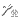
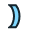
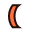
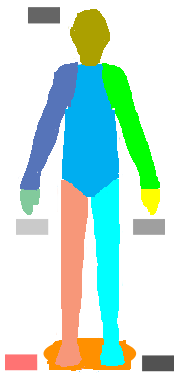

# Unity 2021.3.2f1 Editor Icons List
| Icon | Size | Name |
| --- | --- | --- |
|  | `2x2` | `d_tranp` |
|  | `4x7` | `d_blueGroove` |
|  | `4x7` | `d_Groove` |
|  | `4x7` | `d_redGroove` |
|  | `32x2` | `d_VUMeterTextureHorizontal` |
|  | `2x32` | `d_VUMeterTextureVertical` |
|  | `9x9` | `sv_icon_dot0_sml` |
|  | `9x9` | `sv_icon_dot10_sml` |
|  | `9x9` | `sv_icon_dot11_sml` |
|  | `9x9` | `sv_icon_dot12_sml` |
|  | `9x9` | `sv_icon_dot13_sml` |
|  | `9x9` | `sv_icon_dot14_sml` |
|  | `9x9` | `sv_icon_dot15_sml` |
|  | `9x9` | `sv_icon_dot1_sml` |
|  | `9x9` | `sv_icon_dot2_sml` |
|  | `9x9` | `sv_icon_dot3_sml` |
|  | `9x9` | `sv_icon_dot4_sml` |
|  | `9x9` | `sv_icon_dot5_sml` |
|  | `9x9` | `sv_icon_dot6_sml` |
|  | `9x9` | `sv_icon_dot7_sml` |
|  | `9x9` | `sv_icon_dot8_sml` |
|  | `9x9` | `sv_icon_dot9_sml` |
|  | `9x9` | `sv_icon_none` |
|  | `11x11` | `d_animationnocurve` |
|  | `11x11` | `blendSampler` |
|  | `11x11` | `LockIcon-On` |
|  | `11x11` | `LockIcon` |
|  | `7x18` | `d_leftBracket` |
|  | `7x18` | `d_rightBracket` |
|  | `11x13` | `Clipboard` |
|  | `12x12` | `CollabConflict` |
|  | `12x12` | `CollabError` |
|  | `12x12` | `CollabNew` |
|  | `12x12` | `CollabProgress` |
|  | `12x12` | `CollabPull` |
|  | `12x12` | `CollabPush` |
|  | `12x12` | `d_RectTransformBlueprint` |
|  | `12x12` | `d_RectTransformRaw` |
|  | `15x10` | `d_Animation.SequencerLink` |
|  | `14x12` | `d_EditCollider` |
|  | `13x13` | `d_winbtn_graph` |
|  | `13x13` | `d_winbtn_graph_close_h` |
|  | `13x13` | `d_winbtn_graph_max_h` |
|  | `13x13` | `d_winbtn_graph_min_h` |
|  | `13x13` | `d_winbtn_mac_inact` |
|  | `13x13` | `d_winbtn_win_min` |
|  | `13x13` | `d_winbtn_win_min_a` |
|  | `13x13` | `d_winbtn_win_min_h` |
|  | `13x13` | `d_winbtn_win_rest` |
|  | `13x13` | `d_winbtn_win_rest_a` |
|  | `13x13` | `d_winbtn_win_rest_h` |
|  | `13x14` | `d_Mirror` |
|  | `13x15` | `Lightmapping` |
|  | `5x40` | `d_AvatarBlendBackground` |
|  | `15x14` | `d_AnimationWrapModeMenu` |
|  | `14x15` | `d_CheckerFloor` |
|  | `16x14` | `ClothInspector.SelectTool` |
|  | `16x14` | `d_InspectorLock` |
|  | `16x14` | `d_Particle Effect` |
|  | `16x14` | `d_Profiler.FirstFrame` |
|  | `16x14` | `d_Profiler.LastFrame` |
|  | `16x14` | `d_Profiler.NextFrame` |
|  | `16x14` | `d_Profiler.PrevFrame` |
|  | `16x14` | `d_Profiler.Record` |
|  | `16x14` | `d_SceneViewAlpha` |
|  | `16x14` | `d_SceneViewOrtho` |
|  | `16x14` | `d_SceneViewRGB` |
|  | `16x14` | `d_UnityEditor.DebugInspectorWindow` |
|  | `16x14` | `d_UnityEditor.HierarchyWindow` |
|  | `16x14` | `Profiler.Instrumentation` |
|  | `15x15` | `d_AvatarCompass` |
|  | `15x15` | `d_align_horizontally` |
|  | `15x15` | `d_align_horizontally_center` |
|  | `15x15` | `d_align_horizontally_center_active` |
|  | `15x15` | `d_align_horizontally_left` |
|  | `15x15` | `d_align_horizontally_left_active` |
|  | `15x15` | `d_align_horizontally_right` |
|  | `15x15` | `d_align_horizontally_right_active` |
|  | `15x15` | `d_align_vertically` |
|  | `15x15` | `d_align_vertically_bottom` |
|  | `15x15` | `d_align_vertically_bottom_active` |
|  | `15x15` | `d_align_vertically_center` |
|  | `15x15` | `d_align_vertically_center_active` |
|  | `15x15` | `d_align_vertically_top` |
|  | `15x15` | `d_align_vertically_top_active` |
|  | `19x13` | `d_CustomSorting` |
|  | `17x15` | `SceneLoadIn` |
|  | `17x15` | `SceneLoadOut` |
|  | `17x15` | `SceneSave` |
|  | `17x15` | `SceneSaveGrey` |
|  | `16x16` | `animationdopesheetkeyframe` |
|  | `16x16` | `d_AssemblyLock` |
|  | `16x16` | `BuildSettings.Editor.Small` |
|  | `16x16` | `d_BuildSettings.FlashPlayer.Small` |
|  | `16x16` | `BuildSettings.PSM.Small` |
|  | `16x16` | `d_BuildSettings.PSP2.Small` |
|  | `16x16` | `d_BuildSettings.SelectedIcon` |
|  | `16x16` | `BuildSettings.StandaloneBroadcom.Small` |
|  | `16x16` | `BuildSettings.StandaloneGLES20Emu.Small` |
|  | `16x16` | `BuildSettings.StandaloneGLESEmu` |
|  | `16x16` | `BuildSettings.StandaloneGLESEmu.Small` |
|  | `16x16` | `d_BuildSettings.Web.Small` |
|  | `16x16` | `BuildSettings.WP8.Small` |
|  | `16x16` | `d_BuildSettings.Xbox360.Small` |
|  | `16x16` | `ColorPicker.ColorCycle` |
|  | `16x16` | `d_ColorPicker.CycleColor` |
|  | `16x16` | `d_ColorPicker.CycleSlider` |
|  | `16x16` | `ColorPicker.SliderCycle` |
|  | `16x16` | `d_editicon.sml` |
|  | `16x16` | `d_eyeDropper.sml` |
|  | `16x16` | `d_HorizontalSplit` |
|  | `16x16` | `d_Navigation` |
|  | `16x16` | `d_playLoopOff` |
|  | `16x16` | `d_playLoopOn` |
|  | `16x16` | `d_preAudioAutoPlayOn` |
|  | `16x16` | `d_preAudioLoopOn` |
|  | `16x16` | `d_preAudioPlayOff` |
|  | `16x16` | `d_preAudioPlayOn` |
|  | `16x16` | `d_PreTextureAlpha` |
|  | `16x16` | `d_PreTextureMipMapHigh` |
|  | `16x16` | `d_PreTextureMipMapLow` |
|  | `16x16` | `d_PreTextureRGB` |
|  | `16x16` | `d_ProfilerColumn.WarningCount` |
|  | `16x16` | `d_TreeEditor.AddBranches` |
|  | `16x16` | `d_TreeEditor.AddLeaves` |
|  | `16x16` | `d_TreeEditor.Duplicate` |
|  | `16x16` | `d_TreeEditor.Refresh` |
|  | `16x16` | `d_TreeEditor.Trash` |
|  | `16x16` | `d_UnityEditor.FindDependencies` |
|  | `16x16` | `d_VerticalSplit` |
|  | `16x16` | `d_VisibilityOff` |
|  | `16x16` | `d_VisibilityOn` |
|  | `16x16` | `d_WaitSpin00` |
|  | `16x16` | `d_WaitSpin01` |
|  | `16x16` | `d_WaitSpin02` |
|  | `16x16` | `d_WaitSpin03` |
|  | `16x16` | `d_WaitSpin04` |
|  | `16x16` | `d_WaitSpin05` |
|  | `16x16` | `d_WaitSpin06` |
|  | `16x16` | `d_WaitSpin07` |
|  | `16x16` | `d_WaitSpin08` |
|  | `16x16` | `d_WaitSpin09` |
|  | `16x16` | `d_WaitSpin10` |
|  | `16x16` | `d_WaitSpin11` |
|  | `16x16` | `d_P4_RedRightParenthesis@2x` |
|  | `16x16` | `PreTextureArrayFirstSlice` |
|  | `16x16` | `PreTextureArrayLastSlice` |
|  | `16x16` | `d_CanvasRenderer Icon` |
|  | `16x16` | `d_FreeformLayoutGroup Icon` |
|  | `16x16` | `d_PhysicalResolution Icon` |
|  | `16x16` | `d_ScrollViewArea Icon` |
|  | `16x16` | `d_SelectionList Icon` |
|  | `16x16` | `d_SelectionListItem Icon` |
|  | `16x16` | `d_SelectionListTemplate Icon` |
|  | `16x16` | `SpatialMappingRenderer Icon` |
|  | `16x16` | `WorldAnchor Icon` |
|  | `16x16` | `SaveActive` |
|  | `16x16` | `SaveFromPlay` |
|  | `16x16` | `SavePassive` |
|  | `16x16` | `SoftlockInline` |
|  | `16x16` | `TestFailed` |
|  | `16x16` | `TestIgnored` |
|  | `16x16` | `TestInconclusive` |
|  | `16x16` | `TestNormal` |
|  | `16x16` | `TestPassed` |
|  | `16x16` | `TestStopwatch` |
|  | `30x9` | `d_AS Badge Delete` |
|  | `30x9` | `d_AS Badge New` |
|  | `30x9` | `PackageBadgeDelete` |
|  | `30x9` | `PackageBadgeNew` |
|  | `27x12` | `sv_icon_name0` |
|  | `27x12` | `sv_icon_name1` |
|  | `27x12` | `sv_icon_name2` |
|  | `27x12` | `sv_icon_name3` |
|  | `27x12` | `sv_icon_name4` |
|  | `27x12` | `sv_icon_name5` |
|  | `27x12` | `sv_icon_name6` |
|  | `27x12` | `sv_icon_name7` |
|  | `24x14` | `sv_label_0` |
|  | `24x14` | `sv_label_1` |
|  | `24x14` | `sv_label_2` |
|  | `24x14` | `sv_label_3` |
|  | `24x14` | `sv_label_4` |
|  | `24x14` | `sv_label_5` |
|  | `24x14` | `sv_label_6` |
|  | `24x14` | `sv_label_7` |
|  | `19x18` | `ClothInspector.PaintTool` |
|  | `19x18` | `ClothInspector.PaintValue` |
|  | `19x18` | `ClothInspector.SettingsTool` |
|  | `19x18` | `ClothInspector.ViewValue` |
|  | `19x18` | `d_TerrainInspector.TerrainToolLower On` |
|  | `19x18` | `d_TerrainInspector.TerrainToolLowerAlt` |
|  | `19x18` | `d_TerrainInspector.TerrainToolPlants On` |
|  | `19x18` | `d_TerrainInspector.TerrainToolPlantsAlt On` |
|  | `19x18` | `d_TerrainInspector.TerrainToolPlantsAlt` |
|  | `19x18` | `d_TerrainInspector.TerrainToolRaise On` |
|  | `19x18` | `d_TerrainInspector.TerrainToolRaise` |
|  | `19x18` | `d_TerrainInspector.TerrainToolSetheight On` |
|  | `19x18` | `d_TerrainInspector.TerrainToolSetheight` |
|  | `19x18` | `d_TerrainInspector.TerrainToolSetheightAlt On` |
|  | `19x18` | `d_TerrainInspector.TerrainToolSetheightAlt` |
|  | `19x18` | `d_TerrainInspector.TerrainToolSettings On` |
|  | `19x18` | `d_TerrainInspector.TerrainToolSmoothHeight On` |
|  | `19x18` | `d_TerrainInspector.TerrainToolSmoothHeight` |
|  | `19x18` | `d_TerrainInspector.TerrainToolSplat On` |
|  | `19x18` | `d_TerrainInspector.TerrainToolSplatAlt On` |
|  | `19x18` | `d_TerrainInspector.TerrainToolSplatAlt` |
|  | `19x18` | `d_TerrainInspector.TerrainToolTrees On` |
|  | `19x18` | `d_TerrainInspector.TerrainToolTreesAlt On` |
|  | `19x18` | `d_TerrainInspector.TerrainToolTreesAlt` |
|  | `19x18` | `d_TreeEditor.Branch On` |
|  | `19x18` | `d_TreeEditor.Branch` |
|  | `19x18` | `d_TreeEditor.BranchFreeHand On` |
|  | `19x18` | `d_TreeEditor.BranchFreeHand` |
|  | `19x18` | `d_TreeEditor.BranchRotate On` |
|  | `19x18` | `d_TreeEditor.BranchRotate` |
|  | `19x18` | `d_TreeEditor.BranchScale On` |
|  | `19x18` | `d_TreeEditor.BranchScale` |
|  | `19x18` | `d_TreeEditor.BranchTranslate On` |
|  | `19x18` | `d_TreeEditor.BranchTranslate` |
|  | `19x18` | `d_TreeEditor.Distribution On` |
|  | `19x18` | `d_TreeEditor.Distribution` |
|  | `19x18` | `d_TreeEditor.Geometry On` |
|  | `19x18` | `d_TreeEditor.Geometry` |
|  | `19x18` | `d_TreeEditor.Leaf On` |
|  | `19x18` | `d_TreeEditor.Leaf` |
|  | `19x18` | `d_TreeEditor.LeafFreeHand On` |
|  | `19x18` | `d_TreeEditor.LeafFreeHand` |
|  | `19x18` | `d_TreeEditor.LeafRotate On` |
|  | `19x18` | `d_TreeEditor.LeafRotate` |
|  | `19x18` | `d_TreeEditor.LeafScale On` |
|  | `19x18` | `d_TreeEditor.LeafScale` |
|  | `19x18` | `d_TreeEditor.LeafTranslate On` |
|  | `19x18` | `d_TreeEditor.LeafTranslate` |
|  | `19x18` | `d_TreeEditor.Material On` |
|  | `19x18` | `d_TreeEditor.Material` |
|  | `19x18` | `d_TreeEditor.Wind On` |
|  | `19x18` | `d_TreeEditor.Wind` |
|  | `19x18` | `TerrainInspector.TerrainToolLower` |
|  | `19x18` | `TerrainInspector.TerrainToolSculpt On` |
|  | `19x18` | `TerrainInspector.TerrainToolSculpt` |
|  | `18x20` | `d_back@2x` |
|  | `18x20` | `d_forward@2x` |
|  | `24x15` | `d_SpeedScale` |
|  | `19x19` | `DotFill` |
|  | `19x19` | `DotFrame` |
|  | `19x19` | `DotFrameDotted` |
|  | `19x19` | `DotSelection` |
|  | `19x19` | `d_JointAngularLimits` |
|  | `21x20` | `d_beginButton-On` |
|  | `21x20` | `d_beginButton` |
|  | `21x20` | `d_endButton-On` |
|  | `21x20` | `d_endButton` |
|  | `21x20` | `d_PlayButtonProfile On` |
|  | `21x20` | `d_PlayButtonProfile` |
|  | `21x20` | `d_StepLeftButton-On` |
|  | `21x20` | `d_StepLeftButton` |
|  | `22x22` | `d_animationanimated@2x` |
|  | `22x22` | `d_animationkeyframe@2x` |
|  | `26x21` | `UpArrow` |
|  | `24x24` | `CollabOffline` |
|  | `24x24` | `d_icon dropdown@2x` |
|  | `21x32` | `d_model large` |
|  | `32x21` | `loop` |
|  | `32x21` | `playSpeed` |
|  | `72x11` | `d_ScrollShadow` |
|  | `32x26` | `Collab.Build` |
|  | `32x26` | `Collab.BuildFailed` |
|  | `32x26` | `Collab.BuildSucceeded` |
|  | `120x7` | `d_GEAR` |
|  | `29x29` | `KnobCShapeMini` |
|  | `30x30` | `StateMachineEditor.ArrowTip` |
|  | `30x30` | `StateMachineEditor.ArrowTipSelected` |
|  | `32x32` | `d__Help@2x` |
|  | `32x32` | `d__Popup@2x` |
|  | `32x32` | `d_AlphabeticalSorting@2x` |
|  | `32x32` | `d_Animation.AddEvent@2x` |
|  | `32x32` | `d_Animation.AddKeyframe@2x` |
|  | `32x32` | `d_Animation.EventMarker@2x` |
|  | `32x32` | `d_Animation.FirstKey@2x` |
|  | `32x32` | `d_Animation.LastKey@2x` |
|  | `32x32` | `d_Animation.NextKey@2x` |
|  | `32x32` | `d_Animation.Play@2x` |
|  | `32x32` | `d_Animation.PrevKey@2x` |
|  | `32x32` | `d_Animation.Record@2x` |
|  | `32x32` | `d_animationvisibilitytoggleoff@2x` |
|  | `32x32` | `d_animationvisibilitytoggleon@2x` |
|  | `32x32` | `d_Asset Store@2x` |
|  | `32x32` | `d_Audio Mixer@2x` |
|  | `32x32` | `d_AvatarPivot@2x` |
|  | `32x32` | `blendKey@2x` |
|  | `32x32` | `blendKeyOverlay@2x` |
|  | `32x32` | `blendKeySelected@2x` |
|  | `32x32` | `d_BuildSettings.Android.Small@2x` |
|  | `32x32` | `d_BuildSettings.Broadcom` |
|  | `32x32` | `BuildSettings.Editor` |
|  | `32x32` | `d_BuildSettings.Facebook.Small@2x` |
|  | `32x32` | `d_BuildSettings.FlashPlayer` |
|  | `32x32` | `d_BuildSettings.iPhone.Small@2x` |
|  | `32x32` | `d_BuildSettings.Lumin.small@2x` |
|  | `32x32` | `d_BuildSettings.Metro.Small@2x` |
|  | `32x32` | `d_BuildSettings.N3DS.Small@2x` |
|  | `32x32` | `d_BuildSettings.PS4.Small@2x` |
|  | `32x32` | `BuildSettings.PSM` |
|  | `32x32` | `d_BuildSettings.PSP2` |
|  | `32x32` | `d_BuildSettings.Standalone.Small@2x` |
|  | `32x32` | `d_BuildSettings.Switch.Small@2x` |
|  | `32x32` | `d_BuildSettings.tvOS.Small@2x` |
|  | `32x32` | `d_BuildSettings.Web` |
|  | `32x32` | `d_BuildSettings.WebGL.Small@2x` |
|  | `32x32` | `BuildSettings.WP8` |
|  | `32x32` | `d_BuildSettings.Xbox360` |
|  | `32x32` | `d_BuildSettings.XboxOne.Small@2x` |
|  | `32x32` | `d_CloudConnect@2x` |
|  | `32x32` | `d_Collab@2x` |
|  | `32x32` | `d_console.erroricon.inactive.sml@2x` |
|  | `32x32` | `d_console.erroricon.sml@2x` |
|  | `32x32` | `d_console.infoicon.sml@2x` |
|  | `32x32` | `d_console.warnicon.inactive.sml@2x` |
|  | `32x32` | `d_console.warnicon.sml@2x` |
|  | `32x32` | `d_curvekeyframe@2x` |
|  | `32x32` | `d_curvekeyframeselected@2x` |
|  | `32x32` | `d_curvekeyframeselectedoverlay@2x` |
|  | `32x32` | `d_curvekeyframesemiselectedoverlay@2x` |
|  | `32x32` | `d_curvekeyframeweighted@2x` |
|  | `32x32` | `d_DefaultSorting@2x` |
|  | `32x32` | `d_editcollision_16@2x` |
|  | `32x32` | `d_editconstraints_16@2x` |
|  | `32x32` | `d_Favorite@2x` |
|  | `32x32` | `d_FilterByLabel@2x` |
|  | `32x32` | `d_FilterByType@2x` |
|  | `32x32` | `d_FilterSelectedOnly@2x` |
|  | `32x32` | `d_Lighting@2x` |
|  | `32x32` | `d_LightmapEditor.WindowTitle@2x` |
|  | `32x32` | `d_MoveTool On@2x` |
|  | `32x32` | `d_MoveTool@2x` |
|  | `32x32` | `d_Occlusion@2x` |
|  | `32x32` | `d_P4_AddedLocal@2x` |
|  | `32x32` | `d_P4_AddedRemote@2x` |
|  | `32x32` | `d_P4_CheckOutLocal@2x` |
|  | `32x32` | `d_P4_CheckOutRemote@2x` |
|  | `32x32` | `d_P4_Conflicted@2x` |
|  | `32x32` | `d_P4_DeletedLocal@2x` |
|  | `32x32` | `d_P4_DeletedRemote@2x` |
|  | `32x32` | `d_P4_Local@2x` |
|  | `32x32` | `d_P4_LockedLocal@2x` |
|  | `32x32` | `d_P4_LockedRemote@2x` |
|  | `32x32` | `d_P4_OutOfSync@2x` |
|  | `32x32` | `d_PauseButton On@2x` |
|  | `32x32` | `d_PauseButton@2x` |
|  | `32x32` | `d_PlayButton On@2x` |
|  | `32x32` | `d_PlayButton@2x` |
|  | `32x32` | `d_preAudioAutoPlayOff@2x` |
|  | `32x32` | `d_preAudioLoopOff@2x` |
|  | `32x32` | `d_PreMatCube@2x` |
|  | `32x32` | `d_PreMatCylinder@2x` |
|  | `32x32` | `d_PreMatLight0@2x` |
|  | `32x32` | `d_PreMatLight1@2x` |
|  | `32x32` | `d_PreMatSphere@2x` |
|  | `32x32` | `d_PreMatTorus@2x` |
|  | `32x32` | `d_Preset.Context@2x` |
|  | `32x32` | `d_Profiler.Audio@2x` |
|  | `32x32` | `d_Profiler.CPU@2x` |
|  | `32x32` | `d_Profiler.GPU@2x` |
|  | `32x32` | `d_Profiler.Memory@2x` |
|  | `32x32` | `d_Profiler.Network` |
|  | `32x32` | `d_Profiler.Physics@2x` |
|  | `32x32` | `d_Profiler.Rendering@2x` |
|  | `32x32` | `d_Profiler.Video@2x` |
|  | `32x32` | `d_Project@2x` |
|  | `32x32` | `d_RectTool On@2x` |
|  | `32x32` | `d_RectTool@2x` |
|  | `32x32` | `d_Refresh@2x` |
|  | `32x32` | `d_RotateTool On@2x` |
|  | `32x32` | `d_RotateTool@2x` |
|  | `32x32` | `d_ScaleTool On@2x` |
|  | `32x32` | `d_ScaleTool@2x` |
|  | `32x32` | `d_SceneViewAudio@2x` |
|  | `32x32` | `d_SceneViewFX@2x` |
|  | `32x32` | `d_SceneViewLighting@2x` |
|  | `32x32` | `d_Settings@2x` |
|  | `32x32` | `d_SettingsIcon@2x` |
|  | `32x32` | `d_StepButton On@2x` |
|  | `32x32` | `d_StepButton@2x` |
|  | `32x32` | `d_tab_next@2x` |
|  | `32x32` | `d_tab_prev@2x` |
|  | `32x32` | `d_TerrainInspector.TerrainToolPlants@2x` |
|  | `32x32` | `d_TerrainInspector.TerrainToolSettings@2x` |
|  | `32x32` | `d_TerrainInspector.TerrainToolSplat@2x` |
|  | `32x32` | `d_TerrainInspector.TerrainToolTrees@2x` |
|  | `32x32` | `d_Toolbar Minus@2x` |
|  | `32x32` | `d_Toolbar Plus More@2x` |
|  | `32x32` | `d_Toolbar Plus@2x` |
|  | `32x32` | `d_ToolHandleCenter@2x` |
|  | `32x32` | `d_ToolHandleGlobal@2x` |
|  | `32x32` | `d_ToolHandleLocal@2x` |
|  | `32x32` | `d_ToolHandlePivot@2x` |
|  | `32x32` | `d_TransformTool On@2x` |
|  | `32x32` | `d_TransformTool@2x` |
|  | `32x32` | `d_tree_icon` |
|  | `32x32` | `d_tree_icon_branch` |
|  | `32x32` | `d_tree_icon_branch_frond` |
|  | `32x32` | `d_tree_icon_frond` |
|  | `32x32` | `d_tree_icon_leaf` |
|  | `32x32` | `d_UnityEditor.AnimationWindow@2x` |
|  | `32x32` | `d_UnityEditor.ConsoleWindow@2x` |
|  | `32x32` | `d_UnityEditor.GameView@2x` |
|  | `32x32` | `d_UnityEditor.InspectorWindow@2x` |
|  | `32x32` | `d_UnityEditor.ProfilerWindow@2x` |
|  | `32x32` | `d_UnityEditor.SceneHierarchyWindow@2x` |
|  | `32x32` | `d_UnityEditor.SceneView@2x` |
|  | `32x32` | `d_UnityEditor.Timeline.TimelineWindow@2x` |
|  | `32x32` | `d_UnityEditor.VersionControl@2x` |
|  | `32x32` | `d_ViewToolMove On@2x` |
|  | `32x32` | `d_ViewToolMove@2x` |
|  | `32x32` | `d_ViewToolOrbit On@2x` |
|  | `32x32` | `d_ViewToolOrbit@2x` |
|  | `32x32` | `d_ViewToolZoom On@2x` |
|  | `32x32` | `d_ViewToolZoom@2x` |
|  | `32x32` | `d_winbtn_mac_close@2x` |
|  | `32x32` | `d_winbtn_mac_close_a@2x` |
|  | `32x32` | `d_winbtn_mac_close_h@2x` |
|  | `32x32` | `d_winbtn_mac_max@2x` |
|  | `32x32` | `d_winbtn_mac_max_a@2x` |
|  | `32x32` | `d_winbtn_mac_max_h@2x` |
|  | `32x32` | `d_winbtn_mac_min@2x` |
|  | `32x32` | `d_winbtn_mac_min_a@2x` |
|  | `32x32` | `d_winbtn_mac_min_h@2x` |
|  | `32x32` | `d_winbtn_win_close@2x` |
|  | `32x32` | `d_winbtn_win_close_a@2x` |
|  | `32x32` | `d_winbtn_win_close_h@2x` |
|  | `32x32` | `d_winbtn_win_max@2x` |
|  | `32x32` | `d_winbtn_win_max_a@2x` |
|  | `32x32` | `d_winbtn_win_max_h@2x` |
|  | `32x32` | `d_Grid.BoxTool@2x` |
|  | `32x32` | `d_Grid.Default@2x` |
|  | `32x32` | `d_Grid.EraserTool@2x` |
|  | `32x32` | `d_Grid.FillTool@2x` |
|  | `32x32` | `d_Grid.MoveTool@2x` |
|  | `32x32` | `d_Grid.PaintTool@2x` |
|  | `32x32` | `d_Grid.PickingTool@2x` |
|  | `32x32` | `d_P4_BlueLeftParenthesis@2x` |
|  | `32x32` | `d_P4_BlueRightParenthesis@2x` |
|  | `32x32` | `d_P4_RedLeftParenthesis@2x` |
|  | `32x32` | `d_P4_Updating@2x` |
|  | `32x32` | `d_PreMatQuad@2x` |
|  | `32x32` | `d_GridLayoutGroup Icon` |
|  | `32x32` | `d_HorizontalLayoutGroup Icon` |
|  | `32x32` | `d_VerticalLayoutGroup Icon` |
|  | `32x32` | `d_CanvasGroup Icon` |
|  | `32x32` | `d_AspectRatioFitter Icon` |
|  | `32x32` | `d_Button Icon` |
|  | `32x32` | `d_CanvasScaler Icon` |
|  | `32x32` | `d_ContentSizeFitter Icon` |
|  | `32x32` | `d_LayoutElement Icon` |
|  | `32x32` | `d_Dropdown Icon` |
|  | `32x32` | `d_Image Icon` |
|  | `32x32` | `d_InputField Icon` |
|  | `32x32` | `d_Mask Icon` |
|  | `32x32` | `d_Outline Icon` |
|  | `32x32` | `d_PositionAsUV1 Icon` |
|  | `32x32` | `d_RawImage Icon` |
|  | `32x32` | `d_RectMask2D Icon` |
|  | `32x32` | `d_Scrollbar Icon` |
|  | `32x32` | `d_ScrollRect Icon` |
|  | `32x32` | `d_Selectable Icon` |
|  | `32x32` | `d_Shadow Icon` |
|  | `32x32` | `d_Slider Icon` |
|  | `32x32` | `d_Text Icon` |
|  | `32x32` | `d_Toggle Icon` |
|  | `32x32` | `d_ToggleGroup Icon` |
|  | `32x32` | `d_Profiler.GlobalIllumination@2x` |
|  | `32x32` | `d_Profiler.NetworkMessages@2x` |
|  | `32x32` | `d_Profiler.NetworkOperations@2x` |
|  | `32x32` | `d_Profiler.Physics2D@2x` |
|  | `32x32` | `d_Profiler.UI@2x` |
|  | `32x32` | `d_Profiler.UIDetails@2x` |
|  | `32x32` | `d_UnityEditor.Graphs.AnimatorControllerTool@2x` |
|  | `61x17` | `d_SocialNetworks.FacebookShare` |
|  | `61x17` | `d_SocialNetworks.LinkedInShare` |
|  | `61x17` | `d_SocialNetworks.Tweet` |
|  | `61x17` | `d_SocialNetworks.UDNOpen` |
|  | `38x39` | `d_AvatarBlendLeft` |
|  | `38x39` | `d_AvatarBlendLeftA` |
|  | `38x39` | `d_AvatarBlendRight` |
|  | `38x39` | `d_AvatarBlendRightA` |
|  | `40x40` | `d_eyeDropper.Large@2x` |
|  | `40x40` | `KnobCShape` |
|  | `43x43` | `d_greenLight` |
|  | `43x43` | `d_lightOff` |
|  | `43x43` | `d_lightRim` |
|  | `43x43` | `d_orangeLight` |
|  | `43x43` | `d_redLight` |
|  | `58x58` | `d_WelcomeScreen.AssetStoreLogo` |
|  | `58x70` | `d_monologo` |
|  | `64x64` | `d_BuildSettings.Android@2x` |
|  | `64x64` | `d_BuildSettings.Facebook@2x` |
|  | `64x64` | `d_BuildSettings.iPhone@2x` |
|  | `64x64` | `d_BuildSettings.Lumin@2x` |
|  | `64x64` | `d_BuildSettings.Metro@2x` |
|  | `64x64` | `d_BuildSettings.N3DS@2x` |
|  | `64x64` | `d_BuildSettings.PS4@2x` |
|  | `64x64` | `d_BuildSettings.Standalone@2x` |
|  | `64x64` | `d_BuildSettings.Switch@2x` |
|  | `64x64` | `d_BuildSettings.tvOS@2x` |
|  | `64x64` | `d_BuildSettings.WebGL@2x` |
|  | `64x64` | `d_BuildSettings.XboxOne@2x` |
|  | `64x64` | `d_BuildSettings.Xiaomi@2x` |
|  | `64x64` | `d_Collab.FileAdded` |
|  | `64x64` | `d_Collab.FileConflict` |
|  | `64x64` | `d_Collab.FileDeleted` |
|  | `64x64` | `d_Collab.FileIgnored` |
|  | `64x64` | `d_Collab.FileMoved` |
|  | `64x64` | `d_Collab.FileUpdated` |
|  | `64x64` | `d_Collab.FolderAdded` |
|  | `64x64` | `d_Collab.FolderConflict` |
|  | `64x64` | `d_Collab.FolderDeleted` |
|  | `64x64` | `d_Collab.FolderIgnored` |
|  | `64x64` | `d_Collab.FolderMoved` |
|  | `64x64` | `d_Collab.FolderUpdated` |
|  | `64x64` | `d_console.erroricon@2x` |
|  | `64x64` | `d_console.infoicon@2x` |
|  | `64x64` | `d_console.warnicon@2x` |
|  | `64x64` | `d_AreaLight Icon` |
|  | `64x64` | `d_Assembly Icon` |
|  | `64x64` | `d_AssetStore Icon` |
|  | `64x64` | `d_AudioMixerView Icon` |
|  | `64x64` | `ChorusFilter Icon` |
|  | `64x64` | `d_CollabChanges Icon` |
|  | `64x64` | `d_CollabChangesConflict Icon` |
|  | `64x64` | `d_CollabChangesDeleted Icon` |
|  | `64x64` | `d_CollabConflict Icon` |
|  | `64x64` | `d_CollabCreate Icon` |
|  | `64x64` | `d_CollabDeleted Icon` |
|  | `64x64` | `d_CollabEdit Icon` |
|  | `64x64` | `d_CollabExclude Icon` |
|  | `64x64` | `d_CollabMoved Icon` |
|  | `64x64` | `d_cs Script Icon` |
|  | `64x64` | `d_Prefab Icon` |
|  | `64x64` | `d_PrefabModel Icon` |
|  | `64x64` | `d_PrefabVariant Icon` |
|  | `64x64` | `DefaultSlate Icon` |
|  | `64x64` | `d_DirectionalLight Icon` |
|  | `64x64` | `DiscLight Icon` |
|  | `64x64` | `dll Script Icon` |
|  | `64x64` | `EchoFilter Icon` |
|  | `64x64` | `d_Favorite Icon` |
|  | `64x64` | `d_Folder Icon` |
|  | `64x64` | `d_FolderEmpty Icon` |
|  | `64x64` | `d_FolderFavorite Icon` |
|  | `64x64` | `GameManager Icon` |
|  | `64x64` | `GridBrush Icon` |
|  | `64x64` | `HighPassFilter Icon` |
|  | `64x64` | `d_LightingDataAssetParent Icon` |
|  | `64x64` | `LowPassFilter Icon` |
|  | `64x64` | `MetaFile Icon` |
|  | `64x64` | `d_Microphone Icon` |
|  | `64x64` | `MuscleClip Icon` |
|  | `64x64` | `PrefabOverlayAdded Icon` |
|  | `64x64` | `PrefabOverlayModified Icon` |
|  | `64x64` | `PrefabOverlayRemoved Icon` |
|  | `64x64` | `d_RaycastCollider Icon` |
|  | `64x64` | `ReverbFilter Icon` |
|  | `64x64` | `SceneSet Icon` |
|  | `64x64` | `d_Search Icon` |
|  | `64x64` | `SoftlockProjectBrowser Icon` |
|  | `64x64` | `SpeedTreeModel Icon` |
|  | `64x64` | `d_Spotlight Icon` |
|  | `64x64` | `SpriteCollider Icon` |
|  | `64x64` | `d_AnimatorController Icon` |
|  | `64x64` | `d_AnimatorState Icon` |
|  | `64x64` | `d_AnimatorStateMachine Icon` |
|  | `64x64` | `d_AnimatorStateTransition Icon` |
|  | `64x64` | `d_BlendTree Icon` |
|  | `64x64` | `AnimationWindowEvent Icon` |
|  | `64x64` | `d_AudioMixerController Icon` |
|  | `64x64` | `d_DefaultAsset Icon` |
|  | `64x64` | `EditorSettings Icon` |
|  | `64x64` | `d_AnyStateNode Icon` |
|  | `64x64` | `HumanTemplate Icon` |
|  | `64x64` | `d_LightingDataAsset Icon` |
|  | `64x64` | `d_LightmapParameters Icon` |
|  | `64x64` | `Preset Icon` |
|  | `64x64` | `SubstanceArchive Icon` |
|  | `64x64` | `d_AssemblyDefinitionAsset Icon` |
|  | `64x64` | `d_NavMeshAgent Icon` |
|  | `64x64` | `d_NavMeshData Icon` |
|  | `64x64` | `d_NavMeshObstacle Icon` |
|  | `64x64` | `d_OffMeshLink Icon` |
|  | `64x64` | `d_AnalyticsTracker Icon` |
|  | `64x64` | `d_Animation Icon` |
|  | `64x64` | `d_AnimationClip Icon` |
|  | `64x64` | `d_AimConstraint Icon` |
|  | `64x64` | `d_LookAtConstraint Icon` |
|  | `64x64` | `d_ParentConstraint Icon` |
|  | `64x64` | `d_PositionConstraint Icon` |
|  | `64x64` | `d_RotationConstraint Icon` |
|  | `64x64` | `d_ScaleConstraint Icon` |
|  | `64x64` | `d_Animator Icon` |
|  | `64x64` | `d_AnimatorOverrideController Icon` |
|  | `64x64` | `d_AreaEffector2D Icon` |
|  | `64x64` | `d_AudioMixerGroup Icon` |
|  | `64x64` | `d_AudioMixerSnapshot Icon` |
|  | `64x64` | `d_AudioSpatializerMicrosoft Icon` |
|  | `64x64` | `d_AudioChorusFilter Icon` |
|  | `64x64` | `d_AudioClip Icon` |
|  | `64x64` | `d_AudioDistortionFilter Icon` |
|  | `64x64` | `d_AudioEchoFilter Icon` |
|  | `64x64` | `d_AudioHighPassFilter Icon` |
|  | `64x64` | `d_AudioListener Icon` |
|  | `64x64` | `d_AudioLowPassFilter Icon` |
|  | `64x64` | `d_AudioReverbFilter Icon` |
|  | `64x64` | `d_AudioReverbZone Icon` |
|  | `64x64` | `d_AudioSource Icon` |
|  | `64x64` | `d_Avatar Icon` |
|  | `64x64` | `d_AvatarMask Icon` |
|  | `64x64` | `d_BillboardAsset Icon` |
|  | `64x64` | `d_BillboardRenderer Icon` |
|  | `64x64` | `d_BoxCollider Icon` |
|  | `64x64` | `d_BoxCollider2D Icon` |
|  | `64x64` | `d_BuoyancyEffector2D Icon` |
|  | `64x64` | `d_Camera Icon` |
|  | `64x64` | `d_Canvas Icon` |
|  | `64x64` | `d_CapsuleCollider Icon` |
|  | `64x64` | `d_CapsuleCollider2D Icon` |
|  | `64x64` | `d_CharacterController Icon` |
|  | `64x64` | `d_CharacterJoint Icon` |
|  | `64x64` | `d_CircleCollider2D Icon` |
|  | `64x64` | `d_Cloth Icon` |
|  | `64x64` | `d_CompositeCollider2D Icon` |
|  | `64x64` | `d_ComputeShader Icon` |
|  | `64x64` | `d_ConfigurableJoint Icon` |
|  | `64x64` | `d_ConstantForce Icon` |
|  | `64x64` | `d_ConstantForce2D Icon` |
|  | `64x64` | `d_Cubemap Icon` |
|  | `64x64` | `d_GameObject Icon` |
|  | `64x64` | `d_LightProbeProxyVolume Icon` |
|  | `64x64` | `d_ParticleSystem Icon` |
|  | `64x64` | `d_ParticleSystemForceField Icon` |
|  | `64x64` | `d_RectTransform Icon` |
|  | `64x64` | `d_StreamingController Icon` |
|  | `64x64` | `d_DistanceJoint2D Icon` |
|  | `64x64` | `d_EdgeCollider2D Icon` |
|  | `64x64` | `d_EventSystem Icon` |
|  | `64x64` | `d_EventTrigger Icon` |
|  | `64x64` | `d_Physics2DRaycaster Icon` |
|  | `64x64` | `d_PhysicsRaycaster Icon` |
|  | `64x64` | `d_StandaloneInputModule Icon` |
|  | `64x64` | `d_TouchInputModule Icon` |
|  | `64x64` | `d_HoloLensInputModule Icon` |
|  | `64x64` | `d_SpriteShapeRenderer Icon` |
|  | `64x64` | `d_VisualTreeAsset Icon` |
|  | `64x64` | `d_VisualEffect Icon` |
|  | `64x64` | `d_VisualEffectAsset Icon` |
|  | `64x64` | `d_FixedJoint Icon` |
|  | `64x64` | `FixedJoint2D Icon` |
|  | `64x64` | `d_Flare Icon` |
|  | `64x64` | `d_FlareLayer Icon` |
|  | `64x64` | `d_Font Icon` |
|  | `64x64` | `d_FrictionJoint2D Icon` |
|  | `64x64` | `d_Grid Icon` |
|  | `64x64` | `GUILayer Icon` |
|  | `64x64` | `d_GUISkin Icon` |
|  | `64x64` | `GUIText Icon` |
|  | `64x64` | `GUITexture Icon` |
|  | `64x64` | `d_Halo Icon` |
|  | `64x64` | `d_HingeJoint Icon` |
|  | `64x64` | `d_HingeJoint2D Icon` |
|  | `64x64` | `LensFlare Icon` |
|  | `64x64` | `d_Light Icon` |
|  | `64x64` | `d_LightProbeGroup Icon` |
|  | `64x64` | `d_LightProbes Icon` |
|  | `64x64` | `d_LineRenderer Icon` |
|  | `64x64` | `d_LODGroup Icon` |
|  | `64x64` | `d_Material Icon` |
|  | `64x64` | `d_Mesh Icon` |
|  | `64x64` | `d_MeshCollider Icon` |
|  | `64x64` | `d_MeshFilter Icon` |
|  | `64x64` | `d_MeshRenderer Icon` |
|  | `64x64` | `d_Motion Icon` |
|  | `64x64` | `MovieTexture Icon` |
|  | `64x64` | `d_NetworkAnimator Icon` |
|  | `64x64` | `d_NetworkDiscovery Icon` |
|  | `64x64` | `d_NetworkIdentity Icon` |
|  | `64x64` | `d_NetworkLobbyManager Icon` |
|  | `64x64` | `d_NetworkLobbyPlayer Icon` |
|  | `64x64` | `d_NetworkManager Icon` |
|  | `64x64` | `d_NetworkManagerHUD Icon` |
|  | `64x64` | `d_NetworkMigrationManager Icon` |
|  | `64x64` | `d_NetworkProximityChecker Icon` |
|  | `64x64` | `d_NetworkStartPosition Icon` |
|  | `64x64` | `d_NetworkTransform Icon` |
|  | `64x64` | `d_NetworkTransformChild Icon` |
|  | `64x64` | `d_NetworkTransformVisualizer Icon` |
|  | `64x64` | `NetworkView Icon` |
|  | `64x64` | `d_OcclusionArea Icon` |
|  | `64x64` | `d_OcclusionPortal Icon` |
|  | `64x64` | `d_PhysicMaterial Icon` |
|  | `64x64` | `d_PhysicsMaterial2D Icon` |
|  | `64x64` | `d_PlatformEffector2D Icon` |
|  | `64x64` | `d_PlayableDirector Icon` |
|  | `64x64` | `d_PointEffector2D Icon` |
|  | `64x64` | `d_PolygonCollider2D Icon` |
|  | `64x64` | `d_ProceduralMaterial Icon` |
|  | `64x64` | `d_Projector Icon` |
|  | `64x64` | `d_ReflectionProbe Icon` |
|  | `64x64` | `d_RelativeJoint2D Icon` |
|  | `64x64` | `d_SortingGroup Icon` |
|  | `64x64` | `d_RenderTexture Icon` |
|  | `64x64` | `d_Rigidbody Icon` |
|  | `64x64` | `d_Rigidbody2D Icon` |
|  | `64x64` | `d_ScriptableObject Icon` |
|  | `64x64` | `d_Shader Icon` |
|  | `64x64` | `d_ShaderVariantCollection Icon` |
|  | `64x64` | `d_SkinnedMeshRenderer Icon` |
|  | `64x64` | `d_Skybox Icon` |
|  | `64x64` | `d_SliderJoint2D Icon` |
|  | `64x64` | `TrackedPoseDriver Icon` |
|  | `64x64` | `d_SphereCollider Icon` |
|  | `64x64` | `d_SpringJoint Icon` |
|  | `64x64` | `d_SpringJoint2D Icon` |
|  | `64x64` | `d_Sprite Icon` |
|  | `64x64` | `d_SpriteMask Icon` |
|  | `64x64` | `d_SpriteRenderer Icon` |
|  | `64x64` | `d_StyleSheet Icon` |
|  | `64x64` | `d_SurfaceEffector2D Icon` |
|  | `64x64` | `d_TargetJoint2D Icon` |
|  | `64x64` | `d_Terrain Icon` |
|  | `64x64` | `d_TerrainCollider Icon` |
|  | `64x64` | `d_TerrainData Icon` |
|  | `64x64` | `d_TextAsset Icon` |
|  | `64x64` | `TextMesh Icon` |
|  | `64x64` | `d_Texture Icon` |
|  | `64x64` | `d_Texture2D Icon` |
|  | `64x64` | `d_Tile Icon` |
|  | `64x64` | `d_Tilemap Icon` |
|  | `64x64` | `d_TilemapCollider2D Icon` |
|  | `64x64` | `d_TilemapRenderer Icon` |
|  | `64x64` | `d_TimelineAsset Icon` |
|  | `64x64` | `d_TrailRenderer Icon` |
|  | `64x64` | `d_Transform Icon` |
|  | `64x64` | `d_SpriteAtlas Icon` |
|  | `64x64` | `d_GraphicRaycaster Icon` |
|  | `64x64` | `VideoClip Icon` |
|  | `64x64` | `d_VideoPlayer Icon` |
|  | `64x64` | `d_WheelCollider Icon` |
|  | `64x64` | `d_WheelJoint2D Icon` |
|  | `64x64` | `d_WindZone Icon` |
|  | `64x64` | `d_SpatialMappingCollider Icon` |
|  | `64x64` | `UssScript Icon` |
|  | `64x64` | `UxmlScript Icon` |
|  | `64x64` | `VideoEffect Icon` |
|  | `64x64` | `d_boo Script Icon` |
|  | `64x64` | `d_Js Script Icon` |
|  | `67x67` | `d_UnityLogo` |
|  | `120x43` | `d_ageialogo` |
|  | `124x52` | `AvatarController.Layer` |
|  | `124x52` | `AvatarController.LayerHover` |
|  | `124x52` | `AvatarController.LayerSelected` |
|  | `100x100` | `StateMachineEditor.UpButton` |
|  | `100x100` | `StateMachineEditor.UpButtonHover` |
|  | `128x128` | `sv_icon_dot0_pix16_gizmo` |
|  | `128x128` | `sv_icon_dot10_pix16_gizmo` |
|  | `128x128` | `sv_icon_dot11_pix16_gizmo` |
|  | `128x128` | `sv_icon_dot12_pix16_gizmo` |
|  | `128x128` | `sv_icon_dot13_pix16_gizmo` |
|  | `128x128` | `sv_icon_dot14_pix16_gizmo` |
|  | `128x128` | `sv_icon_dot15_pix16_gizmo` |
|  | `128x128` | `sv_icon_dot1_pix16_gizmo` |
|  | `128x128` | `sv_icon_dot2_pix16_gizmo` |
|  | `128x128` | `sv_icon_dot3_pix16_gizmo` |
|  | `128x128` | `sv_icon_dot4_pix16_gizmo` |
|  | `128x128` | `sv_icon_dot5_pix16_gizmo` |
|  | `128x128` | `sv_icon_dot6_pix16_gizmo` |
|  | `128x128` | `sv_icon_dot7_pix16_gizmo` |
|  | `128x128` | `sv_icon_dot8_pix16_gizmo` |
|  | `128x128` | `sv_icon_dot9_pix16_gizmo` |
|  | `128x128` | `UnityLogoLarge` |
|  | `115x150` | `Collab.NoInternet` |
|  | `115x150` | `Collab.Warning` |
|  | `142x149` | `SocialNetworks.UDNLogo` |
|  | `150x150` | `StateMachineEditor.State` |
|  | `150x150` | `StateMachineEditor.StateHover` |
|  | `150x150` | `StateMachineEditor.StateSelected` |
|  | `150x150` | `StateMachineEditor.StateSub` |
|  | `150x150` | `StateMachineEditor.StateSubHover` |
|  | `150x150` | `StateMachineEditor.StateSubSelected` |
|  | `264x92` | `d_aboutwindow.mainheader@2x` |
|  | `256x256` | `Camera Gizmo` |
|  | `256x256` | `AreaLight Gizmo` |
|  | `256x256` | `AudioSource Gizmo` |
|  | `256x256` | `DirectionalLight Gizmo` |
|  | `256x256` | `DiscLight Gizmo` |
|  | `256x256` | `LensFlare Gizmo` |
|  | `256x256` | `LightProbeGroup Gizmo` |
|  | `256x256` | `LightProbeProxyVolume Gizmo` |
|  | `256x256` | `Main Light Gizmo` |
|  | `256x256` | `ParticleSystem Gizmo` |
|  | `256x256` | `PointLight Gizmo` |
|  | `256x256` | `Projector Gizmo` |
|  | `256x256` | `ReflectionProbe Gizmo` |
|  | `256x256` | `SpotLight Gizmo` |
|  | `256x256` | `d_SceneAsset Icon` |
|  | `256x256` | `VisualEffect Gizmo` |
|  | `256x256` | `WindZone Gizmo` |
|  | `180x378` | `BodyPartPicker` |
|  | `180x378` | `BodySilhouette` |
|  | `180x378` | `Head` |
|  | `180x378` | `HeadIk` |
|  | `180x378` | `HeadZoom` |
|  | `180x378` | `HeadZoomSilhouette` |
|  | `180x378` | `LeftArm` |
|  | `180x378` | `LeftFeetIk` |
|  | `180x378` | `LeftFingers` |
|  | `180x378` | `LeftFingersIk` |
|  | `180x378` | `LeftLeg` |
|  | `180x378` | `MaskEditor_Root` |
|  | `180x378` | `RightArm` |
|  | `180x378` | `RightFeetIk` |
|  | `180x378` | `RightFingers` |
|  | `180x378` | `RightFingersIk` |
|  | `180x378` | `RightLeg` |
|  | `180x378` | `Torso` |
|  | `240x378` | `LeftHandZoom` |
|  | `240x378` | `LeftHandZoomSilhouette` |
|  | `240x378` | `RightHandZoom` |
|  | `240x378` | `RightHandZoomSilhouette` |
|  | `592x343` | `StateMachineEditor.Background` |
